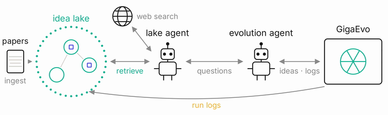
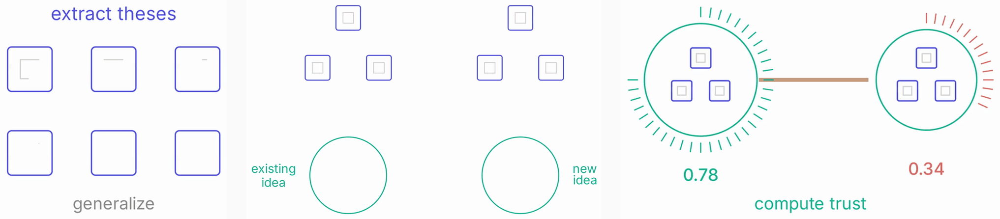
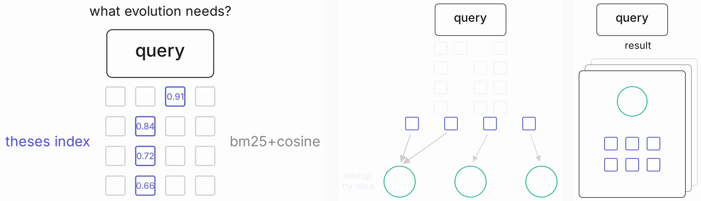
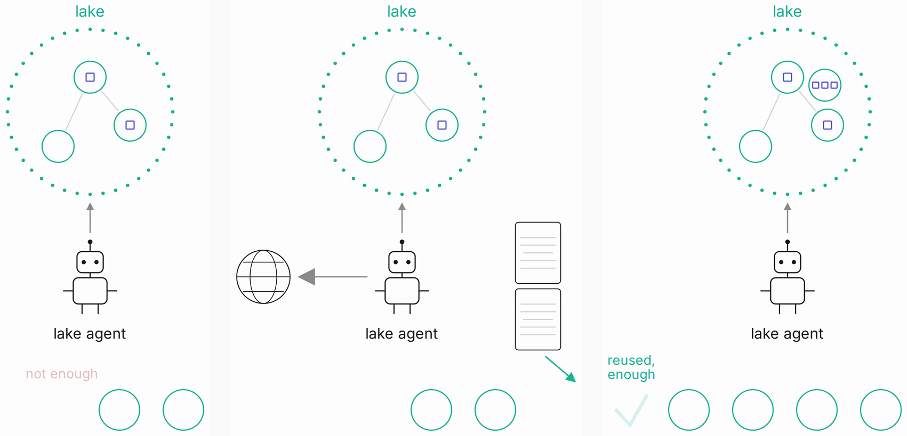
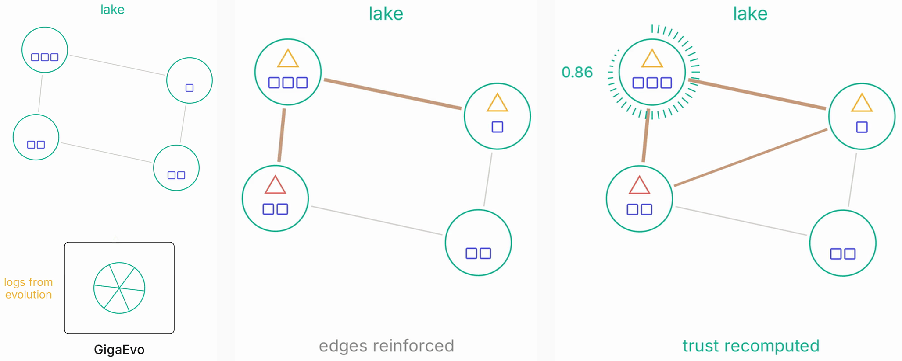
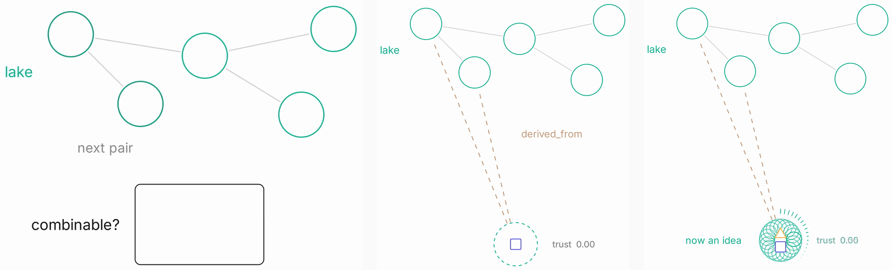

# Abstract

LLM-driven evolutionary search (AlphaEvolve, GigaEvo) improves a candidate solution through
iterated mutation, and every iteration costs model calls. Two sources of waste are visible
immediately. The system does not use knowledge that has already been published, and it does
not reuse the experience of its own previous runs. Every run starts from zero.

Ideas Lake is a knowledge base wired into the evolutionary loop. It is organised in two
layers. A thesis is a fact taken from a source, carrying a number and full provenance; an idea
is a generalisation over theses, carrying applicability conditions, limitations and failure
modes. The lake is filled from scientific papers, from the logs of evolutionary runs
themselves, and from synthesis of new hypotheses over what has already accumulated. It answers
a natural-language query from evolution with a ranked set of ideas.

At the time of writing the lake holds 901 ideas, 3,336 theses from 535 sources and 15,176
edges (live deployment, 2026-08-02). The success criterion stated in the project brief, "100+
concept cards", is exceeded ninefold. In an ablation on IFBench, adding web-retrieved
knowledge raised the target metric from 0.633 to 0.650, and adding logs of previous runs
raised it further to 0.660.

This report describes the system, states the experimental setup and results, and is explicit
about the boundaries beyond which those numbers prove nothing.

# 1. Introduction

A single evolutionary run is slow and expensive. A process can take days and burn millions of
tokens. A measurement taken on the reference setup: 100 mutations × 20 tasks × 3 parallel
workers ≈ 12 hours; the same workload estimated on the school's own inference servers (50
tasks, 250 mutants, a 35B model) came out at 37 hours.

Two causes account for that price, and both are about missing knowledge.

Knowledge from external sources is not used. A technique published last year is rediscovered
by mutation from scratch, if the run reaches it at all.

Experience from previous runs is not reused. Every run starts clean, including on dead ends
that have already been paid for. A negative result that cost hours of compute disappears
together with its log.

The goal of this work is therefore not to speed up the evolutionary loop itself, but to reduce
the number of steps to a result by supplying the mutation agent with knowledge it does not
have.

The contribution is threefold: a two-layer knowledge representation in which trust is derived
from evidence rather than declared; a complete write and read pipeline over that
representation, deployed and serving a live graph of 901 ideas; and an ablation on IFBench
separating the contribution of external knowledge from the contribution of accumulated run
experience.

# 2. Background and related work

**Evolutionary search with LLMs.** AlphaEvolve [1] frames program discovery as an evolutionary
loop in which an LLM proposes mutations and an evaluator scores them. GigaEvo [2] is an
open-source implementation of the same idea and is the system this work integrates with.
Neither keeps knowledge across runs: the population is the only state, and it is discarded
when the run ends.

**Agentic memory.** A-MEM [4] proposes a note schema for LLM agents, extraction in a single
model call, and linking by top-k cosine similarity followed by an LLM arbiter, the mechanism
this work reuses on the write path. HiMem [5] adds a source-to-card hierarchy and a typology
of conflicts between stored items.

Both, however, are evaluated only on LoCoMo, a dialogue benchmark. Neither targets scientific
text, reusable techniques, or anonymisation of concrete results, so their reported numbers do
not transfer to this domain. HiMem in particular reports an F1 of 34.95 against 48.16 for
Mem0, and uses the same model as both judge and backend.

**Prior art inside the ecosystem.** The closest existing component is the `ideas_tracker`
module of `gigaevo-core`; its own analysis places coverage of the present task at 35–45 %,
with the surrounding machinery (sources, provenance, anonymisation, domains, hierarchy,
interface) at approximately zero. Two of the five card fields required by the brief,
"limitations" and "applicability conditions", are not implemented as structured fields
anywhere in the surveyed systems.

**Positioning.** The note schema and the retrieval stack both follow prior work. What is new
here is treating a duplicate as additional evidence rather than noise, so that confidence in
an idea is a function of its evidence set, and closing the loop back from the consumer: the
evolutionary run's own log, including its failures, becomes a first-class source in the same
graph.

# 3. Problem statement and research questions

The primary question: how does the injection of external-source information and of historical
knowledge affect the target metrics of evolution and the rate at which they improve?

It decomposes into four testable questions:

1. When knowledge is injected, does the model find new solutions, or the same ones faster?
2. Can new ideas be synthesised without an external knowledge source, by reflection over what
   has already accumulated?
3. How should the open web be attached so that it is useful, and should evolution itself state
   "I am missing information about X"?
4. Is it better to search the web directly, or to digest what is found into the lake first?

Question 4 was settled architecturally, before the experiment: the path from web to evolution
runs only through the lake. The reason is ownership rather than latency. The lake is shared
and outlives any single run, two independent ingestion points would diverge, and cache,
provenance and source reputation accumulate only if there is exactly one of them.

Three distinct outcomes count as success, and they are not equivalent: reaching the same
fitness in fewer iterations; breaking through the ceiling a bare run hits under the same
iteration budget; and finding different solutions rather than the same ones earlier.

# 4. System design



## 4.1 Ontology: thesis, idea, hypothesis

| Entity | What it is | Properties |
|---|---|---|
| **Thesis** | A concrete result from a paper or from a run log: with a number and a use case, phrased close to the source | Immutable. Carries provenance: URL, title, locator inside the document. Semantic search runs over theses, which are sharper than ideas |
| **Idea** | A generalisation over theses: statement of the technique, applicability conditions, limitations, failure modes, claimed and observed effect | Lives by its leaves. A negative result is not discarded but becomes part of the idea ("do not apply X under condition Y") |
| **Hypothesis** | A synthesis of 2–3 ideas with no evidence | Not a separate class: an idea with zero leaves and `trust_score = 0`. Once confirmed by a run it becomes an ordinary idea |

The key design decision is the two-layer split. A duplicate is not dropped during
deduplication: the same claim restated by another paper becomes one more leaf of the same
idea. Confidence in an idea is therefore derived from its evidence set rather than declared as
a field. An idea backed by three independent sources and one successful run is automatically
distinguishable from an idea with a single leaf, with no manual labelling.

## 4.2 Graph schema

| Node | Contents |
|---|---|
| `Source` | A paper, a documentation page, or an evolutionary run. `url`, `title`, `type: paper\|doc\|run`, `version`, `retrieved_at` |
| `Thesis` | A fact with a number, a 384-d vector, a locator in the document, a text hash |
| `Idea` | The generalisation: text, conditions, limitations, failure modes, `effect_claimed`, `effect_observed`, `trust_score`, vector |

| Edge | Meaning |
|---|---|
| `YIELDS` | `Source → Thesis`: this thesis was extracted from this source |
| `HAS_LEAF` | `Idea → Thesis`: this thesis is evidence under this idea |
| `RELATED` | `Idea → Idea`: co-occurrence. Created by exactly two routes: both ideas used in one source, or both used in one evolutionary result. Weight accumulates idempotently per source |
| `derived_from` | Hypothesis → parent, written at synthesis time (two edges per hypothesis) |

Idea-to-idea edges never appear on their own, and that is deliberate. An edge asserts "these
two techniques co-occurred and worked together"; it must rest on a source or on a run,
otherwise the graph fills with links that stand for nothing.

## 4.3 Trust scoring

Two numbers were considered: usefulness of an idea, and confidence in that estimate, as mean
and variance. The split was rejected. One number remains, and it carries usefulness.

The mechanism is an LLM judge rather than a formula. It receives the idea and its leaves, with
labelled examples in the prompt ("evidence like this is junk, like this is better, like this
is top"), and returns a score. The number exists for the algorithm, not for the reader: top-k,
decay, "show the untrusted less often". The semantics, meaning why an idea is weak, stay in
the idea's text and are never truncated out of the response. Weak ideas are not deleted; they
are returned less often, with the reasons attached.

Scoring happens on the node, not at query time. It is computed when an idea is created and
when it is recomputed, making the cost `O(N)` in ideas rather than `O(k · queries)`.

# 5. Methods

## 5.1 Write path: source → theses → ideas



The write path is split into two phases, and the split is a fault-tolerance requirement.

**Phase 1, extraction.** Fetch the source, parse it into theses, generalise and anonymise.
Runs across 8 workers; the result lands in a `staging` file. It writes nothing to the graph:
network, parser and LLM are the least reliable part of the path, and their failure must not
leave the graph half-populated.

**Phase 2, linking and writing.** Sequential, cursor-driven, under a single writer (an
inter-process file lock). For each thesis: candidate ideas are retrieved semantically, then an
LLM arbiter decides which idea the thesis belongs to, or forms a new one. The idea and its
leaves are written in one transaction. After the source commits, co-occurrence edges are
written, and ideas that gained new leaves are queued for text re-derivation and trust
recomputation.

An arbiter failure does not degrade into "create a new idea": the thesis goes to
`pending_link` and is not written at all. Silent degradation is more expensive here than an
explicit refusal. Duplicates accumulate, and after a hundred sources nothing short of a full
re-ingest repairs the graph.

## 5.2 Read path: query → response



```
POST /retrieve
  { query, k=5, run_id?, budget?, rewrite=true, allow_web=false }
->
  { ideas: [ { idea_id, text, applicability_conditions, limitations, failure_modes,
               effect_claimed, effect_observed, trust_score, score, cosine_similarity, via,
               theses: [ { text, url, title, effect, locator } ] } ],
    log_id, cost: { tokens_in, tokens_out, wall_ms } }
```

The stages: rewrite the query into the corpus vocabulary → hybrid search over the thesis index
(FTS5 full text + cosine over vectors, merged by reciprocal rank fusion) → lift from matched
theses to their ideas → deduplicate → rank with trust taken into account → if fewer than `k`
ideas were found, top up with neighbours along `RELATED` edges.

Search enters through theses, not ideas. An idea's phrasing is abstract and its embedding is
smeared, whereas a thesis carries a number and specifics and matches more precisely. The `via`
field in the response states how each idea got there (`thesis`, `edge` or `padding`), so the
caller can tell a direct hit from a top-up.

The response also carries `cosine_similarity`, the raw query-to-idea cosine, not renormalised
per call. Without it, `score` (min-max over this call's candidates) always assigns `1.0` to
the best element, and a query with nothing relevant in the lake looks exactly as confident as
a query with a perfect match.

## 5.3 The lake agent



The agent is part of the lake, not an external system. It takes a natural-language query,
obtains priors from the lake, judges whether they suffice, and on a shortfall goes to the web:
search, fetch, parse, ingest what was found, wait for digestion, retrieve again. Traversal
depth is a parameter, not just `k`.

The web stack is self-hosted: SearXNG for search, Crawl4AI for crawling, Docling for document
parsing. Planning and synthesis run on the 35B model.

The objection that parsing a source takes minutes and stalls evolution is answered by
arithmetic: evolution runs for hours, and minutes spent asynchronously cost nothing.

The agent returns a language report with links and excerpts, not ready-made cards. Lake cards
are used for gap and duplicate analysis and are not copied into task-local memory. If there is
simultaneously no working lake retrieval and no independent web evidence, the endpoint answers
`503` rather than inventing an empty success.

## 5.4 Feedback: run logs become theses



The question of how to extract a graph update from evolutionary logs closed on a finding.
GigaEvo logs are already structured: every step carries `Justification`, `Insights Used`,
`Changes` and `Explanation`, a ready-made distillation of insight. No raw-text parser is
needed, only a converter from that format into theses.

A run becomes a `Source` of type `run`; each significant mutant becomes a thesis with its
outcome. Linking is reused wholesale: the same arbiter attaches the result to an existing idea
(which then goes for trust recomputation) or opens a new one. If a result fits several ideas,
one is chosen.

A negative result is a result. A mutation that degraded the metric enters the lake on equal
terms with a successful one and is phrased inside the idea as a limitation. This is precisely
what publications cannot supply: the published corpus is biased towards successes, and run
logs are the only accessible source of honest negative data.

One trap is closed explicitly. A fitness value of `-1000.0` in the log means "the mutant
failed to run", not "a terrible result". Read literally, it drags means and deltas down by a
thousand on a single mutant, so such rows participate in neither outcome nor effect and are
counted separately.

## 5.5 Hypothesis synthesis



Without synthesis the graph is not needed: a system that only files away what it found could
be a folder of documents. The mutation agent develops ideas it already knows well, and
empirically generates new ones poorly. It needs a foreign idea injected.

The mechanism: a random pair or triple of ideas → a cheap model answers the short question
"are these combinable at all?" → on "yes" a hypothesis is generated, on "no" nothing is
created. The rationale for randomness was stated directly: an LLM will not invent anything new
by thinking alone, but given a random juxtaposition it may. The second trigger is
recomputation: an idea that just gained new evidence, paired with a neighbour in the same
state.

A hypothesis is created with `trust_score = 0`, until its first experiment, and with
`derived_from` edges to both parents. It has no leaves, so nothing in the thesis index can
find it. The proposal to attach a fabricated use case purely for retrievability was rejected:
the graph contract guarantees that a thesis is a confirmed claim, and a fabricated entity does
not belong there. Instead, retrieval searches ideas as well as theses, while still returning
only ideas.

## 5.6 Engineering against silent failure

This part of the work is the bulk of it, and the architecture diagram does not show any of it.

In a pipeline made of LLM calls, network and three storage systems, almost no failure
announces itself with an exception. Each one returns HTTP 200 and a plausible answer, merely
empty, truncated or wrong. Below are the cases actually encountered, and what closes each.

| Silent failure | How it is closed |
|---|---|
| `max_tokens` reached: JSON is cut mid-token | `finish_reason != "stop"` checked before JSON parsing |
| The grammar truncated a string at exactly `maxLength`, while `finish_reason == "stop"` | String length equal to the schema's `maxLength` → refusal |
| A hung socket stalls a multi-minute phase | Timeout mandatory, no default |
| The server silently ignores the supplied schema | A canary request per model at the start of every run |
| An empty full-text index silently degrades hybrid search to pure cosine | Index population is asserted |
| Implicit AND in FTS5 collapses the result set | Query escaping plus a dedicated check |
| An arbiter failure is read as "a new idea", and duplicates accumulate | `pending_link`: the thesis is not written at all |
| Index rebuild fails after the drop: an empty index does not raise, `/search` returns `200 []`, and ranking reads it as "the lake is empty" | Drop, create and load in one transaction |
| The trust judge returns `0.0` on failure, and `0.0` is a legal value meaning "assessed and not trusted" | A failure is never written to `trust_score`: the old score and the dirty flag remain, and the failure is counted separately |
| A required field is missing: the node goes to Neo4j with a hole, silently, because there is no schema to object (this is how 60 theses were written without vectors) | The reader requires every field the model declares mandatory |
| A job holds the only slot forever if its thread never started, while reporting status `running` | The slot is released in an exception handler around thread start |
| A second process returns the first process's live jobs to the queue, so work runs twice | The lock is taken first; queue recovery is performed only by the lock holder |
| The arbiter rejected every thesis, but the cursor already passed the group: the retry processes zero groups, all counters read zero, and this looks like a clean replay | Two guards: this run's counters and storage (no leaf exists for the source, therefore no ingest happened, whatever the counters say) |
| A forgotten graph address environment variable | Startup refusal with an explicit error; no default |

**Testing the tests.** Non-trivial logic leaves behind an assertion in a single-run check
suite; as of 2026-07-31 the main suite registers 25 of them, with separate suites for the HTTP
layer and the research boundary. The checks themselves were validated by mutation testing:
defects are introduced one at a time and the suite must go red. Nineteen defects were injected
into the queue and writer; 15 turned the suite red immediately, and 4 exposed holes in the
checks themselves, which matter more than the findings. One example: the race check for job
claiming filled the queue before starting the competing processes, so the first process
drained it before the second had even imported the module, and the suite passed on knowingly
broken code. A check that does not fail on broken code is worse than no check at all, because
it manufactures confidence.

# 6. Implementation

Python 3.12, no paid APIs: inference runs on the school's llama.cpp servers, and embeddings
are computed locally on CPU (`/v1/embeddings` returns 501 on all three servers).

| Layer | Built with |
|---|---|
| Data models | `pydantic`; separately, literal flat JSON schemas for the LLM: a schema generated from a model contains `$ref`, on which the llama.cpp grammar silently fails to compile |
| LLM calls | Structured output via `response_format.json_schema.schema`, `temperature=0` on extraction, thinking disabled. Bulk steps on Qwen3.5-9B; linking arbiter and trust judge on Qwen3.6-35B-A3B |
| Prompts | Text files under `prompts/{step}/system.txt`, never string literals in code |
| Embeddings | `snowflake-arctic-embed-s`, 384-d, CPU, asymmetric query prefix |
| Thesis index | SQLite FTS5 + vectors in numpy + reciprocal rank fusion (`k = 60`) |
| Graph | Neo4j over Bolt. Exactly one module knows the storage format; nothing else speaks Cypher |
| HTTP | FastAPI + uvicorn covering graph, search, job-based ingest, retrieve and research. 22 operations in the OpenAPI document |
| Queue | A private SQLite job queue that survives restart; the phase-2 writer is serialised by an inter-process lock |
| Export | Lake export into an Obsidian vault: the graph is drawn by Obsidian, so no viewer was written |

Authentication is `Authorization: Bearer` on every endpoint except `/openapi.json` and
`/docs`. An empty key is a startup refusal, not "auth disabled". Keys and addresses are read
from the environment at call time and never enter the repository.

A push to `main` triggers the deployment pipeline: build the image, run three offline check
suites inside the built image, publish to GHCR under `latest` and the short SHA, update the
server over SSH, then wait for the `healthy` status. The suites run inside the image and not
in the runner's environment, otherwise a green run attests to the runner's Python rather than
to what will ship. Without the last step CI would go green over a dead service: `docker
compose up -d` returns 0 as soon as the container is created, not when it answers. Rollback is
a variable pointing at a previous SHA, with no rebuild. The last pipeline run, 2026-08-01, was
green.

The server holds no sources and builds nothing: it receives a finished image and a single
compose file. Ports listen on loopback only.

# 7. State of the deployed system

Live deployment, measured 2026-08-02:

| Quantity | Value |
|---|---|
| Sources | 535 |
| Theses | 3,336 |
| Ideas | 901 |
| Edges | 15,176 |
| Theses in the index | 3,336 (`in_sync: true`) |
| Ideas without leaves | 0 |
| Theses in `pending_link` (arbiter undecided) | 53 |
| Ingest jobs: succeeded / failed | 158 / 42 |

The success criterion from the project brief (a store of 100+ concept cards, automatic links
between cards, deduplication, and a demonstration answering a query with source-linked
strategies) is met on all four counts: 901 ideas, 15,176 edges, deduplication built into the
write path, and provenance returned with every response. The arbiter's "link or create"
decision is itself the deduplication step.

The equality 3,336 = 3,336 behind `in_sync: true` is not cosmetic. The thesis index and the
graph live in different stores, and their divergence is exactly the kind of failure that stays
invisible from outside until somebody notices that search has stopped returning recent
material.

`pending_link` at 53 of 3,336 (1.6 %) counts theses on which the arbiter did not commit. They
are neither lost nor written on a guess. This is the price of preferring an explicit refusal
to a silent duplicate.

# 8. Experimental setup

| Parameter | Value |
|---|---|
| Evolution task | Prompt template for IFBench [3] (verifiable instruction following) |
| Mutator | Qwen3.6-35B-A3B, reasoning disabled |
| Validation | Qwen3.5-9B |
| Depth | Up to 30 mutations |
| Repeats per arm | 4 independent runs |

The ablation arms are designed to separate two contributions that otherwise mix:

| # | Arm | What it isolates |
|---|---|---|
| 1 | Bare GigaEvo | Baseline |
| 2 | GigaEvo + web agent, no graph | Contribution of fresh external knowledge |
| 3 | GigaEvo + lake, no web | Contribution of accumulated, digested knowledge |
| 4 | Full system | Joint effect |

A noise control is part of the design: the same arm, but with a deliberately irrelevant corpus
mixed into the context. Without it, an improvement cannot be distinguished from the effect of
simply having more text in the context. An experience-accumulation test is also specified:
solve a task, then run the same task again against a lake filled with the first run's
experience, and the second run must reach a higher fitness. That is the direct test of the
claim that the system can both extract experience and give it back.

# 9. Results

| Configuration | Metric | Gain |
|---|---|---|
| Baseline | 0.633 | — |
| \+ web search | 0.650 | +0.017 |
| \+ logs of previous runs | 0.660 | +0.010 |

**Finding 1.** Web search raised the metric: external knowledge fed into the evolutionary loop
works.

**Finding 2.** Adding logs of previous runs produced an additional gain on top of the first.
This is a separate result: it indicates that a system's own run experience carries signal that
published papers do not, and that the two knowledge sources do not substitute for each other.

The combined gain is +0.027 over baseline, roughly +4.3 % relative.

# 10. Threats to validity

Without this section the numbers above read as stronger than they are.

Four independent runs per arm is few. Between-run variance was not measured and is not
reported, and there are no confidence intervals. The +0.010 second-stage gain is of a
magnitude comparable to small-sample noise.

One task and one benchmark. Repeating a single task does not produce statistics; in practice
it is not one task. Transfer to other domains was not tested.

The system was measured in a regime that disadvantages it, and this should be said out loud.
The lake pays off once it holds experience from 20 to 30 different but related tasks; no such
experience existed at measurement time. The evaluation therefore ran against a lake that has
not yet accumulated the very thing it exists for.

The demo corpus contains an element of fitting. Some sources were fetched by hand because they
help with benchmark tasks. This was a deliberate decision and is stated plainly.

The noise control and the experience-accumulation test are specified but are not part of the
reported numbers. Until they run, the possibility that part of the gain comes from context
length alone cannot be excluded.

No proxy metric on an intermediate evolutionary step exists. All measurements are end-to-end,
so every data point costs a full run, which is why the repeat count is low.

`trust_score` is uncalibrated. The judge returns a number derived from labelled examples in
the prompt; the correlation of that number with an idea's actual usefulness in evolution has
not been measured.

Domain is not modelled. A technique giving +X in one field may give −50 % in another. A domain
field was recognised as necessary and deliberately deferred; as a consequence negative results
currently cannot be attributed to a field of application.

# 11. Future work

Stability of results comes first: more runs per arm, the noise control, and confidence
intervals. The binding constraint today is the cost of a single measurement, which makes a
proxy metric on an intermediate evolutionary step the prerequisite for everything else.

Retrieval quality should be validated independently of evolution, with a query set carrying
labelled relevance, an ablation of the hybrid's arms (RRF against weighted min-max), and an
evaluation of query rewriting. At present retrieval is judged only through the final metric,
which is the longest and noisiest feedback loop available.

Generality requires modelling the semantics of ideas well enough to separate domains. Not
every technique transfers: a result from medical imaging does not carry over to finance
automatically. Domain is needed both for retrieval, to stop mixing in the irrelevant, and for
honest attribution of negative results.

The hypothesis life cycle is not yet formally defined. It is open by what signal a hypothesis
becomes an idea, what share of a response may be given to unverified material, and how
hypotheses are deduplicated: random synthesis inevitably repeats itself, while the linking
arbiter works over theses, which a hypothesis does not have.

# 12. Conclusion

Ideas Lake gives an LLM-driven evolutionary search a memory that outlives the run. Facts are
stored close to their sources with full provenance, generalised into reusable techniques, and
returned to the loop on a natural-language query. The run's own logs, successes and failures
alike, are ingested by the same pipeline and become evidence for the next run.

The deployed system holds 901 ideas over 3,336 theses from 535 sources, exceeding the target
set in the project brief by an order of magnitude, and the ablation shows that both knowledge
sources contribute: external material raised the IFBench metric by 0.017 and accumulated run
experience added a further 0.010 on top of it. With four runs per arm and one benchmark these
numbers indicate a direction rather than establish an effect size. The setup needed to
establish one, meaning noise control, the experience-accumulation test, and a proxy metric
that makes repeats affordable, is specified in Sections 8 and 11.

# Team

Team: Alexander Maliy, Alexander Borodin, Daria Belykh.

Mentors: Vladimir Shaposhnikov, Nikita Glazkov, Olga Volkova.

# References

1. A. Novikov et al. *AlphaEvolve: A Coding Agent for Scientific and Algorithmic Discovery.*
   2025. <https://arxiv.org/abs/2506.13131>
2. V. Khrulkov et al. *GigaEvo: An Open-Source Optimization Framework Powered by LLMs and
   Evolution Algorithms.* 2025. <https://arxiv.org/abs/2511.17592>
3. V. Pyatkin et al. *Generalizing Verifiable Instruction Following (IFBench).* 2025.
   <https://github.com/allenai/IFBench>
4. W. Xu et al. *A-MEM: Agentic Memory for LLM Agents.* NeurIPS 2025.
   <https://arxiv.org/abs/2502.12110>
5. *HiMem: Hierarchical Memory for LLM Agents.* 2026. <https://arxiv.org/abs/2601.06377>

\newpage

# Supplementary material

## External API

Authentication is `Authorization: Bearer` on every endpoint except `/openapi.json` and
`/docs`.

```
POST /retrieve       evolution query → ranked ideas with theses and provenance
POST /research       natural-language query → language report (lake priors + independent web)
POST /fetch          one link → both ingest phases → the paper in the graph (queued job)
POST /run            an evolutionary run log → theses → the graph (queued job)
GET  /stats          lake state: nodes, edges, index synchronisation, queue
GET  /healthz        liveness of the service and its workers
GET  /sources /ideas /theses    paginated traversal of the graph with filters
POST /search         direct access to hybrid search over theses
POST /admin/reindex  rebuild the thesis index
```

Response of `/retrieve`:

```json
{ "ideas": [ { "idea_id": "…", "text": "…",
               "applicability_conditions": "…", "limitations": "…", "failure_modes": "…",
               "effect_claimed": "…", "effect_observed": "…",
               "trust_score": 0.0, "score": 0.0, "cosine_similarity": 0.0,
               "via": "thesis | edge | padding",
               "theses": [ { "text": "…", "url": "…", "title": "…",
                             "effect": "…", "locator": "…" } ] } ],
  "log_id": "…",
  "cost": { "tokens_in": 0, "tokens_out": 0, "wall_ms": 0 } }
```

## Graph schema and invariants

```
(:Source)-[:YIELDS]->(:Thesis)          source → extracted fact
(:Idea)-[:HAS_LEAF]->(:Thesis)          idea → evidence beneath it
(:Idea)-[:RELATED {weight}]->(:Idea)    co-occurrence in a source or in a run
(:Idea)-[:derived_from]->(:Idea)        hypothesis → parent (two edges per hypothesis)
```

Invariants enforced by the write path:

- a thesis is immutable once written: there is no update method, and this is the only
  guarantee that provenance cannot drift away from text;
- an idea and its leaves are written in one transaction: a failure between them would leave an
  idea with no evidence;
- the thesis index is populated in the same step as the graph, and the equality of the two
  counts is asserted separately;
- exactly one module knows the storage format; neither ingest nor retrieval speaks Cypher.

## Reproducing the system

```bash
# locally: the lake and Neo4j side by side, one compose file
docker compose --env-file .env.local up -d

# ingest: the two phases, separately
python3 -m lake.ingest.run phase1 --limit N     # network, LLM, staging. Writes no graph
python3 -m lake.ingest.run phase2               # linking, graph, index, trust

# an evolutionary run log into the lake
python3 -m lake.ingest.runlog evolution_full.csv --dry-run

# the service
python3 -m lake.api.app --port 8077             # requires LAKE_API_KEY

# check suites
python3 -B -m lake.selfcheck --offline
python3 -m lake.api.selfcheck
```

Environment variables (values live in the environment only and never enter the repository):
`LAKE_API_KEY`, `LAKE_KEY_9B`, `LAKE_KEY_35B`, `NEO4J_URI`, `NEO4J_USERNAME`,
`NEO4J_PASSWORD`, `NEO4J_DATABASE`.
