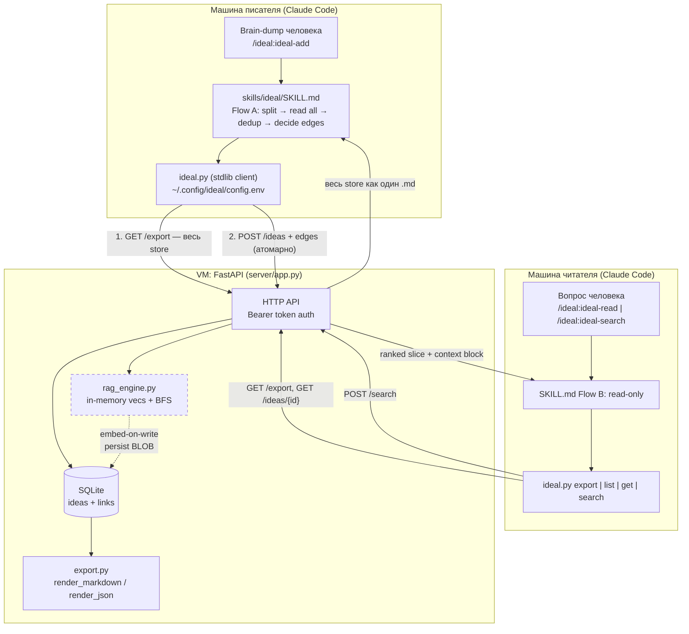

# `Glazkoff/IdeaL` — разбор репозитория

> Источник: `https://github.com/Glazkoff/IdeaL` (клон на `d3ddf7a`, дата разбора 2026-07-26).
> **Важно:** это **fork** от `KhrulkovV/IdeaL`, HEAD совпадает с upstream **байт в байт**, ни одного
> собственного коммита в форке нет.

## TL;DR

- IdeaL — это **Claude Code plugin + FastAPI/SQLite сервер** для хранения «атомарных идей» (title + body + typed links). Код рабочий, тесты `43 passed` (проверено запуском), но это **не** карточки Проекта 28 и **не** pipeline извлечения из статей.
- Главный тезис («Claude читает весь store и сам решает links, без embeddings/RAG») **в коде реализован буквально**: `GET /export` отдаёт весь store одним markdown-документом, а решение о `similar`/`connected` принимает LLM по инструкции в `skills/ideal/SKILL.md`. Сервер физически не умеет создавать links.
- **Описание репозитория устарело.** «no embeddings or RAG» перестало быть правдой 2026-07-16: добавлен `server/rag_engine.py` — persistent embeddings (arctic-embed-s) + `POST /search` (vector seed → BFS по links). Авторы сами называют это «one deliberate, opt-in exception» (`README.md:14-19`).
- **Чего нет вообще:** ingestion из papers/PDF/experiment outputs, анонимизации, полей карточки (applicability conditions / effect / limitations), доменов и per-domain дедупликации, demo-агента, версионирования. Ввод — только текст, который человек руками пишет в `/ideal:ideal-add`.

---

## Что это

IdeaL — совместное хранилище **атомарных идей** («one claim, concept, or question»), где роль поискового движка и линковщика играет сам Claude. Продуктовая рамка: один человек делает brain-dump, Claude разбивает его на атомы, читает **весь** store целиком, решает, с чем новые идеи связаны, и пишет их на сервер; другой человек читает store — тоже через Claude.

Позиционирование сформулировано в `README.md:8-12`:

> **The defining constraint: no algorithm decides how ideas relate.** No embeddings, no
> vector search, no keyword scoring picks the links — Claude does, by reading the whole
> store. The server is a dumb SQLite store plus a Markdown exporter; to find what's
> related, Claude fetches the **entire store as one Markdown document** and **reads it**.
> Claude's judgment *is* the linker.

### Как это выражено в коде (верификация тезиса)

Тезис не маркетинговый — он проверяется тремя фактами:

1. **В сервере нет ни одной функции, создающей link.** Весь SQL сосредоточен в `server/db.py`; единственные пути записи рёбер — `db.insert_link()` (`server/db.py:165-172`), вызываемый из `POST /ideas` (`server/app.py:291-295`) и `POST /links` (`server/app.py:343-345`). Оба принимают `target_id` и `type` **из тела запроса**. Никакой эвристики, similarity, keyword-матчинга в write-path нет.
2. **Решение вынесено в prompt.** Логика линковки живёт в `skills/ideal/SKILL.md:190-207` («Linking guidance (the heart of the skill)») — это инструкции для LLM, а не код.
3. **Read-path спроектирован под «прочитать всё».** `GET /export` (`server/app.py:110-127`) делает `SELECT *` по обеим таблицам без фильтров/пагинации и рендерит один markdown-документ через `export.render_markdown()`.

### Оговорка про RAG — описание репо устарело

`description` репозитория («no embeddings or RAG») отражает состояние на 2026-07-15. Уже 2026-07-16 коммитом `21eb577 Add server-side GraphRAG: persistent embeddings + POST /search` появился `server/rag_engine.py`. Авторы аккуратно ограничили область:

- это **read-only** слой, `POST /search` ничего не пишет;
- он **не создаёт links** — он обходит те, что Claude уже написал (`rag_engine.py:1-12`);
- отключается флагом `IDEAL_RAG_ENABLED=false`, тогда `/search` отдаёт `503` (`server/app.py:214-220`);
- ADD/link flow не затронут.

Формулировка из спеки (`docs/superpowers/specs/2026-07-16-server-side-rag-design.md:11-15`): *«IdeaL's core premise … still holds for the ADD/link flow. This adds **one** exception: an additive, read-side semantic index.»*

**Вывод для нас:** тезис «Claude — линковщик» верен для записи; для чтения в проекте уже сдались и добавили эмбеддинги, потому что читать весь store целиком не масштабируется. Это ровно та развилка, на которую наступит и Проект 28.

---

## Модель данных

### Схема (`server/schema.sql`)

Две таблицы. Это **не** markdown-vault и **не** Obsidian: markdown — это *представление*, а хранилище — SQLite.

Таблица `ideas` (`server/schema.sql:5-23`):

| колонка | тип | смысл |
|---|---|---|
| `id` | `TEXT PRIMARY KEY` | стабильный slug из title, напр. `graph-of-atomic-ideas-3` |
| `title` | `TEXT NOT NULL` | короткий заголовок (несколько слов) |
| `body` | `TEXT NOT NULL` | сама атомарная идея, **свободный markdown**, 1–4 предложения |
| `author` | `TEXT` nullable | кто написал; подставляется клиентом из конфига |
| `tags` | `TEXT NOT NULL DEFAULT ''` | comma-separated, нормализованные (lowercase, dedup) |
| `task` | `TEXT` nullable | задача/проект, которому служит идея |
| `usefulness` | `INTEGER` nullable | 0..100 |
| `reputation` | `INTEGER` nullable | 0..100 |
| `status` | `TEXT` nullable | draft/active/archived |
| `meta` | `TEXT` nullable | **JSON blob для произвольных метаданных** |
| `created_at`, `updated_at` | `TEXT NOT NULL` | ISO-8601 UTC, формат `%Y-%m-%dT%H:%M:%SZ` |
| `embedding` | `BLOB` nullable | float32-вектор (L2-normalized), `NULL` = не проиндексирован |
| `embedding_model` | `TEXT` nullable | имя модели, которой сделан вектор |
| `embedding_dim` | `INTEGER` nullable | длина вектора (sanity check) |

Таблица `links` (`server/schema.sql:25-33`):

```sql
CREATE TABLE IF NOT EXISTS links (
    source_id   TEXT NOT NULL REFERENCES ideas(id) ON DELETE CASCADE,
    target_id   TEXT NOT NULL REFERENCES ideas(id) ON DELETE CASCADE,
    type        TEXT NOT NULL CHECK (type IN ('similar','connected')),
    note        TEXT NOT NULL DEFAULT '',  -- short reason Claude writes for the edge
    created_at  TEXT NOT NULL,
    PRIMARY KEY (source_id, target_id, type),
    CHECK (source_id <> target_id)
);
```

Ключевые свойства рёбер: **ровно два типа**, рёбра **направленные** (обратные не создаются автоматически), идемпотентные по `(source, target, type)`, self-loop запрещён на уровне БД, каскадное удаление, и **обязательный `note`** — короткое объяснение *отношения*, которое пишет Claude.

### ID и теги (`server/ids.py`)

`id` — не UUID, а человекочитаемый slug из title: lowercase, все не-`[a-z0-9]` схлопываются в `-`, обрезка до 60 символов, fallback `"idea"` (`ids.py:7-17`). При коллизии дописывается `-2`, `-3`, … (`ids.py:20-33`). **`id` иммутабелен** — переименование title его не меняет (тест `test_update_does_not_change_the_id`, `server/tests/test_crud.py:72-78`).

### Формат ссылок

В markdown-экспорте ребро рендерится как Obsidian-style wikilink (`server/export.py:83-85`):

```
- **{type}** → [[{target_id}]] — {note}
```

### Реальный пример карточки (verbatim)

В репозитории нет закоммиченных данных (`.gitignore:8-12` исключает `data/` и `*.sqlite`). Поэтому пример ниже **сгенерирован прогоном настоящего кода** (`POST /ideas` × 2 → `GET /export`), то есть это точный, а не выдуманный формат:

```markdown
---
store: IdeaL
generated_at: 2026-07-26T14:54:34Z
idea_count: 2
link_count: 1
link_types: similar (near-duplicate/overlap), connected (relates/builds-on/contrasts)
note: Each idea lists only OUTGOING links; every edge appears exactly once, under its source. IDs in `code` are stable — reference them as target_id.
---

## Gradient checkpointing trades compute for memory
`gradient-checkpointing-trades-compute-for-memory` · anon-a · tags: memory, training, llm · status: active · task: fit-70b-on-8xa100 · usefulness: 80 · reputation: 75 · updated 2026-07-26

Recomputing activations during backward instead of storing them cuts activation memory to O(sqrt(n)) at the cost of one extra forward pass. Applicable when the model fits compute-bound but not memory-bound; ineffective when the bottleneck is parameter memory rather than activations.

Links:
- _(no outgoing links)_

---

## ZeRO stage 3 shards parameters across ranks
`zero-stage-3-shards-parameters-across-ranks` · anon-b · tags: memory, distributed · status: — · task: — · usefulness: — · reputation: — · updated 2026-07-26

Partitioning optimizer state, gradients and parameters across data-parallel ranks removes the per-rank full-model memory requirement, at the cost of extra all-gather communication per layer.

Links:
- **connected** → [[gradient-checkpointing-trades-compute-for-memory]] — alternative lever on the same memory bottleneck
```

Обратите внимание на «шапку» экспорта: это frontmatter-подобный блок с `idea_count`, `link_count` и **легендой типов связей прямо в документе** — сервер объясняет LLM семантику собственного формата (`export.py:59-69`). Null-поля рендерятся как em-dash `—` (`export.py:8`, `_or_dash`).

### ⚠️ Дефект формата: `meta` не попадает в markdown-экспорт

Я специально проверил: **поле `meta` (где живёт провенанс — `source`, `paper`) в `GET /export` не рендерится вообще.** `_meta_line()` (`server/export.py:34-43`) перечисляет `author / tags / status / task / usefulness / reputation / updated` и не трогает `meta`.

Проверка на живом коде: `arXiv in md export: False`, `arXiv in json export: True`.

Провенанс виден только в двух местах:
- `GET /export?format=json` — `render_json()` кладёт `meta` целиком (`export.py:117`);
- context-блок `POST /search` — `_source_line()` вытаскивает `meta.source` / `meta.paper` (`rag_engine.py:249-266`).

Для Проекта 28, где карточка обязана нести ссылку на источник, **основной read-path теряет источник**.

### Чего в модели нет (важно для Проекта 28)

Структура карточки Проекта 28 — **concept → applicability conditions → effect → limitations → links** — в схеме **не выражена**. Есть один плоский `body: TEXT`. Варианты: (а) складывать структуру в свободный markdown внутри `body`, (б) использовать `meta` JSON blob. Ни то, ни другое сервер не валидирует и не индексирует. Также отсутствуют: домены/коллекции (namespace плоский), версионирование, поле источника как first-class citizen, следы анонимизации.

---

## Архитектура и поток данных

Три компонента: **плагин Claude Code** (клиент, только stdlib), **FastAPI-сервер на VM** (SQLite + рендерер), и **опциональный semantic index** внутри сервера.



### Поток ADD (`skills/ideal/SKILL.md:47-97`) — 6 шагов, исполняемых LLM

1. **Split** brain-dump на атомы. Правило против over-split: «a claim plus the essential rationale that makes it make sense is **one** idea». Если атомов >~6 или сплит неоднозначен — показать пользователю и подтвердить.
2. **Read the whole store**: `ideal.py export`. Инструкция явно запрещает срезать угол: *«Read **every** idea and its links, top to bottom. Do not grep, do not skim for keywords»*.
3. **Dedup check** — интерактивный (см. ниже).
4. **Decide edges** — по guidance-разделу. *«It is correct to produce **zero** edges.»*
5. **Write, earliest idea first** — по одной идее, чтобы более поздние могли ссылаться на `id`, вернувшийся от более ранних. `add` печатает **только id** в stdout (`ideal.py:191`), чтобы его можно было захватить в shell-переменную.
6. **Report** — список `→ #<id> (similar|connected): <note>`.

### Поток READ (`SKILL.md:101-145`)

Три инструмента: `export` (весь store, дефолт), `list` (индекс id/title/tags), `get <id>` (одна идея + входящие и исходящие рёбра). Плюс опциональный `search`. В SKILL.md есть явная таблица «когда `search`, а когда `export`» (`SKILL.md:131-135`) с прямым указанием: **для ADD-flow — всегда весь `export`**, потому что dedup и линковка требуют полноты.

### Транзакционность

`POST /ideas` создаёт идею **и её рёбра атомарно** в одной транзакции `BEGIN IMMEDIATE … COMMIT` (`server/app.py:242-307`). Индексация в RAG вынесена **после** коммита (`app.py:309-310`), чтобы эмбеддинг никогда не ломал основной write-path.

---

## Ключевые файлы

| Путь | Что делает |
|---|---|
| `README.md` | 313 строк. Манифест философии, quickstart, полный HTTP API, таблица `.env`, инструкции по SSH-туннелю и firewall. |
| `skills/ideal/SKILL.md` | **Сердце системы.** 207 строк промпта: Flow A (ADD), Flow B (READ), Flow C (RATE/EDIT) и «Linking guidance». Вся «интеллектуальная» логика — здесь, не в коде. |
| `skills/ideal/scripts/ideal.py` | 407 строк. CLI-клиент на **чистой stdlib** (`urllib`, `json`, `argparse`) — ни pip, ни curl, ни jq на клиенте. 12 команд. Конфиг: env → `~/.config/ideal/config.env`. |
| `commands/ideal-add.md` | Slash-команда `/ideal:ideal-add` — тонкая обёртка, делегирует в Flow A скилла. |
| `commands/ideal-read.md` | `/ideal:ideal-read` — делегирует в Flow B, подчёркивает read-only. |
| `commands/ideal-search.md` | `/ideal:ideal-search` — GraphRAG-путь, объясняет `--k/--start-k/--hops` и обработку 503. |
| `commands/ideal-setup.md` | `/ideal:ideal-setup` — запись URL/token/author. Отдельно оговорено: проверять токен через `list`, а не `health` (health неаутентифицирован). |
| `server/app.py` | 443 строки. FastAPI: 10 endpoints, bearer-auth через `hmac.compare_digest`, ручные транзакции, единый error-envelope `{"error","detail"}`. |
| `server/db.py` | 213 строк. Весь SQL, параметризованный. `connect()` c WAL + `foreign_keys=ON` + `busy_timeout=5000`. Идемпотентные `ALTER TABLE`-миграции (`_MIGRATIONS`, строки 32-56). |
| `server/schema.sql` | 36 строк. Две таблицы + два индекса по links. Применяется идемпотентно на старте. |
| `server/models.py` | 108 строк. Pydantic v2. `IdeaCreate`/`IdeaUpdate`/`EdgeIn`/`LinkCreate`/`SearchRequest`. Валидация bounds 0..100 и non-empty title/body. |
| `server/export.py` | 125 строк. **Чистые функции** рендеринга — без БД и HTTP, тривиально тестируемо. `render_markdown()` + `render_json()`. |
| `server/ids.py` | 55 строк. `slugify` / `unique_id` / `normalize_tags` / `split_tags`. |
| `server/config.py` | 52 строки. Загрузка env один раз при импорте. **Fail-fast**: без `IDEAL_TOKEN` — `SystemExit(1)`. |
| `server/rag_engine.py` | 296 строк. Опциональный GraphRAG: `SentenceTransformerEmbedder` (ленивый импорт torch) + `RagEngine` (in-memory `{id: vec}`, `load_persisted`, `backfill`, `index_idea`, `remove`, `search`). |
| `server/tests/conftest.py` | Фикстуры + **`FakeEmbedder`**: детерминированный bag-of-words по фиксированному словарю. Позволяет тестировать весь semantic-путь **без torch и без сети**. |
| `server/tests/test_api.py` | 194 строки. Health, auth, add→export, рендер рёбер, unknown-target rollback, идемпотентность links, суффиксы слагов, точный формат строки экспорта. |
| `server/tests/test_crud.py` | 131 строка. PATCH-семантика (partial, explicit-null, иммутабельный id), DELETE + каскад, auth-гварды. |
| `server/tests/test_search.py` | 280 строк. Vector seed, hops=0 vs hops=1, undirected traversal, re-embed на update, 503 при выключенном RAG, asymmetric query-prompt контракт, quarantine битого BLOB. |
| `server/Dockerfile` | python:3.12-slim. **CPU-torch ставится первым**, чтобы не утянуть многогигабайтный CUDA-билд транзитивно. `HF_HOME=/data/hf-cache`. |
| `deploy/docker-compose.yml` | Один сервис, volume `../data:/data`, `restart: unless-stopped`, healthcheck со `start_period: 300s` (первый boat качает модель). |
| `scripts/run.sh` | 175 строк. Запуск **без Docker и без root** в активном conda-env: `nohup uvicorn`, PID/лог в `./data/`. Ставит зависимости в активный интерпретатор. |
| `scripts/deploy.sh` | Docker-путь. Отказывается деплоить с placeholder-токеном. |
| `scripts/install-docker.sh` | Ставит Docker Engine + compose plugin на голую VM. |
| `scripts/smoke-test.sh` | E2E round-trip health → add → проверка наличия в export. |
| `scripts/update.sh` | `git pull --ff-only` + `run.sh restart` + health. |
| `.claude-plugin/plugin.json` / `marketplace.json` | Манифесты плагина, `version: 0.2.0`. Позволяют `/plugin marketplace add KhrulkovV/IdeaL` без клонирования. |
| `docs/superpowers/specs/2026-07-16-server-side-rag-design.md` | Спека реализованного server-side RAG. Здесь же — факт про **живой store на 129 идей**. |
| `docs/superpowers/specs/2026-07-16-graphrag-retrieval-design.md` | **Superseded.** Описывает client-side `rag/` на `langchain-graph-retriever`, который был удалён. Оставлен как исторический контекст. |

---

## Линковка, дедупликация, эволюция

### Линковка

**Кто решает:** Claude, читая весь `export`. **Кто записывает:** сервер, буквально принимая `{target_id, type, note}`.

Правила из `SKILL.md:190-207` — это фактически спецификация качества графа:

- **`similar`** = идеи *об одном и том же* — mergeable, near-duplicate, или одна поглощает другую.
- **`connected`** = *разные* идеи, которые связаны: builds-on, motivates, is-an-example-of, contrasts, counterargument.
- **«When unsure between the two, use `connected`.»**
- **«0–4 edges per idea; 1–2 is typical. Create **none** rather than invent weak links. "Both mention databases" is *not* a link. Only link ideas whose relationship you could defend in one sentence.»**
- **«Every edge needs a `note` of ≤ ~12 words stating the *relationship*, not a summary of the target»** — с примером: `"builds on: edges carry context"`, а не `"about graphs"`.
- Рёбра **направленные и исходящие** из новой идеи; обратные сервер не создаёт, и Claude'у запрещено их выдумывать.

**Защита целостности графа.** По умолчанию `IDEAL_ON_UNKNOWN_TARGET=reject`: если новая идея ссылается на несуществующий `target_id`, **отклоняется весь запрос** (422, полный rollback — идея не создаётся, `server/app.py:261-270`). Логика в SKILL.md: *«that is intentional, so you never believe a nonexistent link exists»*. Режим `ignore` (создать идею, молча выкинуть плохие рёбра) есть, но включается явно.

Дубликаты рёбер снимаются на уровне БД: `INSERT OR IGNORE` + composite PK, `insert_link()` возвращает `True` только при реальной вставке (`db.py:165-172`) — отсюда идемпотентный `POST /links`, отдающий `{"created": false}` на повторе.

### Дедупликация

**Автоматической дедупликации нет.** Есть шаг 3 в промпте (`SKILL.md:71-76`):

> **3. Dedup check.**
> If a new idea is essentially an existing idea's claim, do not blindly duplicate it.
> Tell the user which existing idea it overlaps (by id + title) and offer:
> (a) skip it, (b) add it with a single `similar` link to the existing one, or
> (c) add anyway as distinct. Let the user choose.

То есть дедуп: (1) **интерактивный** — решает человек, а не система; (2) **best-effort** — зависит от того, честно ли LLM прочитал весь экспорт; (3) **не сохраняет решение** — нет записи «эти два кандидата были рассмотрены и признаны разными», так что следующий прогон будет решать заново; (4) **не по доменам** — вся проверка идёт по плоскому глобальному store.

Единственный жёсткий инвариант — уникальность `id`, и он даёт ровно обратное дедупликации: две идеи с одинаковым title спокойно сосуществуют как `same-title` и `same-title-2` (тест `test_duplicate_titles_get_numeric_suffix`).

### Эволюция существующих заметок

- **`PATCH /ideas/{id}`** — настоящая partial-семантика через `model_dump(exclude_unset=True)` (`app.py:362`): пропущенный ключ не трогается, явный `null` очищает nullable-поле, `title`/`body` нельзя обнулить, `id` не меняется никогда.
- **Рейтинги** — `reputation` (насколько идея хороша/надёжна) и `usefulness` (насколько полезна для задачи), 0..100. В `SKILL.md:157-170` есть таблица маппинга естественного языка в число («excellent/proven → ~90», «weak/shaky → ~25»), с указанием **нюджить относительно текущего значения**, а не сбрасывать.
- **Ограничение, названное авторами явно** (`SKILL.md:180-181`): *«`reputation` is a single current score (latest judgment wins), not an average across users — per-author reputation is a later addition.»*
- **Слияния идей нет.** Нет операции merge, нет tombstone/redirect, нет истории версий и audit trail — только `updated_at`. Если две идеи оказались дублями, максимум — поставить между ними `similar` и/или удалить одну руками.
- **Удаление** — `DELETE /ideas/{id}`, рёбра уходят каскадом. Необратимо; SKILL.md требует подтверждения у пользователя.

### Как эволюция взаимодействует с индексом

Аккуратно сделанная деталь. При изменении `title`/`body` `update_idea()` **тем же UPDATE** обнуляет `embedding`, `embedding_model`, `embedding_dim` (`db.py:189-192`) — «staleness is driven by NULL». Логика в комментарии: если последующий re-embed упадёт, останется `NULL` (будет добит backfill'ом на старте), а не устаревший вектор.

Ещё тоньше: `index_idea(idea_id)` принимает **только id** и перечитывает текущий закоммиченный текст из БД под локом (`rag_engine.py:135-160`). Смысл в докстринге: медленный re-embed, приземлившийся после более свежего конкурентного апдейта, всё равно запишет вектор *новейшего* текста — индекс не может разъехаться со строкой. Есть регрессионный тест ровно на это (`test_search.py:151-171`).

---

## Как запустить

### Зависимости

- **Сервер:** `fastapi>=0.110`, `uvicorn[standard]>=0.29`, `sentence-transformers>=2.2`, `numpy>=1.24`. Dev: `pytest>=8.0`, `httpx>=0.27`. Python 3.12 в Docker-образе.
- **Клиент:** **ноль зависимостей** — только stdlib Python 3.

### Три пути деплоя сервера

**1. Docker (основной).**
```sh
git clone <repo> IdeaL && cd IdeaL
cp .env.example .env          # обязательно: IDEAL_TOKEN=$(openssl rand -hex 32)
./scripts/deploy.sh           # docker compose up -d --build, SQLite → ./data
./scripts/smoke-test.sh       # health + add/export round-trip
```

**2. Без Docker и без root (conda).** Для VM, где нет прав на установку Docker:
```sh
conda activate <your-env>
cp .env.example .env
./scripts/run.sh start        # ставит deps в активный env, nohup uvicorn
./scripts/run.sh status|logs|stop|restart
```
Автостарт после ребута без root — через user crontab: `@reboot cd /path/to/IdeaL && ./scripts/run.sh start`.

**3. Локальная разработка.**
```sh
cd server && pip install -r requirements.txt
IDEAL_TOKEN=dev IDEAL_DB_PATH=./ideal.sqlite uvicorn app:app --reload
```

### Конфигурация (`.env`)

| Переменная | Дефолт | Смысл |
|---|---|---|
| `IDEAL_TOKEN` | *(обязательна)* | Shared bearer token. Без неё сервер **не стартует**. |
| `IDEAL_PORT` | `8000` | Порт на хосте. |
| `IDEAL_HOST` | `0.0.0.0` | Интерфейс (актуально для `run.sh`). |
| `IDEAL_DB_PATH` | `/data/ideal.sqlite` | Путь к SQLite. |
| `IDEAL_PROTECT_READS` | `true` | Требовать токен и на чтение (`/export` отдаёт весь store). |
| `IDEAL_ON_UNKNOWN_TARGET` | `reject` | `reject` = откатить весь запрос; `ignore` = выкинуть плохие рёбра. |
| `IDEAL_RAG_ENABLED` | `true` | Semantic search. `false` → без ML-стека, `/search` = 503. |
| `IDEAL_RAG_MODEL` | `Snowflake/snowflake-arctic-embed-s` | Модель эмбеддингов (~130 МБ, 384-dim, asymmetric). Смена → пере-эмбеддинг всего store на следующем старте. |

### Установка плагина (каждому участнику)

```
/plugin marketplace add KhrulkovV/IdeaL
/plugin install ideal
/reload-plugins
/ideal:ideal-setup       # URL + token + author name
```
Команды **неймспейснуты**: `/ideal:ideal-setup`, `/ideal:ideal-add`, `/ideal:ideal-read`, `/ideal:ideal-search`. Голый `/ideal-setup` вернёт «Unknown command». Конфиг пишется в `~/.config/ideal/config.env` с `chmod 600`, токен никогда не печатается обратно.

### Тесты — проверено запуском

```sh
cd server && pip install -r requirements-dev.txt && pytest tests/ -q
```

**Фактический результат прогона (2026-07-26):**
```
...........................................                              [100%]
43 passed in 0.39s
```

Тесты не требуют ни сети, ни Docker, ни torch — semantic-путь работает через `FakeEmbedder` из `conftest.py`. Это, пожалуй, лучшая инженерная деталь репозитория.

---

## Зрелость: что работает / что заглушка

Честная оценка: **это не прототип-на-выброс, а маленький законченный продукт**, написанный за два дня. `grep` по `TODO|FIXME|XXX|NotImplemented` даёт **ноль попаданий** в продакшн-коде. Но покрывает он существенно меньшую задачу, чем Проект 28.

### Работает (проверено кодом и/или прогоном)

| Область | Статус |
|---|---|
| CRUD идей (create/read/update/delete) | ✅ Полный, с транзакциями и корректной partial-семантикой PATCH |
| Typed links + идемпотентность + каскад | ✅ Инварианты на уровне БД (PK, CHECK, FK CASCADE) |
| Unknown-target rollback | ✅ 422 + полный откат, есть тест |
| Markdown-экспорт всего store | ✅ Чистые функции, точный формат зафиксирован тестом |
| Slug-ID с суффиксами коллизий, иммутабельность | ✅ Есть тесты |
| Auth (bearer, timing-safe) | ✅ `hmac.compare_digest`, добавлено аудитом `6d86556` |
| Fail-fast конфиг | ✅ Нет токена → `SystemExit(1)` |
| Идемпотентные миграции схемы | ✅ `ALTER TABLE ADD COLUMN` по `PRAGMA table_info` |
| Semantic search (`POST /search`) | ✅ Реализован полностью: embed-on-write, persist BLOB, warm index, cosine seed, BFS по рёбрам, markdown context-блок |
| Graceful degradation RAG | ✅ Падение инициализации индекса → `rag.enabled = False`, сервер стартует (`app.py:44-49`) |
| Index/row консистентность | ✅ Re-read под локом, инвалидация в NULL, quarantine битого BLOB — с тестами |
| Три пути деплоя (Docker / conda / dev) | ✅ Со скриптами и проверкой placeholder-токена |
| Тесты | ✅ 43 теста, 0.39 с, без сети и torch |
| Живой стенд | ✅ Спека упоминает «the live 129-idea DB» — система реально использовалась |

### Заглушка, отсутствует или слабое место

| Область | Что не так |
|---|---|
| **Ingestion из документов** | **Отсутствует полностью.** Нет парсинга PDF/LaTeX/arXiv/логов экспериментов. Единственный вход — текст, набранный человеком в `/ideal:ideal-add`. |
| **Prompt-шаблоны извлечения** | Нет отдельных шаблонов. Вся «экстракция» — это 6 шагов Flow A в `SKILL.md`, рассчитанных на brain-dump, а не на статью. |
| **Структура карточки** | `body` — свободный текст. Полей concept/conditions/effect/limitations нет. |
| **Анонимизация** | Не упоминается нигде. Наоборот, `author` — first-class поле, попадающее в экспорт. |
| **Провенанс в основном read-path** | `meta` (source/paper) **не рендерится** в md-экспорте. Проверено. |
| **Дедупликация** | Только промпт + ручное решение пользователя. Нет автоматики, нет доменов, нет памяти о принятых решениях. |
| **Мультиуровневость** | Namespace плоский. Нет доменов, коллекций, иерархии — вопреки «многоуровневому хранилищу» в постановке Проекта 28. |
| **Reputation** | Одно текущее число, «latest judgment wins». Не агрегат по авторам — авторы это признают. |
| **Масштабирование read-path** | `GET /export` без пагинации. На 129 идеях норма; на 10³ — упирается в контекст. `/search` появился именно как реакция на это. |
| **Безопасность** | Один shared bearer token на чтение **и** запись, plain HTTP. Нет per-user auth → `author` самодекларируемый и непроверяемый. TLS явно объявлен «out of scope for v1» (`README.md:181`). |
| **`GET /health` не аутентифицирован** | Отдаёт `{ideas, links, rag.indexed}` — утечка размера store наружу (`app.py:93-105`). |
| **Мёртвый код** | `SearchResponse`/`SearchHit` определены в `models.py:96-109`, но не подключены как `response_model` к `POST /search` (`app.py:209`). Безвредно, но контракт ответа не валидируется. |
| **Demo-агент** | Отсутствует. Есть slash-команды для человека, но нет программного агента, который принимает задачу и возвращает стратегии. |
| **CI** | Нет workflow'ов. Тесты гоняются руками. Issues в репозитории отключены. |

### Активность и происхождение

- **18 коммитов**, все за **два дня**: 2026-07-15 (8) и 2026-07-16 (10).
- **Автор кода один** — 16 коммитов. Владелец upstream — 2 merge-коммита от своих же PR.
- 2 PR, оба смёржены, оба upstream (`#1 audit-fixes-and-rag-removal`, `#2 arctic-embed-asymmetric-ranking`). В форке `Glazkoff/IdeaL` — 0 PR, 0 issues (отключены), 1 ветка `main`, 0 звёзд, MIT.
- **С 2026-07-16 разработка остановлена** (последний push — `2026-07-16T13:01:18Z`).
- Форк `Glazkoff/IdeaL` создан 2026-07-25 и **не содержит ни одного собственного коммита** — HEAD идентичен upstream.
- Каталог `docs/superpowers/specs/` указывает, что авторы работали через плагин «superpowers» с design-спеками до реализации. Спеки высокого качества — с разделами «why this exists», миграциями и планом тестирования.

---

## Открытые вопросы

1. **Fork или upstream?** `Glazkoff/IdeaL` — пустой форк `KhrulkovV/IdeaL` без собственных коммитов. Является ли он реально «main repo Проекта 28», или проект стартует с чистого листа, а IdeaL — прототип-предшественник? Куда слать PR?
2. **Проект жив?** Последний коммит — 2026-07-16, дальше тишина. Живы ли VM со 129 идеями и её store? Можно ли получить дамп как seed-корпус?
3. **Кто единственный автор кода upstream** — и участвует ли он в Проекте 28?
4. **`body` или `meta`: где живут поля карточки?** Свободный markdown внутри `body` (читаемо для LLM, невалидируемо) против структурированного JSON в `meta` (валидируемо, но невидимо в md-экспорте, пока не починен `_meta_line`). Выбор определяет, придётся ли трогать схему.
5. **Где проходит граница «Claude-линковщик не масштабируется»?** У IdeaL она нашлась около 129 идей — тогда добавили `/search`. При 100+ карточках Проекта 28 (каждая длиннее IdeaL-идеи) полный экспорт — это порядка 20–30k токенов на *каждый* ADD. Приемлемо ли это по цене и латентности, или нужен доменный шардинг экспорта с самого начала?
6. **Дедупликация: интерактивная или автоматическая?** У IdeaL решает человек в диалоге. Для 100+ карточек и требования «per-domain dedup» это не масштабируется. Нужна ли автоматическая политика — и что делать с решением «это не дубль», чтобы его не пересчитывать каждый раз?
7. **Как устроена «многоуровневость» store?** У IdeaL namespace плоский. Уровни Проекта 28 — это домены (NLP/CV/RL), уровни абстракции (приём/паттерн/принцип) или что-то ещё? От ответа зависит, хватит ли поля `task`/`tags` или нужна отдельная сущность.
8. **Анонимизация: на входе или на выходе?** Вырезать идентифицирующее при экстракции (необратимо, безопасно) или хранить и фильтровать при чтении (обратимо, рискованно)? В IdeaL, наоборот, `author` — first-class поле в экспорте.
9. **Направленность рёбер.** IdeaL пишет рёбра направленными, но `_build_adjacency` (`rag_engine.py:238-246`) обходит их **ненаправленно**. Нам направление в семантике связи нужно (builds-on ≠ is-built-on) или достаточно `note`?
10. **Ссылки на источник — first-class или в `meta`?** Требование «demo-агент возвращает стратегии со ссылками на источники» означает, что провенанс должен быть в основном read-path. Сейчас он теряется. Делать `source` отдельной колонкой?
11. **Единый shared token** даёт всем чтение и запись и делает `author` непроверяемым. Для командного store с анонимизированными карточками — годится или нужна per-user аутентификация?
12. **Стоит ли вообще держать SQLite+HTTP, а не markdown-vault в git?** Плюсы IdeaL-подхода: транзакции, каскады, миграции. Минусы: нет истории версий, нет code review карточек, нужен работающий сервер. Для «озера идей», которое команда читает и правит, git-vault может оказаться уместнее.

---

> **Хвост утрачен.** Уцелело 440 строк; ссылки других документов доходили до `:455`, то есть не хватает как минимум 15 строк — конца раздела «Открытые вопросы» или того, что шло за ним. В отличие от `02`–`05`, этот разбор заново не перевыводился: репозиторий мёртв с 2026-07-16, а все утверждения, на которые ссылались из утраченного куска, нашлись в уцелевшей части.
