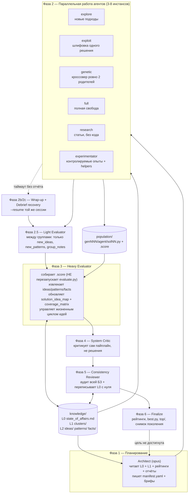

# 03 — idea_evolve и лендинги GigaEvo / CARE

Источники исследования:

- `https://github.com/aleksanderborodin/idea_evolve` — публичный репозиторий владельца блока C (клон на момент 2026-07-26, единственный коммит `471ae63 claude_and_docs`, MIT).
- `https://airi-institute.github.io/gigaevo-cover/`
- `https://airi-maestro.github.io/care-page`

---

## TL;DR

1. **`idea_evolve` — это не эскиз, а работающая система.** ~4000 строк оркестратора, 10 промптов агентов, 5 задач, 7 прогонов с реальными артефактами: 17 снимков поколений, 86 файлов идей *[ревизия 2026-07-29: верно по расположению файлов в каталогах `knowledge/ideas/*/`, но по `type:` в YAML-фронтматтере карточек идеи только 79 — ещё 4 файла несут `type: fact`, 2 — `type: pattern` (все шесть — misfiled), и один файл вообще без фронтматтера; см. §«idea_evolve: данные реальных прогонов»]*, 153 решения, 135 `.score`-сайдкаров, 120 отчётов агентов *[ревизия 2026-07-29: было «120», точный пересчёт по клону (`find . -path "*/reports/*" -name "*.md"`) даёт 112; см. там же]*. Это самый зрелый из трёх изученных артефактов.

2. **Ключевой факт для Проекта 28: у владельца блока C уже есть база знаний идей с жизненным циклом.** Идея — это markdown-файл с YAML-фронтматтером, живущий в одной из директорий `active / established / disputed / debunked / archived`, с полями `confidence`, `supported_by`, `contradicted_by`, `related_ideas`, `cluster`, `last_confirmed_gen`. Идеи не удаляются — опровергнутые сохраняются как негативное знание.

3. **Но это «озеро идей» внутри одного прогона, а не между задачами.** Спецификация V4 прямо предписывает при смене задачи *стирать* `knowledge/`. Кросс-задачное переиспользование в `idea_evolve` не поддерживается — переносятся только сводки статей в `papers/summaries/`. Это главное расхождение с ТЗ Проекта 28.

4. **В карточке идеи `idea_evolve` нет полей «условия применимости», «эффект» и «ограничения»** как отдельных структурных полей. Они растворены в свободном тексте тела и косвенно восстанавливаются через `history/solution_idea_map.md` и `history/coverage_matrix.md`.

5. **Заявленный в README результат занижен относительно реальных данных прогона.** README обещает Sidon 66 → 89 за 7 поколений; фактический `history/score_progression.md` показывает 66 → **105** (теоретическая верхняя граница ~109). README устарел.

6. **В реальной базе знаний видна «гниль знания» (knowledge rot).** В `knowledge/ideas/active/` лежат файлы с `type: fact` и `type: pattern`; `fact_001` существует в двух расходящихся копиях с разными `confidence` (0.8/`verified: false` против 1.0/`verified: true`). Тело `idea_004` буквально содержит признание: «the stale copy in ideas/active/ should be deleted». Механизм консистентности реально не справляется.

7. **GigaEvo (AIRI) — это промышленный аналог того же класса систем.** Микросервисы (Master API / Runner API / WebUI), MAP-Elites, мульти-остров, DAG на asyncio, Hydra, PostgreSQL + Redis + MinIO. `FusionBrainLab/gigaevo-core` — 125 звёзд, активная разработка *[ревизия 2026-07-29: по `gh api` на 2026-07-29 последний пуш кода — 2026-05-26, больше двух месяцев назад; число звёзд (125) с этой даты не менялось. «Активная разработка» текущими данными не подтверждается — см. раздел про метаданные репозиториев в блоке про лендинги]*.

8. **Самое важное открытие вне прямого задания: в `gigaevo-core` уже реализован `ideas_tracker` + «memory cards» — это и есть «озеро идей» в терминах Проекта 28.** Карточка содержит `description`, `category`, `keywords`, `task_description_summary` (≈ условия применимости), `usage.median_delta_fitness` (≈ измеренный эффект), `programs`, `strategy`. Есть банки `active`/`inactive`, дедупликация, отслеживание использования и **измеряемый вклад в фитнес**.

9. **CARE = Collaborative Agent Reasoning Ecosystem** (расшифровка есть только в описании репозитория `AIRI-MAESTRO/care`, на самом лендинге её нет). Это TUI/CLI-слой стека MAESTRO: **MAGE** (генерация) → **CARL** (формат цепочки) → **GigaEvo Memory** (хранение) → **GigaEvo Platform** (эволюция).

10. **Стеки смыкаются: `GigaEvo Memory` — общий компонент** и для GigaEvo, и для MAESTRO/CARE.

11. Единственные бенчмарк-числа на лендингах: CARE-пресет «Summarizer» — ROUGE-L с 0.582 до 0.724 (+0.142) за 10/40 оценённых вариантов. У GigaEvo на лендинге числовых бенчмарков нет вообще.

12. **Живой конфиг `idea_evolve` расходится со спецификацией V4** сильнее, чем на косметику: таймауты 2700 с вместо 900, лимиты ходов 1500 вместо 80, ревью консистентности каждое поколение вместо каждого третьего, и harness по умолчанию — `opencode` (GLM-5.1), а не Claude Code.

13. Реплика владельца блока C «Я так вижу в общем случае» подкреплена кодом: это его личная работающая реализация, а не концепт-презентация.

14. Прямого конфликта с ТЗ Проекта 28 нет: `idea_evolve` — это *потребитель* идей внутри эволюционного цикла, а ТЗ описывает *хранилище* идей. Они стыкуются, но требуют согласования схемы карточки.

15. Главный нерешённый вопрос: строить озеро идей поверх `gigaevo-memory` (готовый сервис, REST, поиск BM25+вектор, версионирование) или поверх файловой схемы `idea_evolve` (проще, прозрачнее, но не масштабируется за пределы одного прогона).

---

## idea_evolve: что это

Полное название по README — **Idea Evolve, «Evolutionary code optimization through collaborative AI agent work sessions»**. Заявка автора в описании репозитория: «Turns ClaudeCode/OpenCode/Codex into autonomous collaborative evolutionary agent».

Постановка проблемы (раздел 1.1 спецификации `IDEA_EVOLVE_COMPLETE_V4.md`), дословно:

> Each conversation starts fresh. There is no memory of what was tried, what worked, what failed, or why. The same dead ends get explored repeatedly.

Позиционирование относительно AlphaEvolve, дословно:

> The original AlphaEvolve system by Google DeepMind demonstrated that wrapping an LLM in an evolutionary loop … But it operates as a single LLM pipeline: one prompt sampler, one model, one loop. This system asks: what if instead of one LLM doing everything, we had a team of specialized agents, each with a distinct cognitive role, sharing knowledge through a structured file system, coordinating through an architect, and learning not just about the problem but about their own process?

Основная идея: каждая роль — это не вызов функции, а **отдельная сессия CLI-агента** (Claude Code / OpenCode / Codex), запускаемая как процесс. Оркестратор при этом принципиально **stateless**: всё состояние живёт в файлах, позиция в цикле восстанавливается по факту наличия файлов на диске.

Класс задач (раздел 1.3), дословно:

> optimization problems where candidate solutions can be automatically evaluated — sorting algorithms, scheduling heuristics, mathematical constructions, ML hyperparameter configurations, code optimization.

Заявленные принципы проектирования (раздел 2), в порядке из документа: агенты — это рабочие сессии, а не вызовы функций; файлы — источник истины; читать широко, писать узко; информация течёт вверх как сжатие и вниз как курирование; знание имеет три уровня разрешения; у каждого знания есть провенанс; структурированная оболочка + свободное наполнение (YAML frontmatter + markdown body); система отлаживает сама себя; **опровергнутое знание — это тоже знание**; ничего не теряется при таймаутах; система измеряет саму себя.

Отдельно стоит принцип 2.9, дословно:

> When an idea is proven wrong, it is marked as debunked with an explanation of why. It is not deleted. Debunked ideas prevent agents from rediscovering dead ends. But if an agent independently tries a debunked approach and succeeds, that is a legitimate discovery — it means the debunking was context-dependent. Knowledge evolves; nothing is permanently forbidden.

Это прямо релевантно ТЗ Проекта 28: негативное знание сохраняется наравне с позитивным.

### Стек

| Слой | Технология |
|---|---|
| Оркестратор | Python 3.12+, один файл `orchestrator.py` (4047 строк), stateless |
| Запуск агентов | `orchestrator_harness.py` (787 строк) — три адаптера: `claude-code`, `opencode`, `codex` |
| Модели | Алиасы `opus` / `sonnet` / `haiku`, маршрутизируются по harness; живой конфиг: `opencode` → `zai/glm-5.1`, `codex` → `gpt-5.5` |
| Хранилище | Обычная файловая система, никакой БД |
| Форматы | YAML (манифест, метрики, конфиг), JSON (`.score`, кэш, тайминги), Markdown + YAML frontmatter (знание) |
| Конкурентность | `fcntl.flock()` на разделяемых JSON, очередь оценок в `/tmp/idea_evolve_eval_queue.json` |
| Дашборд | Flask, читает файловую систему напрямую, без БД (`dashboard/app.py`, 53 строки + маршруты) |
| Внешняя сеть | WebSearch / WebFetch для research-агентов, загрузка статей с arXiv через `papers/manage.py` *[ревизия 2026-07-29: заявлено в спецификации (`IDEA_EVOLVE_COMPLETE_V4.md:367`, «download them via `papers/manage.py add <arxiv_id>`»), в коде отсутствует — файла `papers/manage.py` нет нигде в репозитории, каталога `papers/` нет ни на верхнем уровне, ни в одном из 7 прогонов (`find . -iname manage.py` и `find . -iname papers` по всему клону — пусто). Пайплайн статей существует только в спецификации и ни разу не исполнялся; см. §«idea_evolve: ключевые файлы»]* |

Команда запуска (дословно из спецификации, вариант Claude Code):

```bash
npx @anthropic-ai/claude-code --print \
  --model <model> \
  --max-turns <N> \
  --allowedTools "Read,Write,Bash,Glob,Grep" \
  --session-id <uuid> \
  -p "<prompt>"
```

---

## idea_evolve: архитектура

Цикл одного поколения состоит из шести фаз. Оркестратор не хранит состояние: функция `phase_status(project_root, gen)` определяет, где остановился прогон, исключительно по наличию файлов на диске.



### Трёхслойная база знаний

Ключевое архитектурное решение — знание хранится на трёх уровнях разрешения, чтобы не взрывать контекст агентов. Дословно из спецификации:

```
┌─────────────────────────────────────────────────────┐
│  Layer 0 — State of Affairs                         │
│  Single document. ~800-1500 tokens.                 │
│  Written by: Consistency Reviewer (every 3 gens)    │
│              Gen-1 Evaluator (bootstrap)             │
│  Read by: ALL agents, FIRST thing                   │
├─────────────────────────────────────────────────────┤
│  Layer 1 — Topic Cluster Summaries                  │
│  One file per cluster. ~200-400 tokens each.        │
│  Written by: Evaluator (incremental updates)        │
│              Consistency Reviewer (corrections)      │
│  Read by: Agents read clusters relevant to task     │
├─────────────────────────────────────────────────────┤
│  Layer 2 — Ideas, Patterns, Facts                   │
│  Individual files with YAML frontmatter.            │
│  Written by: Evaluator (new + updates)              │
│              Consistency Reviewer (lifecycle moves)  │
│  Read by: Agents drill in when detail is needed     │
└─────────────────────────────────────────────────────┘
```

### Схема карточки идеи (дословно, `docs/knowledge_base.md`)

Это центральный артефакт для сопоставления с ТЗ Проекта 28.

```yaml
---
id: idea_001
type: idea
name: "Human-readable name"
lifecycle: active | established | disputed | debunked | archived
confidence: 0.85          # 0.0–1.0
first_seen: generation_1
last_updated: generation_4
last_confirmed_gen: 4     # staleness tracking — flag if current_gen - last_confirmed_gen > threshold
cluster: cluster_003      # or: unclustered
supported_by:
  - gen003_explore_1_sol02
  - gen004_exploit_1_sol01
contradicted_by: []
related_ideas:
  - idea_005
  - idea_012
tags: [algebraic, construction, sidon]
---

Markdown body: description of the idea and evidence.
```

Требование к телу карточки (дословно, `evaluator_light.md`) — фактически это требование самодостаточности идеи:

> Body: **2-4 paragraphs** describing the idea, how it works, when it helps, and current evidence for/against. A future agent must be able to implement the idea from this file alone, without reading the original solution.

Рядом живут три родственных типа: `fact` (истина о среде, без жизненного цикла, `verified: true|false`, `source`), `pattern` (эмпирическая закономерность, `lifecycle: active | confirmed`, `evidence`) и `cluster` (группировка идей с `member_ideas`, `best_score`, `best_solution`, `status: active | stale | exhausted`).

### Жизненный цикл идеи

```
active ──evidence grows──> established
active ──contradiction──> disputed ──confirmed false──> debunked
active ──no longer relevant──> archived
```

Семантика переходов задана дословно в `evaluator.md`:

> - **active**: Newly proposed or under investigation. Limited evidence.
> - **established**: Multiple solutions confirm this idea works. Confidence >= 0.7.
> - **disputed**: Evidence is mixed. Some solutions support it, others contradict. Confidence typically 0.3-0.6.
> - **debunked**: Strong evidence that this idea does not work. Confidence < 0.2. Keep the file -- negative knowledge is valuable.
> - **archived**: Superseded by a better idea, or no longer relevant to the current frontier. Not wrong, just not useful right now.
>
> Transitions require evidence. Never change status without citing specific solution results. When you dispute or debunk an idea, explain why in the body.

Правило неудаления (дословно, `consistency_review.md`): `Do not delete knowledge files. Debunk or archive them instead.`

### Как идеи переиспользуются

Прямых полей «эффект» и «применимость» в карточке нет. Вместо этого работают два внешних индекса.

`history/solution_idea_map.md` — какие идеи реализованы в каком решении, с разделением на центральные и периферийные (дословный формат):

```
## Solution [id] (score: X)
- Central: idea_001 (greedy nearest-neighbor), idea_007 (time-based cutoff)
- Peripheral: idea_003 (random tie-breaking)
- Novel elements: [brief description of anything not yet captured as an idea]
```

`history/coverage_matrix.md` — какие комбинации идей уже пробовали и с каким результатом (дословный формат, ограничение — топ-30 идей, разреженный формат):

```
| Idea Combination          | Times Tried | Best Score | Avg Score | Last Tried |
|---------------------------|-------------|------------|-----------|------------|
| idea_001 + idea_003       | 3           | 82.4       | 76.1      | gen_12     |
| idea_002 alone            | 1           | 61.0       | 61.0      | gen_05     |
```

Самое строгое правило против дублирования идей (дословно, `evaluator_light.md`):

> Create an idea file only if BOTH of these hold:
>
> - No existing idea in `knowledge/ideas/{active,established,disputed}/` captures this strategy (check by name and first-paragraph content — never duplicate).
> - At least one solution in THIS group demonstrates it.
>
> If an existing idea already captures the concept, do NOT create a new file. Note in `group_notes.md` that this group exercised it, and mention any new evidence in `report.md` so the existing idea can be updated at end-of-gen.

### Как агенты договариваются

Прямой коммуникации между агентами нет. Дословно (раздел 7.2):

> Instances of the same type do not communicate directly. They run in parallel without knowledge of each other. Coordination happens through the Architect: it writes different directives for each instance.

Изоляция записи: каждый агент пишет только в свой `workspace/{gen}_{type}_{instance}/output/`, в общие директории файлы переносит только оркестратор. Важная оговорка из спецификации, дословно: «write isolation is advisory. The agents are instructed to write only to `output/`, but nothing enforces it… a confused agent could theoretically write elsewhere».

Контракт координации — `manifest.yaml`, который пишет Architect (дословный шаблон):

```yaml
generation: 4
strategy_summary: "Focus on refining top solutions while exploring lattice alternatives"
agents:
  - type: explore
    instance: 1
    model: sonnet
    brief: "briefs/gen004/explore_1.md"
    timeout: 1200
  - type: exploit
    instance: 1
    model: opus
    brief: "briefs/gen004/exploit_1.md"
    timeout: 1500
parallel_groups:
  - ["explore_1", "explore_2", "research_1"]
  - ["exploit_1"]
```

### Двухтрековая стратегия — механизм защиты от вырождения

Это, пожалуй, самая содержательная часть промпта архитектора и прямой ответ на риск «база знаний засасывает всех в инкрементальные улучшения». Дословно:

> ### MANDATORY: Two-Track Strategy (applies EVERY generation after gen 1)
>
> **Track A — Directed exploitation (your choice of agents).** This is where you command and steer: refine the best solutions, test incremental variations, run experiments on known techniques.
>
> **Track B — Radical exploration (minimum 1 explore + 1 research, mandatory).** These agents exist to find something **completely new**. They are NOT under your strategic direction — their job is to surprise you.
>
> 1. **The explore agent MUST NOT start from the current best solution or any file in `population/top/` or `population/best.py`.**
> 2. **The explore agent MUST NOT refine, tweak, or extend the current best technique.**
> 3. **The research agent surveys the problem domain for ideas the system has never tried.**
> 4. **Do not judge Track B agents by whether they beat the current best.**
> 5. **In the explore brief, explicitly state: "This is a Track B radical exploration. You must NOT use [current dominant technique/starting point]. Start from scratch."**
>
> **Why this matters:** The knowledge base, state of affairs, and clusters all describe what the system has already tried. They create a gravity well that pulls every agent toward incremental refinement. Track B agents exist to escape that gravity.

### Эволюционная механика — чего в системе НЕТ

Существенное отрицательное наблюдение: несмотря на название, классической эволюционной машинерии в `idea_evolve` нет. Отсутствуют MAP-Elites, острова, ниши, дескрипторы поведения, novelty search, размер популяции, турнирная/рулеточная селекция, ставки мутации и кроссовера.

Вместо них:

- **Мутация** — это сессия `exploit`-агента, а не численный оператор.
- **Кроссовер** — единственный явный генетический оператор: `genetic`-агент и ровно два родителя, которых **выбирает Architect**, а не механизм отбора.
- **Селекция** — ранжирование `population/top/` (топ-10) + `population/best.py` плюс суждение Architect.
- **Отбраковка** применяется к *идеям*, а не к решениям: `population/` растёт монотонно, оттуда ничего не удаляется.

Функция приспособленности задаётся пользователем в задаче, а не системой:

```python
# Solutions must implement:
def entrypoint() -> <problem_specific_output>

# validate() receives the output and returns:
{"fitness": <float>, "is_valid": <0|1>}
```

Приоритет источников оценки, дословно по порядку: (1) `.score`-сайдкар рядом с решением, (2) кэш `history/eval_cache.json` по SHA-256 содержимого файла, (3) комментарий-заголовок `# fitness: 1.234` в первых 10 строках.

---

## idea_evolve: ключевые файлы

Репозиторий физически расщеплён на два слоя: код и рабочие данные лежат в подкаталоге `idea-evolve/` (дефис), спецификация, README и лендинговые доки — в корне репозитория `idea_evolve` (подчёркивание). Ниже пути даны относительно `idea-evolve/`, кроме явно помеченных корневых файлов.

| Файл | Строк | Что делает |
|---|---|---|
| `orchestrator.py` | 4047 | Единственный оркестратор. `class RunContext` (`orchestrator.py:37`), `phase_status()` (`orchestrator.py:613`) — восстановление позиции в цикле по файлам на диске, `run_generation()` (`orchestrator.py:3853`), `main()` (`orchestrator.py:3908`). |
| `orchestrator_harness.py` | 787 | Три адаптера запуска CLI-агентов: `ClaudeCodeAdapter` (`:227`), `OpenCodeAdapter` (`:360`), `CodexAdapter` (`:581`), реестр `get_adapter()` (`:763`), исключения `SessionTimeout`/`SessionError` (`:48`, `:56`). |
| `agents/*.md` — 12 файлов, 2388 строк суммарно | см. таблицу ниже | Системные промпты ролей (architect, evaluator, evaluator_light, exploit, explore, full, genetic, research, experimentator, system_critic, consistency_review) + `_shared_eval_contract.md`. |
| `prompts/*.md` — 3 файла, 61 строка суммарно | `analysis_debrief.md` 16, `debrief_instructions.md` 20, `debrief_recovery.md` 25 | **Не промпты ролей.** Это служебные мини-шаблоны debrief-механизма (что дописать агенту при таймауте). Собственно ролевые промпты лежат в `agents/`, а не в `prompts/` — это единственный каталог с таким названием во всём репозитории, и он вводит в заблуждение относительно своего содержимого. |
| `papers/manage.py` | — | **Файла нет в репозитории.** `find . -iname manage.py` по всему клону не даёт ни одного совпадения; каталога `papers/` тоже нет ни на верхнем уровне, ни в одном из 7 прогонов (`find . -iname papers` — пусто). Путь задокументирован только текстом: `IDEA_EVOLVE_COMPLETE_V4.md:367` («download them via `papers/manage.py add <arxiv_id>`») и `agents/research.md:34-121` (полный CLI: `list`, `status`, `add`, `add-doi`, `summarize`). `orchestrator.py` сам `papers/manage.py` не вызывает — только упоминает `papers/summaries/` в промпте (`orchestrator.py:2074-2075`) и в списке каталогов, которые чистятся при смене задачи (`orchestrator.py:2470`, `papers/` в списке *не* значится — см. раздел «База знаний живёт один прогон»). Конвейер существует только на бумаге, ни разу не отработал. |
| `dashboard/app.py` | 53 | Flask-приложение: `create_app()` регистрирует два blueprint'а, читает файловую систему напрямую, без БД. |
| `dashboard/data/scanner.py` | 1226 | Вся тяжёлая логика чтения прогонов — самый большой файл дашборда, крупнее самого `app.py` в 23 раза. |
| `dashboard/routes/api.py` | 393 | JSON-маршруты для фронтенда. |
| `dashboard/data/helpers.py`, `dashboard/data/config.py` | 141, 86 | Форматирование и определение корня проекта. |
| `dashboard/routes/pages.py`, `dashboard/data/__init__.py`, `dashboard/routes/__init__.py` | 10, 27, 2 | Тонкие обвязки. |
| `IDEA_EVOLVE_COMPLETE_V4.md` (корень репозитория) | 1122 | Спецификация v4 — единственный источник для секций про схему карточки vs ТЗ-28, про смену задачи и про непокрытые тестами потоки ниже. |
| `scripts/*.py` (не запрошено явно, но по теме) | `check_docs_consistency.py` 242, `new_kaggle_problem.py` 258, `submit_to_kaggle.py` 179 | Вспомогательные скрипты, вне цикла оркестратора. |

---

## idea_evolve: данные реальных прогонов

Точный пересчёт по клону (`wc -l`, `find | wc -l`), семь прогонов в `idea-evolve/runs/`:

| Прогон | Каталог |
|---|---|
| 1 | `runs/gemm/attempt_001` |
| 2 | `runs/gemm/attempt_002` |
| 3 | `runs/megaminx/attempt_001` |
| 4 | `runs/permcodes/attempt_001` |
| 5 | `runs/permcodes/attempt_002` |
| 6 | `runs/sidon/attempt_001` |
| 7 | `runs/strawberry/attempt_001` |

| Величина | Известное число | Пересчитано | Статус |
|---|---|---|---|
| Прогонов | 7 | 7 (`find . -maxdepth 2 -type d -name "attempt_*"`) | подтверждено |
| Снимков поколений (`history/generations/genNNN.md`) | 17 | 17 | подтверждено |
| Файлов идей (`knowledge/ideas/**/*.md`) | 86 | 86 | подтверждено буквально, **но с оговоркой** — см. ниже |
| Решений (`.py` под `population/`, без `__pycache__`) | 153 | 153 | подтверждено точно |
| `.score`-сайдкаров | 135 | 135 | подтверждено точно |
| Отчётов агентов (`reports/**/*.md`) | 120 | **112** | **расходится** |
| Фактов (`knowledge/facts/*.md`) | 15 | 15 (10 в `gemm/attempt_001`+`gemm/attempt_002` по 5, 5 в `sidon/attempt_001`; megaminx/permcodes/strawberry — 0) | подтверждено |
| Кластеров (`knowledge/clusters/*.md`) | 10 | 10 (2 megaminx, 4 permcodes, 4 sidon) | подтверждено |

**Оговорка к «86 файлам идей».** Число считает файлы по расположению (каталог `knowledge/ideas/*/`), не по содержимому. Разбор `type:` в YAML-фронтматтере даёт:

- 79 файлов с `type: idea`,
- 4 файла с `type: fact` (misfiled — см. раздел про гниль знания ниже),
- 2 файла с `type: pattern` (misfiled — см. там же),
- 1 файл вообще без фронтматтера — `runs/permcodes/attempt_002/knowledge/ideas/active/README.md` (не карточка идеи, а служебная заметка евалюатора).

79 + 4 + 2 + 1 = 86 — совпадает, но означает, что «86 идей» как факт неверно: реальных карточек идей 79.

**Отчёты агентов: расхождение с известным числом.** `find . -path "*/reports/*" -name "*.md" | wc -l` даёт 112, а не 120. Разбивка по типам файлов: `architect.md` 15, `evaluator.md` 13, `evaluator_debrief.md` 12, `evaluator_group0.md` 1, `system_critic_debrief.md` 13, `experimentator_N.md` 9, `exploit_N.md` 7, `explore_N.md` 21, `full_N.md` 8, `research_N.md` 13 — сумма 112. Ближайшие кандидаты на «120», которые проверены и отвергнуты: `reports/` + `feedback/consistency_reviews/*.md` (13 файлов) = 125; `reports/` + `feedback/system_recommendations_archive/*` (9 файлов) = 121. Ни один вариант не даёт ровно 120. Возможно, известное число считало иначе (например, включая нетекстовые файлы прошлого клонирования репозитория или было получено на другом снимке того же коммита) — в текущем клоне `471ae63` точное число отчётов под `reports/` — **112**.

Дополнительно: `knowledge/patterns/*.md` — 34 файла (9 megaminx, 4 permcodes, 18 sidon, 3 strawberry).

---

## README против реальных данных

`README.md:16` (корень репозитория), дословно:

> **Example result:** Sidon set problem (find largest B2 sequence in {0..10000}).
> Greedy baseline: **66 elements**. After 7 generations of autonomous agent work: **89 elements** (+35%). Theoretical target: ~100.

Фактические данные прогона `runs/sidon/attempt_001`:

`history/score_progression.md:5-11`, дословно (таблица):

```
| Gen | Best fitness |
|-----|-------------|
|   0 | 66 |
|   3 | 102 (+36) |
|   4 | 102 |
|   5 | 105 (+3) |
|   6 | 105 |
|   7 | -- |
|   7 | 105 |
```

Итоговый результат прогона — **105**, не 89. Строка `7 | --` перед финальной `7 | 105` — след сбойного обновления прогресса на поколении 7, впоследствии исправленного повторной записью; сам файл этого противоречия не объясняет.

Верхняя граница подтверждена в `knowledge/state_of_affairs.md:14`, дословно: «Theoretical upper bound: **~109** (sqrt(N) + O(N^{1/4}), O'Bryant 2022). Gap: 4 elements.» Фронтматтер того же файла (`state_of_affairs.md:2-3`): `generation: 7`, `best_score: 105`.

README занижает реальный результат прогона на 16 элементов (89 против 105) и не был обновлён после того, как прогон превзошёл заявленный показатель.

---

## Гниль знания (knowledge rot) на живых данных

### Дубликат fact_001 с расходящимся содержимым

Известный факт подтверждается буквально. Две копии одного `id: fact_001` в прогоне `sidon/attempt_001`:

`runs/sidon/attempt_001/knowledge/facts/fact_001.md:1-9` (канонический каталог `facts/`):
```yaml
confidence: 0.8
verified: false
```

`runs/sidon/attempt_001/knowledge/ideas/active/fact_001.md:1-10` (misfiled в `ideas/active/`):
```yaml
confidence: 1.0
last_confirmed_gen: 6
verified: true
```

Тело второй копии само это признаёт (`ideas/active/fact_001.md:16-18`): «**Gen 6 confirmation**… **Gen 6 consistency fix**: confidence upgraded to 1.0, verified set to true.» — то есть исправление реально произошло, но было записано не туда: в `ideas/active/`, а не в `facts/`, где его продолжает искать любой агент, читающий факты по каталогу.

### Это не единичный случай — по всему прогону sidon шесть таких пар

Поиск дублирующихся `id:` внутри `knowledge/` каждого прогона (`grep -RH "^id:"`, сравнение по каталогу) даёт совпадения только в `sidon/attempt_001` — ни в одном из остальных шести прогонов дублей нет:

| id | Канонический путь | Misfiled-копия | Расхождение содержимого |
|---|---|---|---|
| `fact_001` | `knowledge/facts/fact_001.md` | `knowledge/ideas/active/fact_001.md` | confidence 0.8/false → 1.0/true |
| `fact_002` | `knowledge/facts/fact_002.md` | `knowledge/ideas/active/fact_002.md` | канонический файл всё ещё утверждает «~100-102»; misfiled-копия несёт исправление «~109» и дословную пометку (`ideas/active/fact_002.md:15,21-22`): «Correction history: Original fact said "~100-102" which was incorrect… **NOTE**: This file replaces the STALE version in facts/fact_002.md which still says "~100-102". The facts/ version must be overwritten with this corrected content.» — этого не произошло. |
| `fact_004` | `knowledge/facts/fact_004.md` | `knowledge/ideas/active/fact_004.md` | канонический файл: «the validator extracts the largest valid Sidon subset» (неверно); misfiled-копия несёт исправление и такую же дословную пометку (`ideas/active/fact_004.md:18-25`): «This was WRONG… **NOTE**: This file replaces the STALE version in facts/fact_004.md… The facts/ version must be overwritten.» — тоже не выполнено. |
| `fact_005` | `knowledge/facts/fact_005.md` | `knowledge/ideas/active/fact_005.md` | не просто устарели — это **два разных факта под одним id**: канонический — общее «Difference Set Equivalence» (сумма/разность), misfiled — конкретное «Naive Ruzsa-Lindström is NOT valid Sidon in integer arithmetic» с формулой исправления и верификацией для p=61,67,71,73. |
| `pattern_009` | `knowledge/patterns/active/pattern_009.md` | `knowledge/ideas/active/pattern_009.md` | версии разошлись по поколению: канонический датирован gen 3 (порог блокеров «45»), misfiled — gen 4 (порог скорректирован до «43», добавлен разбор pair-trade). |
| `pattern_011` | `knowledge/patterns/active/pattern_011.md` | `knowledge/ideas/confirmed/pattern_011.md` | здесь корректная, более свежая версия (gen 5, `lifecycle: confirmed`, ceiling 70 с beam search) оказалась в misfiled-копии, а в каноническом каталоге `patterns/active/` осталась более ранняя (gen 4, `lifecycle: active`, ceiling 69) — то есть агент, честно читающий `patterns/`, получит устаревшие данные, а верные лежат там, где их никто не ищет. |

Итог: 6 из 6 дублей в этом прогоне идут по одной и той же оси — файл `type: fact` или `type: pattern`, физически положенный в `knowledge/ideas/{active,confirmed}/` вместо своего каталога, при живом каноническом файле рядом.

### Признание в idea_004.md — дословно

`runs/sidon/attempt_001/knowledge/ideas/established/idea_004.md:23`, дословно:

> Status: Established. This is the foundational principle behind all competitive solutions. Note: the stale copy in ideas/active/ should be deleted — this established/ version is canonical.

На момент клонирования файла `idea_004.md` в `knowledge/ideas/active/` того же прогона **не существует** — значит, либо чистка когда-то произошла (но фраза-триггер осталась в теле файла как мёртвая ссылка на уже несуществующую проблему), либо запись всегда была декларативной и никто её не выполнял отдельным шагом. В любом случае обнаружение проблемы автоматическую доработку не закрывает.

### state_of_affairs.md сам фиксирует ту же болезнь

`runs/sidon/attempt_001/knowledge/state_of_affairs.md:65`, дословно:

> 4. **DANGER: Stale fact files persist.** facts/fact_002.md says upper bound "~100-102" (WRONG: ~109). facts/fact_004.md says validator extracts subsets (WRONG: sentinel scoring). 4-generation architectural issue — no orchestrator path updates facts/. Agents reading facts/ will be misled.

Это независимое (написанное Consistency Reviewer'ом) подтверждение находки из предыдущего пункта: сам оркестратор не имеет кода, который дописывал бы обновления в `facts/` после первой записи (только `Heavy Evaluator` пишет туда новые факты, `docs/knowledge_base.md`: «`facts/` | ❌ never (Light) | ✅ adds (Heavy) | — (Consistency Reviewer)» — обновление существующих фактов не предусмотрено ни одной ролью).

### Стрелка на этот риск в собственной документации автора — DESIGN-19

`docs/operational_history.md:1300` (заголовок `### [DESIGN-19] Light Evaluator между группами — открытые риски`), пункт 1, дословно (`docs/operational_history.md:1317-1325`):

> 1. **Double-counting ideas with Heavy Evaluator.** Light eval writes `knowledge/ideas/<lifecycle>/*.md` mid-generation. Heavy eval at end-of-gen may re-extract the same idea under a different name (LLMs are inconsistent about idea naming). No dedup layer between them; the Heavy evaluator's prompt now points to `knowledge/group_notes/` + `reports/genNNN/evaluator_group*.md` but the template (`agents/evaluator.md`) isn't updated to say "consolidate, don't duplicate." Watch `knowledge/ideas/active/` for obvious dupes after gen 1; if seen, add a dedup pass or update the template.

Автор сам пометил это как «none verified yet» (`docs/operational_history.md:1315`) — риск, требующий проверки на первом реальном прогоне. Данные `sidon/attempt_001` показывают, что риск материализовался (шесть дублей выше), а рекомендованное действие («add a dedup pass or update the template») по состоянию клона `471ae63` не выполнено.

### Стрей-файл, искажающий подсчёт

`runs/permcodes/attempt_002/knowledge/ideas/active/README.md` — без фронтматтера, дословно:

> No ideas were updated this generation. This is the bootstrap generation — all knowledge was created from scratch. There were no pre-existing idea files to modify.
>
> All ideas from this generation are in `../new_ideas/`:
> - idea_001 through idea_014
>
> See `generation_snapshot.md` for the full list of ideas created this generation.

Оба пути, на которые ссылается заметка — `knowledge/ideas/new_ideas/` и `generation_snapshot.md` — в этом прогоне отсутствуют (`find . -iname new_ideas -o -iname generation_snapshot.md` под каталогом прогона — пусто). Файл попадает в счётчик «86 файлов идей» просто по расположению, будучи фактически артефактом евалюатора, ссылающимся в никуда.

### Масштаб

На 7 прогонов гниль сосредоточена в одном — `sidon/attempt_001`, самом длинном (7 поколений против 1-5 в остальных) и самом насыщенном знанием (31 из 86 файлов идей, 18 из 34 паттернов, 5 из 15 фактов, 4 из 10 кластеров — везде наибольшая доля). Корреляция очевидна: чем дольше живёт база знаний внутри одного прогона, тем заметнее расхождение между Light/Heavy Evaluator и Consistency Reviewer, предсказанное самим автором в DESIGN-19.

---

## Спецификация V4 против живого конфига

Спецификация (раздел 12 «Configuration», `IDEA_EVOLVE_COMPLETE_V4.md:812-902`) приводит референсный `user/config.yaml`. Живой файл `idea-evolve/user/config.yaml` расходится с ним по всем заявленным пунктам плюс один дополнительный:

| Параметр | Спецификация (адрес) | Живой конфиг (адрес) |
|---|---|---|
| `timeouts.agent_default` | `900` (`IDEA_EVOLVE_COMPLETE_V4.md:861`) | `2700` (`user/config.yaml`, блок `timeouts:`) |
| `max_turns.explore` (и `exploit`, `full`) | `80` (`IDEA_EVOLVE_COMPLETE_V4.md:871-873`) | `1500` (`user/config.yaml`, блок `max_turns:`) |
| `consistency_review_interval` | `3` (`IDEA_EVOLVE_COMPLETE_V4.md:900`, «Consistency Reviewer runs every 3 generations», также дословно в §5: `IDEA_EVOLVE_COMPLETE_V4.md:169,407`) | `1` — каждое поколение (`user/config.yaml`, ключ `consistency_review_interval: 1`) |
| Harness по умолчанию | Claude Code CLI: «Every agent is launched as a Claude Code CLI session» (`IDEA_EVOLVE_COMPLETE_V4.md:936`), команда `npx @anthropic-ai/claude-code --print …` (`:939`) | `harnesses.default: opencode`, `models.opencode.sonnet: zai/glm-5.1` (`user/config.yaml`) |
| `timeouts.wrap_up` | `900` (`IDEA_EVOLVE_COMPLETE_V4.md:865`) | `2700` (`user/config.yaml`) |
| `timeouts.evaluator` | `900` (`IDEA_EVOLVE_COMPLETE_V4.md:862`) | `2700` (`user/config.yaml`) |

Ни один из расходящихся параметров не помечен как экспериментальный — оба файла существуют в одном коммите `471ae63`. Три из четырёх изменений (таймауты, лимиты ходов, harness) увеличивают ресурсы на сессию; консистентность, наоборот, требуется чаще, чем предписывает спецификация, а не реже.

---

## Покрытие тестами

Единственный тестовый файл — `tests/test_adapters.py`, 234 строки (плюс `tests/conftest.py`, 14 строк — только фикстуры). Docstring файла (`test_adapters.py:1-11`), дословно:

> Adapter smoke tests.
>
> These tests exercise the minimum contract all harnesses must honor:
>   - `launch()` returns a non-empty session id (and finishes under timeout)
>   - `resume()` with the returned id retains session memory
>   - `SessionTimeout` is raised on wall-clock timeout AND carries a session id
>     so the wrap-up/debrief state machine can resume the same session
>
> Heavier tests (full-workflow, tool-permission translation, `--max-turns`
> fidelity) are deliberately out of scope. These only guard the pieces
> `orchestrator.py` depends on.

11 юнит-тестов без сети/подпроцессов плюс 3 интеграционных теста, помеченных `@pytest.mark.skipif` на отсутствие `opencode` + `MODELGATE_API_KEY` (`test_adapters.py:147-223`) — то есть при отсутствии реального доступа к ModelGate интеграционная часть не выполняется вовсе.

Автор сам перечисляет непокрытое — раздел «15.4 Untested End-to-End Flows» (`IDEA_EVOLVE_COMPLETE_V4.md:1100-1109`), дословно:

> These flows are implemented but have not been verified in a real multi-generation run:
>
> - **Genetic crossover** — Requires Architect to specify 2 parents by path. The `genetic.md` template is correct but parent path resolution is untested.
> - **Experimentator → knowledge pipeline** — Experiment results go to `knowledge/experiments/`, evaluator consolidates old ones. The full cycle is untested.
> - **Consistency reviewer cluster updates** — When the reviewer writes `updated_clusters/`, the orchestrator diffs against existing clusters to find removed ones and fix orphaned refs.
> - **Experiment requests flow** — Full agents → `experiment_requests.md` → collected to `feedback/` → listed in Architect prompt.
> - **Gen-1 Evaluator cluster bootstrap** — No example cluster files exist. Prompt describes the format but there's nothing to imitate. First clusters may be poor.
> - **`--allowedTools` auto-approval** — We assume it auto-approves tools in `--print` mode. If not, agents would be blocked waiting for approval.

Соседний раздел «15.5 Spec Deviations — Intentional» (`IDEA_EVOLVE_COMPLETE_V4.md:1111-1119`) добавляет ещё один пункт, релевантный разделу про гниль знания: «Knowledge files versioned» в спецификации → «Overwritten in place» в реализации, с обоснованием «Would need git or versioning layer» — то есть отсутствие версионирования знания задокументировано как осознанный компромисс, а не оплошность, что делает найденную гниль знания предсказанным, а не случайным дефектом.

---

## Лендинги GigaEvo и CARE

Источники: живые страницы (`https://airi-institute.github.io/gigaevo-cover/`, `https://airi-maestro.github.io/care-page`) и исходники лендингов из публичных репозиториев `airi-institute/gigaevo-cover` (каталог `docs/` — это и есть опубликованная страница, побайтово совпадает с `curl`-выгрузкой) и `airi-maestro/care-page`, метаданные репозиториев — `gh api`.

### Лендинг GigaEvo

Исходник — `index.html` (1362 строки, `lang="ru"`; есть англ.-версия `index-en.html`, не разбиралась подробно).

Тег-лайн (index.html:48): «GigaEvo — эволюционный фреймворк для автоматизации ML и LLM-ориентированных задач», далее (index.html:146-147): «Фреймворк создан для автоматизации задач машинного обучения, включающих оптимизацию моделей, параметров, признаков и LLM-ориентированных методов. Решение минимизирует участие специалистов, ускоряет цикл экспериментов и повышает качество итоговых моделей.»

Архитектура и технологии — каждый пункт нашёлся дословно:

- **Микросервисы Master API / Runner API / WebUI** — подтверждено, index.html:196-203: «Master API работает на порту 8000 и служит центральным сервисом оркестрации... Множественные экземпляры Runner API работают на портах 8001 и далее... WebUI работает на порту 7860...».
- **MAP-Elites** — index.html:173: «Асинхронный эволюционный движок реализует алгоритм MAP-Elites, поддерживающий разнообразный архив высокоэффективных программ по показателям приспособленности и корректности».
- **Мульти-остров** — там же (index.html:173): «...включая одно- и многоостровные конфигурации с периодической миграцией решений.»
- **DAG на asyncio** — index.html:164: «...асинхронного фреймворка на основе направленного ациклического графа (DAG), реализованного в Python с использованием asyncio, что обеспечивает параллельное выполнение...».
- **Hydra** — index.html:175: «Управление конфигурацией и экспериментами выполняется с помощью Hydra, использующей иерархические YAML-файлы...».
- **PostgreSQL + Redis + MinIO** — подтверждено, отдельный аккордеон «Подробнее о хранении данных», index.html:217 (PostgreSQL — «основная база данных для хранения конфигураций экспериментов»), :219 (Redis — «кэширование и координация», очереди задач), :221 (MinIO — «S3-совместимое объектное хранилище»).
- **LangGraph-мутатор** — index.html:174: «Операция мутации осуществляется агентом на базе LangGraph, который формирует подсказки (prompts) на основе контекста задачи, родительских программ и метрик...».
- **EvoMemory** — на самой странице заголовок раздела — «GigaEvo Memory» (index.html:1118, якорь `#evo_memory`), но кнопка в шапке и репозиторий называются `EvoMemory` (index.html:69, `href="https://github.com/AIRI-Institute/gigaevo-memory"`). Раздел (index.html:1122-1141) описывает функцию памяти («использовать лучшие идеи из прошлых экспериментов и накапливать опыт») без привязки к конкретному внешнему потребителю.

**Бенчмарки и ссылки на статьи — проверено по всему файлу (1362 строки): их нет.**
- Все числа с плавающей точкой на странице, кроме мелочей вида `Python 3.12+` (index.html:576) и CSS-градиентов (`0%`/`100%`, index.html:35/131), — это координаты SVG-иконок Telegram/GitHub в подвале (index.html:1340, 1347), не метрики.
- Слово «publication» встречается один раз (index.html:1311) — это шаблонная фраза подвала: «This page was built using the AIRI Institute template for research publications and scientific projects» — про сам шаблон страницы, не про статью с результатами GigaEvo.
- Полный список `href` на странице (index.html, все 27 ссылок): якоря разделов, картинки `images/*.jpg`, три GitHub-репозитория (`gigaevo-platform`, `gigaevo-memory`, `FusionBrainLab/gigaevo-core`), Telegram, `mailto:`, шрифты Google, MIT-лицензия, ссылка на `index-en.html` и на лендинг MAESTRO (`https://airi-institute.github.io/maestro-cover/`, index.html:1060). **Ни одной ссылки на arxiv.org, doi.org или другую научную публикацию нет.**

Команда (раздел «Команда», index.html:1184-1293): 8 карточек участников (роли ниже, имена не привожу). Роли: инженер-исследователь, три младших научных сотрудника, ведущий научный сотрудник — руководитель группы «Генеративное проектирование», системный аналитик, научный сотрудник — руководитель группы «Мультимодальные архитектуры ИИ», и один участник с аффилиацией «Сбер, Блок Риски» (index.html:1285-1293) — единственный не-AIRI член команды.

### Лендинг CARE

URL из задания — `https://airi-maestro.github.io/care-page` (редиректит/содержательно совпадает с каноническим `https://airi-maestro.github.io/`, см. `<link rel="canonical">`, index.html:11). Исходник — `index.html` (2528 строк) + `i18n.js` (переводы, RU/EN). На самой странице лендинг называет себя «MAESTRO», не «CARE»: `<title>MAESTRO — агентные цепочки из текстового запроса</title>` (index.html:6), `og:site_name` = «MAESTRO CARE» (index.html:17).

**Расшифровка CARE = Collaborative Agent Reasoning Ecosystem** — подтверждается: она есть только в описании репозитория, на лендинге отсутствует.
- Репозиторий, `gh api repos/AIRI-MAESTRO/care` → `"description": "Collaborative Agent Reasoning Ecosystem TUI & CLI"`.
- На лендинге слово «CARE» встречается 17 раз (grep по `index.html`), но исключительно как часть бренда «MAESTRO CARE» (og-теги, index.html:17, :28; подпись футер-колонки index.html:2416) или как часть путей/URL (`github.com/AIRI-MAESTRO/care`, `care-docs`, ключ `localStorage` `care-landing-theme`, index.html:65). Ни разу слова «Collaborative», «Agent Reasoning» или «Ecosystem» рядом с расшифровкой CARE не встречаются (grep по `index.html` и `i18n.js` на «collaborative»/«ecosystem» даёт 0 попаданий в видимом тексте; «ecosystem» находится только в служебном README самого репозитория лендинга и в `i18n.js:314` — но там это другое предложение: `"stack.subtitle": "MAESTRO — an ecosystem for generating and evolving chains"`, тоже без раскрытия аббревиатуры CARE).
- Отдельная находка: JSON-LD на лендинге (index.html:46) указывает `codeRepository` на личный аккаунт, а не на организационный `AIRI-MAESTRO/care`, на который ведут остальные кнопки страницы (index.html:159, :248, :2147). Расхождение внутри самого лендинга; имя аккаунта не привожу.

Стек MAGE → CARL → GigaEvo Memory → GigaEvo Platform, раздел «Что под капотом» (`#stack`, index.html:1274-1319, i18n-ключи `stack.*`):
- Видимая структура из 4 слоёв подтверждена: «Генерация» (`stack.mage`, CSS-класс `stack-module--mage`, index.html:1288) → «Формат цепочки» (`stack.carl`, класс `--carl`, index.html:1295) → «Память» (`stack.memory`, класс `--memory`, index.html:1302) → «Эволюция» (`stack.platform`, класс `--platform`, index.html:1311).
- **Но буквы «MAGE» и «CARL» и словосочетания «GigaEvo Memory»/«GigaEvo Platform» как видимый текст на странице не встречаются вообще.** Они существуют только как служебные имена — CSS-модификаторы (`stack-module--mage/--carl/--memory/--platform`) и ключи i18n (`stack.mage.*`, `stack.carl.*`, `stack.memory.*`, `stack.platform.*`, i18n.js:73-84). Видимый посетителю текст — только русские названия «Генерация / Формат цепочки / Память / Эволюция» с короткими описаниями (index.html:1289-1315).
- Слово «GigaEvo» на лендинге CARE не встречается ни разу — ни в `index.html`, ни в `i18n.js` (grep case-insensitive по обоим файлам → 0 совпадений). Оно есть только в служебном README репозитория лендинга (упоминания про имя ассета `gigaevo_agent_evolution_transparent.png`) и в имени скрипта `scripts/build_emotes.py:29` — то есть в исходниках сборки, не в содержимом страницы.
- Вывод: соответствие слоёв «Память»→GigaEvo Memory и «Эволюция»→GigaEvo Platform — это интерпретация по параллели с лендингом GigaEvo и именами CSS-классов/i18n-ключей, а не факт, прямо написанный на странице CARE.

### Единственные числа на обоих лендингах

Место — блок `evolution-showcase` на лендинге CARE, index.html:1360-1391 (рус. версия; тот же текст на английском в i18n.js:340/345/357-358):

Дословная цитата (index.html:1362): «Пример: пресет Summarizer · 8 тестовых кейсов · метрика ROUGE-L»

Дальше три метрики (index.html:1370, 1379, 1385-1390):
- «Стартовый fitness» → **0.582** (подпись «исходная цепочка»)
- «Лучший fitness» → **0.724** (подпись «после 10 мутантов»)
- «ROUGE-L» → **+0.142**, подпись-хинт «0.582 → 0.724»
- «Мутанты» → **10 / 40**, подпись «оценено / бюджет»

Пресет Summarizer, ROUGE-L 0.582 → 0.724 (+0.142), 10 из 40 (сформулировано на странице как «10 / 40, оценено / бюджет» — то есть оценено 10 вариантов из бюджета в 40).

**Другие числа на странице CARE — есть, но это не бенчмарки, а маркетинг/демо-контент**, поэтому они отделены от единственного «настоящего» бенчмарка:
- Hero-статы (index.html:325-342): «≈1 мин» / «до первого агента», «TUI + CLI» / «один инструмент», «100%» / «открытый код» — рекламные заявления, не измерения качества.
- Демо-пример в разделе про формат CARL (index.html:614, 698, 706, 710): вымышленный отчёт `q3-report.pdf`, `period: Q3 2025`, `revenue: $4.20M`, `net_income: $0.91M` — иллюстрация того, как выглядит цепочка обработки документа, цифры не относятся к CARE/MAESTRO как продукту.
- Счётчик шагов цепочки «было / стало» в примере эволюции (index.html: `1 шаг` → `3 шага`, в блоке `carl-chain-count`) — тоже часть того же иллюстративного примера, не отдельная метрика.

На лендинге GigaEvo числовых данных, похожих на бенчмарк, нет вообще (см. выше) — единственные числа с точкой там оказались координатами SVG-иконок.

### Смыкание стеков

Прямой текстовой ссылки «MAESTRO/CARE использует GigaEvo Memory» на лендинге CARE нет (слово «GigaEvo» там не встречается). Смыкание подтверждается с обратной стороны и косвенно:

- Лендинг GigaEvo прямо ссылается на MAESTRO и его формат CARL: index.html:1059-1060 — «В новой версии GigaEvo Platform получила функцию автоматического улучшения структурированных цепочек рассуждений в формате библиотеки CARL из фреймворка MAESTRO. Подробнее о формате и возможностях фреймворка — [MAESTRO](https://airi-institute.github.io/maestro-cover/)». Это ссылка на **другой** лендинг (`maestro-cover`), не на `care-page`, но подтверждает, что GigaEvo Platform умеет работать с форматом CARL, специфичным для MAESTRO/CARE.
- `gigaevo-memory` — отдельный самостоятельный репозиторий AIRI-Institute (не часть `gigaevo-core` и не часть `care`), на него ссылается кнопка «EvoMemory» с лендинга GigaEvo (index.html:69, `AIRI-Institute/gigaevo-memory`). Метаданные репозитория (`gh api repos/AIRI-Institute/gigaevo-memory`): создан 2026-04-06, последний пуш 2026-06-26, 3 звезды, лицензия не указана, описание отсутствует (`"description": null`). Отдельность репозитория делает архитектурно правдоподобным, что и GigaEvo Platform, и MAESTRO/CARE подключают его как общую библиотеку памяти — но сам факт использования репозиторием `care` библиотеки `gigaevo-memory` ни на одном из двух лендингов текстом не подтверждён.
- Внутри лендинга CARE слой «Память» (index.html:1302-1310) по CSS-классу и i18n-ключу назван `--memory`/`stack.memory` — по аналогии с именем «GigaEvo Memory» с другого лендинга, но это структурное совпадение имён, не цитата.

Итог: смыкание стеков реально существует на уровне репозиториев (общий `gigaevo-memory`, GigaEvo Platform исполняет цепочки формата CARL из MAESTRO), но на лендинге CARE это нигде не названо словом «GigaEvo» — связь видна только через лендинг GigaEvo (ссылка на MAESTRO/CARL) и через совпадение служебных имён в исходнике CARE.

### Метаданные репозиториев

Запрошено `gh api repos/...` 2026-07-29; в задании ожидалось состояние на 2026-07-26 — разрыв всего 3 дня.

**`AIRI-MAESTRO/care`** (`gh api repos/AIRI-MAESTRO/care`):
- Создан: `2026-06-15T08:34:52Z`.
- Последний пуш: `2026-06-29T14:27:42Z`; `updated_at` (последняя активность/старение звёзд): `2026-06-29T14:30:54Z`.
- Звёзды: `0`, форки: `0`, open issues: `0`.
- Лицензия: `null`.
- Описание: `"Collaborative Agent Reasoning Ecosystem TUI & CLI"`.
- Видимость: `public`. Язык: Python, размер 2003 (KB).
- Репозиторий не получал пушей с 29 июня, поэтому состояние на 26 июля и на 29 июля (текущая дата) идентично.

**`FusionBrainLab/gigaevo-core`** (`gh api repos/FusionBrainLab/gigaevo-core`):
- Звёзды: **125**.
- Форки: 25, open issues: 20, subscribers: 2, network_count (форки в сети): 25.
- Лицензия: MIT.
- Описание: «Evolutionary algorithm that uses Large Language Models (LLMs) to automatically improve programs through iterative mutation and selection».
- Создан: `2025-11-17T11:05:28Z`.
- Последний пуш: `2026-05-26T09:37:57Z`; `updated_at`: `2026-06-30T02:26:00Z` (эта дата обновляется звёздами/форками, не кодом).
- Видимость: `public`, `homepage`: `https://airi-institute.github.io/gigaevo-cover/`.
- **Последний пуш кода — 2026-05-26**, то есть больше двух месяцев назад относительно 2026-07-29. Число звёзд (125) при этом не изменилось со дня публикации кода. Формулировка «активная разработка» (см. TL;DR) текущими данными `gh api` не подтверждается — код не пушился давно, хотя интерес (форки/звёзды) остаётся стабильно высоким.

**`AIRI-Institute/gigaevo-memory`** (бонусный источник, использован в разделе про смыкание стеков): создан `2026-04-06T14:13:25Z`, последний пуш `2026-06-26T14:06:13Z`, звёзды 3, форки 0, лицензия не указана, описание отсутствует (`null`), видимость `public`.

### Что это значит для проекта 28

- Оба стека (GigaEvo и MAESTRO/CARE) решают задачу, структурно близкую блоку A: вход (задача/запрос) → преобразование через LLM → структурированный результат с версионированием и метриками. Их DAG/CARL-исполнитель и «озеро идей» с тезисами/идеями — разные предметные области, прямого кода переиспользовать нельзя.
- **GigaEvo Memory** — отдельный репозиторий с открытой лицензией не указан (лицензия `null`), 3 звезды, слабо документирован (`description: null` в API) — прежде чем на него ссылаться как на образец для `index.py`/векторного индекса блока A, стоит прочитать код, а не полагаться на лендинги: оба лендинга описывают функцию памяти на уровне маркетинга, без деталей формата хранения.
- Формат CARL (LLM/TOOL/TRANSFORM/MEMORY/MCP/CONDITIONAL/STRUCTURED_OUTPUT-шаги, см. лендинг GigaEvo, index.html:1090) может быть релевантен для контрактов блока B/C при линковке идей в цепочки — но это чужой формат, у блока A свой (`prompts/{step}/system.txt`), дублировать не нужно.
- Риск дублирования: GigaEvo уже реализует эволюцию промптов через MAP-Elites с ROUGE/BERTScore/BLEU-валидацией (index.html:928 и далее) — если блок C (эволюция) в проекте 28 планирует нечто похожее, стоит явно сверить контракты, а не изобретать вторую версию того же самого внутри лейка.
- Числовой пример ROUGE-L (0.582→0.724, 10/40) — это демонстрационный кейс на 8 тестах, не отчёт о качестве системы в проде; использовать его как аргумент «CARE работает» некорректно — выборка слишком маленькая, и это единственный такой пример на обеих страницах.
- «Смыкание стеков» через `gigaevo-memory` подтверждено только по совпадению репозиториев и косвенной ссылке с лендинга GigaEvo на MAESTRO/CARL — если блоку A нужно опереться на факт совместного использования, для отчётности лучше сослаться на код (issues/PR), а не на лендинги: там прямого текста об этом нет.

---

## Схема карточки идеи против ТЗ проекта 28

ТЗ требует пять полей карточки: концепция → условия применимости → эффект → ограничения → связи. Сопоставление со схемой `idea_evolve` (`docs/knowledge_base.md`, раздел «File Schemas» → Idea; идентичный YAML в `agents/evaluator.md:89-104`):

| Поле ТЗ-28 | Есть как структурное поле? | Где на самом деле |
|---|---|---|
| концепция | частично — `name` (короткое имя) структурно; развёрнутое описание только в теле | `name:` в фронтматтере + тело (свободный текст) |
| условия применимости | **нет** — только текст | требование к телу (дословно, `agents/evaluator_light.md:112`, идентично `agents/evaluator.md:107`): «Body: 2-4 paragraphs describing the idea, how it works, **when it helps**, and current evidence for/against.» — «when it helps» и есть условия применимости, но нигде не вынесено в поле |
| эффект | **нет прямого числового поля на уровне идеи** | ближайшие структурные суррогаты: `confidence` (0.0-1.0, вера, не измеренный эффект) и список `supported_by` (только идентификаторы решений-подтверждений, без чисел). Единственное настоящее числовое поле эффекта во всей схеме знания — `best_score`/`best_solution` в карточке **кластера** (`docs/knowledge_base.md`, схема Cluster), то есть эффект измерим только на уровне группы идей, не отдельной идеи |
| ограничения | **отсутствует полностью** — ни как поле, ни как обязательный элемент текста тела. Ближайший структурный аналог — `contradicted_by` (список решений, где идея не сработала), но это свидетельство против идеи в целом, а не описание условий отказа | — |
| связи | да, полно — `related_ideas`, `cluster`, `contradicted_by`, `supported_by`, `tags` | фронтматтер |

Внешние индексы `history/solution_idea_map.md` и `history/coverage_matrix.md` (описаны выше) частично восстанавливают «эффект» пост-фактум (сравнение Best Score / Avg Score по комбинациям идей), но это агрегированный отчёт по решениям, а не поле самой карточки идеи — и он ведётся вручную Heavy Evaluator, а не выводится автоматически из `.score`.

Итог: из пяти полей ТЗ-28 структурно закрыты только «связи»; «концепция» закрыта частично (имя, но не суть); «условия применимости» и «эффект» существуют исключительно как текст или как суррогат на другом уровне детализации (кластер, а не идея); «ограничения» не закрыты никак.

---

## База знаний живёт один прогон

Спецификация прямо предписывает уничтожение состояния при смене задачи. `IDEA_EVOLVE_COMPLETE_V4.md:561-567`, дословно:

> **Problem-agnostic design:** The orchestrator never hardcodes metric names, directions, or formatting. Everything flows from `metrics.yaml`. To change the problem:
>
> 1. Replace `problem/description.md`, `constraints.md`, `validate.py`, `helpers/core.py`, `initial_programs/`
> 2. Replace `problem/metrics.yaml` with the new metric definitions
> 3. Update `user/config.yaml` `target_score` to match the new target
> 4. Clear old state: `knowledge/`, `population/`, `history/`, `reports/`, `feedback/`, `briefs/`
> 5. Update `user/initial_ideas.md` and `user/initial_facts.md`

Пункт 4 — это буквально требование стереть всю базу знаний идей (`knowledge/`) при переходе на новую задачу. В списке нет `papers/` — единственный каталог, который спецификация явно оставляет жить между задачами, описан в §3.4 (`IDEA_EVOLVE_COMPLETE_V4.md:367-373`): «All future agents can read summaries from `papers/summaries/` without re-downloading» (`:367`), и в перечне «Writes to papers/: … updated `index.yaml`» (`:373`) как накопительный ресурс. Полный список всех каталогов проекта, где `papers/` фигурирует наравне со стираемыми (для контраста), дан в `IDEA_EVOLVE_COMPLETE_V4.md:996`: `population/`, `knowledge/`, `problem/`, `history/`, `reports/`, `briefs/`, `feedback/`, `user/`, `agents/`, `workspace/`, `papers/`, `prompts/`, `dashboard/` — из тринадцати каталогов проекта только `papers/` не входит в список очистки при смене задачи (шаг 4 выше называет ровно шесть каталогов на стирание, `papers/` среди них нет).

Это прямое расхождение с посылкой Проекта 28: «озеро идей» подразумевает межзадачное переиспользование карточек идей, а в `idea_evolve` межзадачно переносятся только текстовые сводки статей — сама база идей, паттернов, фактов и кластеров закладывается заново на каждой задаче и не имеет пути наружу.

---

## Итоговая оценка

**Переиспользуемо:**
- Трёхслойная иерархия знания (L0 State of Affairs / L1 clusters / L2 ideas-patterns-facts) как способ не взрывать контекст агента — архитектурная идея, независимая от конкретной реализации файлов.
- Принцип «опровергнутое знание — тоже знание» (`lifecycle: debunked`, не удаляется) — прямое совпадение с духом ТЗ-28 про негативное знание.
- Два внешних индекса переиспользования — `solution_idea_map.md` (центральные/периферийные идеи в решении) и `coverage_matrix.md` (комбинации идей × лучший результат) — рабочий, пусть и грубый, способ измерять фактический эффект комбинаций идей постфактум.
- Механизм «двухтрекового» планирования (Track A/B в `architect.md`) как защита от вырождения к инкрементальным улучшениям — концептуально переносимо на ретрив идей для Проекта 28 (не отдавать только «похожее на то, что уже работало»).

**Не переиспользуемо или требует переделки:**
- Файловая схема карточки идеи не закрывает 3 из 5 полей ТЗ-28 структурно (см. выше) — потребуется новая схема, а не прямое заимствование.
- База знаний архитектурно одноразовая (см. выше) — прямо противоречит межзадачному переиспользованию, на котором строится Проект 28.
- Механизм консистентности (Light + Heavy Evaluator + Consistency Reviewer) на практике не держит инвариант «одна идея — один файл»: гниль уже видна на реальных данных единственного длинного прогона — `runs/sidon/attempt_001/knowledge/ideas/active/fact_001.md` и его расходящийся канонический двойник `runs/sidon/attempt_001/knowledge/facts/fact_001.md`, плюс ещё пять аналогичных пар в том же прогоне. Это не гипотетический риск: автор сам предсказал его в `docs/operational_history.md:1317-1325` (DESIGN-19) как непроверенный, а данные показывают, что он подтвердился.
- Harness и модели живого конфига (`opencode`/`zai/glm-5.1` по умолчанию) — специфика окружения автора, не переносится вместе с архитектурой; для Проекта 28 модели уже заданы (Qwen3.5-9B / Qwen3.6-35B-A3B, свои серверы школы).
- Тестовое покрытие ограничено контрактом harness-адаптеров (234 строки, `tests/test_adapters.py`) — вся остальная логика (evaluator, consistency reviewer, кроссовер, коуверидж) проверена только косвенно, через факт наличия реальных прогонов, но не автоматическими тестами.
