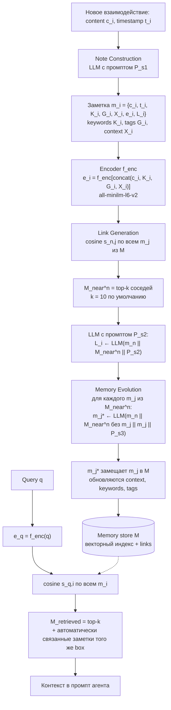
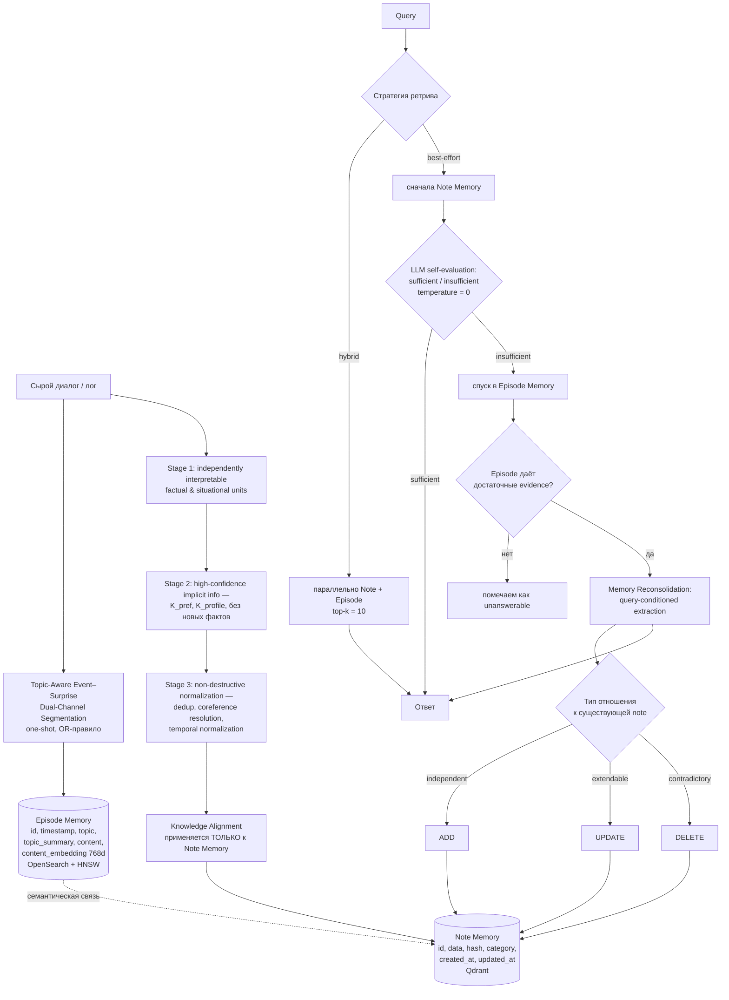

# 04. Научная база: агентная память и извлечение идей

> Черновик research-базы для AIRI Summer 2026, Проект 28 «Озеро идей» (Ideas Lake).
> Все цифры и названия полей взяты из текстов статей и официальных репозиториев дословно.
> Где проверить не удалось — стоит `не подтверждено`.

## TL;DR

1. **arXiv:2601.06377 действительно резолвится в HiMem** — «HiMem: Hierarchical Long-Term Memory for LLM Long-Horizon Agents», v1 от 10 января 2026, cs.AI, код лежит в https://github.com/jojopdq/HiMem. Никакого поиска по названию не потребовалось.
2. **A-MEM** (arXiv:2502.12110, NeurIPS 2025) даёт нам ровно то, что нужно для карточек: атомарная note со схемой `m_i = {c_i, t_i, K_i, G_i, X_i, e_i, L_i}`, автогенерация `keywords` / `context` / `tags` одним LLM-вызовом, линковка через top-k cosine + LLM-решение, и **memory evolution** — переписывание соседних заметок при добавлении новой.
3. **HiMem** даёт ортогональную вещь: **двухуровневую память** (`Episode Memory` → `Note Memory`), трёхстадийное извлечение знаний (Stage 1 факты → Stage 2 неявные атрибуты → Stage 3 неразрушающая нормализация) и **conflict-aware Memory Reconsolidation** с типизацией `independent / extendable / contradictory` → `ADD / UPDATE / DELETE`.
4. A-MEM без иерархии плохо масштабируется по стоимости эволюции; HiMem без линковки не строит граф идей.
5. Оба работают на **одном бенчмарке LoCoMo** (диалоги), и это главная слабость: **ни одна из статей не про научные тексты, не про идеи и не про анонимизацию**.
6. Ключевые цифры-ориентиры: A-MEM ~**1 200 токенов на memory-операцию** (85–93 % экономии против 16 900 у baseline), retrieval **0.31 µs → 3.70 µs** при росте с 1K до 1M заметок. HiMem overall **GPT-Score 80.71** против Mem0 68.74 / SeCom 69.03 / A-MEM 51.88, при **1 271.69 токенов** и **1.53 с** latency.
7. Осторожно: HiMem по **F1** проигрывает Mem0 (34.95 против 48.16) и меряет себя главным образом LLM-судьёй GPT-4o-mini на GPT-4o-mini-бэкенде. Плюс в §3.3 HiMem описывает A-MEM неверно («entities, relations, and temporal features») и цитирует его же в списке работ про LLM-as-a-Judge bias. Это сигнал: числа HiMem брать как порядок величины, не как истину.
8. Выигрыш от эволюции памяти у HiMem честно маленький: **+5.85 % на Note Memory, но всего ~0.28 % на overall**. У A-MEM ablation куда драматичнее (Multi Hop F1 9.65 → 21.35 → 27.02), но это разные постановки.

---

## A-MEM (arXiv:2502.12110)

**Точное название:** A-Mem: Agentic Memory for LLM Agents (в листинге arXiv — «A-MEM»).
**Авторы:** Wujiang Xu¹, Zujie Liang², Kai Mei¹, Hang Gao¹, Juntao Tan¹, Yongfeng Zhang¹˒³.
**Аффилиации:** ¹ Rutgers University, ² Independent Researcher, ³ AIOS Foundation.
**Даты:** v1 — 17 февраля 2025; последняя правка (v11) — 8 октября 2025.
**Венью:** NeurIPS 2025 (Advances in Neural Information Processing Systems).
**Код:**
- Benchmark evaluation: https://github.com/WujiangXu/AgenticMemory (на abs-странице указан как `github.com/WujiangXu/A-mem`)
- Production-ready Agentic Memory: https://github.com/WujiangXu/A-mem-sys

### Постановка задачи

Авторы бьют по двум вещам сразу. Первая: существующие memory-системы (MemGPT, MemoryBank, SCM) дают только базовое storage/retrieval, а структуру памяти, точки записи и момент ретрива разработчик обязан **задать заранее** — «predefine memory storage structures, specify storage points within the workflow, and establish retrieval timing». Вторая: попытки добавить структуру через graph database (Mem0) упираются в **predefined schemas and relationships**. Их собственный пример: когда агент выучил новое математическое решение, система умеет только положить его в заранее заданную рубрику и не умеет «forge innovative connections or develop new organizational patterns as knowledge evolves».

Отличие от agentic RAG сформулировано явно и для нас важно: agentic RAG проявляет агентность **на этапе ретрива** (когда и что доставать), A-MEM — **на этапе хранения и эволюции** структуры. Knowledge base у agentic RAG остаётся статической.

### Механизм

Три модуля на запись (`Note Construction` → `Link Generation` → `Memory Evolution`) и один на чтение (`Retrieve Relative Memory`). Идейный источник — метод Zettelkasten (Ahrens, «How to Take Smart Notes»): атомарные заметки + гибкая линковка. Метафора «box» в статье: связанные заметки образуют коробку через похожие contextual descriptions, но — важное отличие от классического Zettelkasten — **одна заметка может одновременно лежать в нескольких boxes**.



### Схема памяти

Формально (уравнение 1 статьи), коллекция `M = {m_1, m_2, ..., m_N}`, каждая заметка:

```
m_i = { c_i , t_i , K_i , G_i , X_i , e_i , L_i }
```

| Поле | Имя в статье | Что это (формулировка авторов) |
|---|---|---|
| `c_i` | content | «the original interaction content» — исходный текст взаимодействия |
| `t_i` | timestamp | «the timestamp of the interaction» |
| `K_i` | keywords | «LLM-generated keywords that capture key concepts» |
| `G_i` | tags | «LLM-generated tags for categorization» |
| `X_i` | context | «the LLM-generated contextual description that provides rich semantic understanding» |
| `e_i` | embedding | плотный вектор, формула ниже |
| `L_i` | links | «the set of linked memories that share semantic relationships» |

Генерация семантической части — **один LLM-вызов** (уравнение 2):

```
K_i , G_i , X_i  ←  LLM( c_i ‖ t_i ‖ P_s1 )
```

Эмбеддинг считается **по конкатенации всех текстовых полей**, а не по одному content (уравнение 3):

```
e_i = f_enc[ concat( c_i , K_i , G_i , X_i ) ]
```

Промпт `P_s1` (Приложение B.1) требует ровно такой JSON:

```json
{
  "keywords": [ /* several specific, distinct keywords; order from most to least important;
                    don't include keywords that are the name of the speaker or time;
                    at least three keywords, but don't be too redundant */ ],
  "context":  /* one sentence summarizing: Main topic/domain, Key arguments/points,
                 Intended audience/purpose */,
  "tags":     [ /* several broad categories/themes for classification;
                    include domain, format, and type tags; at least three tags */ ]
}
```

**Что реально в коде** (`A-mem-sys/agentic_memory/memory_system.py`, класс `MemoryNote`) — схема шире, чем в статье, и эта разница нам полезна:

```python
self.content, self.id, self.keywords, self.links, self.context,
self.category, self.tags, self.timestamp, self.last_accessed,
self.retrieval_count, self.evolution_history
```

То есть в реализации добавлены `category` (default `"Uncategorized"`), `last_accessed`, `retrieval_count` и **`evolution_history`** — журнал изменений заметки. `context` по умолчанию `"General"`. В статье этих полей нет.

### Алгоритм линковки

Косинусная близость по эмбеддингам как дешёвый префильтр, LLM — как арбитр.

```
# уравнения 4-6
function LinkGeneration(m_n, M):
    for m_j in M:
        s[n][j] = (e_n · e_j) / (|e_n| * |e_j|)          # eq.4, cosine

    M_near_n = { m_j : rank(s[n][j]) <= k }              # eq.5, top-k
                                                          # k = 10 по умолчанию

    L_i = LLM( m_n ‖ M_near_n ‖ P_s2 )                   # eq.6
    # L_i = { m_i, ..., m_k } — плоское множество id, без типов рёбер и без весов
    return L_i
```

Промпт `P_s2` (Приложение B.2) подаёт в LLM `{context}`, `content: {content}`, `keywords: {keywords}` новой заметки и блок `{nearest_neighbors_memories}`, а спрашивает: «Should this memory be evolved? Consider its relationships with other memories.»

Обоснование авторов: embedding-фильтр даёт масштабируемость без полного перебора, а LLM ловит «subtle patterns, causal relationships, and conceptual connections that might not be apparent from embedding similarity alone».

**Важно для нас:** рёбра **нетипизированные и невзвешенные**. `L_i` — просто список id. Никакого «противоречит / уточняет / является частным случаем» в A-MEM нет.

### Алгоритм эволюции

```
# уравнение 7
function MemoryEvolution(m_n, M_near_n):
    for m_j in M_near_n:
        m_j_star = LLM( m_n ‖ (M_near_n \ m_j) ‖ m_j ‖ P_s3 )
        M[m_j] = m_j_star        # эволюционировавшая заметка ЗАМЕЩАЕТ исходную
```

Обратите внимание на аргумент `M_near_n \ m_j`: при обновлении соседа LLM видит и новую заметку, и **остальных соседей, кроме самого обновляемого**. Обновлению подлежат `context`, `keywords`, `tags` (не `content`).

Промпт `P_s3` (Приложение B.3) фиксирует и решение, и формат:

```json
{
  "should_evolve": true/false,
  "actions": ["strengthen", "merge", "prune"],
  "suggested_connections": ["neighbor_memory_ids"],
  "tags_to_update": ["tag_1", ... "tag_n"],
  "new_context_neighborhood": ["new context", ..., "new context"],
  "new_tags_neighborhood": [["tag_1",...,"tag_n"], ... ["tag_1",...,"tag_n"]]
}
```

Текст промпта перечисляет действия `strengthen` и `update_neighbor`, а JSON-схема — `strengthen`, `merge`, `prune`. **Это расхождение внутри самой статьи**, и в коде оно тоже присутствует; в реальности `merge` и `prune` в пайплайне не реализованы как отдельные операции. Возврат идёт списком в порядке `[[new_memory],[neighbor_memory_1],...[neighbor_memory_n]]`.

В коде есть дополнительный, **не описанный в статье** механизм: счётчик `self.evo_cnt` и `evo_threshold: int = 100`; каждые 100 эволюций вызывается `consolidate_memories()`, которая пересобирает `ChromaRetriever` с нуля.

### Ретрив

Максимально простой: dense-only, без BM25, без реранкера, без графового обхода.

```
e_q = f_enc(q)                                            # eq.8, тот же энкодер
s_q_i = (e_q · e_i) / (|e_q| * |e_i|)                     # eq.9, cosine по всем m_i из M
M_retrieved = { m_i : rank(s_q_i) <= k }                  # eq.10, top-k
```

- **Энкодер:** `all-minilm-l6-v2` во всех экспериментах (в коде `model_name: str = 'all-MiniLM-L6-v2'`).
- **Индекс:** Chroma (`ChromaRetriever`, коллекция `memories`).
- **Ранжирование:** только cosine, никакого rerank.
- **k:** базово `k = 10` «to maintain computational efficiency»; в подобранном виде (Таблица 8) для GPT-4o-mini и GPT-4o — Multi Hop 40, Temporal 40, Open Domain 50, Single Hop 50, Adversarial 40; для Qwen2.5-1.5b/3b и Llama3.2-1b/3b — почти везде 10.
- Подпись к Рис. 2 обещает, что «When related memory is retrieved, similar memories that are linked within the same box are also automatically accessed» — то есть развёртывание по `L_i`. В уравнениях 8–10 этого шага **нет**, формально описан только плоский top-k.

### Бенчмарки и числа

**Датасеты.** `LoCoMo` — 7 512 QA-пар, диалоги в среднем ~9K токенов, до 35 сессий, пять категорий (single-hop, multi-hop, temporal, open-domain, adversarial). `DialSim` — из Friends / The Big Bang Theory / The Office, 1 300 сессий за пять лет, ~350 000 токенов, >1 000 вопросов на сессию.

**Бейзлайны:** LoCoMo, ReadAgent, MemoryBank, MemGPT.
**Метрики:** F1 и BLEU-1 основные; дополнительно ROUGE-L, ROUGE-2, METEOR, SBERT Similarity; плюс средняя длина контекста в токенах.
**Модели:** шесть — GPT-4o-mini, GPT-4o, Qwen2.5-1.5b, Qwen2.5-3b, Llama3.2-1b, Llama3.2-3b (в приложении ещё DeepSeek-R1-32B, Claude 3.0 Haiku, Claude 3.5 Haiku).

LoCoMo, GPT-4o-mini (F1 / BLEU-1, %):

| Метод | Multi Hop | Temporal | Open Domain | Single Hop | Adversarial | Token Length |
|---|---|---|---|---|---|---|
| LoCoMo | 25.02 / 19.75 | 18.41 / 14.77 | 12.04 / 11.16 | 40.36 / 29.05 | **69.23 / 68.75** | 16 910 |
| ReadAgent | 9.15 / 6.48 | 12.60 / 8.87 | 5.31 / 5.12 | 9.67 / 7.66 | 9.81 / 9.02 | 643 |
| MemoryBank | 5.00 / 4.77 | 9.68 / 6.99 | 5.56 / 5.94 | 6.61 / 5.16 | 7.36 / 6.48 | 432 |
| MemGPT | 26.65 / 17.72 | 25.52 / 19.44 | 9.15 / 7.44 | 41.04 / 34.34 | 43.29 / 42.73 | 16 977 |
| **A-Mem** | **27.02 / 20.09** | **45.85 / 36.67** | **12.14 / 12.00** | **44.65 / 37.06** | 50.03 / 49.47 | **2 520** |

DialSim (все метрики, %):

| Метод | F1 | BLEU-1 | ROUGE-L | ROUGE-2 | METEOR | SBERT Sim. |
|---|---|---|---|---|---|---|
| LoCoMo | 2.55 | 3.13 | 2.75 | 0.90 | 1.64 | 15.76 |
| MemGPT | 1.18 | 1.07 | 0.96 | 0.42 | 0.95 | 8.54 |
| **A-Mem** | **3.45** | **3.37** | **3.54** | **3.60** | **2.05** | **19.51** |

Авторская трактовка: F1 3.45 — это «+35 % над LoCoMo (2.55) и +192 % над MemGPT (1.18)». Абсолютные значения при этом мизерные, метрика на DialSim почти не разделяет.

**Стоимость и эффективность.** ~**1 200 токенов на memory-операцию**, «85-93 % reduction in token usage compared to baseline methods (LoCoMo and MemGPT with 16,900 tokens)». Стоимость <**$0.0003** за операцию на коммерческом API. Время: **5.4 с** на GPT-4o-mini и **1.1 с** на локальной Llama 3.2 1B на одной GPU.

**Масштабирование** (Таблица 4), при росте 1K → 10K → 100K → 1M заметок:

| Размер | A-Mem retrieval | MemoryBank | ReadAgent | Память (у всех одинаково) |
|---|---|---|---|---|
| 1 000 | 0.31 µs | 0.24 µs | 43.62 µs | 1.46 MB |
| 10 000 | 0.38 µs | 0.26 µs | 484.45 µs | 14.65 MB |
| 100 000 | 1.40 µs | 0.78 µs | 6 682.22 µs | 146.48 MB |
| 1 000 000 | 3.70 µs | 1.91 µs | 120 069.68 µs | 1 464.84 MB |

Пространственная сложность у всех трёх систем `O(N)`, то есть A-MEM «introduces no additional storage overhead». MemoryBank стабильно чуть быстрее на ретриве.

**Ablation** (GPT-4o-mini; LG = Link Generation, ME = Memory Evolution), F1 / BLEU-1:

| Вариант | Multi Hop | Temporal | Open Domain | Single Hop | Adversarial |
|---|---|---|---|---|---|
| w/o LG & ME | 9.65 / 7.09 | 24.55 / 19.48 | 7.77 / 6.70 | 13.28 / 10.30 | 15.32 / 18.02 |
| w/o ME | 21.35 / 15.13 | 31.24 / 27.31 | 10.13 / 10.85 | 39.17 / 34.70 | 44.16 / 45.33 |
| **A-Mem** | **27.02 / 20.09** | **45.85 / 36.67** | **12.14 / 12.00** | **44.65 / 37.06** | **50.03 / 49.47** |

Читается однозначно: линковка — фундамент (Multi Hop 9.65 → 21.35, Single Hop 13.28 → 39.17), эволюция — существенная надстройка сверху (ещё +5.67 F1 на Multi Hop, +14.61 на Temporal).

**Гиперпараметр k:** проверяли `k ∈ {10, 20, 30, 40, 50}`. Рост k улучшает результат, но выходит на плато и «sometimes slightly decreases at higher values», особенно на Multi Hop и Open Domain — больший контекст приносит шум.

**t-SNE-анализ:** эмбеддинги A-MEM образуют более выраженные кластеры, чем base memory (= A-MEM без LG и ME). Качественный аргумент, не количественный.

### Ограничения

Раздел 6 статьи, честно и коротко — всего два пункта:

1. **Зависимость от базовой LLM.** «the quality of these organizations may still be influenced by the inherent capabilities of the underlying language models. Different LLMs might generate slightly different contextual descriptions or establish varying connections between memories.»
2. **Только текст.** Мультимодальность (изображения, аудио) — future work.

Чего авторы **не** признали, но что видно из текста и кода:
- Стоимость записи растёт как `O(k)` LLM-вызовов на каждую новую заметку (эволюция каждого из k соседей) — при k=50 это дорого.
- Нет типов и весов у рёбер, нет дедупликации как отдельной операции (`merge`/`prune` в JSON есть, в пайплайне не реализованы).
- Эволюция **перезаписывает** соседей без версионирования (в статье; в коде есть `evolution_history`, но он не описан и не оценивался).
- Нет механизма разрешения противоречий: если новая заметка конфликтует со старой, система просто «обновит контекст».
- Adversarial-категория — единственная, где A-MEM проигрывает голому LoCoMo (50.03 против 69.23), то есть **на распознавании «ответа нет» память вредит**.

---

## HiMem (arXiv:2601.06377)

**ID резолвится корректно.** arXiv:2601.06377 = HiMem, поиск по названию не понадобился.

**Точное название:** HiMem: Hierarchical Long-Term Memory for LLM Long-Horizon Agents.
**Авторы:** Ningning Zhang, Xingxing Yang, Zhizhong Tan, Weiping Deng, Wenyong Wang (corresponding author).
**Аффилиация:** все пятеро — Macau University of Science and Technology.
**Даты:** v1 — 10 января 2026, ревизий нет.
**Венью:** препринт arXiv, cs.AI, лицензия CC BY 4.0. Journal reference отсутствует, конференция **не подтверждено**.
**Код:** https://github.com/jojopdq/HiMem
**Keywords авторов:** Long-Term Memory · LM Agents · Hierarchical Memory.

### Постановка задачи

Три диагноза, сформулированных в введении:

1. **Semantic misalignment** — «extracted memories are detached from their original dialogue context», отсюда ошибки в temporal references, coreference и implicit semantics.
2. **Monolithic or insufficiently hierarchical memory structures** — вынужденный размен между fidelity и retrieval efficiency: подробные логи дороги на ретриве, агрессивные абстракции теряют детали.
3. **Static or similarity-driven memory updates** — нет принципиального механизма для случая, когда новая информация «partially overlaps with, extends, or contradicts existing memories».

Отсюда три требования, которые авторы выводят из когнитивных теорий памяти: (i) иерархия «конкретное событие ↔ абстрактное знание», (ii) единый механизм семантического выравнивания, (iii) conflict-aware обновление вместо статической аккумуляции.

### Механизм

Три модуля: hierarchical memory construction, hierarchical memory retrieval, conflict-aware memory updating.



Ключевая асимметрия: **Episode Memory immutable** — «newly constructed episodes are appended chronologically without modification, preserving the temporal integrity of interaction histories». Меняется только Note Memory.

### Схема памяти

Статья описывает записи прозой, точные имена полей пришлось поднимать из репозитория. Ниже — и то, и другое.

**Episode Memory.** Формулировка статьи: «Each episode is represented by a structured record containing **an ID, timestamp, topic, topic summary, metadata, and the corresponding dialogue segment**».

Реальные имена полей из `config/instructions/segmentation.md` (выход сегментатора):

```
segment_id
start_exchange_number
end_exchange_number
num_exchanges
topic                 # one clear concept only
topic_summary         # ≤ 25 words, concise and accurate
```

Реальный OpenSearch mapping из `himem/memory/episode_store.py`:

```json
"mappings": { "properties": {
    "id":                {"type": "keyword"},
    "timestamp":         {"type": "text"},
    "topic":             {"type": "keyword"},
    "topic_summary":     {"type": "text"},
    "content":           {"type": "text"},
    "content_embedding": {"type": "knn_vector", "dimension": 768,
                          "method": {"engine": "lucene", "space_type": "l2", "name": "hnsw"}}
}}
```

**Note Memory.** Формулировка статьи: «Each aligned knowledge entry is stored as a note, represented as a structured record containing **an identifier, the extracted content, a semantic category, and associated metadata**».

Категории знаний заданы формулой в §2.2.2:

```
K = { K_fact , K_pref , K_profile }
```

где `K_fact` — «objective facts and events», `K_pref` — «user preferences», `K_profile` — «relatively stable user traits».

Реальные поля из `himem/memory/note_store.py`:

```
id            # uuid
data          # содержимое заметки (то, что эмбеддится)
hash          # md5 от data — дешёвая точная дедупликация
category      # Fact | Event | User_Profile | User_Preference; default 'Fact'
created_at    # ISO, tz US/Pacific
updated_at    # проставляется только при UPDATE
user_id
timestamp
metadata      # всё остальное складывается сюда
```

Отдельно в `himem/configs/enums.py` объявлен `MemoryType`, который в статье не фигурирует вовсе:

```python
class MemoryType(Enum):
    SEMANTIC   = "semantic_memory"
    EPISODIC   = "episodic_memory"
    PROCEDURAL = "procedural_memory"
```

`PROCEDURAL` — заявка на «как делать», которая в статье не реализована. Для нас это прямо интересное место: карточка идеи ближе к procedural, чем к semantic.

**Multi-Stage Knowledge Extraction.** Три стадии, «decomposed into three stages to avoid semantic collapse»:

- **Stage 1** — «extracts independently interpretable factual and situational units». В репозитории промпт называет роль `User Memory Extractor`, приоритет — «**answerability**, not narrative elegance», извлечение обязано покрывать вопросы: What happened / When / Who was involved / How did each person feel / What does it symbolize / What exact words appeared.
- **Stage 2** — «identifies high-confidence implicit information related to user preferences and profiles **without introducing new facts**». Роль в промпте — `Semantic Attribute Extractor`, вход — только атомарные факты Stage 1, «You MUST treat these facts as the only source of truth».
- **Stage 3** — «non-destructive normalization, including deduplication, coreference resolution, and temporal normalization». Роль — `NON-DESTRUCTIVE FACT TRANSFORMER`, с жёстким контрактом:
  1. *Source Preservation* — каждый уникальный вход Stage-1/Stage-2 должен быть представлен выходной note.
  2. *No Merging* — «You MAY split one note, but you MAY NOT merge multiple input facts into one output fact».
  3. *No Abstraction* — нормализовать можно, обобщать и терять реляционные детали нельзя.
  4. *Reversibility* — «All transformations must be logically reversible back to the original input source».

**Knowledge Alignment** — отдельный сквозной процесс: temporal alignment относительных выражений времени, coreference resolution для сущностей, extraction of implicit semantic relations. Применяется **избирательно**: «Episode Memory prioritizes preserving original dialogue context, while Note Memory emphasizes abstraction and normalization». В основной конфигурации KA включён только для Note Memory — и это подтверждается ablation (ниже).

### Алгоритм линковки

Здесь у HiMem принципиально другой ответ, чем у A-MEM: **явной линковки между заметками нет**. Связь — иерархическая и одна: episode → note.

```
# Сегментация (§2.2.1), один проход LLM
function DualChannelSegmentation(dialogue):
    # LLM ОДНОВРЕМЕННО оценивает оба сигнала и сразу выдаёт финальную разметку
    boundary(i) = TopicShift(i) OR SurpriseDiscontinuity(i)      # OR-правило
    # TopicShift          — сдвиг в discourse goals или subtopics
    # SurpriseDiscontinuity — «abrupt change in intent or emotional state»
    return непересекающиеся episodes
```

«These two criteria are fused using an OR rule, producing event units that align with both semantic continuity and cognitive salience.» Сегментация выполняется «in a single pass» — это осознанный размен простоты на выразительность, и авторы сами записали его в ограничения.

Дальше — «These two memory types are semantically linked to form a hierarchical structure». Механика этой связи в статье **не специфицирована формально**; в коде связь реализуется через `metadata['segment_id']`, проставляемый эпизоду, и общие `user_id` / `timestamp` в payload заметок. Графа идей, аналогичного `L_i` из A-MEM, у HiMem нет. Это существенная дыра для нашей задачи.

### Алгоритм эволюции

Самое ценное в HiMem. Триггер намеренно консервативен — **конъюнкция двух условий**.

```
function BestEffortRetrieveAndReconsolidate(query):
    notes = NoteMemory.search(query, top_k = 10)
    verdict = LLM_self_evaluate(query, notes)        # binary: sufficient | insufficient
                                                     # temperature = 0, фиксированный промпт
                                                     # «serves solely as a control signal,
                                                     #  without introducing or revising memory content»
    if verdict == sufficient:
        return answer(notes)

    episodes = EpisodeMemory.search(query, top_k = 10)
    if not sufficient(episodes):
        return UNANSWERABLE                          # реконсолидация НЕ запускается

    # оба условия выполнены -> Memory Reconsolidation
    new_facts = LLM_extract(query, episodes)         # query-conditioned knowledge extraction
    for f in new_facts:
        rel = LLM_classify(f, NoteMemory)            # conflict-aware controller
        switch rel:
            case independent:            NoteMemory.ADD(f)
            case extendable:             NoteMemory.UPDATE(f)
            case contradictory:          NoteMemory.DELETE(conflicting_note)
            case equivalent | irrelevant: NONE       # есть в коде, в статье не упомянута
    return answer(episodes)

# EpisodeMemory НИКОГДА не изменяется: append-only, хронологически
```

Дословно из §2.4: «Memory reconsolidation is triggered only when two conditions are jointly satisfied: (i) retrieval from Note Memory alone is insufficient, and (ii) the subsequently retrieved Episode Memory provides adequate supporting evidence. This conjunctive trigger grounds updates in episodic context and prevents premature revisions.»

Типизация из `config/instructions/knowledge_conflict_detection.md` — «conflict-aware memory controller», четыре операции `(1) ADD, (2) UPDATE, (3) DELETE, and (4) NONE`, отображение:

| Knowledge Conflict Type | Operation |
|---|---|
| Independent | ADD |
| Extendable | UPDATE |
| Contradictory | DELETE |
| Equivalent / Irrelevant | NONE |

Авторы явно отмежёвываются от Reflexion: «HiMem performs structured, evidence-grounded memory operations rather than free-form verbal reflection», и от Self-Refine: «HiMem confines the LLM to deterministic routing and decision control».

**Adaptive Forgetting** (§2.5) — опциональный механизм по usage frequency. Авторы честно пишут: «forgetting primarily serves as a scalability-oriented mechanism to control memory size and maintain retrieval efficiency, and **does not contribute directly to the performance gains** reported in our experiments». Деталей алгоритма в статье нет.

### Ретрив

Две стратегии:

- **hybrid retrieval** — параллельно опрашиваются Note Memory и Episode Memory, «to maximize recall».
- **best-effort retrieval** — сначала Note Memory, спуск в Episode Memory только при недостатке evidence. «Retrieved evidence is evaluated by an LLM to assess answerability, and unsupported queries are explicitly marked as unanswerable.»

Инфраструктура (Приложение B):

| Компонент | Значение |
|---|---|
| Base LLM | GPT-4o-mini, `temperature = 0.0`, `max_tokens = 8192` |
| Embedding | `all-mpnet-base-v2` (768d) |
| top-k | 10 |
| Episode Memory backend | **OpenSearch** (HNSW, engine `lucene`, `space_type: l2`) |
| Note Memory backend | **Qdrant** |
| Judge | GPT-4o-mini (для GPT-Score) |
| Железо | MacBook Pro, Apple M4 Max, 128GB unified memory |

В репозитории есть целый слой реранкеров (`himem/reranker/`: huggingface, llm, sentence_transformer, zero_entropy) и поддержка pgvector — в статье они не описаны и в экспериментах не фигурируют.

### Бенчмарки и числа

**Датасет — только LoCoMo.** «average length of approximately 600 turns (around 16K tokens) and spans up to 32 interaction stages». Категория Adversarial **исключена** из количественной оценки, «as it focuses on unanswerability detection rather than answer correctness» — со ссылкой на Mem0.

**Метрики:** GPT-Score (LLM-судья GPT-4o-mini) как основная, F1 как лексическая, плюс latency (только время ретрива, без LLM-инференса) и token consumption. Три независимых прогона, mean ± std.

**Бейзлайны:** Mem0, SeCom, A-MEM.

Основные результаты (GPT-Score / F1, %, mean(std)):

| Задача | A-MEM | SeCom | Mem0 | **HiMem** |
|---|---|---|---|---|
| Single Hop | 59.33(0.51) / 34.45(0.46) | 87.02(0.35) / 23.70(0.06) | 75.90(0.74) / **53.05(0.65)** | **89.22(0.06)** / 43.93(0.24) |
| Multi Hop | 40.78(0.77) / 20.98(0.05) | 59.10(1.17) / 13.21(0.01) | 56.62(2.86) / **32.90(1.11)** | **70.92(0.77)** / 28.32(0.05) |
| Temporal | 50.26(1.55) / 35.84(0.26) | 33.54(0.39) / 4.28(0.06) | 68.54(0.51) / **56.37(0.74)** | **74.77(0.25)** / 22.05(0.22) |
| Open Domain | 24.65(2.14) / 9.30(0.50) | **60.07(0.49)** / 8.57(0.10) | 42.36(0.49) / **22.70(0.20)** | 54.86(1.30) / 18.92(0.45) |
| **Overall** | 51.88(0.52) / 30.71(0.29) | 69.03(0.24) / 16.77(0.02) | 68.74(0.98) / **48.16(0.73)** | **80.71(0.21)** / 34.95(0.11) |

**Читать критически.** HiMem выигрывает по GPT-Score везде кроме Open Domain (там SeCom 60.07 против 54.86). По F1 HiMem **проигрывает Mem0 во всех категориях** и в overall (34.95 против 48.16). Судья и бэкенд — одна и та же модель GPT-4o-mini. Расхождение GPT-Score и F1 в 13+ пунктов в пользу разных систем — это ровно тот случай, когда метрика выбирает победителя.

**Ablation по компонентам** (GPT-Score / F1):

| Задача | HiMem | w/o Episode | w/o Note |
|---|---|---|---|
| Single Hop | 89.22 / 43.93 | 76.50 / 41.09 | 89.02 / 45.14 |
| Multi Hop | 70.92 / 28.32 | 56.26 / 26.29 | 70.33 / 26.13 |
| Temporal | 74.77 / 22.05 | 68.12 / 23.65 | 72.48 / 29.35 |
| Open Domain | 54.86 / 18.92 | 48.26 / 22.58 | 48.61 / 16.81 |
| **Overall** | **80.71 / 34.95** | 69.29 / 33.59 | 79.63 / 36.60 |

Асимметрия: убрать Episode Memory — минус 11.42 GPT-Score; убрать Note Memory — минус всего 1.08. То есть **сырой контекст критичен, а слой абстракций даёт в основном скорость и «semantic anchors»**, а не точность. Авторы формулируют это как «asymmetric yet complementary roles».

**Ablation по Knowledge Alignment** (Average GPT-Score / F1):

| Метод | Average |
|---|---|
| HiMem | 80.71 / 34.95 |
| HiMem w/o KA | 79.50 / 35.98 |
| Note Memory | 63.44 / 29.79 |
| Note Memory w/o KA | 57.51 / 28.25 |
| Episode Memory | 78.12 / 36.59 |
| Episode Memory w/o KA | **79.63 / 36.60** |

Главный вывод: для Note Memory KA даёт **+5.93 GPT-Score**, для Episode Memory — **минус 1.51**, то есть вредит. «semantic alignment should be memory-type aware rather than applied as a uniform preprocessing step».

**Memory Self-Evolution** (Note Memory, Average):

| Конфигурация | GPT-Score | F1 |
|---|---|---|
| Note Memory w/o KA | 57.51 | 28.25 |
| + KA | 63.44 | 29.79 |
| + KA & + ME | **69.29** | **33.59** |

Формулировка авторов: «enabling Memory Self-Evolution improves Note Memory performance by approximately **5.85 %**, which further leads to a slight overall performance gain of about **0.28 %**». То есть в изолированном слое эффект заметный, в системе целиком — почти нулевой.

**Стратегии ретрива** (Average):

| Стратегия | GPT-Score | F1 | Lat. (s) | Tok. |
|---|---|---|---|---|
| hybrid retrieval | **80.71** | 34.95 | **1.53** | 1 271.69 |
| best-effort retrieval | 75.24 | **35.54** | 1.82 | **1 134.24** |

Контринтуитивно: best-effort **медленнее** (1.82 против 1.53 с), потому что добавляет self-evaluation и потенциальный второй запрос, но экономит токены (1 134 против 1 272).

**Эффективность против бейзлайнов** (Overall):

| Метод | Lat. (s) | Tok. |
|---|---|---|
| A-MEM | **0.93(0.10)** | 2 699.85(1.62) |
| SeCom | — (предзагрузка, несопоставимо) | 2 712.56(0.08) |
| Mem0 | 4.53(0.16) | 1 582.51(207.25) |
| HiMem | 1.53(0.03) | **1 271.69(0.05)** |

A-MEM быстрее HiMem на ретриве в 1.6 раза, HiMem экономнее по токенам в 2.1 раза.

**top-k:** проверяли `k ∈ {5, 10, 15, 20, 25}`, «performance plateaus when k ≥ 10», latency и токены растут монотонно. То же плато, что у A-MEM, но на вдвое меньшем k.

### Ограничения

Четыре пункта, названные авторами:

1. **Dependence on LLM Judgment Capabilities.** Вся система висит на суждениях базовой LLM — сегментация, извлечение, детекция конфликтов, оценка достаточности. «In scenarios involving noisy inputs, metaphorical language, or cross-cultural pragmatic variations, the accuracy of segmentation and knowledge extraction may be affected.» Предлагаемое лечение — lightweight auxiliary classifiers или uncertainty estimation в критических точках.
2. **Expressive Limits of One-Shot Segmentation.** Один глобальный проход предполагает, что структура событий видна целиком; «in extremely long or highly interleaved dialogues, event boundaries may exhibit hierarchical or recursive structures».
3. **Conservative Triggers for Knowledge Evolution.** Реконсолидация запускается только по факту провала ретрива, поэтому «may allow certain latent inconsistencies or outdated knowledge to persist if they are not explicitly surfaced during retrieval». Это прямо наша проблема: карточка-идея может быть устаревшей годами и никогда не всплыть в запросе.
4. **Limited Evaluation Scope.** Только single-user, только текст, фактически только LoCoMo.

Из Ethical Considerations, релевантное нам: «it also poses a risk of "consolidating" hallucinations or incorrect information if the backbone LLM makes erroneous judgments during the conflict-aware update phase» — и рекомендация human-in-the-loop для high-stakes доменов.

**Замечания к качеству, найденные нами (не из статьи):**
- В §3.3 A-MEM описан как система, которая «augments event-level memory with entities, relations, and temporal features to support time-aware retrieval and reasoning». Это **не соответствует** статье A-MEM (там keywords/tags/context и Zettelkasten-линковка, никаких entities/relations). Описание больше похоже на Zep/Graphiti.
- Тот же источник `[40]` (Xu et al., то есть A-MEM) и `[25]` (Pan et al., SeCom) процитированы в §3.2 как «prior work that systematically studies LLM-as-a-Judge and its biases» — вместе с корректным `[46]` (Zheng et al.). Ни A-MEM, ни SeCom исследованиями смещений LLM-судьи не являются.
- Вывод: методологическая часть HiMem ценна, сравнительные числа — брать с поправкой.

---

## Смежные работы

Пятнадцать работ 2023–2026 годов по памяти LLM-агентов, извлечению структурированного знания и graph RAG. Шесть заданы поимённо, девять — восстановлены по теме и подтверждены по arXiv/GitHub. Разбор короткий: что делает, что переиспользуемо для «озера идей», на чём оценено.

### Mem0 (arXiv:2504.19413)

«Mem0: Building Production-Ready AI Agents with Scalable Long-Term Memory», подано 28 апреля 2025, cs.CL. Двухфазный пайплайн (§2.1): **Extraction Phase** — LLM извлекает набор «salient memories» `Ω = {ω₁, ω₂, ..., ωₙ}` из пары сообщений `(m_{t-1}, m_t)` с учётом сводки диалога и recency-окна; **Update Phase** — по каждому кандидату LLM через function-calling сам выбирает одну из четырёх операций: `ADD` (нет семантически эквивалентной памяти), `UPDATE` (дополнение существующей), `DELETE` (противоречие новому), `NOOP`. Отдельного классификатора конфликтов нет — решение принимает то же LLM-обращение. Расширение `Mem0^g` (§2.2) хранит память как граф `G=(V,E,L)`; конфликтующие связи помечаются invalid, а не удаляются физически. На LoCoMo: **26 %** относительного улучшения по LLM-as-a-Judge над OpenAI-бейзлайном, у графового варианта — ещё **+2 %** к overall score; **91 %** меньше p95-latency и **>90 %** экономии токенов против full-context подхода. Переиспользуемо: паттерн «ADD/UPDATE/DELETE/NOOP одним LLM-вызовом» — но, как и у HiMem (`04-papers.md:442-449`), это не решает слияние двух карточек с сохранением обоих провенансов (пробел 6 ниже). Код: `github.com/mem0ai/mem0`.

### Zep / Graphiti (arXiv:2501.13956)

«Zep: A Temporal Knowledge Graph Architecture for Agent Memory», подано 20 января 2025. Граф `G=(N,E,φ)` из трёх иерархических подграфов (§2): episode subgraph (сырые эпизоды, non-lossy хранилище), semantic entity subgraph (сущности и факты, извлечённые и резолвленные), community subgraph (кластеры сущностей с суммаризацией — авторы прямо ссылаются на GraphRAG как источник идеи, ref. [4]; разделение episodic/semantic — на AriGraph, ref. [9]). Би-темпоральная модель (§2.2.3): на каждом ребре хранятся четыре штампа — `t'_created`/`t'_expired` (транзакционное время `T'`) и `t_valid`/`t_invalid` (время события `T`). Новое ребро сравнивается LLM с семантически близкими существующими; при обнаруженном временнóм противоречии старому ребру ставится `t_invalid = t_valid` нового — **инвалидация, не удаление**, и «Graphiti consistently prioritizes new information» по транзакционной шкале. На DMR (500 диалогов Multi-Session Chat, вопрос-ответ по 60 репликам, §4.2): Zep **94.8 %** (gpt-4-turbo) / **98.2 %** (gpt-4o-mini) против MemGPT **93.4 %** и бейзлайна полной суммаризации **35.3 %** — авторы сами признают, что DMR «poorly represents real-world enterprise use cases». На LongMemEval (в среднем **115 000** токенов на диалог, §4.3.2): **+15.2 %** (gpt-4o-mini) / **+18.5 %** (gpt-4o) точности и **-90 %** латентности против бейзлайна. Переиспользуемо: типизированные, но физически не удаляемые рёбра — инвалидация вторым штампом времени, ровно то, что нужно для «идея устарела, но провенанс не теряется». Код: `github.com/getzep/graphiti` (29.2k звёзд).

### HippoRAG (arXiv:2405.14831, NeurIPS 2024)

«HippoRAG: Neurobiologically Inspired Long-Term Memory for Large Language Models». Оффлайн-индексация: LLM через open information extraction достаёт triples (subject, relation, object) из пассажей, они образуют граф; онлайн-ретрив — по entity-упоминаниям в запросе запускается Personalized PageRank, ранжирующий пассажи по агрегированной вероятности узлов — «single-step multi-hop retrieval» без итеративного LLM-вызова на каждый хоп. На 2WikiMultiHopQA: **46.6 EM / 59.5 F1** против ColBERTv2 **33.4 EM / 43.3 F1**; на MuSiQue: **19.2 EM / 29.8 F1** против **15.5 EM / 26.4 F1**. Против IRCoT (итеративный multi-step ретрив): в **10–30 раз дешевле** и в **6–13 раз быстрее** при сравнимом качестве. Бенчмарки: MuSiQue, 2WikiMultiHopQA, HotpotQA. Переиспользуемо: PPR по графу как способ найти релевантные карточки без ручного обхода рёбер — альтернатива и BFS у IdeaL, и top-k cosine у A-MEM. Код: `github.com/OSU-NLP-Group/HippoRAG`.

### GraphRAG (arXiv:2404.16130, Microsoft Research)

«From Local to Global: A Graph RAG Approach to Query-Focused Summarization», подано 24 апреля 2024, последняя правка 19 февраля 2025. Два прохода LLM: (1) извлечение entity-графа из корпуса, (2) заранее сгенерированные саммари сообществ через иерархическую Leiden-кластеризацию (§3.1.4) — алгоритм рекурсивно ищет под-сообщества внутри каждого найденного сообщества до листовых, давая саммари на нескольких уровнях абстракции. На корпусах подкастов (~1 млн токенов, 1 669 чанков) и новостей (~1.7 млн токенов, 3 197 чанков) против naive RAG: **72–83 %** win rate по comprehensiveness и **75–82 %** по diversity на подкастах (p<.001), **72–80 %** / **62–71 %** на новостях (p<.01). Переиспользуемо: иерархия сообществ как способ отвечать на global sensemaking-вопросы («какие тренды в озере?») без обхода каждой идеи по отдельности. Код: `github.com/microsoft/graphrag`.

### Voyager (arXiv:2305.16291)

«Voyager: An Open-Ended Embodied Agent with Large Language Models», подано 25 мая 2023. Три компонента: automatic curriculum (максимизирует исследование), ever-growing skill library (исполняемый код, хранится и переиспользуется), iterative prompting (учитывает фидбэк среды, ошибки исполнения, self-verification). Против предыдущего SOTA: **3.3×** больше уникальных предметов получено, **2.3×** длиннее пройденные дистанции, вехи tech tree разблокированы **в 15.3× быстрее** (конкретные имена бейзлайнов в проверенном тексте аннотации не названы). Переиспользуемо: skill library как прецедент «карточки, которую можно исполнить повторно в новом контексте» — но перенос ограничен одним миром (Minecraft), см. пробел 9 про межзадачное переиспользование. Код: `github.com/MineDojo/Voyager`.

### Chain-of-Note (arXiv:2311.09210, EMNLP 2024)

«Chain-of-Note: Enhancing Robustness in Retrieval-Augmented Language Models». Для каждого retrieved-документа модель сперва пишет reading note — оценивает релевантность документа запросу — и только потом строит ответ по накопленным заметкам. Обучено на LLaMA-2 7B на данных, сгенерированных ChatGPT. Улучшение **+7.9 EM** при полностью зашумлённом ретриве, **+10.5** к rejection rate на вопросах вне знаний претрейна (real-time questions). Переиспользуемо: промежуточная заметка-фильтр перед агрегацией — механизм, близкий к тому, что должен делать шаг «отфильтровать по применимости к текущему контексту» (пробел 1), но Chain-of-Note не хранит заметки, использует их одноразово в одном проходе генерации.

### MemGPT (arXiv:2310.08560)

«MemGPT: Towards LLMs as Operating Systems», подано 12 октября 2023, правка февраль 2024; только препринт arXiv, венью не подтверждена (проект позже стал продуктом Letta). Виртуальное управление контекстом по аналогии с иерархией памяти ОС: LLM явно вызывает функции постраничного переноса данных между «быстрой» (context window) и «медленной» (внешнее хранилище) памятью, используя interrupts для управления потоком между собой и пользователем. Оценено на двух доменах: анализ документов, превышающих контекст модели, и multi-session chat; численных таблиц в проверенном тексте аннотации нет. Переиспользуемо: явное разделение «что в контексте прямо сейчас» и «что лежит во внешнем хранилище и требует вызова». Код: `memgpt.ai` / `research.memgpt.ai`.

### Generative Agents (arXiv:2304.03442, ACM UIST '23)

«Generative Agents: Interactive Simulacra of Human Behavior», подано 7 апреля 2023, правка 6 августа 2023; ACM UIST '23, `dl.acm.org/doi/fullHtml/10.1145/3586183.3606763`. Архитектура из трёх компонент: **memory stream** — полная хронологическая запись наблюдений на естественном языке; **reflection** — периодический синтез памяти в утверждения более высокого уровня; **retrieval** — извлечение по взвешенной комбинации recency/importance/relevance для планирования поведения. Песочница на 25 агентах: от одной пользовательской подсказки («агент X хочет устроить вечеринку на День святого Валентина») агенты автономно разослали приглашения, познакомились и скоординировались, чтобы прийти вовремя. Абляция подтверждает: observation, planning и reflection каждое критично для правдоподобности поведения. Переиспользуемо: reflection как механизм «синтезировать несколько сырых записей в одно обобщение более высокого уровня» — близко к обобщению тезисов в идею у нас, но без структурированной схемы карточки. Код: `github.com/joonspk-research/generative_agents` (21.7k звёзд).

### Reflexion (arXiv:2303.11366, NeurIPS 2023)

«Reflexion: Language Agents with Verbal Reinforcement Learning», подано 20 марта 2023; NeurIPS 36, стр. 8634–8652, `proceedings.neurips.cc/paper_files/paper/2023`. Агент вербально рефлексирует по сигналу фидбэка (scalar или free-form) и кладёт рефлексию в episodic memory buffer как дополнительный контекст для следующей попытки — без обновления весов модели. Заявлено **91 % pass@1** на HumanEval (по данным поиска; таблица самой статьи впрямую не проверялась). Переиспользуемо: episodic memory buffer с текстовой рефлексией как дешёвый способ «запомнить, что не сработало» — прямая параллель с пробелом 5 про извлечение из логов экспериментов, но у Reflexion рефлексия живёт для одного и того же агента и той же задачи, не переносится между задачами.

### RAPTOR (arXiv:2401.18059, ICLR 2024)

«RAPTOR: Recursive Abstractive Processing for Tree-Organized Retrieval», подано 31 января 2024, `proceedings.iclr.cc/paper_files/paper/2024/hash/8a2acd174940dbca361a6398a4f9df91`. Рекурсивно embeds → clusters → summarizes чанки текста снизу вверх, строя дерево с разными уровнями абстракции; ретрив на инференсе идёт по дереву, интегрируя информацию с разных уровней абстракции, а не только по листьям. При сочетании с GPT-4 — **+20 п.п. absolute accuracy** на QuALITY (по формулировке абстракта — «state-of-the-art»). Переиспользуемо: дерево уровней абстракции как альтернатива плоскому индексу тезисов — но дерево у RAPTOR строится кластеризацией эмбеддингов чанков, а не формальной иерархией «источник → тезис → идея» проекта. Код: `github.com/parthsarthi03/raptor`.

### Self-RAG (arXiv:2310.11511, ICLR 2024, Oral top 1 %)

«Self-RAG: Learning to Retrieve, Generate, and Critique through Self-Reflection», подано 17 октября 2023, `iclr.cc/virtual/2024/oral/19736`. Обучает одну LM (7B/13B) адаптивно решать, нужен ли ретрив вообще, и через «reflection tokens» критиковать и retrieved-пассажи, и собственную генерацию. Превосходит ChatGPT и retrieval-augmented Llama2-chat на open-domain QA, reasoning и fact verification; даёт выигрыш в фактологичности и точности цитирования на long-form генерации (точные числа по отдельным задачам в проверенном тексте не встречены). Переиспользуемо: reflection-токены как встроенный, а не внешний, контроль «нужен ли вообще ретрив» — router внутри модели, а не отдельный шаг пайплайна. Код: `github.com/AkariAsai/self-rag`.

### MemoryBank (arXiv:2305.10250, AAAI 2024)

«MemoryBank: Enhancing Large Language Models with Long-Term Memory», подано 17 мая 2023, правка 21 мая 2023; `ojs.aaai.org/index.php/AAAI/article/view/29946`. Три модуля: memory storage, memory retriever, memory updater — последний вдохновлён кривой забывания Эббингауза: важные или часто вспоминаемые записи усиливаются, невостребованные затухают со временем. Продемонстрировано на чат-боте SiliconFriend (AI companion) с дообучением на психологических диалогах; количественных таблиц в проверенном тексте абстракта нет. Существенно для нас: время-зависимое усиление/затухание меняет саму запись памяти — это прямо противоречит инварианту проекта «тезис иммутабелен после записи» (`10-implementation-spec.md:98`); у нас неизменен тезис, пересчитывается (пере-выводится) идея, а не запись.

### SeCom (arXiv:2502.05589, ICLR 2025)

«On Memory Construction and Retrieval for Personalized Conversational Agents», подано 8 февраля 2025, `proceedings.iclr.cc/paper_files/paper/2025/hash/e56f394bbd4f0ec81393d767caa5a31b`. Показывает, что гранулярность единицы памяти решает всё: turn-level, session-level и summarization-based методы одинаково теряют либо точность ретрива, либо семантическое качество извлечённого. Решение — сегмент-модель, делящая долгий диалог на топически цельные сегменты, плюс компрессионное шумоподавление (LLMLingua-2) поверх сегментов. Превосходит бейзлайны на LOCOMO и Long-MT-Bench+; сегментация отдельно обходит DialSeg711, TIAGE, SuperDialSeg. Это тот же SeCom, который HiMem использует как бейзлайн и неверно цитирует как исследование смещений LLM-судьи (`04-papers.md:566`). Переиспользуемо: явный выбор гранулярности единицы памяти как отдельный, оцениваемый шаг — вопрос, закрытый у нас архитектурно (тезис — минимальная неделимая единица, `10-implementation-spec.md:103`), но не решённый в общем виде ни для одной карточки идеи в литературе.

### AriGraph (arXiv:2407.04363, IJCAI 2025)

«AriGraph: Learning Knowledge Graph World Models with Episodic Memory for LLM Agents», подано 5 июля 2024, правка 15 мая 2025; IJCAI-25, `ijcai.org/proceedings/2025/0002.pdf`. Агент строит и обновляет memory graph, совмещающий семантические (общие факты) и эпизодические (конкретные события) вершины и рёбра по мере исследования среды; агент Ariadne = эта память + планирование и принятие решений. Заметно обходит установленные memory-методы и сильные RL-бейзлайны на серии задач TextWorld (Treasure Hunt, Cleaning, Cooking); конкурентен с выделенными KG-методами на статичном multi-hop QA (точные числа в проверенном тексте не встречены). Разработан в AIRI — `github.com/AIRI-Institute/AriGraph`. Переиспользуемо: слияние эпизодической и семантической памяти в одном графе с типизированными вершинами — на это прямо ссылается Zep как источник собственного разделения episode/semantic subgraph (arXiv:2501.13956 §2, ref. [9]).

### Think-on-Graph (arXiv:2307.07697, ICLR 2024)

«Think-on-Graph: Deep and Responsible Reasoning of Large Language Model on Knowledge Graph», подано 15 июля 2023, правка 24 марта 2024. LLM как агент, итеративно исполняющий beam search по графу знаний: на каждом шаге исследует связанные сущности/отношения, оценивает многообещающие пути и рассуждает по извлечённому. SOTA на **6 из 9** датасетов, где у большинства прежних SOTA было дообучение — у ToG его нет, работает plug-and-play с любой LLM/KG без дополнительного обучения. Переиспользуемо: beam search по графу идей как альтернатива top-k cosine (A-MEM) и BFS (IdeaL) — с явной трассируемостью пути рассуждения, что облегчает провенанс ответа. Код: `github.com/IDEA-FinAI/ToG`.

---

## Ближайший prior art 2026 года

Три работы 2026 года занимаются идеями как таковыми, а не диалогами, и все три подтверждены на arXiv. Разбор ниже подробный для ResearchStudio-Idea — она ближе всех подошла к задаче Проекта 28 и опаснее всех для его новизны — и короче для двух соседних.

### ResearchStudio-Idea (arXiv:2607.04439)

**Точное название:** «ResearchStudio-Idea: An Evidence-Grounded Research-Ideation Skill Suite from ML Conference Outcomes». Подано 5 июля 2026, cs.AI, 11 авторов (аффилиации: Nanyang Technological University, Microsoft Research, National University of Singapore, A*STAR — по именам не называем, см. правила документа).

**Заявка (Introduction/Abstract):** пакет из трёх «скиллов» — `Paper-Search` (мультиисточниковый литературный поиск: arXiv, DBLP, OpenAlex, OpenReview, Semantic Scholar, Crossref), `Scoop-Check` (проверка коллизии с прежними работами по заявке новизны) и `IdeaSpark` (сквозной пайплайн генерации и аудита одной карточки идеи). Ядро — анализ **1 947 статей** ICLR/ICML/NeurIPS 2021–2025.

#### Датасет (§3)

ICLR 2020 исключён («review-data schema differs from later years»). Метки: **Oral 1 014**, **HC (High-Cited, top-30 по цитируемости на venue-year) 260**, **Reject 722**; после дедупа по OpenReview submission id и слияния меток — **1 947** уникальных статей (label-inclusive total 1 996, минус 49 пересечений Oral∩HC). Хранятся: title, abstract, author list, OpenReview id, decision string, review fields (rating, confidence, soundness, contribution, summary, strengths, weaknesses, questions), meta-review, Semantic Scholar citation count. Покрытие метаданных неполное: полный abstract — 1 074 статьи, распарсенные reviews — 716, введение — 682, meta-review — 340; отдельный review-recovery проход поднимает review-evidence для карточек, но статьи без восстановимого review-текста всё равно проходят извлечение — их review-поля просто помечены как low-evidence.

#### Двухстадийное извлечение (§4)

**Stage 1** (Claude Sonnet 4.6, вход — title/abstract/introduction/reviews/meta-review) даёт **восемь базовых полей**: `innovation_approach`, `key_step`, `why_non_obvious`, `trigger_condition`, `reviewer_praise` (список из 3), `reviewer_concern` (список из 3), `acceptance_signal`, `contribution_type` (categorical: theoretical/methodological/empirical/benchmark/system). JSON-схема требует непустые списки длины 3 для двух review-полей. **Все 1 947 статей проходят Stage 1**.

**Stage 2** (второй проход Claude Sonnet 4.6) переписывает только первые четыре поля в доменно-агностичную форму — заменяет предметные существительные («Transformer», «diffusion», «molecule») плейсхолдерами, переводит в императив («Audit …», «Transfer …», «Design …»), убирает прикладные детали: `abstract_strategy`, `abstract_key_step`, `abstract_why_non_obvious`, `abstract_trigger_condition`. Мотивация: прямое эмбеддирование описаний цепляется за предметные существительные и даёт тематические, а не стратегические, кластеры. Непустые все четыре поля — у **1 891 из 1 947** статей (56 отброшены на этом шаге).

#### Эмбеддинг и кластеризация (§5)

Конкатенация четырёх абстрагированных полей (в среднем **1 185 символов**), эмбеддинг — **OpenAI text-embedding-3-large** (3 072 измерения), L2-нормализация. Снижение размерности — UMAP (3 072 → 10, `n_neighbors=15`, `min_dist=0`), кластеризация — HDBSCAN с `min_cluster_size=10` (выбрано по свипу гиперпараметра): даёт **31 ideation sub-pattern** и лучший silhouette в свипе (**0.584**, считается только по кластеризованным точкам) при цене — **902/1 891 = 47.7 %** статей остаются некластеризованными («unclustered», не «noise»: геометрическая метка, не признак слабой стратегии — у обеих групп сравнимая медианная длина полей). Размеры кластеров — от 13 до 86, среднее 31.9, медиана 22.

#### Индукция паттернов и схема карточки (§6, Приложение D)

Каждый из 31 кластеров получает 2–6-словную метку и предложение-описание от Opus 4.7 (по восьми ближайшим к центроиду представителям), затем — **level-2 disambiguation card** с шестью панелями: `tactical_pattern` (специфический тактический ход кластера), `Step-by-Step` (5-шаговый абстрактный рецепт, дистиллированный из принятых примеров кластера), `differentiation_within_parent` (отличие от соседних кластеров-сиблингов под тем же паттерном), `when_to_pick_this_one` (ситуативные условия выбора именно этого под-паттерна), `tactical_failure_mode` (специфичный для кластера паттерн отказа по Reject-статьям), `Examples` (paper-agnostic уроки Oral/Reject, без цитат конкретных статей).

Второй проход Opus 4.7 строит **level-1 таксономию** из 31 кластера по промпту с ограничениями (6–18 паттернов, каждый — переиспользуемая стратегия рассуждения, а не домен/venue, с definition + operational signature + when-to-apply, каждый кластер маппится на один основной паттерн + опционально второй). Результат — **15 ideation patterns**, без правок:

| Паттерн (id) | n<sub>cl</sub> | Oral | HC | Reject | n |
|---|---|---|---|---|---|
| Audit and Pivot an Assumption (`assumption_audit_and_pivot`) | 6 | 94 | 11 | 79 | 181 |
| Substitute the Operator or Representation (`architectural_operator_substitution`) | 4 | 57 | 21 | 39 | 109 |
| Liberate a Fixed Generative Component (`generative_process_redesign`) | 3 | 46 | 22 | 30 | 94 |
| Design a Confound-Isolating Diagnostic (`controlled_diagnostic_design`) | 1 | 41 | 24 | 25 | 86 |
| Unify Heterogeneous Inputs into One Space (`unify_into_shared_representation`) | 1 | 30 | 30 | 28 | 82 |
| Reframe as a Solvable Object (`reframe_as_solvable_object`) | 3 | 48 | 5 | 26 | 79 |
| Manufacture the Supervisory Signal (`self_supervised_signal_engineering`) | 3 | 26 | 17 | 24 | 66 |
| Encode Structure by Construction (`structural_prior_encoding`) | 3 | 30 | 9 | 23 | 61 |
| Prove Equivalence to Unify (`algebraic_equivalence_unification`) | 1 | 30 | 2 | 27 | 59 |
| Decompose for Differentiated Treatment (`heterogeneous_decomposition`) | 1 | 15 | 14 | 22 | 47 |
| Decompose and Delegate to Solvers (`decompose_and_delegate`) | 1 | 19 | 12 | 12 | 42 |
| Relax Discrete Search to Continuous (`relax_discrete_search_to_continuous`) | 1 | 20 | 1 | 14 | 35 |
| Adapt by Conditioning, Not Retraining (`adapt_via_conditioning`) | 1 | 10 | 2 | 6 | 18 |
| Characterize a Limit, Then Surpass It (`characterize_limit_then_surpass`) | 1 | 9 | 0 | 6 | 15 |
| Design a Property-Targeting Pretext Objective (`targeted_self_supervised_objective`) | 1 | 7 | 2 | 6 | 15 |

Три паттерна с малой выборкой (`adapt_via_conditioning` n=18, `characterize_limit_then_surpass` n=15, `targeted_self_supervised_objective` n=15) помечены внутренним флагом `confidence: low` — но этот флаг **не показывается модели во время генерации**, чтобы не создавать смещение к паттернам с большим n. Паттерны официально не взаимоисключающие (например, Audit-and-Pivot пересекается с Prove-Equivalence, потому что доказательство эквивалентности часто ослабляет несущее допущение) — «right reading is compositional».

Каждый **level-1 pattern card** дополнительно несёт: `Definition`, `Operational signature`, `When to apply`, `Step-by-Step` (5 шагов), `Success conditions` (из Oral), `Failure modes` (из Reject), блок `Oral vs Reject gap`, блок `Oral vs HC gap`, `Reviewer expectations`, `Cognitive barriers`, `Examples` (paper-agnostic уроки). Пример (Приложение D, паттерн `assumption_audit_and_pivot`, Oral 94/HC 11/Reject 79/n 181): «Surface the single implicit assumption the target result … holds *because* of it. Do not pivot on an assumption whose removal leaves the achievable outcome unchanged» — и сопутствующий sub-pattern `C01` (O20/H9/R21) про относительный «representational locus» атаки/защиты в security-статьях.

#### IdeaSpark: workflow (§13)

Двухуровневая архитектура: **runtime tier** (лёгкая спецификация скилла, phase-промпты, схемы, retrieval hooks, детерминированные валидаторы) и **evidence tier** (15 pattern cards + 31 sub-pattern cards + domain×pattern матрица + saturation records + corpus-derived failure-mode inventory). Пять фаз:

- **Phase 0** — Literature Grounding через `Paper-Search` (arXiv/DBLP/OpenAlex/OpenReview/Semantic Scholar/Crossref).
- **Phase 1** — Bottleneck Identification: диагностика нерешённых ограничений по evidence bundle.
- **Phase 2** — Pattern-Guided Ideation: retrieval релевантных паттернов, выбор «от одной до трёх ролей паттерна» (мульти-паттерн композиция), инстанцирование кандидата.
- **Phase 3** — Quality Gauntlet: четыре проверки (gap-closure-scoped reject scan; recipe application; anti-pattern substantive verification; paper-pointed threat — коллизия по точному механизму) и двухслойный вердикт (`hard_floor` vs мягкие замечания).
- **Phase 4** — Expansion, implementability audit, rendering, validation; выход — карточка идеи с полями `core_claim`, `compute_budget`, `falsification_prediction`, различия с ближайшей литературой (`differentiation_from_lit[i]` со ссылкой на `paper_id`). Поля `core_claim` и `falsification_prediction` (**kill-switch fields**) хранятся байт-в-байт неизменными между фазами — модель не может тихо смягчить проверяемое утверждение.

Faithfulness (§13.5): grounding over memory (утверждения либо трассируются к найденной записи, либо явно помечены как модельные), citation faithfulness (цитаты обязаны резолвиться в записи корпуса), claim faithfulness, honest abstention (система отказывается генерировать, если условия не выполнены — выход тогда `do_not_generate` или `phase_3_failed`, не пустая карточка).

**Пример из Приложения C:** реальный прогон `run_prompt85_tns` (тема — «non-asymptotic analysis of sticky Track-and-Stop») пойман на точной коллизии с уже опубликованной arXiv:2505.22475 и завершён вердиктом `abandon` / `hard_floor` — конкретное подтверждение, что Scoop-Check не декларативен, а реально работает как гейт.

#### Scoop-Check (§14.4)

Разлагает заявленную новизну на четыре оси — **problem framing, core mechanism, key insight, application domain** — и сравнивает с ближайшими найденными прежними работами. `level = 5 − (число совпавших осей)`: Level 5 — нет пересечения (максимальная новизна), Level 1 — совпали все четыре оси (идея уже занята). Вердикт по карточке — **минимум** (worst case) по всем найденным близким прежним работам, а не среднее: одна достаточно близкая работа топит идею целиком, усреднение размыло бы этот сигнал нерелевантными находками.

#### Оценка (§14)

**Сиды:** 100 method-agnostic формулировок, построенных из заголовков Oral-статей **ICLR 2026** (постдатирует индукционный корпус 2021–2025 и предполагаемый порог знаний генераторов/судей — forward held-out тест, не пересказ). Заголовок переписывается без метода и без диагноза узкого места, чтобы не утечь решение статьи в промпт.

**Нормализация вывода (§14.3):** каждая идея приводится к трёхсекционному Markdown (Title/Motivation/Method); Motivation — [259, 330] слов, Method — [449, 866] слов (совпадает с распределением длины исходных Oral-статей); Method обязан включать формальные уравнения с построчной интерпретацией. Из карточек IdeaSpark перед оценкой вырезаются protected «author-decision» аннотации — по 55-сидовому пилоту их оставление стоит IdeaSpark примерно одну позицию ранга.

**Судьи (§14.4):** `idea-quality` (три оси — problem position, method quality [depth/soundness/feasibility], problem-fit; обязательная цитата-подтверждение на каждую ось; A/C-гейт против «сильный метод при тривиальной задаче»; listwise-ранжирование, blind к источнику) и `scoop-check` (см. выше). Протокол — 3 независимых слепых раунда на каждый сид, случайная перестановка меток на раунд.

**Системы:** `IdeaSpark`, `Opus-self-gen` (тот же backbone, но сам-написанный generic-скилл), `Opus-4.8 (bare)`, `GPT-5.5 (bare)`.

Результаты (Table 11, Quality 1–4, 100 сидов × 3 раунда):

| Система | Quality (mean) | std | Wins/100 |
|---|---|---|---|
| **IdeaSpark** | **3.87** | 0.35 | **88** |
| Opus-self-gen | 2.57 | 0.55 | 6 |
| Opus-4.8 (bare) | 2.56 | 0.57 | 6 |
| GPT-5.5 (bare) | 1.00 | 0.00 | 0 |

Результаты (Table 12, Novelty 1–5, 300 суждений = 100 сидов × 3 раунда):

| Система | Novelty (mean) | std | L1 | L2 | L3 | L4 | L5 |
|---|---|---|---|---|---|---|---|
| GPT-5.5 (bare) | **3.73** | 0.53 | 2 | 2 | 77 | 214 | 5 |
| IdeaSpark | 2.92 | 0.53 | 1 | 53 | 216 | 30 | 0 |
| Opus-self-gen | 2.86 | 0.50 | 1 | 59 | 222 | 18 | 0 |
| Opus-4.8 (bare) | 2.32 | 0.60 | 19 | 168 | 110 | 3 | 0 |

**Читать критически.** На голой новизне выигрывает худшая по качеству система: GPT-5.5 (bare) — «novel-but-empty»: генерирует расплывчатый доменно-агностичный шаблон («diagnostic-heads + contrastive-pairs + uncertainty-routing»), у которого нет точного прежнего аналога именно потому, что нечего конкретно сравнивать — отсюда высокий Level, но качество 1.00 и ноль побед. IdeaSpark и Opus-self-gen концентрируются на L3 (среднее пересечение: общая рамка/домен, но отличный механизм) — авторы называют это «честным и защитимым профилем новизны».

**Ограничения (§15), три пункта:** (1) покрытие ограничено тремя ML-конференциями, что смещает индуцированное распределение паттернов — доменов, слабо представленных в этих proceedings, корпус не видит; (2) конечная оценка автоматическая, человеческое исследование — следующий этап; ретрив для новизны не делает backdating «по состоянию на дату», хотя ICLR 2026 формально постдатирует корпус; (3) у судейских метрик два известных смещения: `idea-quality` по конструкции занижает бенчмарк/систем/чисто-измерительные вклады (награждает новый механизм), а новизна сама по себе вводит в заблуждение (нарочито расплывчатая идея уходит от коллизии) — отсюда решение никогда не ранжировать по одной новизне, а читать плоскость quality×novelty.

**Ответственное использование (§17):** статьи из Reject используются только как агрегированный, паттерн-уровневый сигнал о том, как проваливаются стратегические ходы — никогда для ранжирования, профилирования или указания на конкретных авторов, статьи или рецензентов; авторство сохраняется как метаданные, но не как модельный признак (§16.1).

### AutoSci (arXiv:2605.31468)

«AutoSci: A Memory-Centric Agentic System for the Full Scientific Research Lifecycle», подано 29 мая 2026. Четыре модуля: **SciMem** — memory со схемой, разделяющая **Long-Term Knowledge Memory** (переиспользуемое научное знание) и **Active Research Memory** (проектные артефакты — идеи, эксперименты, рукописи, рецензии); **SciFlow** — пятистадийный жизненный цикл от понимания литературы до ответа на рецензию через харнесс, управляющий состоянием, контекстом, верификацией, фидбэком и оркестрацией; **SciDAG** — DAG-образные мульти-агентные операторы и переиспользуемые шаблоны под сложные стадийные навыки; **SciEvolve** — превращает фидбэк (от пользователей, экспериментов, рецензий, внешней среды) в **версионированные** обновления организации SciMem, навыков SciFlow и шаблонов SciDAG, замыкая цикл «сделали → проверили → сохранили → переиспользовали → улучшили систему». Числовых бенчмарков в проверенном тексте не встречено — не выдумываем.

### DeepInnovator (arXiv:2602.18920)

«DeepInnovator: Triggering the Innovative Capabilities of LLMs», подано 21 февраля 2026. Два компонента: (1) «standing on the shoulders of giants» — автоматический пайплайн извлекает и организует структурированное научное знание из большого корпуса неразмеченной литературы; (2) «conjectures and refutations» — тренировочная парадигма **Next Idea Prediction**, моделирующая генерацию идей как итеративный процесс «предсказать → оценить → доработать правдоподобную и новую следующую идею». **DeepInnovator-14B** значимо превосходит необученные бейзлайны, **win rates 80.53–93.81 %** (по автоматической и экспертной оценке), выходит на уровень текущих топовых LLM. Обучен на статьях по математике, финансам, статистике и CS, но обобщается out-of-distribution на право и биотехнологии, значимо превосходя необученную базовую модель и там. Код: `github.com/HKUDS/DeepInnovator`, модель: `huggingface.co/T1anyu/DeepInnovator`.

---

## Двенадцать пробелов

Двенадцать вещей, которых нет ни в одной из 15 смежных работ и ни в одной из трёх работ prior art 2026 года — их придётся закрывать самим.

1. **Сборки стратегии из нескольких карточек нет.** «Собрать из нескольких карточек связную стратегию, отфильтровать по применимости к текущему контексту, отранжировать по ожидаемому эффекту» — этого нет ни в одной из 18 разобранных работ и ни в одном репозитории. IdeaSpark ближе всех: Phase 2 выбирает «одну-три роли паттерна» (композиция паттернов), но это генерация одной новой карточки из существующих паттернов, а не сборка стратегии из уже сохранённых в хранилище карточек чужих идей, и ранжирования по ожидаемому эффекту у него нет — есть только post-hoc LLM-судья по готовому выводу (arXiv:2607.04439 §13.3.3, §14.4).

2. **Оценка нигде не идёт по научному домену идей.** A-MEM и HiMem оценены только на LoCoMo (диалоги, `04-papers.md:13`); ResearchStudio-Idea/AutoSci/DeepInnovator оценены на генерации идей с нуля из научной литературы, но ни одна не индексирует уже опубликованный корпус тезисов для повторного *ретрива* карточек — все три генерируют идею заново, а не отдают на чтение то, что уже лежит в хранилище. Ни один из 18 источников не решает именно нашу задачу «источник → тезис → идея на запись, идея → выдача на чтение» целиком.

3. **Анонимизации нет ни у кого.** A-MEM/HiMem/Mem0/Zep/MemoryBank/SeCom привязывают память к `user_id`, Generative Agents — к конкретной агентской персоне, ResearchStudio-Idea сохраняет авторство как метаданные, но явно не как модельный признак (arXiv:2607.04439 §16.1, §17) — однако нигде нет процедуры **отвязки идеи от источника, автора, проекта, датасета** на входе.

4. **Причинно-условных полей карточки нет.** Поля везде либо описательные (A-MEM: `keywords`/`tags`/`context` — свободный текст, `04-papers.md:67-76`), либо категориальные (HiMem: `K_fact`/`K_pref`/`K_profile`, `04-papers.md:348-351`; Mem0: типы сущностей в `Mem0^g`). Ближе всего Scoop-Check (разложение заявки на problem framing/core mechanism/key insight/application domain) и карточка ResearchStudio-Idea (`Step-by-Step`, `when_to_pick_this_one`) — но нигде «применимость» и «эффект» не формализованы как отдельные структурированные поля вида «применимо, ЕСЛИ X, ожидаемый эффект Y».

5. **Логи о том, что НЕ сработало, никто не извлекает из тела эксперимента.** Логи экспериментов — это по большей части провалившиеся попытки, а обе статьи по памяти извлекают только позитивные утверждения: у A-MEM — сырой `content` взаимодействия, у HiMem Stage 1 — «what happened», не «что не получилось» (`04-papers.md:380`). ResearchStudio-Idea — единственная работа, которая явно использует Reject-корпус (722 статьи) как источник знания о провале, но это провал на уровне решения программного комитета (рецензентский фидбэк), а не провал эксперимента внутри одной статьи или одного прогона. Извлечения «что конкретно не сработало» из тела статьи или лога прогона нет ни у кого.

6. **Слияния двух карточек одной идеи с сохранением обоих провенансов нет ни у кого.** У A-MEM `merge` есть в JSON-схеме `P_s3`, но не реализован в пайплайне (`04-papers.md:162`); у HiMem Stage 3 прямо запрещает слияние («No Merging», `04-papers.md:384`), а классификатор конфликтов для `Equivalent` просто возвращает `NONE` — дубликат выбрасывается, не сливается (`04-papers.md:449`); у Mem0 `UPDATE` дополняет ОДНУ существующую память, а не сливает две записи с двумя разными источниками; у Zep/Graphiti конфликт инвалидирует старое ребро (второй штамп времени), но не сливает два независимых. Алгоритма «две карточки описывают одну идею → слить, сохранив оба источника и оба набора условий применимости» нет нигде из 18.

7. **Провенанс не типизирован по «заявлено vs измерено».** Ни одна работа не разделяет эффект на два постоянно несливаемых поля по типу источника: у A-MEM поля эффекта нет вообще; HiMem категоризирует по типу знания (Fact/Event/Profile/Preference), не по типу источника (`04-papers.md:359`); Zep/Graphiti трассирует факт к эпизоду-источнику (arXiv:2501.13956 §2.2.3), но не различает «источник заявил» от «источник измерил». Это прямое отличие от инварианта проекта: `effect_claimed` (агрегат по source.type=paper) и `effect_observed` (агрегат по source.type=run) у нас никогда не сливаются (`10-implementation-spec.md:115-116,129`) — такого разделения нет ни в одной изученной статье.

8. **Дедупа по домену нет.** Везде дедуп либо глобальный по всему корпусу (Mem0 `ADD`/`UPDATE` по семантической близости независимо от домена; HippoRAG/GraphRAG — entity resolution по всему графу), либо, наоборот, намеренно доменно-агностичен: ResearchStudio-Idea Stage 2 нарочно стирает предметные существительные, чтобы кластеризовать СКВОЗЬ домены (arXiv:2607.04439 §4.2) — операция, обратная нужной нам: не слить непохожие домены в одну стратегию, а не слить одинаковую идею, повторно всплывшую в двух разных доменах, в один инстанс без потери разметки обоих контекстов применимости.

9. **Межзадачное переиспользование ограничено одним миром или одним агентом везде, где оно вообще есть.** Skill library Voyager переносится только между мирами Minecraft одного и того же агента (arXiv:2305.16291); episodic memory buffer Reflexion живёт для одной задачи и одного прогона (arXiv:2303.11366). Ни одна из 18 работ не переносит `applicability_conditions` идеи из домена A в домен B с пересчётом условий под новый контекст.

10. **Замкнутого цикла «идея → использована → сработала» нет нигде.** Оценка везде — либо retrieval-точность на QA сразу после ретрива (A-MEM/HiMem/Mem0/Zep/HippoRAG/SeCom — числа на LoCoMo/DMR/LongMemEval), либо генеративное качество в момент выдачи идеи (ResearchStudio-Idea/DeepInnovator — LLM-судья сразу после генерации, arXiv:2607.04439 §14, arXiv:2602.18920). Ни одна работа не замеряет карточку идеи по тому, помогла ли она позже, — нет лонгитюдной проверки «эта карточка действительно была использована и сработала», то есть нет обратной связи с блоком эволюции (C) вообще.

11. **Инкрементальный пересчёт связей по накоплению материала не встречается.** У A-MEM `L_i` пересчитывается сразу при записи через top-k cosine + один LLM-вызов, рёбра остаются нетипизированными и невзвешенными (`04-papers.md:135`). Нигде не встречается паттерн «поле связей физически пустое до накопления N новых листьев, потом пересчитывается одним проходом» — это архитектурное решение проекта (`differentiation`: `null` в MVP, заполняется post-hoc по накоплению 3 новых листьев, `10-implementation-spec.md:114,484`), не то, что подтверждено или опровергнуто в изученной литературе.

12. **Разделения «условие входа» и «режим отказа» на два обязательных разных поля нет ни у кого.** У A-MEM таких полей нет вообще; у HiMem категории конфликта (`independent`/`extendable`/`contradictory`) описывают отношение МЕЖДУ заметками памяти, а не отношение заметки к условию собственного применения (`04-papers.md:442-449`); у ResearchStudio-Idea в карточке паттерна есть `Failure modes` и `when_to_pick_this_one`, но это про выбор тактики автором новой идеи, а не про диагностику отказа уже сохранённой карточки на чтении. Разделение `limitations` (когда приём в принципе неприменим) / `failure_modes` (как ломается при неправильном применении) как двух разных обязательных полей — решение проекта (`10-implementation-spec.md:112-113,125-127`), которому в литературе нет ни подтверждения, ни аналога.
