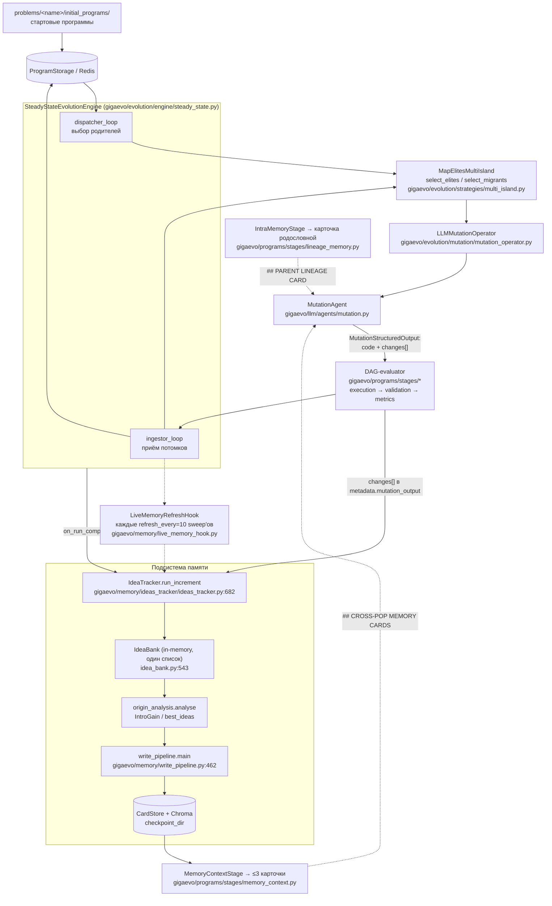
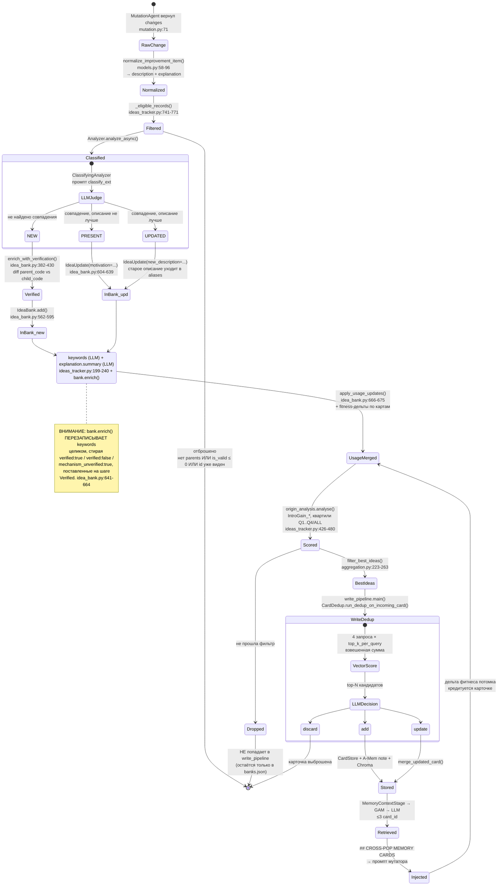

# 05 — Репозиторий `FusionBrainLab/gigaevo-core`: разбор подсистемы `ideas_tracker` / memory

**Что разбирали:** `FusionBrainLab/gigaevo-core` (public, MIT, 125 звёзд, 24 форка, Python, ~19 MB).
Клон: `gh repo clone FusionBrainLab/gigaevo-core -- --depth 100`, tip `0f2b866` от `2026-05-26 12:37:21 +0300`.
`AIRI-Institute/gigaevo-core` — это форк того же репозитория; исследовали именно `FusionBrainLab/gigaevo-core` как upstream.
Все `file:line` ниже — относительно корня этого репозитория.

---

## TL;DR

1. **Да, «Озеро идей» здесь уже есть — и оно рабочее, но узкоспециализированное.** Полный цикл «извлечь идею из мутации → классифицировать → дедуплицировать → обогатить → посчитать эффект на фитнес → записать в хранилище → достать обратно и вложить в промпт мутатора» реализован end-to-end (`gigaevo/memory/ideas_tracker/`, `gigaevo/memory/shared_memory/`, `gigaevo/programs/stages/memory_context.py`).
2. **Но источник идей ровно один — вывод LLM-мутатора внутри эволюционного прогона.** Ни статей, ни документов, ни логов экспериментов, ни ручного ввода: `grep` по `arxiv|pdf|paper|literature` в `gigaevo/`, `config/`, `docs/` не даёт ни одного попадания в memory-подсистеме.
3. **Схема карточки** — `class Idea` (`gigaevo/memory/ideas_tracker/models.py:155-176`) и `class MemoryCard` (`gigaevo/memory/shared_memory/models.py:21-40`). Из полей ТЗ-28 явно закрыты «концепция» и «эффект»; «условия применимости» размазаны по свободному тексту внутри `description`; «ограничения» и «ссылки на источник» **не имеют аналога вообще**.
4. **`description` — это не проза, а упакованная грамматика v4**: `[UNVERIFIED_]<VERB> <target> [<old>→<new>]: <mechanism>; support=N; Δbest=+F; co=[t1,t2]` (`gigaevo/memory/ideas_tracker/idea_bank.py:122-130`), с жёстким инвариантом «ровно одно двоеточие» (`:133-138`).
5. **Дедупликация трёхслойная**, но живых слоёв два: (а) LLM-классификация против банка внутри прогона (промпт `prompts/classify_ext/system.txt`), (б) при записи — 4-канальный векторный отбор кандидатов + LLM-судья `add|discard|update` (`gigaevo/memory/shared_memory/card_dedup.py:278-398`). Третий слой — canonical-key merge — **мёртв**: `derive_canonical_key` (`idea_bank.py:116`) не вызывается из прода ни разу.
6. **Ретрив:** ChromaDB dense-эмбеддинги (`all-MiniLM-L6-v2`) через vendored GAM `ResearchAgent`, затем LLM выбирает ≤3 `card_id`. Порога похожести нет, только top-k.
7. **Ранжирование по «пользе» карточки формально описано в промпте, но в Python не подключено.** Функция `apply_render_filters` (`gigaevo/memory/shared_memory/card_search.py:27-103`), реализующая сортировку `support × max(delta_best, 0)` и фильтр `verified:false ∧ support<3`, не имеет ни одного продового вызова — только тесты.
8. **`median_delta_fitness` и `total_used` считаются и пишутся, но никогда не читаются для ранжирования** (`idea_bank.py:438-462` — продюсер; читателей в проде нет).
9. **Хранилище:** локальный `CardStore` (`api_index.json` на диске) + локальная Chroma; опционально — удалённый сервис `gigaevo-memory`. Связь с ним реальная: PyPI-пакет `gigaevo-memory` 0.2.3 (`requires_python >=3.12`), подключён через extra `[memory-platform]` (`pyproject.toml:117-127`). Сам сервис — `AIRI-Institute/gigaevo-memory`: FastAPI + Postgres/pgvector + Redis, версионирование карточек, BM25+vector+hybrid поиск, **3 звезды и БЕЗ ЛИЦЕНЗИИ**.
10. **Ключевая ловушка:** Hydra-провайдер чтения жёстко прибивает `use_api=False` (`gigaevo/memory/provider.py:74-79`), поэтому штатный путь `run.py` **никогда** не ходит в `gigaevo.memory_platform` / `gigaevo-memory`; `config/memory/api.yaml` и `local.yaml` эквивалентны по эффекту. Плюс gigaevo-core **не отправляет никакого ключа API** к этому сервису.
11. **Зрелость смешанная.** Работают: extraction, classify-dedup, enrichment, origin-analysis, write-pipeline, GAM-ретрив, инъекция в промпт. Мертвы/не подключены: canonical-key dedup, `apply_render_filters`, `normalize_delta_best`, `components/statistics.py` (сломанный импорт `utils.it_logger`, файла нет), `prompts/memory_selector/user.txt` (не грузится).
12. **Документация отстала от кода.** `docs/memory.md` описывает `RecordManager`, `active/inactive` банки и файлы `components/analyzer.py`, `components/records_manager.py` — ничего этого в HEAD нет. Реальный `IdeaBank` — один список (`idea_bank.py:553-556`).
13. **Собственная внутренняя оценка качества карточек — плохая и непочиненная.** `plans/memory-system-quality-boost.md` фиксирует замеры: 39 % карточек тавтологичны, 72 % ProgramCard — заглушки `pending_analysis`, ≥3 дубля пережили дедуп. План написан, ветки нет, кода нет.
14. **Ноль публичного обсуждения memory:** 18 открытых PR и 3 issue — ни один не касается memory/ideas. Все PR-номера в коммитах (#250, #253, #258) — внутренние, в публичном репозитории их нет.
15. **Вывод по проекту 28:** это **не** Озеро идей в смысле ТЗ, а **банк эволюционных «рычагов» (levers) для одного домена — оптимизации кода**. Покрытие цели ~35-45 %; всё, что делает Озеро «озером» (внешние источники, провенанс, анонимизация, иерархия, доменная дедупликация, агент-демо), отсутствует.

---

## Что такое gigaevo-core

GigaEvo — фреймворк эволюционного поиска программ, где мутации порождает LLM, а отбор идёт по MAP-Elites. Формулировка авторов (`README.md:7-10`):

> "Evolutionary algorithm framework that uses Large Language Models to automatically improve programs through iterative mutation and selection (MAP-Elites). Programs are Python functions; fitness is task performance. The framework is task-agnostic and supports single runs, multi-island evolution, and prompt co-evolution."

Статья: arXiv `2511.17592`, «GigaEvo: An Open Source Optimization Framework Powered By LLMs And Evolution Algorithms» (`README.md:302-310`). Лицензия MIT, Python 3.11+, Redis обязателен.

Ключевые части:

| Компонент | Где | Что делает |
|---|---|---|
| `SteadyStateEvolutionEngine` | `gigaevo/evolution/engine/steady_state.py:1-30` | непрерывный асинхронный цикл: dispatcher (запуск мутаций) + ingestor (приём оценённых потомков) |
| `MapElitesMultiIsland` | `gigaevo/evolution/strategies/multi_island.py` | MAP-Elites-архив, острова, миграция |
| `LLMMutationOperator` | `gigaevo/evolution/mutation/mutation_operator.py` | берёт родителей, зовёт `MutationAgent` |
| `MutationAgent` | `gigaevo/llm/agents/mutation.py:392-408` | собирает user-промпт из блоков родителей + контекста |
| DAG-стадии (evaluator) | `gigaevo/programs/stages/` | исполнение, валидация, метрики, memory-контекст |
| `PostRunHook` | `gigaevo/evolution/engine/hooks.py:18-30` | точка расширения после прогона; сюда встаёт `IdeaTracker` |

**Где идеи входят в цикл.** Мутатор обязан вернуть структурированный JSON, в котором есть поле `changes` — список гипотез. Схема (`gigaevo/llm/agents/mutation.py:36-52`):

```python
class MutationChange(BaseModel):
    """Tracker-friendly description of one introduced change."""

    description: str = Field(
        description=(
            "Generalizable description of the introduced change, optionally followed "
            "by concrete specifics when they matter. Prefer `general pattern + "
            "concrete instance` over a narrow one-off description."
        )
    )
    explanation: str = Field(
        description=(
            "Explain why this change was introduced, why it helped for this "
            "program, and when possible why the same idea could transfer to future "
            "mutations."
        )
    )
```

`changes` попадает в `program.metadata["mutation_output"]["changes"]`, откуда его вытаскивает `program_to_record` (`gigaevo/memory/ideas_tracker/models.py:258-284`). **Это единственная точка входа идей в систему.**

**Где идеи выходят.** `MemoryContextStage` (`gigaevo/programs/stages/memory_context.py`) выбирает ≤3 карточки и кладёт их текст в `StringContainer`; `ConcatMemoryStage` подписывает блок заголовком `## CROSS-POP MEMORY CARDS` (`gigaevo/programs/stages/lineage_memory.py:816-820`); `MemoryMutationContext.format()` оборачивает в `## Memory Instructions` (`gigaevo/evolution/mutation/context.py:402-410`); `MutationAgent._build_parent_blocks` вставляет в промпт под каждым родителем (`gigaevo/llm/agents/mutation.py:400-408`).

---

## Эволюционный цикл



Два режима запуска трекера:
- **post-run** — `IdeaTracker.on_run_complete` (`ideas_tracker.py:660-666`), один раз в конце прогона;
- **live** — `LiveMemoryRefreshHook.__call__` (`live_memory_hook.py:67-94`), каждые `refresh_every` (по умолчанию 10) ingestor-sweep'ов, которые принесли хотя бы одну программу. Это и есть «pipeline=intra_extra_memory», ставший дефолтным в `feat!: v2.0.0 — intra-memory pipeline becomes default (#250)`.

---

## ideas_tracker: жизненный цикл карточки

**Важно: канонического state-machine с состояниями `active/retired` в коде НЕТ.** `docs/memory.md:1048` обещает `components/records_manager.py` c `RecordManager` и «active/inactive idea bank management» — этого файла в HEAD не существует; `IdeaBank` — это один плоский список без статусов (`idea_bank.py:553-556`):

```python
    def __init__(self, chunk_size: int = 5) -> None:
        self._ideas: list[Idea] = []
        self._id_index: dict[str, int] = {}  # O(1) id → list-index lookup
        self._chunk_size = chunk_size
```

Единственный «inactive_bank» в HEAD — в мёртвом `components/statistics.py:65`. Ниже — фактический жизненный цикл, восстановленный из кода.



Существенные детали цикла:

- **Банк не переживает прогон.** `IdeaTracker.__init__` создаёт пустой `IdeaBank` (`ideas_tracker.py:625`), и нигде нет загрузки прошлого `banks.json` в банк. Межпрогонная память живёт **только** в бэкенде (`CardStore` / API), не в `IdeaBank`.
- **Удаления / retire нет.** Единственный способ «убрать» карточку — LLM-решение `discard` при записи или невключение в `best_ideas`. Механизма устаревания по времени/использованию нет.
- **`aliases` — журнал перезаписей**, а не связи: при `UPDATE` старое описание кладётся туда (`idea_bank.py:620-627`), при canonical-merge — описание поглощённой карточки (`idea_bank.py:571-576`).
- **Верификация против диффа** (`idea_bank.py:237-278`, `324-368`): `verify_lever` сверяет `<VERB> <target> <old>→<new>` c реальным диффом `parent_code`/`child_code` — сначала AST (`_ast_value_for_kwarg`), затем regex. Если рычаг не подтверждён — к описанию приклеивается префикс `UNVERIFIED_`. Отдельно проверяется «заземлён ли механизм в диффе» (`mechanism_grounded_in_diff`, `:300-321`): либо пересечение токенов механизма с изменёнными токенами кода, либо ≥2 слова из `_ML_LEXICON` (`:50-94`).

---

## Схема карточки

### `class Idea` — карточка внутри трекера

Verbatim, `gigaevo/memory/ideas_tracker/models.py:155-176`:

```python
class Idea(BaseModel):
    """
    A tracked improvement idea extracted from evolutionary programs.

    Produced by an Analyzer and stored in IdeaBank. Enriched with keywords
    and an explanation summary after initial classification.
    """

    model_config = ConfigDict(extra="forbid")

    id: str = Field(default_factory=lambda: str(uuid4()))
    description: str
    category: str = ""
    strategy: str = ""
    task_description: str = ""
    task_description_summary: str = ""
    last_generation: int = 0
    programs: list[str] = Field(default_factory=list)
    keywords: list[str] = Field(default_factory=list)
    explanation: IdeaExplanation = Field(default_factory=IdeaExplanation)
    usage: UsagePayload = Field(default_factory=UsagePayload)
    aliases: list[dict[str, Any]] = Field(default_factory=list)
```

Вложенные модели, `models.py:113-153`:

```python
class IdeaExplanation(BaseModel):
    """Accumulated motivations and synthesised usage summary for an Idea."""

    model_config = ConfigDict(extra="forbid")

    entries: list[str] = Field(default_factory=list)
    summary: str = ""


class UsageEntry(BaseModel):
    """Single per-task entry in a memory card's usage payload."""

    model_config = ConfigDict(extra="forbid")

    task_description_summary: str
    """Human-readable task summary this entry belongs to."""

    used_count: int
    """Number of times this card was used in this task."""

    fitness_delta_per_use: list[float] = Field(default_factory=list)
    """Fitness deltas for each use: child_fitness - max(parent_fitness)."""

    median_delta_fitness: float | None = None
    """Median fitness delta across all uses for this task."""


class UsagePayload(BaseModel):
    """Aggregated usage statistics for a single memory card."""

    model_config = ConfigDict(extra="forbid")

    entries: list[UsageEntry] = Field(default_factory=list)
    """Per-task usage entries, sorted by task_description_summary."""

    total_used: int = 0
    """Total use count across all tasks."""

    median_delta_fitness: float | None = None
    """Median fitness delta across all uses and all tasks."""
```

### `class MemoryCard` — карточка в хранилище

Verbatim, `gigaevo/memory/shared_memory/models.py:21-40`:

```python
class MemoryCard(BaseModel):
    """Canonical general memory card (ideas, insights)."""

    model_config = ConfigDict(extra="forbid", validate_assignment=True)

    id: str
    category: str = "general"
    description: str = ""
    task_description: str = ""
    task_description_summary: str = ""
    strategy: str = ""
    last_generation: int = 0
    programs: list[str] = Field(default_factory=list)
    aliases: list[Any] = Field(default_factory=list)
    keywords: list[str] = Field(default_factory=list)
    evolution_statistics: dict[str, Any] = Field(default_factory=dict)
    explanation: MemoryCardExplanation = Field(default_factory=MemoryCardExplanation)
    works_with: list[str] = Field(default_factory=list)
    links: list[str] = Field(default_factory=list)
    usage: UsagePayload = Field(default_factory=UsagePayload)
```

Есть ещё `class ProgramCard` (`models.py:52-68`) — карточка топовой программы с `code`, `fitness`, `connected_ideas: list[ConnectedIdea]`, где `ConnectedIdea = {idea_id, description}` (`models.py:43-49`).

### Таблица полей и соответствие ТЗ-28

Спецификация Проекта 28: **концепция → условия применимости → эффект → ограничения → связи**.

| поле | тип | file:line | смысл | соответствие ТЗ-28 |
|---|---|---|---|---|
| `id` | `str` (uuid4) | `models.py:165` | идентификатор; при коллизии переприсваивается (`idea_bank.py:592-593`) | служебное |
| `description` | `str` | `models.py:166` | **упакованная грамматика v4**: `[UNVERIFIED_]<VERB> <target> [<old>→<new>]: <mechanism>; support=N; Δbest=+F; co=[t1,t2]` | **концепция** (частично + **эффект** через `Δbest`, + частично **условия** через `<mechanism>`) |
| `category` | `str` | `models.py:167` | **всегда `""`** — ни один конструктор `Idea(...)` его не задаёт; при конверсии превращается в `"general"` (`card_conversion.py:155`) | нет |
| `strategy` | `str` | `models.py:168` | `mutation_output["archetype"]` — тип мутации (exploration/exploitation/hybrid) | слабо → **условия применимости** |
| `task_description` | `str` | `models.py:169` | полный текст задачи прогона | контекст, не поле ТЗ |
| `task_description_summary` | `str` | `models.py:170` | LLM-саммари задачи. **Одинаково у всех карточек прогона** — `prompts/memory_selector/system.txt` прямо запрещает использовать как дискриминатор | формально **условия применимости**, фактически бесполезно |
| `last_generation` | `int` | `models.py:171` | последнее поколение, где идея встречалась | служебное |
| `programs` | `list[str]` | `models.py:172` | id программ-носителей идеи | **связи** (внутренние, на артефакты прогона) |
| `keywords` | `list[str]` | `models.py:173` | 3-7 тегов от LLM (`prompts/keywords/`); также технические `verified:*`, `canonical:*`, `pending_analysis:*` | поиск; частично **условия применимости** |
| `explanation.entries` | `list[str]` | `models.py:118` | накопленные `explanation` из всех мутаций-носителей | **концепция** (обоснование) |
| `explanation.summary` | `str` | `models.py:119` | LLM-сводка причин (`prompts/usage_summary/`) | **концепция** |
| `usage.entries[].used_count` | `int` | `models.py:130` | сколько раз карточка выбиралась в этой задаче | **эффект** |
| `usage.entries[].fitness_delta_per_use` | `list[float]` | `models.py:133` | `child_fitness - max(parent_fitness)` за каждое использование | **эффект** |
| `usage.entries[].median_delta_fitness` | `float \| None` | `models.py:136` | медиана дельт по задаче | **эффект** |
| `usage.total_used` | `int` | `models.py:148` | суммарное число использований | **эффект** |
| `usage.median_delta_fitness` | `float \| None` | `models.py:151` | медиана по всем задачам | **эффект** |
| `aliases` | `list[dict]` | `models.py:176` | архив предыдущих описаний при `UPDATE`/merge | история, не поле ТЗ |
| `evolution_statistics` | `dict[str, Any]` | `shared_memory/models.py:36` | ключи `Q1..Q4`, `ALL`, `best_ideas_snapshot` с метриками `IntroGain_*` | **эффект** (богатая версия) |
| `works_with` | `list[str]` | `shared_memory/models.py:38` | «другие карточки, встретившиеся в той же программе» — **никогда не заполняется**: у `Idea` такого поля нет, `normalize_memory_card` просто пробрасывает `raw.get("works_with")` | заявлено как **связи**, фактически пусто |
| `links` | `list[str]` | `shared_memory/models.py:39` | заполняется **только** из A-Mem-ноты (`card_conversion.py:241-249`), если включена LLM-эволюция памяти | **связи** (карточка↔карточка) |
| `ProgramCard.connected_ideas` | `list[ConnectedIdea]` | `shared_memory/models.py:65` | какие идеи породили эту программу | **связи** (идея↔программа) |

### Чего в схеме нет вообще

| поле ТЗ-28 / требование | статус |
|---|---|
| **Ограничения / limitations** | **нет аналога.** Ближайшее — префикс `UNVERIFIED_` и keywords `verified:false` / `mechanism_unverified:true` (`idea_bank.py:335-368`), но это статус *верификации*, а не ограничение применимости. Ещё есть `co=[t1,t2]` — список конфаундеров. Категорические вердикты `regressed`/`failed` живут в **другом** объекте — эфемерной intra-карточке (`lineage_memory.py:562-587`), которая в банк не попадает |
| **Ссылка на источник (провенанс)** | **нет.** `grep -rni "provenance\|source_url\|source_ref\|citation" gigaevo/memory/` → 0 попаданий. `programs: list[str]` — это id артефактов текущей инсталляции, не внешний источник |
| **Домен / предметная область** | **нет поля.** Единственная сегментация — `namespace` на уровне всего хранилища (`config/memory_backend.yaml:17`: `namespace: ${oc.env:MEMORY_NAMESPACE,exp9}`) |
| **Уровень абстракции / иерархия** | **нет.** Карточки плоские, родитель-потомок между карточками отсутствует |
| **Временная метка** | **нет.** Ни у `Idea`, ни у `MemoryCard` нет `created_at`/`updated_at`. Timestamp есть только у A-Mem-ноты и у снапшота `banks.json` |
| **Автор / ответственный** | только `author` на уровне namespace в API-конфиге, не на карточке |

---

## Извлечение идей: промпты и LLM-вызовы

### Общий LLM-клиент трекера

`gigaevo/memory/ideas_tracker/llm.py`. Промпты — обычные текстовые файлы `prompts/{step}/system.txt` и `prompts/{step}/user.txt` (`llm.py:39-64`), подстановка через `<INSERT>` или dict-плейсхолдеры.

Параметры запроса, verbatim `llm.py:121-140`:

```python
    def _build_request(
        self, step: str, content: str | dict[str, str], reasoning: dict | None
    ) -> dict[str, Any]:
        system = self._prompts.load(step, "system")
        user = self._prompts.load(step, "user", content)
        kwargs: dict[str, Any] = {
            "messages": [
                {"role": "system", "content": system},
                {"role": "user", "content": user},
            ],
            "model": self.model,
            "temperature": 0,
        }
        if self._is_openrouter and reasoning:
            safe = _json_safe_dict(reasoning)
            if safe:
                kwargs["extra_body"] = {"reasoning": safe}
        if not self._is_openrouter and "Qwen3.5" in self.model:
            kwargs["extra_body"] = {"chat_template_kwargs": {"enable_thinking": False}}
        return kwargs
```

- **temperature = 0** жёстко.
- **Function calling / structured output НЕ используется** — обычный `chat.completions.create`, ответ парсится `json.loads` вручную.
- Модель по умолчанию: `google/gemini-3-flash-preview`, base_url `https://openrouter.ai/api/v1`, `reasoning: {effort: "minimal"}` (`config/ideas_tracker/default.yaml`, `ideas_tracker.py:582-584`).
- Ошибки LLM **проглатываются**: `llm.py:156-158` возвращает `""` при любом исключении.

### Ретраи

| место | параметр | значение |
|---|---|---|
| `ClassifyingAnalyzer.__init__` | `retry_attempts` | `10` (`analyzers.py:186`) — повтор при `JSONDecodeError`, цикл `analyzers.py:285-299` |
| `ClusteringAnalyzer.__init__` | `max_attempts` | `10` (`analyzers.py:511`) |
| `ClusteringAnalyzer.__init__` | `max_rounds` | `20` (`analyzers.py:512`) — раунды рефайнмента |
| `CardUpdateDedupConfig` | `llm_max_retries` | `2` (`card_update_dedup.py:90`) |
| `ResearchAgent` (GAM) | `max_iters` | `3`, хардкод (`gam_search.py:115`) |
| enrichment (`keywords`, `usage_summary`) | — | **без ретраев**, одна попытка, при ошибке пустой результат (`ideas_tracker.py:207-230`) |

### Шаг 1 — `classify_ext` (основной путь, `analyzer_type: default`)

Вызов: `analyzers.py:287` / `:318`. User-часть собирается в коде (`analyzers.py:279`):

```python
prompt = f" Existing Ideas: \n {chunk.text} \n Incoming Ideas: \n {unclassified_text}"
```

`chunk.text` — существующие идеи по `chunk_size=5` штук в формате `[{short_id}]: {description}` (`idea_bank.py:690-714`).

**`gigaevo/memory/ideas_tracker/prompts/classify_ext/system.txt` (124 строки, verbatim):**

```
You are an advanced Semantic Idea Classifier and Knowledge Base Curator. Your task is to process a stream of "Incoming Ideas" and compare them against a database of "Existing Ideas" to classify them, filter duplicates, and upgrade existing descriptions with better technical details.

### INPUT FORMATS
1. **Existing Ideas:** `[{idea_id}] {idea_text}`
2. **Incoming Ideas:** `{c}) {change}` where `c` is the sequence number.

### CLASSIFICATION LOGIC & CRITERIA
Process each Incoming Idea through the following strict decision tree:

#### PHASE 1: CONFLICT & IDENTITY CHECK (Is it strictly the same logic?)
Compare the core intent, specific parameters, and logic of the Incoming Idea with ALL Existing Ideas.

* **CRITICAL: PARAMETER CONFLICT = NEW IDEA**
    * If the Incoming Idea targets the same mechanism but uses **different numbers, constants, or formulas**, it is a **New Idea**.
    * *Example:* "Set blending to 0.85" vs "Set blending to 0.2". -> **New Idea** (Different hypothesis).
    * *Example:* "Grid range [0.1, 0.9]" vs "Grid range [0.05, 0.95]". -> **New Idea** (Different setup).

* **MATCH FOUND (Go to Phase 2):**
    * The logic AND the parameters are consistent.
    * The Incoming Idea describes the same code change using synonyms or different phrasing.

* **NO MATCH (Classify as "New Idea"):**
    * The idea introduces a completely new mechanism or parameter set.

#### PHASE 2: INFORMATION DENSITY CHECK (Is the description objectively better?)
If a match is found (no conflicts), compare the *quality* of the Incoming text against the Existing text.

* **BETTER DESCRIPTION (Classify as "Updated Idea"):**
    * **Detail Up-leveling:** The Incoming text adds missing formulas, line numbers, or specific constraints to a vague Existing Idea.
    * **Preservation:** It does NOT remove specific formulas present in the Existing Idea.
    * *Example:* Old: "Shrink circles." New: "Shrink circles using formula w = r^2/sum." -> **Updated Idea**.

* **WORSE, EQUAL, OR VAGUE DESCRIPTION (Classify as "Present Idea"):**
    * **Downgrade:** The Incoming text replaces a specific formula with a generic summary (e.g., changing "w_i = (radii[j]^2)..." to "two-phase approach").
    * **Synonyms:** It just rephrases the existing text without adding technical value.

### OUTPUT FORMAT
Return a single strictly valid JSON object:
{
  "new_ideas": [
    "string (text of the unique incoming idea)"
  ],
  "present_ideas": [
    "[string (ID of the matching existing idea where the incoming description was NOT better)]:[string (sequence number of idea from list of incoming ideas)]"
  ],
  "updated_ideas": [
    {
      "id": "[string (ID of the matching existing idea)]:[string (sequence number of idea from list of incoming ideas)]",
      "text": "string (The superior description from the incoming idea)"
    }
  ]
}

### RULES
1. **Strict JSON:** Output raw JSON only. No Markdown blocks, no conversational text.
2. **Exclusivity:** An incoming idea must appear in exactly one category: `new_ideas`, `present_ideas`, or `updated_ideas`.
3. **Preserve IDs:** Always use the exact `{idea_id}` from the input when mapping to `present` or `updated`.
4. **Numbers Matter:** Treat numerical parameters (0.5 vs 0.8) as identifying features. Different numbers mean different ideas.
5. **No Downgrades:** Never update an idea if it loses mathematical precision.

### EXAMPLES

Example #1: Semantic Matching and New Concepts
Focus: Identifying duplicates with different wording and recognizing completely new features.

**Input Context:**
Existing Ideas:
[a51e61bf] Use barycentric coordinates.
[g14u43jo] Initialize population using LatinHypercube sampling to improve global search coverage.
[k96s25pq] Apply Basinhopping with Powell method.

Incoming Ideas:
1) Use barycentric coordinates via sqrt_s transformation (lines 13-17) to ensure all points stay within the unit triangle boundary.
2) Use LatinHypercube sampling for the start.
3) Use Nelder-Mead optimization for local search instead of Powell.
4) Apply Basinhopping with Powell method to refine the result.

**Expected Output:**
{
  "new_ideas": [
    "Use Nelder-Mead optimization for local search instead of Powell"
  ],
  "present_ideas": [
    "[g14u43jo]:[2]",
    "[k96s25pq]:[4]"
  ],
  "updated_ideas": [
    {
      "id": "[a51e61bf]:[1]",
      "text": "Use barycentric coordinates via sqrt_s transformation (lines 13-17) to ensure all points stay within the unit triangle boundary"
    }
  ]
}

Example #2: Parameters, Conflicts, and Refinement
Focus: Detecting parameter changes (New Idea) and upgrading descriptions only when technical detail increases.

**Input Context:**
Existing Ideas:
[f89l66hr] Blend radius with factor 0.85.
[a48z35vm] Shrink weight is calculated as w_i = (radii[j]^2) / (radii[i]^2 + radii[j]^2).
[o27e03bq] Initialize grid with jitter 0.05.

Incoming Ideas:
1) Blend radius using a conservative factor of 0.2 to prevent oscillation.
2) Use adaptive weight shrinkage with a two-phase gentle approach.
3) Initialize grid with jitter 0.05 (lines 10-12) to break symmetry.
4) Initialize grid with jitter 0.15 for wider coverage.

**Expected Output:**
{
  "new_ideas": [
    "Blend radius using a conservative factor of 0.2 to prevent oscillation",
    "Initialize grid with jitter 0.15 for wider coverage"
  ],
  "present_ideas": [
    "[a48z35vm]:[2]"
  ],
  "updated_ideas": [
    {
      "id": "[o27e03bq]:[3]",
      "text": "Initialize grid with jitter 0.05 (lines 10-12) to break symmetry"
    }
  ]
}
```

**`prompts/classify_ext/user.txt` (1 строка, verbatim):**

```
INPUT:
<INSERT>
```

### Шаг 1-bis — `classify` (legacy, файлы есть, кода-вызова нет)

`prompts/classify/system.txt` (58 строк) — упрощённая версия без `updated_ideas`. **В HEAD ни один вызов `call("classify", ...)` не найден** — используется только `classify_ext`. Файл: `gigaevo/memory/ideas_tracker/prompts/classify/system.txt`.

### Шаг 2 — `keywords` (обогащение)

Вызов: `ideas_tracker.py:207` — `await analyzer.call_async("keywords", idea.description)`, парсинг `json.loads(kw_raw).get("keywords", [])`.

**`prompts/keywords/system.txt` (75 строк, verbatim):**

```
System Prompt — Keyword Extraction for Evolutionary Idea Tracking

You are a keyword extraction engine specialized for an evolutionary
optimization idea bank. Ideas describe code mutations applied to
programs. Your keywords will be used for:
  - Grouping semantically related ideas
  - Distinguishing ideas that sound similar but differ in mechanism
  - Retrieval and search across the idea bank

Output Requirements

Return ONLY valid JSON:
{ "keywords": ["keyword1", "keyword2", ...] }

Do NOT include explanations, commentary, markdown, or text outside JSON.

Keyword Extraction Rules

1. For each idea, produce TWO levels of keywords:

   a) CATEGORY tags (1-3): High-level technique categories that
      describe what kind of change this is.
      Examples: "initialization strategy", "solver configuration",
      "constraint formulation", "parameter tuning", "search strategy",
      "numerical stability", "objective formulation",
      "boundary handling", "post-processing", "data representation".

   b) MECHANISM tags (2-5): Specific technical mechanisms, algorithms,
      or parameter choices that distinguish this idea from others in
      the same category.
      Examples: "halton sequence", "slsqp", "hexagonal grid",
      "multi-start", "squared distance", "beta distribution",
      "maxiter 1000", "learning rate 0.001".

2. STOP WORD PRINCIPLE — do NOT use as standalone keywords any term
   that would apply to the majority of ideas in the bank. These are
   words that describe the problem domain itself rather than a
   specific idea's contribution. Typical examples:
     - The problem's object nouns (what is being optimized)
     - Generic process words: optimization, algorithm, implementation,
       approach, method, improvement, solution, result, performance
     - Vague action words: increase, decrease, change, modify, adjust
   If a domain noun appears in a SPECIFIC compound that names a real
   technique, that compound is acceptable (e.g., "gradient descent"
   is fine even though "descent" alone is too broad).

3. Preserve specific numeric values when they are central to the idea
   (e.g., "upper bound 0.6", "maxiter 1000", "margin 1e-4").

4. Keywords must be:
   - Lowercase
   - No duplicates
   - A narrower keyword must not co-occur with a broader one that
     contains it (e.g., do NOT output both "bound" and "upper bound")

5. Use 2-4 word phrases. Single generic words are almost never useful.

6. Total: produce 3-7 keywords per idea.

Examples

Input: "Increased the maximum number of optimization iterations from 500 to 1000 to allow for more thorough optimization"
Good: {"keywords": ["solver configuration", "iteration budget", "maxiter 1000"]}
Bad:  {"keywords": ["optimization iterations", "maximum number", "optimization"]}

Input: "Replaced fixed grid initialization with randomized initialization using Halton sequence to provide better initial coverage and break symmetry"
Good: {"keywords": ["initialization strategy", "halton sequence", "quasi-random sampling", "symmetry breaking"]}
Bad:  {"keywords": ["fixed grid initialization", "randomized initialization", "halton sequence", "unit square", "symmetry breaking"]}

Input: "Added a small safety margin of 1e-4 when computing distances in the constraint function to improve numerical stability"
Good: {"keywords": ["numerical stability", "constraint formulation", "safety margin 1e-4", "distance tolerance"]}
Bad:  {"keywords": ["safety margin", "distances", "constraint function", "numerical stability", "1e-4"]}

If the text lacks meaningful content, return:
{ "keywords": [] }
```

**`prompts/keywords/user.txt` (verbatim):**

```
Extract keywords from the following text:
<INSERT>
```

### Шаг 3 — `usage_summary` (сводка мотиваций)

Вызов: `ideas_tracker.py:223` — только если `len(entries) > 1`; если ровно одна запись, она берётся как есть без LLM (`ideas_tracker.py:218-219`).

**`prompts/usage_summary/system.txt` (43 строки, verbatim):**

```
System Prompt — Explanation Summarization for Idea Tracking

You are a precise summarization engine for an evolutionary optimization
idea bank. You receive multiple explanation sentences that describe why
a particular code mutation was introduced. Your job is to distill them
into one concise statement.

Output Requirements

Return ONLY valid JSON:
{ "summary": "your generated summary here" }

Do NOT include explanations, commentary, markdown, or text outside JSON.

Summarization Rules

1.  Distill the sentences into a single statement that captures the
    causal mechanism: what was wrong or limiting, and why this idea
    fixes it.
2.  Preserve specific technical details (algorithm names, parameter
    values, formulas) that appear in the input.
3.  Deduplicate: if multiple sentences say the same thing in different
    words, merge them — do not repeat.
4.  Strip filler language. Avoid hedging words ("potentially",
    "effectively", "which collectively") unless they carry real meaning.
5.  The summary must be:
    -   1-2 sentences maximum, regardless of input size
    -   Factually consistent with the input
    -   Neutral in tone
6.  Do NOT introduce new information.
7.  Do NOT speculate or infer beyond what is stated.

Behavior Constraints

-   Do NOT list points.
-   Do NOT restructure into bullets.
-   Do NOT classify statements.
-   Do NOT explain reasoning.

Only produce a clean summary.

If the input lacks meaningful content, return:
{ "summary": "" }
```

**`prompts/usage_summary/user.txt`:** `Summarize the following sentences:\n<INSERT>`

### Шаг 4 — `task_description_summary`

Вызов: `ideas_tracker.py:132` (синхронный, один раз на инстанс через `cached_property`).

**`prompts/task_description_summary/system.txt` (23 строки, verbatim):**

```
System Prompt - Task Description Summarization for Idea Tracking

You summarize a task/problem description into a short, high-signal brief
for memory-card metadata. The input can be long and include implementation
details, constraints, and formatting rules.

Output Requirements

Return ONLY valid JSON:
{ "summary": "your generated summary here" }

Do NOT include explanations, markdown, or extra text outside JSON.

Summarization Rules

1. Produce a compact summary of what the task is and what success means.
2. Preserve core constraints and evaluation goal when present.
3. Keep only information needed to understand the task context quickly.
4. Do NOT include low-level template boilerplate unless it is a hard constraint.
5. Maximum length: 1-2 sentences.
6. Do NOT invent details or speculate.
7. If input has no meaningful content, return:
   { "summary": "" }
```

**`prompts/task_description_summary/user.txt`:** `Summarize the following task description:\n<INSERT>`

### Шаг 5 — альтернативный путь `analyzer_type: fast` (`ClusteringAnalyzer`)

Пайплайн: embed → DBSCAN → LLM-рефайнмент кластеров → выбор представителя → синтез описания (`analyzers.py:559-571`).

Параметры (`analyzers.py:501-515`, `config/ideas_tracker/fast.yaml`):

```yaml
    analyzer_fast_settings:
      embeddings_model: sentence-transformers/all-mpnet-base-v2
      batch_size: 32
      min_samples_for_dbscan: 4
      dbscan_eps: 0.25
      dbscan_min_samples: 2
      max_attempts: 10
      max_rounds: 20
      recompute_center: false
      refine_subgroup_size: 20
      llm_max_concurrent: 100
```

DBSCAN: `metric="cosine"`, `eps=0.25`, `min_samples=2`, векторы предварительно L2-нормируются (`analyzers.py:614-625`). Шумовые точки (`label == -1`) становятся синглтон-кластерами.

Три промпта этого пути:

1. **`prompts/cluster_fast_refine/system.txt` (260 строк)** — «cluster refinement judge»: решает, какие элементы кластера оставить (`included`), какие выкинуть (`rejected`) для реклассификации. Начало, verbatim:

```
You are a cluster refinement judge for an evolutionary idea bank. Items were grouped by **embedding similarity**, which frequently groups items that share vocabulary but describe different concrete edits. Your job is to identify which items belong together as one coherent concept and which must be separated.

### CORE RULE
Keep items together if a one-sentence summary of all of them would be clear and useful to an agent deciding whether this cluster is relevant to its current task. Split only when items would produce a contradictory or incoherent summary. **Over-fragmentation is as harmful as over-inclusion.**

Rejected items are **not discarded** — they return to the pool for re-clustering.
```

Основное правило разделения (verbatim, `cluster_fast_refine/system.txt`):

```
**CRITICAL — two levels of same-ness are both required:**

**Level 1 — Same method.** Items must refer to the same concrete technique or component. This is stricter than "same pipeline stage."
...
**Level 2 — Same direction.** Within the same method, items must change it in the same direction (all increase, all decrease, all replace-with-adaptive, etc.).

**CRITICAL — Different numeric values on the same method and direction are the SAME concept. Do not split them.**
```

Полный текст: `gigaevo/memory/ideas_tracker/prompts/cluster_fast_refine/system.txt`.
User-часть (verbatim, `cluster_fast_refine/user.txt`):

```
CLUSTER REFINEMENT — **Minimize** `included`. Expansion passes ≠ init sampling ≠ `ftol`/epsilon ≠ radius scaling (see system Example C). Use the **same** line indices as below in your JSON:

<INSERT>
```

Ответ валидируется как точное разбиение диапазона индексов (`_validate_partition`, `analyzers.py:408-421`) — при несоответствии ретрай.

2. **`prompts/cluster_fast_representative/system.txt` (40 строк, verbatim):**

```
You select the **single best representative idea** for a cluster of numbered idea descriptions. The representative becomes the cluster’s **canonical** summary.

Clusters are supposed to be **minimal** after refinement: **one** concrete edit (or strict paraphrases). If the list still has **multiple** lines, they should be near-duplicates; your job is to pick the **best** single line for documentation.

### INPUT FORMAT
A list of ideas:
- `{k}) {description}` where `k` is **1-based** line index (1, 2, …, n).

### YOUR TASK
Choose **one** index:
- Prefer the line with the **most identifying detail**: exact parameters, line numbers, file references, formulas, algorithm names—**not** the line that vaguely summarizes many possible changes.
- **Reject** mentally any “umbrella” description that could cover several unrelated edits if a **narrower** line states the same edit more precisely.
- If two lines are strict paraphrases, prefer the **richer** / more precise (per `classify_ext` “updated idea” quality).
- Do **not** pick the line that best matches a **broad** theme across mixed content; pick the line that is the **sharpest** statement of **one** change.

### OUTPUT FORMAT
Return one JSON object only:
{
  "representative_index": <int>
}

- `representative_index` must be in **1..n** inclusive.

### RULES
1. **Strict JSON:** Raw JSON only. No markdown fences, no extra text.
2. **Exactly** the field `representative_index`.
3. If **n == 1**, output `{ "representative_index": 1 }`.
```

*Цитата обрывалась здесь — продолжение восстановлено 2026-07-29 из того же файла промпта.*

**Разбор выполнен 2026-07-29** по клону `FusionBrainLab/gigaevo-core`, tip `0f2b866` (`git log -1 --format=%ci` → `2026-05-26 12:37:21 +0300`) — тот же коммит, с которого начата уцелевшая часть `knowledge/05-repo-gigaevo-core.md`, так что расхождений «репозиторий ушёл вперёд» здесь по определению нет: любое несовпадение с уцелевшей головой — это несовпадение с тем же самым снимком кода, не дрейф во времени.

---

## Извлечение идей: промпты и LLM-вызовы (продолжение)

Уцелевшая часть обрывается внутри `### EXAMPLE` промпта `cluster_fast_representative` (шаг 5, альтернативный путь `analyzer_type: fast`). Дописываю пример и оставшиеся два шага этого пути.

Хвост `gigaevo/memory/ideas_tracker/prompts/cluster_fast_representative/system.txt` (строки 29-40, verbatim):

```
### EXAMPLE

Input:
1) Tune learning rate to 0.01.
2) Set optimizer learning rate to 0.01 with cosine decay and warmup 500 steps (lines 44–51).

Output:
{
  "representative_index": 2
}

(2) is the same change with **more** identifying detail.
```

Вызов — `analyzers.py:799-812`, метод `_pick_representative`: до `self._max_attempts` (10) попыток, парсинг через локальный `_extract_json_object` (`analyzers.py:395-405` — сначала `json.loads` целиком, при ошибке ищет `\{[\s\S]*\}` regex'ом и парсит найденное; в отличие от `classify_ext`, где `json.loads(raw)` вызывается без такой страховки). При исчерпании попыток — `None`, и `_cluster_to_idea` (`analyzers.py:750-797`) откатывается на `members[0]` как представителя (`analyzers.py:760`, `rep = await self._pick_representative(cluster) or members[0]`).

### Шаг 6 — `cluster_desc_synth` (синтез описания кластера)

Вызов: `analyzers.py:814-835`, метод `_synthesise_description`, только если в кластере `len(members) > 1` (`analyzers.py:782-786`); для кластера из одного элемента описание берётся как есть, без LLM.

**Важное отличие от всех предыдущих шагов: ответ этого промпта — не JSON.** `_synthesise_description` возвращает `await self._llm.call_async("cluster_desc_synth", prompt, self._reasoning)` без единого `json.loads`/`_extract_json_object` (`analyzers.py:827-831`) — правило самого промпта: «Output only the description. No preamble, no labels, no JSON.» (`prompts/cluster_desc_synth/system.txt:30`). При исключении в цикле попыток — просто `logger.error` (`analyzers.py:832-835`) и после `self._max_attempts` попыток метод проваливается в `None`-возврат (неявный, функция допадает до конца без `return`), и `_cluster_to_idea` подставляет `description = desc or rep.description` (`analyzers.py:786`) — то есть при отказе LLM карточка кластера получает описание представителя без синтеза, а не пустую строку.

`gigaevo/memory/ideas_tracker/prompts/cluster_desc_synth/system.txt` (30 строк, ключевые правила, verbatim):

> You are a technical description synthesizer for an evolutionary idea bank. Your job is to write a single synthesized description for a cluster of related ideas. The description will be used as the cluster's entry in a vector database queried by an AI agent making mutation decisions for code optimization.
>
> ...
>
> - Maximum 4 sentences.
> - ...Do NOT invent values, identifiers, outcomes, or causal claims that are absent from the input.
> - **Mechanism uniqueness rule:** if the cluster contains items that touch *different parameters / components under one umbrella narrative*, emit a single sentence that explicitly enumerates each regime as `(a)`, `(b)`, etc. Do NOT pick one regime as canonical and bury the others.
> - Prioritize the most specific and well-reasoned explanation available. Discard redundant or weaker justifications.
> - Output only the description. No preamble, no labels, no JSON.

`prompts/cluster_desc_synth/user.txt` (verbatim, плейсхолдеры — dict-подстановка `<INSERT_REP>`/`<INSERT_DES>`/`<INSERT_EXPL>` через `llm.py:52-56`, а не единичный `<INSERT>`):

> Synthesize a description for the following cluster of related ideas.
>
> REPRESENTATIVE DESCRIPTION (most specific idea in the cluster):
> <INSERT_REP>
>
> ALL DESCRIPTIONS:
> <INSERT_DES>
>
> EXPLANATIONS:
> <INSERT_EXPL>
>
> Write a single synthesized description of up to 3 sentences that captures the shared mechanism, the full range of values or approaches explored, and the reasoning for why this change improves performance. Be specific and actionable.

Оба шага 5-6 идут через тот же `LLMClient` (`analyzers.py:526-528`, `self._llm = LLMClient(model=model, base_url=base_url, max_concurrent=llm_max_concurrent)`), то есть тот же `_build_request` (`llm.py:121-140`) — **`temperature=0` жёстко и здесь**, function calling не используется нигде в модуле.

### Число LLM-вызовов на цикл

Фиксированного числа нет — оно зависит от размера банка и от того, сколько идей пришло за инкремент. Формула по коду одного `run_increment` (`ideas_tracker.py:679-733`, путь `analyzer_type: default`):

| вызов | сколько раз | адрес |
|---|---|---|
| `task_description_summary` | 0 или 1 (кэш `cached_property`, при первом обращении) | `ideas_tracker.py:118-123`, `:650-652` |
| `classify_ext` | на каждую программу с ≥1 pending-идеей — до `ceil(len(bank)/5)` вызовов (цикл прерывается раньше, если `unclassified_count == 0`), на каждый вызов до 10 попыток при сбое JSON | `analyzers.py:207-220` (sync), `:222-248` (async, `asyncio.Semaphore(max_concurrent_classifications=8)`), чанки — `idea_bank.py:690-714` (`chunk_size=5`) |
| `keywords` | 1 на каждую idea из `_select_ideas_needing_enrichment` (новые + идеи, у которых изменилось число `explanation.entries` с прошлого инкремента) | `ideas_tracker.py:189-196`, `:207` |
| `usage_summary` | 1 на такую idea, только если `len(entries) > 1` | `ideas_tracker.py:216-230` |
| дедуп-судья при записи (`ask_llm_for_dedup_decision`) | 1 (до `llm_max_retries=2` попыток) на каждую best-idea-кандидата, у которой нашёлся ≥1 векторный кандидат | `card_dedup.py:278-398`, `:400-434` |

Путь `analyzer_type: fast` (не дефолт — дефолт `analyzer_type: default`, `config/ideas_tracker/default.yaml:4`) добавляет вместо `classify_ext`: `cluster_fast_refine` — 1 вызов на подгруппу (`refine_subgroup_size=20`) на кластер на раунд рефайнмента, до `max_rounds=20` раундов, конкурентно (`analyzers.py:671-710`); `cluster_fast_representative` — 1 на кластер с >1 членом; `cluster_desc_synth` — 1 на кластер с >1 членом.

---

## Дедупликация

Три слоя, из них живых два.

### Слой 1 (мёртв) — canonical-key merge

`derive_canonical_key(verb, target, old, new)` (`idea_bank.py:116-119`) строит ключ `f"{VERB}:{target}:{norm(old)}:{norm(new)}"`. Потребитель — `IdeaBank.add()` (`idea_bank.py:562-595`): если у новой idea есть keyword с префиксом `canonical:` (`_canonical_keyword`, `idea_bank.py:531-535`, ищет `kw.startswith("canonical:")`), и в банке уже есть idea с тем же `canonical:`-keyword, обе мержатся (программы объединяются, старое описание уходит в `aliases` с меткой `f"{id}-canonical-merge"`, `idea_bank.py:571-576`).

Слой мёртв на двух уровнях одновременно:
- `grep -rn "derive_canonical_key" --include="*.py" .` вне `tests/` даёт **0 совпадений** — функция не вызывается из прода нигде.
- Единственный писатель keyword `canonical:*`, который бы мог сделать `_canonical_keyword` непустым, тоже не найден: `grep -rn "\"canonical:\|'canonical:"` вне тестов находит только двух *читателей* — `idea_bank.py:533` и `card_search.py:48` (последний — уже отмеченная в TL;DR головы мёртвая `apply_render_filters`). Ни один enrichment-шаг (`keywords`, `usage_summary`, verification) не производит такой keyword.

Итого: `new_canonical` в `IdeaBank.add()` всегда `None` на реальных данных → ветка слияния по канонической строке (`idea_bank.py:564-591`) в проде никогда не исполняется. Тесты (`tests/memory/test_canonical_key.py`, `tests/memory/ideas_tracker/test_idea_bank_canonical_dedup.py`) вызывают `derive_canonical_key` и конструируют idea с явным `keywords=[f"canonical:{key}"]` вручную — то есть проверяют код, который прод никогда не подводит к этому состоянию.

### Слой 2 (жив) — LLM-классификация против банка внутри прогона

Уже описан выше и в уцелевшей голове: `classify_ext` (`analyzers.py:274-334`), решение `new_ideas` / `present_ideas` / `updated_ideas` на основе банка идей текущего прогона. Отдельный сбой-путь здесь тоже смещён в сторону «добавить»: если все 10 попыток `classify_ext` для чанка возвращают невалидный JSON, `parsed` остаётся дефолтным `{"present_ideas": [], "new_ideas": [], "updated_ideas": []}` (`analyzers.py:280-284`), то есть элементы pending остаются `unclassified`; в `_apply_pending_to_result` (`analyzers.py:343-360`) всё, что не помечено `classified`, безусловно уходит в `result.new_ideas` — то есть отказ классификатора здесь тоже вырождается в «трактовать как новую идею», тем же паттерном, что и слой 3 ниже.

### Слой 3 (жив) — векторный отбор + LLM-судья при записи

Это основной, единственный систематически работающий слой. `CardDedup.run_dedup_on_incoming_card()` (`gigaevo/memory/shared_memory/card_dedup.py:400-434`):

1. **4-канальный векторный скоринг** (`score_duplicate_candidates`, `card_dedup.py:155-234`). Четыре запроса строит `build_dedup_queries` (`card_update_dedup.py:226-246`):
   - `description` — сам текст идеи;
   - `explanation_summary` — сводка мотиваций;
   - `description_explanation_summary` — конкатенация первых двух с метками `IDEA_DESCRIPTION:`/`EXPLANATION_SUMMARY:`;
   - `description_task_description_summary` — конкатенация описания с саммари задачи, метки `IDEA_DESCRIPTION:`/`TASK_DESCRIPTION_SUMMARY:`.

   По каждому каналу — top-`top_k_per_query` (по умолчанию 5, `card_update_dedup.py:87`) векторных хитов, дальше `compute_weighted_candidates` (`card_update_dedup.py:249-290`) считает взвешенную сумму:

   `final_score(card) = Σ weight[channel] × score[channel](card)` по всем 4 каналам (`card_update_dedup.py:271-278`).

   **Веса — ровно те, что заявлены в задании**, `class RetrievalWeights` (`card_update_dedup.py:26-39`):

   ```python
   description: float = 0.35
   explanation_summary: float = 0.2
   description_explanation_summary: float = 0.3
   description_task_description_summary: float = 0.15
   ```

   (0.35 + 0.2 + 0.3 + 0.15 = 1.0 ровно). Кандидаты с `final_score < min_final_score` (по умолчанию 0.0) отбрасываются, оставшиеся сортируются по убыванию и обрезаются до `final_top_n` (по умолчанию 5) — `card_update_dedup.py:279-290`.

2. **LLM-судья** (`ask_llm_for_dedup_decision`, `card_dedup.py:278-398`) получает `NEW_CARD` + отформатированных кандидатов и должен вернуть `action: add|discard|update` строгим JSON.

3. **Fail-open — сбой LLM → `add`.** Дефолт задан явно ещё до первого вызова:

   ```python
   default_decision: dict[str, Any] = {
       "action": "add",
       "reason": "",
       "duplicate_of": "",
       "updates": [],
   }
   ```
   (`card_dedup.py:284-289`). Дальше цикл ретраев `for attempt in range(cfg.llm_max_retries)` (по умолчанию 2, `card_update_dedup.py:90`, `card_dedup.py:370`): при исключении в `self.llm_service.generate(prompt)` — `continue` (`:373-377`); при JSON, не прошедшем `parse_llm_card_decision`, — предупреждение и следующая попытка (`:378-389`). Если ни одна попытка не дала валидного решения, срабатывает `else`-ветка самого `for` (то есть цикл довели до конца без `break`):

   ```python
   else:
       # All retries exhausted without a valid JSON response — fall back to add
       logger.warning(
           "[Memory][CardDedup]Dedup LLM failed all {} attempts, defaulting to action=add "
           "for card {!r}",
           cfg.llm_max_retries,
           _str_or_empty(incoming_card.id).strip(),
       )
   return decision  # остаётся default_decision, action="add"
   ```
   (`card_dedup.py:390-398`). Это и есть требуемое место: **два независимых сбоя судьи** (нет ни одного кандидата → `card_dedup.py:416-422`, и полный отказ LLM после ретраев → `:390-398`) **оба ведут к `action="add"`**, никогда к отбрасыванию идеи и никогда к «тихому» состоянию без решения.

   Есть и третий, менее очевидный fail-open того же семейства: `parse_llm_card_decision` (`card_update_dedup.py:328-430`) сама нормализует любое нераспознанное значение `action` в `"add"` (`:342-344`, `if action not in {"add","discard","update"}: action="add"`), а `run_dedup_on_incoming_card` дополнительно подстраховывает `action = str(decision_dict.get("action") or "add")` (`card_dedup.py:427`) — то есть даже если бы `ask_llm_for_dedup_decision` каким-то образом вернул словарь без ключа `action`, ветка снова сходится к `add`.

   Слой отдельно проверен на «update без данных для мержа»: если LLM вернул `action=update`, но `updates` пуст, это **не** тихо остаётся update — код понижает до `discard` (если есть `duplicate_of`) или до `add` (если нет) с явным `logger.warning` (`card_update_dedup.py:396-409`); аналогично `discard` без `duplicate_of` повышается до `update` (если есть `updates`) или понижается до `add` (`:411-423`). Итого у пайплайна дедупа нет ни одного пути, который заканчивался бы молчаливой потерей идеи — все тупики сходятся либо к явному `add`, либо к логированному понижению состояния.

---

## Измеренный эффект: origin-анализ и usage

Два независимых, статистических (не LLM-самооценочных) механизма измерения эффекта идеи. Ни один не спрашивает LLM «насколько это было полезно» — оба считают дельты фитнеса по факту прогона.

### `usage.median_delta_fitness` — прямая атрибуция по использованию

Работает только для идей, реально выбранных `MemoryContextStage` и вставленных в промпт мутатора (метаданные `MUTATION_MEMORY_SELECTED_IDS_METADATA_KEY`). `_compute_usage_updates_from_program_selection` (`ideas_tracker.py:144-186`):

1. Для каждой валидной (`is_valid > 0`) программы читает список `card_id`, выбранных для неё при мутации (`prog.metadata.get(MUTATION_MEMORY_SELECTED_IDS_METADATA_KEY)`, `:164-166`).
2. Дельта — **строго** `child_fitness - max(parent_fitnesses)`, максимум по фитнесам всех валидных родителей (`ideas_tracker.py:172-177`, `delta = child_fitness - max(parent_fitnesses)`; программа без ни одного валидного родителя-фитнеса пропускается, `:175-176`).
3. Дельта копится по `(card_id, task_summary)` в `usage_by_card` (`:178-181`), затем на каждую карточку строится `UsagePayload` через `build_usage_payload` (`idea_bank.py:438-462`):

```python
usage_entries.append(
    UsageEntry(
        task_description_summary=task_summary,
        used_count=len(deltas),
        fitness_delta_per_use=deltas,
        median_delta_fitness=median(deltas),
    )
)
...
return UsagePayload(
    entries=usage_entries,
    total_used=len(total_deltas),
    median_delta_fitness=median(total_deltas) if total_deltas else None,
)
```
(`idea_bank.py:449-462`). `median` — стандартная `statistics.median` (импорт в шапке файла), не робастный вариант из `origin_analysis`. Медиана считается дважды: `entries[].median_delta_fitness` — по одной задаче, `usage.median_delta_fitness` (верхнеуровневый) — по всем задачам и всем использованиям сразу (`total_deltas`, `:457-462`). При слиянии карточек (`update`-путь дедупа) те же дельты объединяются заново через `merge_usage_payloads` → `build_usage_payload` (`idea_bank.py:515-528`, `card_update_dedup.py:522-525`), так что медиана не «плывёт» инкрементально, а всегда пересчитывается с нуля по полному списку дельт.

Как уже зафиксировано в голове документа (TL;DR п.8): `total_used`/`median_delta_fitness` **считаются и пишутся, но не читаются нигде для ранжирования** в проде — единственный читатель (`card_search.py`) относится к мёртвой `apply_render_filters`.

### `origin_analysis.analyse()` — статистика по лидинии, не по прямому использованию

Второй, независимый от `usage`, механизм: не «эту карточку выбрали и вот дельта», а «эта идея впервые появилась у ребёнка — насколько ребёнок оказался лучше остальных, у кого её ещё не было». Конвейер — `gigaevo/memory/ideas_tracker/utils/origin_analysis/pipeline.py:61-335`, `def analyse(banks_path, programs_path, quartile_mode="generation_range", elite_pct=0.05, desc_k=10, sibling_mode="best_parent", sibling_gen_window=0)`.

**Квартили поколений** (`b1,b2,b3`) — по умолчанию `quartile_mode="generation_range"` → `generation_range_bounds` (`quartiles.py:21-27`): диапазон `[gmin, gmax]` делится на 4 равные по **длине** части (`b_k = gmin + k·0.25·(gmax-gmin+1)`), не по числу программ; альтернатива `generation_quantile_bounds` (`quartiles.py:6-18`) делит по **квантилям множества поколений** (равное число уникальных generation-значений в каждой части). `generation_to_quartile` (`quartiles.py:30-37`) относит `gen` к Q1..Q4 сравнением с `b1,b2,b3`.

**Порог элиты** — `elite_threshold_by_top_k(fitness_vals, elite_pct=0.05)` (`statistics.py:43-56`): верхние `⌈elite_pct·n⌉` (минимум 1) программ по фитнесу среди всех валидных — не процент от лучшего значения, а число мест.

**Intro-событие** — `compute_intro_events` (`events.py:55-111`): для ребёнка с родителями `parents`, `introduced = child_origin_ideas - ⋃(origin_ideas родителей)` (`:73-79`) — идеи, которых не было ни у одного родителя, но есть у ребёнка. Для каждой такой идеи фиксируется `best_parent_fit` (максимум фитнеса среди родителей, `pick_best_parent`, `statistics.py:17-35`) и `mean_parent_fit`.

**IntroGain** (`pipeline.py:191-233`):
- `IntroGain_best = child_fit − best_parent_fit` (`:192`), `IntroGain_mean = child_fit − mean_parent_fit` (`:193`);
- `IntroGain_best_rel = IntroGain_best / (|best_parent_fit| + ε)`, `ε = 1e-12` (`:174,194-198`);
- **перцентиль** — `percentile_rank(sorted_vals, x) = bisect_right(sorted_vals, x) / len(sorted_vals)` (`statistics.py:36-40`), отдельно «в своём квартиле» (`IntroGain_percentile_in_quartile`, распределение `gains_by_q_sorted[quartile]`) и «по всему прогону» (`IntroGain_percentile_overall`, `gains_all_sorted`) — `pipeline.py:200-210`;
- **MAD-z** — робастный z-score вместо обычного (среднее/σ): `z = (gain_best − median) / (1.4826·MAD + ε)`, где `MAD = robust_median(|x − robust_median(x)|)` (`statistics.py:28-33`), `robust_median` — обычная медиана с усреднением двух средних элементов при чётном `n` (`:9-15`); константа `1.4826` — стандартный множитель согласованности MAD→σ для нормального распределения. Считается и «в квартиле» (`IntroGain_z_in_quartile`), и «по всему прогону» (`IntroGain_z_overall`) — `pipeline.py:212-233`.

**Sibling-метрики** (`SiblingWin/SiblingPercentile/SiblingDelta`, и их `_allgens`-варианты) — сравнение ребёнка с фитнесами «братьев», рождённых от того же лучшего родителя (`sibling_mode="best_parent"`, дефолт) или того же набора родителей (`"parent_set"`), сгруппированных по поколению (с окном `sibling_gen_window`) либо без учёта поколения (`_allgens`) — `pipeline.py:141-162, 235-265`, реализация групп — `siblings.py`.

**Потомковые метрики** (`DescMaxLift_k_best`, `ReachesElite_k`, `TimeToElite_k`, `DescendantCount_k`, `BranchingFactor`, `TimeToPeak_k`, `LineageReachesFinal`) — BFS по дереву потомков ребёнка до глубины `k=desc_k` поколений (по умолчанию 10) или до конца прогона (`k<0`) — `compute_descendant_metrics` (`events.py:114-192`).

**Агрегация и фильтр «лучших» идей.** `aggregate_idea_rows` (`aggregation.py:51-220`) сводит event-строки в одну строку на `(idea_id, quartile)` из `{Q1,Q2,Q3,Q4,ALL}`, беря медианы/перцентили `nanmedian`/`nanquantile`/`nanrate_bool` (`statistics.py:59-77`, все — с отбросом не-`finite` значений). `filter_best_ideas` (`aggregation.py:223-263`) — гейт «войти в best_ideas»:

```python
base_ok = (
    (df_sel["intro_events"] >= 1)
    & (IntroGain_best_rel_median > 0.01)
    & (DownsideRate_best < 0.4)
)
cond_ge3 = (intro_events >= 3) & (SiblingWinRate_allgens >= 0.5)
cond_eq2 = (intro_events == 2) & (IntroGain_best_p10 > 0) & (SiblingWinRate_allgens >= 1.0 - eps)
cond_eq1 = (intro_events == 1) & (
    (BornInElite_rate >= 1.0 - eps)
    | (top50_desc_mask & (ReachesElite_k_rate >= 1.0 - eps))
)
keep_mask = base_ok & (cond_ge3 | cond_eq2 | cond_eq1)
```
(`aggregation.py:230-248`). Из прошедших строк для каждой idea оставляется одна — по приоритету квартиля `ALL > Q4 > Q3 > Q2 > Q1` и затем по убыванию `IntroGain_best_median` (`:251-263`).

Результат пишется в `banks.json` per-idea per-quartile через `_compute_and_write_statistics` (`ideas_tracker.py:426-480`): `evolution_statistics[quartile] = {все колонки df_summary кроме idea_id/quartile/description}` (`:452-460`) — то есть реальные ключи `evolution_statistics` это `intro_events`, `IntroGain_best_p10/median/rel_median/p90`, `DownsideRate_best`, `TailRisk_best_median(...)`, `IntroGain_percentile_*`, `IntroGain_z_*`, `SiblingWinRate*`, `DescMaxLift_k_best_median`, `ReachesElite_k_rate`, `TimeToElite_k_median`, `LineageReachesFinal_rate`, `DescendantCount_k_median`, `BranchingFactor_median`, `TimeToPeak_k_median`, `ParentFitnessPercentile_within_gen_median`, `BornInElite_rate`, `origin_programs`, `origin_in_elite_rate`, `origin_generation_span`, `origin_root_diversity`, `reinvention_rate_origins_per_distinct_gen` (полный список колонок — `aggregation.py:155-214`). Среди них **нет** ключей `support` и `delta_best` — к этому несовпадению с промптами возвращаюсь в разделе «Грамматика описания».

---

## Собственный аудит качества

Источник — `plans/memory-system-quality-boost.md` (202 строки) + `tools/memory_quality_audit.py` (177 строк) + `tests/memory/test_memory_quality_audit.py` (226 строк). Все три файла существуют на разбираемом коммите `0f2b866`.

**Важная поправка к голове документа.** TL;DR головы (`05-repo-gigaevo-core.md:24`) утверждает: «План написан, ветки нет, **кода нет**». Это неверно на том же самом коммите, который разбирала голова: харнес из плана (`plans/memory-system-quality-boost.md` §3 A.1, «New script `tools/memory_quality_audit.py`») **существует и реализован** — `tools/memory_quality_audit.py` (`is_stub_description`, `is_tautology`, `normalize_target_stem`, `audit_run`, CLI) плюс полный тест-файл на 226 строк. Кода нет только для workstream'ов WS-D (`gigaevo/memory/quality/mechanism_validator.py` — директории `gigaevo/memory/quality/` не существует) и для отчёта `docs/audits/memory_quality_v4_baseline.md` (не найден нигде в дереве, `find . -iname "*audit*"` даёт только сам `tools/memory_quality_audit.py`, тесты и несвязанный `gigaevo/experiment/log_audit.py`) — то есть Phase A.3 плана («прогнать харнес на свежем v4-прогоне и получить правую колонку таблицы») по репозиторию не прослеживается как выполненная.

### Проверка чисел из задания

Числа взяты из premise-таблицы плана (`plans/memory-system-quality-boost.md:13-17`, источник — `output/tabular_regression_intra_extra_20260523_161718/memory/api_index.json`, **PRE-v4**, «graded by hand») и продублированы в target-таблице (`:36-42`):

| число | где заявлено | подтверждено? |
|---|---|---|
| **61 % (11/18)** карточек с конкретным механизмом, цель ≥85 % | `plans/...md:13` («11/18 (61%) specific mechanism»), `:38` (target-таблица, fix-pack цель 85 %) | **подтверждено** — то же 11/18 и general_count=18 повторено в `tests/memory/test_memory_quality_audit.py:125-126,132-134` (`test_general_card_count_exact` → 18, `test_specific_idea_count_within_tolerance` → допуск 9-13 вокруг hand-graded 11) |
| **39 % тавтологий** | арифметически 7/18 = 1 − 61 % (`:13`) | **подтверждено** (комплементарно к 61 %, тот же источник) |
| **≥3 пары дублей из 18 пережили дедуп** | `:14` (три конкретные группы: `target_log_transform`/`target_transform`; `n_clusters` 10→15/50→15; тройка `household_count`/`log1p_population`/`household_count_train`), target-таблица `:39` («Duplicate-lever pairs surviving canonical-key: ≥3 of 18 (17%)») | **частично подтверждено, с оговоркой.** Тест жёстко фиксирует только 2 из 3 групп (`test_known_dedup_pair_target_transform_flagged`, `test_known_dedup_pair_n_clusters_flagged`, `:136-146`) — третья, «тройка population-transform», в тестовых assert'ах не отражена. Формулировка `:39` («≥3 of 18», 3/18≈17%) читается как счёт карточек-дублей, а не пар; при tripled-группе из 3 карточек комбинаторно пар больше 3 — план сам по себе неоднозначен насчёт единицы счёта |
| **72 % ProgramCard-заглушек (47/65)** | `:15` («47/65 ProgramCards are `pending_analysis` stubs»), target-таблица `:40` («72% (47/65)») | **не подтвердилось — прямое противоречие внутри репозитория.** Тест на тот же PRE-v4-прогон фиксирует другие числа: `test_program_card_count_exact` → `report.program_count == 55` (`test_memory_quality_audit.py:122-123`), `test_total_cards_exact` → `report.total_cards == 73` (`:119-120`, т.е. 55+18, не 65+18=83), и `test_stub_count_within_tolerance` → допуск `43 ≤ stub_count ≤ 47` вокруг **«Hand-graded: 45/55 stubs»** (`:128-130`) — то есть 81.8 % (45/55), а не 72.3 % (47/65). Оба источника называют себя «hand-graded» на тот же самый run-каталог `output/tabular_regression_intra_extra_20260523_161718`, но расходятся и в знаменателе (65 против 55 ProgramCard), и в проценте (72 % против ≈82 %) |

Проверить эти числа *напрямую* по данным нельзя: `output/tabular_regression_intra_extra_20260523_161718/` и `output/phase_c_smoke_20260524/`, на которые ссылаются оба документа, в репозитории отсутствуют (`find . -iname "*tabular_regression_intra_extra*"` — 0 совпадений) — это локальные артефакты прогона, не закоммиченные. Тестовый класс `TestAuditRunOnPreV4` читает путь `PRE_V4_RUN = Path("/home/jovyan/gigaevo/output/tabular_regression_intra_extra_20260523_161718")` (`test_memory_quality_audit.py:16-18`) и **пропускает себя** (`pytest.skip`), если каталога нет (`:113-117`) — то есть «жёсткий гейт» плана («harness must reproduce the PRE-v4 grades... before we trust it on v4 data», `plans/...md:151`) в этом репозитории и в CI **никогда не выполняется**, а тихо зеленеет как skip. Единственная зелень, которую даёт `pytest` на этом файле без внешнего каталога, — синтетические юнит-тесты (`TestAuditRunSyntheticStores`, `:149-227`), которые не имеют отношения к PRE-v4 числам вовсе.

Итог: `61%`/`39%`/`18` — согласованы между планом и тестом и это единственная пара источников, которая сходится; `47/65 (72%)` — заявлено в плане, но собственный тест-файл того же репозитория на тот же прогон называет другие числа (`55`, `45/55`); подтвердить которое из двух верно по коммиту `0f2b866` нельзя — сырых данных нет, а «гейт», который должен был это проверить, всегда skip'ается.

---

## Грамматика описания

Формат (как цитируется в промптах-читателях — `gigaevo/prompts/mutation/system.txt:19`, `gigaevo/prompts/memory_selector/system.txt:11-12`, `gigaevo/prompts/mutation_suggestions/system.txt:14`):

> `[UNVERIFIED_]<VERB> <target> [<old>→<new>]: <mechanism>; support=N; Δbest=+F; co=[t1,t2]`

Парсер-инвариант — `_PACKED_RE` (`idea_bank.py:122-130`, verbatim):

```python
_PACKED_RE = re.compile(
    r"^(?P<unverified>UNVERIFIED_)?(?P<verb>ADD|REMOVE|UPDATE|SWAP|USE)\s+"
    r"(?P<rest>.+?)"
    r":\s*"
    r"(?P<mechanism>.+?)"
    r";\s*support=(?P<support>\d+)"
    r";\s*Δbest=(?P<delta_best>[+-]?[\d.]+)"
    r";\s*co=\[(?P<co>[^\]]*)\]\s*$"
)
```

Плюс жёсткий предварительный инвариант «ровно одно двоеточие» (`parse_packed_description`, `idea_bank.py:133-138`): `desc.count(":") != 1` → `ValueError` до попытки матчить regex.

### Разбор по полям

| поле | откуда | адрес |
|---|---|---|
| `UNVERIFIED_` (опциональный префикс) | приклеивается `enrich_with_verification`, если `verify_lever`/`mechanism_grounded_in_diff` не подтвердили рычаг по диффу `parent_code`/`child_code` | `idea_bank.py:334-368` (`decide_verification`), `:421-424` (приклейка префикса, без дублирования — `if verb_prefix and not new_desc.startswith(verb_prefix)`) |
| `VERB` | один из 5: `ADD\|REMOVE\|UPDATE\|SWAP\|USE`, whitelist `_VERB_WHITELIST` | `idea_bank.py:41`, используется в сообщении об ошибке `:143-146` |
| `target` | извлекается из `rest` тремя способами в зависимости от разделителя: `target old→new` (по `→`, `:158-163`), `target = new` (по ` = `, для `USE`, `:164-167`), либо первое слово `rest` для `UPDATE`/`SWAP` без явного значения (`:168-169`) | `idea_bank.py:149-171` |
| `[<old>→<new>]` | опциональная часть; извлекается из `rest.partition(" ")` → `new_part.partition("→")` | `idea_bank.py:158-163` |
| `<mechanism>` | всё после единственного `:` до `; support=` — это то, что промпт мутации называет `<why-it-transfers>` (см. ниже) | `idea_bank.py:126,139,182` |
| `support=N` | целое, `\d+` | `idea_bank.py:127,183` |
| `Δbest=+F` | со знаком, `[+-]?[\d.]+` | `idea_bank.py:128,184` |
| `co=[t1,t2]` | список через запятую, может быть пуст | `idea_bank.py:129,173-174,185` |
| `(UNVERIFIED)` в скобках как альтернатива префиксу | обрабатывается отдельно как suffix на `rest`, не regex-группой | `idea_bank.py:150-153` |

Семантика suffix-полей по докстрингам dev-инструментов для промпт-инжиниринга (`tools/mutation_prompt_sota_final_ensemble.py:122-125`, это офлайн-скрипт авторов для полировки промптов, не часть рантайма):
- `support=N` — «count of distinct programs that used this lever»;
- `Δbest=+F` — «best fitness improvement attributed to this lever (positive = improvement, direction-aware)»;
- `co=[…]` — «co-changed levers in the same program (confounders; do NOT double-credit)».

### Находка: producer suffix-полей не найден в рантайме — верификация, судя по всему, мертва на реальных данных

Промпт мутации сам диктует форму, в которой LLM обязан писать `changes[i].description` (`gigaevo/prompts/mutation/system.txt:65-67`, verbatim):

> Form: one short sentence (~20 words) shaped `<what changed, including old→new>: <why-it-transfers>`. Use a natural verb that fits the operation (`raised`, `swapped`, `perturbed`, `rewrote`, …) and name the actual symbol/component/array region touched.

Все GOOD/BAD-примеры того же промпта (`:84-96`) — вида `"Lowered CatBoost depth 7->6: feature_count=8 saturates depth-7 expressivity; deeper trees fit val noise."` — **без** суффикса `; support=...; Δbest=...; co=[...]`. Это логично: суффикс — агрегатная статистика (число программ, использовавших рычаг; лучший достигнутый Δfitness) через **всю** популяцию, которую отдельная LLM-мутация в принципе не может знать в момент, когда описывает свою одну правку.

Я искал код, который собирает эту суффиксную строку (`grep -rn "support=" --include="*.py" .` вне `tests/` и вне `tools/*_ensemble.py`) — **не нашёл ни одного места в `gigaevo/`**, которое бы форматировало `f"...support={n}; Δbest={d}; co=[{...}]"` на живом пути. Единственные вхождения литерала `support=` вне регекспарсера — в `tools/mutation_prompt_*_ensemble.py` и `tools/memory_excellent_card_ensemble.py` (офлайн-скрипты для полировки промптов, объявляющие `PACKED_GRAMMAR` как константу-образец) и в самих промпт-файлах, описывающих формат для **чтения**, а не производство. Согласуется с этим и то, что реальные ключи `evolution_statistics` (см. раздел «Измеренный эффект» — `IntroGain_*`, `SiblingWinRate*`, ...) **не содержат** ни `support`, ни `delta_best` — то есть даже структурированная агрегатная статистика не называется так, как утверждают `mutation/system.txt` и `memory_selector/system.txt`, что она «зеркалирует» (`memory_selector/system.txt:15`: «evolution_statistics.support ... mirrors support=N suffix»).

Единственный продовый вызов `enrich_with_verification` — сразу после классификации, на ещё не агрегированном, единичном описании (`analyzers.py:343-360`, вызов на `:349-353`):

```python
if not item["classified"]:
    enriched = enrich_with_verification(
        description=item["description"],
        parent_code=record.parent_code,
        child_code=record.code,
    )
```

На этой стадии никакого `support=`/`Δbest=`/`co=` в описании ещё физически быть не может (эти числа рождаются много позже, на стадии `origin_analysis.analyse()` — см. диаграмму жизненного цикла в голове документа, `Scored --> origin_analysis.analyse()`). А `parse_packed_description` требует их **обязательными** группами regex'а (`support=(?P<support>\d+)`, не `(?:...)?`). Значит `parse_packed_description(item["description"])` (`idea_bank.py:402-409`, внутри `enrich_with_verification`) почти наверняка кидает `ValueError` на реальном мутаторском выводе — и функция уходит в passthrough-ветку:

```python
except (ValueError, KeyError):
    return {
        "description": description,
        "keywords": [],
        "parent_diff_verified": False,
    }
```
(`idea_bank.py:402-409`).

Это подтверждено собственным тестом модуля, причём тем же самым примером, что и в плане аудита качества (см. выше): `tests/memory/ideas_tracker/test_enrich_with_verification.py:8-20`, `test_unparsable_description_returns_original`, verbatim:

```python
def test_unparsable_description_returns_original(self) -> None:
    result = enrich_with_verification(
        description="Removed target_log_transform log->raw: matches scale",
        parent_code="y = np.log1p(y)",
        child_code="y = y",
    )
    assert (
        result["description"]
        == "Removed target_log_transform log->raw: matches scale"
    )
    assert result["keywords"] == []
    assert result["parent_diff_verified"] is False
```

Описание в этом тесте — ровно в форме, которую реально диктует промпт мутации (`<verb'd action old->new>: <mechanism>`, без суффикса), и тест прямо фиксирует ожидаемое поведение: `keywords == []`, `parent_diff_verified is False` — то есть **никакой пометки `verified:true`/`verified:false`/`UNVERIFIED_`-префикса не происходит вообще**. Остальные тесты того же файла (`test_parsable_update_lever_passes` и далее, `:22-71`), где верификация реально срабатывает, кормят функцию вручную сконструированными строками уже с суффиксом (`"...; support=1; Δbest=+0.012; co=[]"`) — то есть проверяют код на входных данных, для которых я не нашёл продового источника.

Вывод: элаборированная машинерия верификации по диффу (`verify_lever`, `mechanism_grounded_in_diff`, AST/regex-проверка, `UNVERIFIED_`-префиксация, keywords `verified:true/false`/`mechanism_unverified:true`), подробно описанная в жизненном цикле карточки в голове документа (`05-repo-gigaevo-core.md:157,205`) как работающий шаг, **по цепочке вызовов выглядит мёртвой на реальных данных** — единственный продовый вызов происходит на описании, которое по спецификации самого промпта мутации не может содержать обязательные для парсинга суффиксные поля. Это не стопроцентно доказано без реального прогона (нельзя исключить, что где-то ещё есть промежуточный шаг, который дописывает `support=0; Δbest=+0.0; co=[]`-заглушку перед классификацией — такой код не найден ни в `idea_bank.py`, ни в `analyzers.py`, ни в `ideas_tracker.py`, ни в `card_conversion.py`, ни в `write_pipeline.py`), но вес улик (спецификация промпта + отсутствие producer'а + собственный тест модуля с тем же примером, что и в плане аудита) делает это находкой, а не домыслом.

**Разбор:** `FusionBrainLab/gigaevo-core`, tip `0f2b8665` (`0f2b866543089a6054f57f1a71eb615a55d89348`), коммит от `2026-05-26 12:37:21 +0300`. Проверка репозитория выполнена `2026-07-29`; `pushed_at` репозитория на GitHub — по-прежнему `2026-05-26T09:37:57Z`, то есть **репозиторий не ушёл вперёд** относительно клона и относительно оценки на `2026-07-26`.

Ниже — вторая половина утраченного хвоста `knowledge/05-repo-gigaevo-core.md`: мёртвый код, интеграционные швы, A/B-протокол. Разделы про дедупликацию, измеренный эффект, аудит качества и грамматику описания пишет другой агент.

---

## Мёртвые ветки и неподключённый код

Известное подтверждено и развёрнуто. В утраченном оригинале названо **6** мёртвых подсистем — нашлось ровно 6 (плюс один смежный «мёртвый сигнал», не подсистема, отмечен отдельно в конце раздела).

### 1. Ранжирование `support × Δbest` (`apply_render_filters`)

`gigaevo/memory/shared_memory/card_search.py:27-103`. Функция целиком:
- фильтрует `MemoryCard` с `verified:false ∧ support<3` (`card_search.py:55-56`);
- схлопывает по `canonical:`-ключу, оставляя карточку с большим `delta_best` (`:59-68`, см. п.4 — ключ никогда не проставлен);
- дедуплицирует остаток по 60-символьному префиксу описания с overlap-ratio > 0.7 (`:70-81`);
- **сортирует по `support * max(delta_best, 0)`** (`:85-88`);
- отдельно сортирует `ProgramCard` по `fitness` (`:98-101`).

Вызовов из прода — ноль. Единственные обращения к `apply_render_filters` — `tests/memory/test_render_filters.py` (10 вызовов). Ни `gigaevo/programs/stages/memory_context.py`, ни `MemorySelectorAgent`, ни `AmemGamMemory` эту функцию не импортируют.

Хуже: даже если её подключить, сортировка ничего не даст. `_stats()` (`card_search.py:36-41`) читает `card.evolution_statistics.get("support", 0)` и `.get("delta_best", 0.0)` — плоские ключи. А единственный писатель `evolution_statistics` — `IdeaTracker._compute_and_write_statistics` (`gigaevo/memory/ideas_tracker/ideas_tracker.py:426-469`) — кладёt туда результат `origin_analysis.pipeline.analyse()`, **сгруппированный по квартилю**: `idea["evolution_statistics"] = {"Q1": {...}, "Q2": {...}, ...}` (`ideas_tracker.py:463-464`), где вложенные метрики — `IntroGain_best`, `IntroGain_mean`, `IntroGain_percentile_in_quartile`, `SiblingWin`, `SiblingPercentile` и т.д. (`gigaevo/memory/ideas_tracker/utils/origin_analysis/pipeline.py:286-300`). Полей `support` и `delta_best` в этом словаре **нет вообще** ни на каком уровне вложенности — `grep -n "support\|delta_best" gigaevo/memory/ideas_tracker/utils/origin_analysis/pipeline.py` даёт 0 попаданий обоих имён. Итог: ключ сортировки не просто «всегда 0» по отсутствию записи — он был бы 0 даже при полном подключении функции, потому что пишущий пайплайн вообще не производит полей с такими именами. Единственное место, где `support`/`delta_best` существуют как плоские числа — упакованная грамматика `description` (`Δbest=+F`, `support=N`, `idea_bank.py:122-130`), но `apply_render_filters` их оттуда не парсит.

### 2. `gigaevo/memory/ideas_tracker/components/statistics.py` — не просто не вызывается, а сломан

`compute_evolutionary_statistics(logger)` (`components/statistics.py:12-77`) — единственное найденное вхождение имени функции во всём репозитории (grep `compute_evolutionary_statistics` даёт 1 совпадение — само определение, вызовов нет). Дублирует то, что реально исполняется как метод `IdeaTracker._compute_and_write_statistics` (`ideas_tracker.py:426-469`) — тот же алгоритм, инлайненный внутрь трекера.

Модуль дополнительно **не импортируется**: `components/statistics.py:8` —
```python
from gigaevo.memory.ideas_tracker.utils.it_logger import IdeasTrackerLogger
```
Файла `gigaevo/memory/ideas_tracker/utils/it_logger.py` в репозитории нет (каталог `utils/` содержит только пакет `origin_analysis/`), и класса `IdeasTrackerLogger` нет нигде (`grep -rn "class IdeasTrackerLogger"` — 0 попаданий, `grep -rn "it_logger"` — только эта одна строка). Любая попытка импортировать `gigaevo.memory.ideas_tracker.components.statistics` завершится `ModuleNotFoundError`.

### 3. `gigaevo/memory_platform/` — целиком недостижим в дефолтной сборке

Пакет (`__init__.py`, `shared_memory/memory.py` 1095 строк, `shared_memory/remote_gam_retriever.py` 336 строк, `shared_memory/models.py`) — клиент для **внешнего** сервиса `gigaevo-memory` (Postgres+pgvector, Redis, отдельный FastAPI, см. `README_memory_platform_run.md:1-192`). Единственная точка входа в основной код — `gigaevo/llm/agents/memory_selector.py:52`: `from gigaevo.memory_platform import AmemGamMemory as platform_backend`, и это лениво импортируется только когда `use_api=True` (`memory_selector.py:49-58`).

`use_api` по умолчанию `False` (`gigaevo/memory/write_pipeline_config.py:46`), переключается `MEMORY_USE_API` (`config/memory_backend.yaml:18: use_api: ${oc.env:MEMORY_USE_API,false}`) — но см. раздел «Интеграционные швы»: путь `SelectorMemoryProvider` жёстко прибивает `use_api=False`, так что штатный `run.py` в `gigaevo.memory_platform` не попадает никогда, независимо от `MEMORY_USE_API`.

Плюс упаковочный барьер: extra `memory-platform` в `pyproject.toml:125-126` резолвит зависимость `gigaevo-memory` только при `python_version >= '3.12'`, с явным комментарием (`pyproject.toml:120-124`): «gigaevo-memory wheels require Python >=3.12; gated so CI on 3.11 can install [memory-platform] without resolution failure. The single test that imports `gigaevo_memory` uses `pytest.importorskip`». Смоук-путь по `README.md` (коммит `0f2b8665`, «minimal install works end-to-end») целится в Python 3.11 без экстра — `gigaevo.memory_platform` в нём физически не участвует.

### 4. Canonical-key дедуп — ключ вычисляется, но никогда не пишется в карточку

`derive_canonical_key(verb, target, old, new)` и `normalize_canonical_value(v)` (`gigaevo/memory/ideas_tracker/idea_bank.py:99-119`) не вызываются нигде за пределами собственного определения (`grep -rn "derive_canonical_key"` — 1 совпадение). Функция, которая должна была бы прикреплять результат как ключевое слово `canonical:{key}` к `Idea.keywords`, отсутствует: `grep -rn '"canonical:'` по всему `gigaevo/` находит только два **чтения** префикса —
- `idea_bank.py:531-534` (`_canonical_keyword`, используется в `IdeaBank.add()`, `idea_bank.py:562-585`, для слияния при коллизии ключа);
- `card_search.py:46-50` (внутри мёртвого `apply_render_filters`, см. п.1).

Ни один конструктор `Idea(...)` в репозитории (`idea_bank.py`, `analyzers.py:790-797`, `write_pipeline.py`) не добавляет строку `canonical:...` в `keywords`. Значит `_canonical_keyword()` всегда возвращает `None` для реально создаваемых карточек, ветка merge-по-канонический-ключу в `IdeaBank.add()` никогда не срабатывает, а `_canonical`-группировка в `apply_render_filters` работает на пустом множестве. Два потребителя одного и того же несуществующего пишущего звена.

### 5. `normalize_delta_best` — определена, не вызывается

`gigaevo/memory/shared_memory/card_conversion.py:36-40`:
```python
def normalize_delta_best(value: Any, *, lower_is_better: bool) -> float:
    """Producer-normalized Δbest: positive ALWAYS = improvement."""
    raw = to_float(value, default=0.0) or 0.0
    return -raw if lower_is_better else raw
```
`grep -rn "normalize_delta_best" gigaevo` — единственное совпадение это определение. Ни `write_pipeline.py`, ни `card_conversion.py` сам себя, ни `analyzers.py` её не вызывают — нормализация знака `Δbest` под `lower_is_better`-метрики нигде не применяется к тому, что реально попадает в карточку.

### 6. `gigaevo/prompts/memory_selector/user.txt` — грузится API, но API не вызывается

Файл существует и содержит полный шаблон (`MUTATION INPUTS` / `TASK DESCRIPTION` / `AVAILABLE METRICS` / `MUTATION MODE` / `PARENTS` / инструкцию выбрать ≤`{max_cards}` карточек). Загрузчик тоже существует: `MemorySelectorPrompts.user()` (`gigaevo/prompts/__init__.py:145-152`) вызывает `load_prompt("memory_selector", "user", ...)`. Но `grep -n "MemorySelectorPrompts\." gigaevo/llm/agents/memory_selector.py` показывает единственный вызов — `MemorySelectorPrompts.system()` (`memory_selector.py:220`); `.user()` не вызывается нигде в репозитории кроме собственного определения.

Вместо загрузки шаблона `_build_request()` (`memory_selector.py:207-238`) **инлайнит тот же текст вручную** — теми же заголовками `MUTATION INPUTS` / `TASK DESCRIPTION:` / `AVAILABLE METRICS:` и т.д. (`:224-238`), собранными f-строкой. Файл на диске и код в `_build_request` — независимые копии одного шаблона: правка `user.txt` не повлияет на реальный запрос к LLM.

### Смежная находка (не входит в счёт 6, но того же типа)

`UsagePayload.total_used` и `UsagePayload.median_delta_fitness` (`gigaevo/memory/ideas_tracker/models.py:148,151`, продюсер — `build_usage_payload`, `idea_bank.py:435-462`) считаются и пишутся в каждую карточку, но не читаются ни для ранжирования, ни для отображения: `grep -rn "\.total_used\b" gigaevo --include="*.py"` и `grep -rn "\.median_delta_fitness\b" gigaevo --include="*.py"` вне `models.py`/`idea_bank.py` дают 0 совпадений. Тот же паттерн, что и в п.1: эффект посчитан, канала потребления нет.

---

## Интеграционные швы

### `MemoryProvider` — точка входа на чтение

`gigaevo/memory/provider.py:18-29`:
```python
class MemoryProvider(ABC):
    @abstractmethod
    async def select_cards(
        self, program: Program, *, task_description: str, metrics_description: str,
    ) -> MemorySelection: ...
```
Две реализации в том же файле: `NullMemoryProvider` (`:32-42`, всегда пустой `MemorySelection(cards=[], card_ids=[])`) и `SelectorMemoryProvider` (`:45-98`, делегирует в `MemorySelectorAgent`).

Регистрация — Hydra, поле `EvolutionContext.memory_provider` (`gigaevo/entrypoint/evolution_context.py:39-41`, `default_factory=NullMemoryProvider`), подставляется группой конфига `memory`:
- `config/memory/none.yaml` → `_target_: gigaevo.memory.provider.NullMemoryProvider` (дефолт);
- `config/memory/local.yaml` и `config/memory/api.yaml` → оба **дословно одинаковы**: `_target_: gigaevo.memory.provider.SelectorMemoryProvider`, `max_cards: 3`, `checkpoint_dir: ${checkpoint_dir}`, `namespace: ${namespace}` — ни один не передаёт `use_api`, потому что у `SelectorMemoryProvider.__init__` (`provider.py:56-66`) такого параметра вообще нет.

Потребитель — `gigaevo/programs/stages/memory_context.py` (DAG-стадия `MemoryContextStage`, всегда присутствует в пайплайне, вызывает `memory_provider.select_cards(...)`).

**Найденный баг, а не просто «шов»**: `SelectorMemoryProvider._get_selector()` (`provider.py:68-81`) создаёт агента так —
```python
self._selector = MemorySelectorAgent(
    checkpoint_dir=self._checkpoint_dir,
    namespace=self._namespace,
    use_api=False,       # ← литерал, всегда False
)
```
(`provider.py:76-80`, буквально строка 79 — `use_api=False,`). В `MemorySelectorAgent._create_memory_backend()` (`gigaevo/llm/agents/memory_selector.py:59-118`) действует `use_api = self._use_api_override if self._use_api_override is not None else cfg.use_api` (`:79-83`). Так как `_use_api_override = False` (не `None`), итоговое `use_api` **всегда `False`**, независимо от `config/memory_backend.yaml`'s `api.use_api` / `MEMORY_USE_API`. Значит выбор `memory=api` через Hydra не отличается по эффекту от `memory=local` — оба используют локальный `AmemGamMemory`, `gigaevo.memory_platform` (см. дохлую подсистему №3) через этот путь не достижим никогда. Чтобы реально включить API-бэкенд, `use_api` в `SelectorMemoryProvider` нужно либо не передавать явным литералом (оставить `None`, дать `cfg.use_api` решить), либо прокинуть параметром из Hydra-конфига `api.yaml`, добавив его в сигнатуру.

**Чтобы подключить своё хранилище** через этот шов: реализовать `MemoryProvider.select_cards(program, *, task_description, metrics_description) -> MemorySelection` (`MemorySelection = {cards: list[str], card_ids: list[str]}`, `provider.py:21-28`, `memory_selector.py:23-27`), зарегистрировать через Hydra `_target_` в новом `config/memory/<name>.yaml`, выставить в `memory=<name>`. `NullMemoryProvider`/`SelectorMemoryProvider` — единственные существующие реализации; третьей (например, обёртки над `graph_client.py`/`index.py` блока A) в репозитории нет.

### `PostRunHook` — точка входа на запись

`gigaevo/evolution/engine/hooks.py:18-30`:
```python
class PostRunHook(ABC):
    @abstractmethod
    async def on_run_complete(self, storage: ProgramStorage) -> None: ...

class NullPostRunHook(PostRunHook):
    async def on_run_complete(self, storage: ProgramStorage) -> None:
        pass
```
Единственная нетривиальная реализация — `IdeaTracker(PostRunHook)` (`gigaevo/memory/ideas_tracker/ideas_tracker.py:542-661`), метод `on_run_complete` (`:659-664`) читает все программы из `ProgramStorage` и запускает `run_increment`.

Регистрация: `EvolutionEngine.__init__(..., post_run_hook: PostRunHook | None = None, ...)` (`gigaevo/evolution/engine/core.py:60`), `self._post_run_hook = post_run_hook or NullPostRunHook()` (`:84`). Вызывается один раз, после генерационного цикла — `await self._post_run_hook.on_run_complete(self.storage)` (`gigaevo/evolution/engine/steady_state.py:176`). Hydra-цель — `config/ideas_tracker/default.yaml:3`: `_target_: gigaevo.memory.ideas_tracker.ideas_tracker.IdeaTracker`; дефолт (`ideas_tracker=none`) — `NullPostRunHook`.

**Чтобы подключить своё хранилище на запись**: реализовать `PostRunHook.on_run_complete(storage: ProgramStorage) -> None` и зарегистрировать через `config/ideas_tracker/<name>.yaml` с `_target_` на свой класс; `storage.get_all(exclude=...)` (`ideas_tracker.py:661`) — единственный контракт на чтение прогонов, который реально нужен снаружи.

### `memory_selector.py` — отбор карточек для подмешивания

Подтверждено: dense-эмбеддинги `all-MiniLM-L6-v2` (дефолт, `gigaevo/memory/config.py:26`) через `ChromaRetriever` (`gigaevo/memory/shared_memory/amem_gam_retriever.py:13,197` — `retrievers[tool_name] = ChromaRetriever(chroma_config)`), обёрнутый vendored GAM `ResearchAgent` (`gigaevo/memory/_vendor/GAM_root/gam/agents/research_agent.py`). `MemorySelectorAgent.select()` (`memory_selector.py`) парсит `ExperimentalDecision.top_ideas`, режет `[:max_cards]` (`:192`, `max_cards=3` по умолчанию, `provider.py:59`) и отдаёт `card_id`.

**Порога похожести действительно нет**: `grep -rn "threshold\|min_similarity\|similarity_cutoff\|score_threshold" gigaevo/memory/shared_memory/*.py gigaevo/llm/agents/memory_selector.py` — 0 попаданий. Отбор — чистый top-k по решению LLM, никакой численный cutoff (косинусный или иной) карточку не отфильтрует, даже если она нерелевантна.

---

## Протокол A/B, который никто не выполнил

Дословно, `docs/memory.md:905-907`:

> `### Phase B: Controlled Experiment`
>
> `Run 2+ control runs (no memory) and 2+ treatment runs (with memory from Phase A). All runs use the same problem, config, and model.`

Полная процедура (`docs/memory.md:866-940`, раздел `## Full Experiment Workflow`):
- **Phase A** (`:871-903`) — прогон с `ideas_tracker=true`/`default`, `IdeaTracker` как `PostRunHook` пишет карточки в `checkpoint_dir`.
- **Phase B** (`:905-940`) — 4 конкретных прогона с явными Hydra-командами: `R1`/`R2` контроль без `memory=` (`:913-926`), `R3`/`R4` — `memory=local checkpoint_dir="$MEMORY_BANK"` (`:927-940`).
- **Analysis** (`:942-966`) — `gigaevo status` и `gigaevo plot comparison` по всем 4 прогонам, сравнение траекторий fitness.

**Следов исполнения в репозитории нет.** Проверено:
- каталога `experiments/` в рабочем дереве нет (`ls experiments` → `No such file or directory`);
- `git log --all --oneline --diff-filter=A -- 'experiments/**'` — 0 коммитов за всю историю репозитория, т.е. файлы под `experiments/` никогда не добавлялись;
- `.gitignore` игнорирует `experiments/**/plots`, `experiments/**/archives`, `outputs/` и т.п., но явно **не** игнорирует `experiments/**/05_results.md` (`!experiments/**/05_results.md`) — то есть отчёт был бы виден в git, если бы существовал; его нет;
- `README_memory.md` (два поддерживаемых сценария запуска) описывает только команды запуска, ни одного результата;
- в `CHANGELOG.md` нет записей про `ablation`/`control run`/`treatment run` в контексте memory (единственное близкое по названию — `ablation_v3_no_deep.py`, упомянутый в старых записях про suggester rank+LEX, файла с таким именем в репозитории нет, и это не про memory).

Рядом существует **другой**, не-A/B протокол — `plans/memory-system-quality-boost.md:9-24` — с замерами на одиночных прогонах (`output/tabular_regression_intra_extra_20260523_161718/...`, `n=1`, явно помечены confidence `low`/`high (n=1)`). Это план на будущее измерение качества карточек (не на прогон 2+2 из `docs/memory.md`), сам помечен как ещё не выполненный по факту (Phase A плана — «Measure v4 ground truth… on FRESH v4 output» — это тоже не про сравнение с/без memory, а про качество грамматики карточек; см. раздел про измеренный эффект/аудит качества у другого агента). Ни один из двух документов не подкреплён данными в репозитории.

---

## Метаданные репозитория

`gh api repos/FusionBrainLab/gigaevo-core`, выполнено `2026-07-29`:

| поле | значение |
|---|---|
| `full_name` | `FusionBrainLab/gigaevo-core` |
| `stargazers_count` | **125** |
| `forks_count` | **25** |
| `license.spdx_id` | **MIT** |
| `created_at` | `2025-11-17T11:05:28Z` |
| `pushed_at` | `2026-05-26T09:37:57Z` |
| `updated_at` | `2026-06-30T02:26:00Z` |
| `visibility` / `private` | `public` / `false` |
| `description` | «Evolutionary algorithm that uses Large Language Models (LLMs) to automatically improve programs through iterative mutation and selection» |
| `open_issues_count` (REST) | `20` — см. ниже, это открытые issue **и** открытые PR вместе, стандартная особенность REST-поля GitHub |

Известное на `2026-07-26`: 125 звёзд, MIT, push `2026-05-26`, 18 PR (0 смержено), 3 issue, ни одного про memory. **Расхождений нет** — `pushed_at` не сдвинулся, значит между `2026-05-26` и `2026-07-29` в `main` не было ни одного коммита; репозиторий не ушёл вперёд ни относительно клона (`0f2b8665`), ни относительно прежней оценки.

PR и issues — `gh api graphql` (`pullRequests(states: [OPEN, CLOSED, MERGED])`, `issues`):

| | всего | open | merged | closed |
|---|---|---|---|---|
| Pull Requests | **18** | 18 | **0** | 0 |
| Issues | **3** | 2 | — | 1 |

Подтверждено: 18 PR, **все ещё открыты**, 0 смержено (номера `#2`–`#21` за вычетом занятых issue-номерами `#1`, `#9`, `#18`). 3 issue (`#1` closed, `#9` и `#18` open). `20 = 18 open PR + 2 open issues` — объясняет расхождение с REST `open_issues_count`, реального расхождения в данных нет.

**Про memory** — ни в одном из 18 заголовков PR, ни в одном из 3 заголовков issue слово «memory» не встречается (список заголовков — `fix(bandit)`, `fix(acceptor)`, `fix(complexity)`, `fix(optuna)`, `test: enable pytest-xdist`, `feat(dataplane): typed Redis coordination plane`, `refactor(config)` и т.п. — все про акцептор/бандит/оптуну/датаплейн/конфиг). Полнотекстовый поиск (`gh api search/issues -f q='repo:FusionBrainLab/gigaevo-core memory'`) даёт **8** совпадений, но все — про RAM/runtime-память (утечка памяти в асинхронном `httpx`, `WorkerPool`→`loky`, типизированный Redis coordination plane, pytest-xdist), ни одного про подсистему memory-карточек. **Ноль** issue/PR про подсистему `ideas_tracker`/memory-cards подтверждается и по заголовкам, и по полнотекстовому поиску.

**PyPI-пакет `gigaevo-memory`** (`curl https://pypi.org/pypi/gigaevo-memory/json`):

| версия | дата публикации (wheel) |
|---|---|
| 0.1.0 | 2026-02-19T17:27:52Z |
| 0.2.0 | 2026-03-24T17:20:01Z |
| 0.2.1 | 2026-03-24T19:01:13Z |
| 0.2.2 | 2026-04-03T18:49:29Z |
| **0.2.3** (текущая) | **2026-04-05T11:23:39Z** |

`requires_python: >=3.12`. Пять релизов за полтора месяца (2026-02-19 → 2026-04-05), затем тишина до `pushed_at` репозитория `gigaevo-core` (2026-05-26) и до текущей проверки (2026-07-29) — новых версий не выходило почти четыре месяца.

---

## Чего в gigaevo-core нет

Раздел «Схема карточки» этого документа (см. таблицу «Чего в схеме нет вообще») уже фиксирует отсутствие ограничений/provenance/домена/иерархии/временных меток по данным из таблицы полей. Ниже — те же выводы, но проверенные счётчиками `grep`, плюс два пункта, которых в той таблице не было: сохранность структуры кластера и утечка данных по построению.

| проверка | команда | результат |
|---|---|---|
| ссылки на литературу | `grep -rn "arxiv\|pdf\|paper" gigaevo/memory/` | **0 попаданий** |
| провенанс/цитирование | `grep -rn "provenance\|source_url\|citation" gigaevo/memory/` | **0 попаданий** |
| анонимизация/PII | `grep -rn "anonymi\|redact\|pii\|sanitiz" gigaevo/memory/ --include="*.py"` | **3 попадания, все в одном файле** — `gigaevo/memory/ideas_tracker/components/statistics.py:44-47`, и это не анонимизация: `sanitized = [{k: (v if pd.notna(v) else None) ...}]` — просто замена `NaN` на `None` перед JSON-сериализацией. Файл к тому же сам мёртв и сломан (см. раздел «Мёртвые ветки», п.2) |
| `created_at` / временная метка | чтение `models.py` | **Нет** ни у `Idea` (`gigaevo/memory/ideas_tracker/models.py:155-176`), ни у `MemoryCard` (`gigaevo/memory/shared_memory/models.py:21-40`), ни у `ProgramCard` (`:52-68`). Единственный `created_at` во всей memory-подсистеме — `Program.created_at` в `gigaevo/memory/live_memory_hook.py:45,84`, это таймстемп эволюционной программы, не карточки |
| поле «домен» / сегментация | чтение моделей + `config/memory_backend.yaml:17` | **Нет поля на карточке.** Единственная сегментация — `namespace: str = "default"` (`gigaevo/memory/shared_memory/memory_config.py:51`, `write_pipeline_config.py:45`), строка на уровне **всего хранилища** (`namespace: ${oc.env:MEMORY_NAMESPACE,exp9}`), не атрибут отдельной карточки и не таксономия |

**Структура кластера при схлопывании в карточку.** Путь `ClusteringAnalyzer._cluster_to_idea` (`gigaevo/memory/ideas_tracker/analyzers.py:750-797`) частично сохраняет, частично теряет: список `programs` — это **все** `source_program_id` участников кластера, без потерь (`analyzers.py:774-776`, `dict.fromkeys(...)` только убирает дубли id, не элементы); `explanation.entries` — конкатенация **всех** `change_motivation` участников (`:777`, `:796`). Но `other_descriptions` — исходные тексты **не-представительских** участников (`:778-780`) — используются только как вход для LLM-синтеза одного объединённого `description` (`:782-786`) и **нигде не сохраняются** после этого: возвращаемый `Idea` (`:790-797`) не содержит ни списка исходных описаний, ни числа участников кластера (`cluster.size` нигде не попадает в `Idea`). Итог: после схлопывания видно, *откуда* взялась карточка (id программ) и *почему* (мотивации), но не *что именно* говорил каждый не выбранный участник кластера, и не *сколько* их было.

**Утечка данных по построению.** Три места, где в карточку копируется артефакт целиком, без анонимизации или усечения:
- `programs: list[str]` (`Idea`: `models.py:172`; `MemoryCard`: `shared_memory/models.py:302`) — список id программ-носителей, то есть прямая ссылка на артефакты конкретной установки/прогона;
- `ProgramCard.code` — **полный исходный код** программы: `code=program.code` (`gigaevo/memory/ideas_tracker/models.py:282`, `program_to_record`) и `"code": str(program.get("code") or "")` (`gigaevo/memory/write_pipeline.py:332`, путь записи из словаря) — ни усечения, ни хэширования, ни выборки фрагмента;
- `task_description` — **полный текст задачи** прогона, без усечения: `str(program.get("task_description") or "").strip()` (`write_pipeline.py:302-303`) и одноимённое поле в `ProgramRecord`/`Idea` (`models.py:169`, заполняется из `task_description` аргумента `program_to_record`, `models.py:264-281`).

Ничего из этого не анонимизируется, не хэшируется и не фильтруется перед сохранением — карточка, которую видит промпт мутатора, по построению несёт полный исходник и полный текст задачи любой программы, чью идею она описывает.

---

## Покрытие ТЗ проекта 28 и «build vs extend»

ТЗ Проекта 28 требует пять полей карточки: **концепция → условия применимости → эффект → ограничения → связи**. Известная прежде оценка: покрытие ТЗ **35–45 %**, при этом «внешняя машинерия» (источники, провенанс, анонимизация, домены, иерархия, интерфейс) — **~0 %**. Ниже — таблица по факту находок этого документа и `knowledge/05-repo-gigaevo-core.md` (см. раздел «Схема карточки»).

| требование ТЗ-28 | что есть в gigaevo-core | чего нет |
|---|---|---|
| **концепция** | `Idea.description` / `MemoryCard.description` — упакованная грамматика v4 `[UNVERIFIED_]<VERB> <target> [<old>→<new>]: <mechanism>; support=N; Δbest=+F; co=[t1,t2]` (`idea_bank.py:122-130`); `explanation.entries`/`explanation.summary` — обоснование | Грамматика жёстко привязана к диффу кода (`VERB ∈ {ADD, REMOVE, UPDATE, SWAP, USE}`, верификация — AST/regex-сверка с исходником, `idea_bank.py:213-249`); идея не про код физически не ложится в это поле |
| **условия применимости** | `task_description`/`task_description_summary` (контекст задачи), `strategy` (архетип мутации), `keywords` | `task_description_summary` **одинаков у всех карточек одного прогона** — не дискриминатор; нет отдельного структурированного поля «когда применимо», только смешение с описанием |
| **эффект** | Измеримо и по-настоящему: `usage.entries[].fitness_delta_per_use`, `.median_delta_fitness`, `.total_used` (`idea_bank.py:435-462`) — реальные дельты фитнеса child−parent; `evolution_statistics` от origin-анализа (IntroGain, квартили, перцентили, MAD-z, `origin_analysis/pipeline.py:280-300`); `Δbest=` в самой грамматике | Ничего из посчитанного не участвует в ранжировании при отборе карточек для промпта — см. раздел «Мёртвые ветки», пп. 1 и «смежная находка»: эффект посчитан, но не читается там, где решается, какую карточку показать LLM |
| **ограничения** | Косвенно: префикс `UNVERIFIED_`, keywords `verified:false`/`mechanism_unverified:true` (статус верификации диффа, не ограничение применимости); `co=[t1,t2]` — список конфаундеров в грамматике | **Аналога нет.** Ни одного поля вида «в каких условиях приём вредит» или «какой ценой» |
| **связи** | `MemoryCard.links` (только из A-Mem-ноты, при включённой LLM-эволюции памяти), `ProgramCard.connected_ideas: list[ConnectedIdea]` (идея↔программа) | `MemoryCard.works_with` объявлено, но **никогда не заполняется** — у `Idea` такого поля нет, конверсия просто пробрасывает отсутствующий ключ; связей карточка↔карточка вне A-Mem-пути нет |
| **источники / ингест (документы, статьи, логи экспериментов)** | — | **0.** `grep -rn "arxiv\|pdf\|paper" gigaevo/memory/` → 0. Единственный источник идей — вывод LLM-мутатора внутри эволюционного прогона |
| **провенанс / ссылка на источник** | — | **0.** `grep -rn "provenance\|source_url\|citation" gigaevo/memory/` → 0. `programs: list[str]` — id внутренних артефактов, не внешняя ссылка |
| **анонимизация** | — | **0**, и хуже: утечка по построению (`programs`, `ProgramCard.code`, `task_description` — см. раздел выше) |
| **домен / сегментация** | `namespace` на уровне всего хранилища | Поля «домен» на карточке нет; дедуп и ранжирование внутри namespace не различают домены |
| **иерархия / уровни разрешения** | — | Карточки плоские; при схлопывании кластера в карточку структура кластера теряется частично (см. раздел выше) |
| **интерфейс / демо-агент** | `gigaevo/memory/examples/memory_read_example.py` (122 строки) — CLI-скрипт, показывающий формат запроса `MemorySelectorAgent` | Это пример для разработчика, не продукт с ответом «вот релевантные стратегии со ссылками на источники» |

**Вывод.** Оценка 35–45 % подтверждается предметно: из пяти полей карточки закрыты «концепция» и «эффект» (причём «эффект» в gigaevo-core сделан лучше, чем можно было ожидать — это не самооценка LLM, а статистика по реальным дельтам фитнеса и origin-анализ с квартилями/перцентилями); «условия применимости» и «связи» — частично и с оговорками (одинаковый summary, незаполняемый `works_with`); «ограничения» — не имеет аналога вообще. Внешняя машинерия (источники, провенанс, анонимизация, домены, иерархия, интерфейс) — действительно ~0 %, и в двух случаях (провенанс, анонимизация) это буквально `grep` → 0 попаданий, а не отсутствие по умолчанию: анонимизация не забыта, а прямо противоречит текущей конструкции карточки (полный код, полный текст задачи).

**Что заимствовать.** Модель эффекта — расчёт `fitness_delta_per_use`/`median_delta_fitness` и origin-анализ по квартилям (`origin_analysis/pipeline.py`) — единственная в найденных системах реализация «измеримый эффект, а не заявленный LLM»; сама механика упакованной грамматики (валидируемый инвариант «ровно одно двоеточие», AST-верификация рычага) как образец дисциплины формата, даже если грамматика самого блока A будет другой. Слой `PostRunHook`/`MemoryProvider` как паттерн интеграционного шва (абстрактный интерфейс + Null-реализация по умолчанию + Hydra/DI-регистрация) можно взять как архитектурную идею для точки стыка «блок A ↔ формат B», не заимствуя код напрямую (граф — не наша зона).

**Что писать заново.** Всё, что выше отмечено «с нуля»/«0»: ингест источников (в gigaevo-core источник ровно один — LLM-мутатор, внешних документов нет физически), провенанс/цитирование поля, анонимизация (здесь придётся не столько добавить, сколько не повторить утечку по построению), поле «ограничения», доменная сегментация карточки (в отличие от namespace на весь стор), сохранение структуры кластера при схлопывании, и рабочий отбор по эффекту (сам расчёт эффекта заимствовать, а вот подключение его к ранжированию — писать с нуля, потому что в gigaevo-core он реализован, но не подключен, и не может быть просто "включён": поля `evolution_statistics.support`/`delta_best`, которые единственная существующая сортировка ожидает, никаким пайплайном не производятся).
