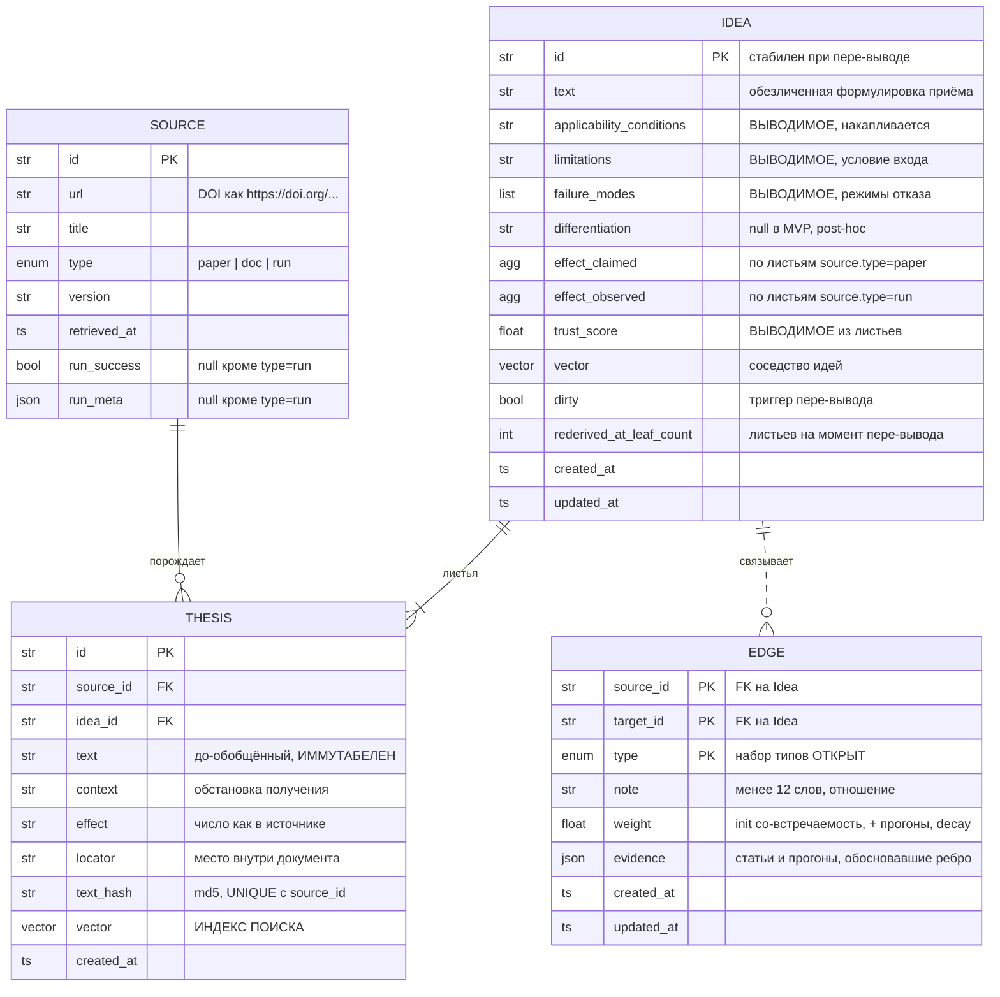
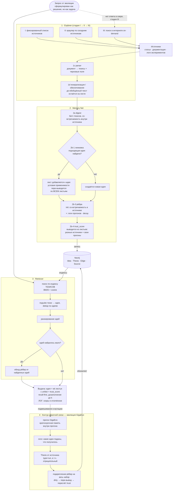

# 06 — Ideas Lake: архитектура (v2, после встреч 2026-07-27)

> **Статус: ядро согласовано командой, числа и часть механизмов — нет.**
> v1 (2026-07-27, утро) была личным предложением одного участника. v2 переписана по итогам двух встреч 2026-07-27: с менторами и командой (доска, фото). Всё, что помечено **[команда]** и **[менторы]**, обсуждено вслух и принято; всё остальное остаётся предложением автора документа.
> Не является ground truth для чисел SMART и для формул — они в §10. Владельцы блоков и контракты между ними — в [`07-roles-and-contracts.md`](./07-roles-and-contracts.md).
> **Модель данных §3 обновлена 2026-07-28** по итогам разбора инструментов ([`09`](./09-tools-and-prior-art.md)) и живых замеров на серверах школы. Каждая правка помечена **[решено 2026-07-28]**; реализация — [`10-implementation-spec.md`](./10-implementation-spec.md).

## Как читать

| Метка | Смысл |
| --- | --- |
| **[менторы]** | задано или подтверждено менторами на встрече 2026-07-27 |
| **[команда]** | решено на встрече команды 2026-07-27 |
| **[решено]** | решение автора документа; командой не обсуждалось |
| **[открыто]** | вопрос выявлен, ответа нет; блокирует или нет — указано |
| **[ограничение]** | сознательно принятая слабость MVP, с названной ценой |

Ссылки вида `[05] 05-repo-gigaevo-core.md` — на разборы репозиториев в этом каталоге; `file:line` внутри них — на исходный код, как он зафиксирован на 2026-07-26.

---

## 0. [Доска](https://miro.com/app/board/uXjVH3i6LnU=/?share_link_id=519378720295)

---

## 1. Задача и рамка

Официальная постановка (слайд 28): многоуровневое агентное хранилище, которое автономно извлекает из статей, документации и фрагментов вывода экспериментов **не текстовые выдержки, а обезличенные карточки идей** в форме

```
концепция → условия применения → эффект → ограничения → связи
```

**Критерии успеха со слайда:** 100+ карточек; автоматические связи; дедупликация в рамках домена; демо — агент отвечает релевантными стратегиями со ссылками на источники.

**[менторы] Рамка, добавленная на встрече: потребитель — эволюция GigaEvo, а не абстрактный агент.** Формулировка со встречи: «мы решаем не общую задачу памяти, а маленькую часть — только для эволюции». Отсюда три следствия, которых не было в v1:

1. У GigaEvo уже есть **краткосрочная память одного прогона** (`GigaEvo Memory`, MAP-Elites, острова). Озеро — **долговременная память**, живущая между прогонами. Связь двусторонняя: краткосрочная выгружается в озеро, озеро подмешивается в мутацию.
2. Успех измеряется не качеством карточек самих по себе, а **дельтой эволюции с озером против эволюции без него** (§7).
3. **[команда] Проверка гипотезы дешёвая.** Эволюция сама отсеет мусор: «если 10 % того, что мы рекомендуем, подойдёт — это отлично, главное ничего не потерять». Это переворачивает политику выдачи v1 (§5.3).

**Что уже есть в мире** (детали — `00-overview.md`): ни одна из четырёх изученных систем не покрывает задачу. Лучшее покрытие — `gigaevo-core/ideas_tracker`, ~35–45 %, при нулевом покрытии внешней машинерии. С нуля: ингест из документов, обезличивание, провенанс в основном пути чтения, интерфейс к эволюции.

---

## 2. Центральное решение: двухслойная модель «тезис → идея»

**[команда]** Принято целиком. Терминология команды: **идея — нода графа, тезис — лист**.

```
Идея (обезличена, обобщена, несёт рёбра, это и есть «карточка» ТЗ)
  ├── Тезис 1  ← статья A: «префильтр дешёвой моделью, −70% compute на ImageNet/ResNet-50»
  ├── Тезис 2  ← статья B: «в NAS-поиске отсев дешёвым прокси, −40% GPU-часов»
  └── Тезис 3  ← наш прогон #17: «на нашей задаче не сработало, прокси не коррелировал»
```

Статья **не является источником идей — она источник тезисов**. Тезисы извлекаются, векторизуются, линкуются к ближайшей по смыслу идее; если подходящей идеи нет — идея создаётся.

### Почему так

| Проблема | Как закрывается |
| --- | --- |
| **Merge не существует ни в одной изученной системе.** У A-MEM `merge` объявлен в JSON-схеме и не реализован; у HiMem Stage 3 слияние прямо запрещено; `Equivalent → NONE` выбрасывает дубль [04] | Merge = добавление листа. Идеи сливаются, тезисы **накапливаются**. Ничего не уничтожается |
| **Обезличивание необратимо и непроверяемо** | Идея обобщена, тезис хранит до-обобщённый текст с числами и use-case. Обобщение обратимо по построению |
| **Эффект после обобщения нечем сверить с источником** | Число живёт на тезисе (`Thesis.effect`) и сверяется; идея несёт агрегат |
| **Условия применимости при n=1** — из одной статьи контраст вывести нельзя. Это ровно ошибка GigaEvo: `task_description_summary` резюмирует *задачу прогона*, а не применимость идеи, одинаков у всех карточек прогона, и промпт селектора запрещает использовать его как дискриминатор [05] | Условия применимости идеи — обобщение по контекстам её листьев. 1 тезис → гипотеза, 5 тезисов из 5 обстановок → появился контраст |
| **Провенанс против обезличивания** | Идея обезличена, тезис несёт url/doi и конкретику |
| **Позитивный bias литературы** | **[команда]** под идеей лежат не только тезисы из статей, но и **результаты своих прогонов, включая отрицательные**. «В статьях все люди толстые, а мы не даём» |
| **Доверие нечем обосновать** | **[команда]** `trust_score` идеи **выводится из листьев**, а не объявляется отдельным полем (§3.3) |
| **Многоуровневость** (в определении ТЗ) | Настоящая ось абстракции: тезис → идея |

### Честная калибровка

Структурно это **не новизна**. Это консенсусная форма работ 2025–2026: HiMem `Episode → Note Memory`, Zep `episode → semantic entity → community`, AutoSci `LTKM` vs `ARM`, Generative Agents (reflections цитируют породившие их воспоминания) [04]. Форма проверена — это плюс; новизну заявлять надо в другом месте (§9).

**Ключевое число из этого консенсуса** — ablation HiMem: убрать Episode Memory (сырой низ) = **−11.42** GPT-Score; убрать Note Memory (абстракции) = **−1.08** [04]. Точность несёт сырой слой. Отсюда прямое следствие: **тезисы обязаны доезжать до агента** в выдаче, и **поиск идёт по тезисам**, а не по идеям (§5.3).

---

## 3. Модель данных



Интерактивно на доске: [диаграмма «5 · Модель данных v2»](https://miro.com/app/board/uXjVH3i6LnU=/?moveToWidget=3458764679285740075) и [фрейм «4 · Граф идей»](https://miro.com/app/board/uXjVH3i6LnU=/?moveToWidget=3458764679285643285) — как это выглядит на живом примере.

**[команда] Хранилище — Neo4j.** Блокер №1 из v1 закрыт. Обоснование со встречи: глубоких подграфов не ищем, на 10²–10⁴ узлов эффективность безразлична, бонус — готовая визуализация графа в питч. Вектора и полнотекст живут рядом (нативный индекс Neo4j либо отдельный слой) — **[решено 2026-07-28, вечер] отдельный слой у A**, см. §9; готовая механика гибрида BM25 + cosine есть в `gigaevo-memory` [02].

### 3.1 Thesis (тезис) — лист

**[команда]** Иммутабелен. Лист ровно одной идеи в каждый момент. Векторизуется — **это и есть индекс поиска**.

| Поле | Тип | Смысл |
| --- | --- | --- |
| `id` | str | |
| `text` | str | до-обобщённое утверждение, близко к источнику |
| `context` | str | обстановка (датасет, модель, масштаб) — то, что снимается при обобщении |
| `effect` | str | число ровно как в источнике, с единицей; `""` если числа нет |
| `locator` | str | место внутри документа: `"Methodology, 3.2"`, `"Table 4"` |
| `text_hash` | str | `md5(normalize(text))`; уникальность по паре с `source_id` |
| `vector` | vec | индекс поиска, 384d |
| `created_at` | ts | |

**Инварианты:** иммутабелен после записи; принадлежит ровно одной идее; при merge не уничтожается; уникальность по паре `(source_id, text_hash)` — тот же текст из **другого** источника создаёт новый лист, потому что именно так копится доверие (§3.3); листья от прогонов создаются только из логов прогона (§5.4).

**[решено 2026-07-28]** Поля `kind` на тезисе **нет**. Чем является число в `effect` — заявлением статьи или измерением прогона — говорит `Source.type`. Один enum вместо двух с одним именем; расхождению взяться неоткуда. Цена: агрегация `effect_*` по слою листьев требует join с источником, поэтому `graph_client.get_ideas()` отдаёт листья уже склеенными с `source.type`.

**[решено 2026-07-28]** `claimed_effect` → `effect`: у листа от прогона ничего не «claimed», это измерено. Разделение `effect_claimed` / `effect_observed` остаётся на идее, где оно и есть инвариант (§3.3).

**[решено 2026-07-28]** `source_provenance` схлопнут в `locator`: `url` и `version` уехали на `Source`, дублировать их в каждом листе незачем. `confirmation_provenance` не нужен — метаданные прогона живут на `Source` типа `run`.

**[команда]** Слой листьев **гетерогенен**: тезисы из статей и артефакты прогонов лежат рядом под одной идеей. **[открыто]** правила агрегации по гетерогенному слою (`paper` vs `run`) для `effect_*`.

**[открыто, необязательно]** `extraction_fidelity` на тезисе — насколько верно прочитан источник. В v1 это была шкала доверия №1. Команда к трёхшкальной модели не приходила; оставлено как кандидат в абляцию (§3.3).

### 3.2 Source (источник)

**[решено]** Отдельная сущность: один источник даёт много тезисов, и метаданные (версия, тип, кредибилити) — свойство источника, не тезиса.

| Поле | Тип | Смысл |
| --- | --- | --- |
| `id` | str | `sha1(url + version)[:16]` |
| `url` | str | канонический адрес; DOI как `https://doi.org/10.48550/arXiv.2405.12345` |
| `title` | str | для выдачи со ссылкой на источник — критерий ТЗ №4 |
| `type` | enum | `paper` \| `doc` \| `run` |
| `version` | str | arXiv — `"v2"`; `doc` — дата фетча; `run` — `run_id` |
| `retrieved_at` | ts | единственная привязка ко времени у `doc`, у которых нет версии |
| `run_success` | bool? | исход прогона; `null` у `paper` и `doc` |
| `run_meta` | json? | метаданные прогона; `null` у `paper` и `doc` |

**[решено 2026-07-28]** Три правки против v2-черновика:

- `kind` → `type`, `url_or_doi` → `url` — снимают коллизию имён с тезисом и составное поле «или/или»;
- `log` схлопнут в `run`: лог прогона и есть прогон, различать две сущности некому;
- **`run_success` и `run_meta` живут на источнике, а не на тезисе.** Один прогон даёт **один** исход `{fitness_delta, success, notes}` и создаёт **несколько** тезисов — по одному под каждую использованную идею (`07` §3, C4). Исход общий для всех них; на листе он был бы продублирован N раз с гарантией разъехаться. Это меняет контракт C4.

`run_meta` намеренно не типизирован: формат логов GigaEvo придёт от C и пока неизвестен.

**[открыто, необязательно]** `source_credibility` — шкала доверия №2 из v1; см. §3.3.

### 3.3 Idea (карточка идеи) — нода графа

**[команда]** Это «карточка» в терминах ТЗ. Обезличена: без конкретных чисел и без конкретных use-case — они остаются на листьях. Формулировка со встречи: «она содержит в себе именно чёткую идею».

| Поле | ТЗ | Тип | Смысл |
| --- | --- | --- | --- |
| `id` | — | str | **стабилен при пере-выводе** |
| `text` | концепция | str | обобщённая формулировка приёма |
| `applicability_conditions` | условия применения | str | **выводимое**; обобщение по `context` листьев; накапливается |
| `limitations` | ограничения | str | **выводимое**: когда приём **в принципе неприменим** |
| `failure_modes` | — | str[] | **выводимое**: **как ломается** при неправильном применении |
| `differentiation` | — | str? | отличие от соседних идей; в MVP `null`, заполняется post-hoc |
| `effect_claimed` | эффект | agg | агрегат по листьям с `source.type=paper`. **[решено]** свободный текст |
| `effect_observed` | эффект | agg | агрегат по листьям с `source.type=run`. **[решено]** свободный текст |
| `trust_score` | — | float | **выводимое из листьев**, см. ниже |
| `vector` | — | vec | вектор от `text`; соседство идей, обход графа |
| `dirty` | — | bool | выставляется при изменении состава листьев; триггерит пере-вывод |
| `rederived_at_leaf_count` | — | int | **[решено 2026-07-28, вечер]** число листьев на момент последнего пере-вывода; пишет A |
| `created_at`, `updated_at` | — | ts | |

**[решено 2026-07-28]** `concept` → `text`: симметрия с листом, у обеих нод `text` и его `vector`, сущность их и так различает. `vector_concept` → `vector` по той же причине. `vector_applicability` в MVP не заводится — помечен «под абляцию», второй векторный канал дороже, чем даёт до первых замеров.

**[решено 2026-07-28] Граница `limitations` / `failure_modes`.** Без неё LLM кладёт одно и то же в оба поля, поэтому формулировка идёт в промпт пере-вывода дословно: `limitations` — условие входа («требует предварительно обученного и замороженного энкодера»), `failure_modes` — режим отказа («слишком слабый энкодер → потеря семантики»).

**[решено 2026-07-28] Форма агрегата `effect_*` — свободный текст.** Вопрос был открыт. Цена решения названа: числа не сравниваются машинно, метрику на них D не построит. Инвариант «не сливаются» держится тем, что в схеме пере-вывода это **два отдельных поля**, а не аккуратностью промпта.

**[решено 2026-07-28] `differentiation` в MVP пуст.** Чтобы его вывести, нужны соседние идеи в момент вывода — то есть уже построенные рёбра, а рёбра строятся по идеям. Круг разрывается отдельным проходом после появления рёбер. В критериях ТЗ (§4) поля нет.

**[команда] Доверие: одно выводимое поле, а не объявленное.** Со встречи: «у нас нет отдельного поля credibility — оно подтверждается тем, сколько у нас листьев». Две составляющие:

- **кредибилити-количество** — сколько тезисов из **разных источников** сошлось под идеей;
- **кредибилити-качество** — сколько своих прогонов её использовало и с каким результатом; **отрицательный результат — тоже результат и тоже понижает/уточняет, а не выбрасывается**.

**[решено]** Формула **статическая и заменяемая**, пересчитывается по листьям на лету. Кандидат первой версии — логарифм от числа различающихся источников с поправкой на баланс `run`-исходов. Смысл требования: доказательства лежат в графе, поэтому смена формулы **не теряет информацию** и применима задним числом.

**[команда]** Отдельного булева `verified` нет: он эквивалентен `trust_score > порог` и порождает второе определение того же самого.

**[открыто, необязательно, кандидат в абляцию]** Трёхшкальная модель доверия из v1: `extraction_fidelity` → тезис, `source_credibility` → источник, `transferability` → идея. Аргумент за: в `idea_evolve` смешение `confidence` факта и `verified` идеи сломалось на живых данных — `fact_001` в двух расходящихся копиях (`0.8/false` против `1.0/true`), система заметила и не починила [03]. Аргумент против: три шкалы — три источника рассинхрона; выводимый агрегат такого класса ошибок не допускает по построению. **Проверять абляцией, не спором.**

**[команда]** Актуальность (старый метод, доказанный, но мёртвый) — **не моделируем**. Признано отдельным от достоверности измерением; в MVP не входит.

**Инварианты:** `id` стабилен при пере-выводе; листья только пополняются или переназначаются; `effect_claimed` и `effect_observed` **никогда не сливаются**.

### 3.4 Edge (связь между идеями)

**[команда]** Рёбра — между **идеями**, не между тезисами.

| Поле | Тип | Происхождение решения |
| --- | --- | --- |
| `source_id`, `target_id` | idea_id | |
| `type` | enum | **[открыто]** набор типов. У IdeaL их два (`similar` / `connected`) с правилом «when unsure, use `connected`» [01]; у A-MEM рёбра нетипизированные, и это названо их ограничением [04]. Обсуждался тип «логическая последовательность» (идея A применяется перед идеей B) — Даша; в MVP не зафиксирован |
| `note` | str ≤12 слов | правило IdeaL: «only link ideas whose relationship you could defend in one sentence» [01] |
| `weight` | float | три механизма, ниже |
| `evidence` | json | какие статьи и какие прогоны обосновали ребро; нужно, чтобы формулу веса можно было менять задним числом |
| `created_at`, `updated_at` | ts | |

**[команда] Жизненный цикл веса — три механизма, а не один:**

1. **Инициализация — со-встречаемость в одном источнике.** Тезисы одной статьи наследуют статью; идеи, набравшие листья из одной статьи, соединяются ребром с начальным весом, вычисленным алгоритмически. Причина, по которой v1 была неправа: **холодный старт**. Без этого механизма граф в момент запуска не имеет ни одного ребра, и подкреплять нечего. **[открыто]** опциональная перепроверка LLM по тексту статьи — действительно ли связь есть.
2. **Подкрепление — из логов эволюции.** Прогон использовал идеи `{1,2,3}` и дал хороший результат → веса внутри набора растут; плохой → падают. **[команда]** подкрепление льётся **на весь использованный набор**, а не попарно с перебором.
3. **Затухание.** Формула decay берётся из HiMem [04].

**[ограничение] Со-встречаемость в корпусе — это мода, а не подтверждение.** Литература публикует то, что сработало. Поэтому инициализация даёт только **приоры**; единственное настоящее подтверждение — механизм 2, то есть свои прогоны. Цена: пока прогонов мало, граф отражает моду публикаций.

**[открыто, важное]** Механизм разрыва rich-get-richer. Не решён ни в v1, ни на встрече.

**[открыто, не блокирует]** Би-темпоральность (`t_valid` / `t_invalid` из Zep: противоречащее ребро инвалидирует старое, ничего не удаляя [04]). **[команда]** противоречащие идеи в MVP просто **сосуществуют независимо** — конфликт не типизируется и не разрешается. Механизм остаётся кандидатом; проактивного обнаружения устаревания нет ни у кого, авторы HiMem это признают [04].

**Инварианты (взяты у IdeaL, проверены их тестами):** PK `(source_id, target_id, type)` → идемпотентность записи; self-loop запрещён; ссылка на несуществующую идею откатывает весь запрос (`IDEAL_ON_UNKNOWN_TARGET=reject`); каскадное удаление [01].

### 3.5 Гиперрёбра — признаны нужными, отложены

**[команда]** Разобрано вслух и зафиксировано: **пары не описывают тройки**. Если цепочка `ABC` работает хорошо, а `BCD` плохо, ребро `BC` получает и плюс, и минус, схлопывается в ~0 — и про `ABC` граф уже не помнит ничего. Существуют наборы, где ни одна пара не работает, а тройка работает.

**[отложено]** Реализация известна и дешёвая: гиперребро = нода специального вида + обычные рёбра к участникам. В MVP не делаем — это второй порядок сложности при отсутствующих данных подкрепления. **[ограничение]** цена: эффекты комбинаций из трёх и более идей не сохраняются.

### 3.6 Домен

**[команда] Домен — не сущность.** Ни таблицы, ни поля, ни фильтра. Домен — это то, как идеи ложатся в латентном пространстве; одна идея естественно попадает сразу в несколько доменов (модель для медицинского CV полезна и в немедицинском CV). Выделять домены можно **post-hoc** — для аналитики, визуализации и отчёта по критерию ТЗ №3, — но **поиск ими не ограничивается**: «ничего не теряем, ничего не ограничиваем».

Это отменяет из v1: сущность `Cluster`, двухуровневую иерархию `домен ⊃ применимость`, материализованные имена кластеров, фильтр по кластерам на входе ретрива и связанный с ним риск обрыва recall.

**[открыто]** Как выделять домены post-hoc и как предъявить «дедупликацию в рамках домена» (критерий ТЗ №3) без сущности домена.

---

## 4. Схема карточки против ТЗ

| Поле ТЗ | Где живёт | Статус |
| --- | --- | --- |
| концепция | `Idea.text` | закрыто |
| условия применения | `Idea.applicability_conditions` | закрыто структурно; **выводимое**, критерия приёмки нет |
| эффект | `Idea.effect_claimed` + `effect_observed`, первичные числа на листьях | закрыто; форма агрегата — свободный текст (§3.3) |
| ограничения | `Idea.limitations` + `failure_modes` | закрыто структурно; **выводимое**, критерия приёмки нет |
| связи | `Edge` | закрыто структурно; типы открыты, вес — три механизма (§3.4) |
| ссылка на источник (критерий успеха №4) | `Source.url` + `Source.title` + `Thesis.locator`, **видны в выдаче** | закрыто |

Для сравнения: у `gigaevo-core` из пяти полей ТЗ закрыты два (концепция, эффект), «ограничения» отсутствуют как поле, «условия применимости» — свободный текст, одинаковый у всех карточек прогона [05].

---

## 5. Компоненты

### 5.1 Explorer — ингест

**[команда] Три стадии, строго по порядку.** В v1 web-поиск был «режется первым»; теперь это дорожная карта, а не отсечение.

| Стадия | Что | Статус |
| --- | --- | --- |
| **I** | фиксированный список источников, парсинг | MVP |
| **II** | краулер: обход соседних источников, автоматический парсинг | после MVP |
| **III** | **поиск в интернете on-demand**: эволюция спрашивает то, чего в озере нет → уходим в интернет → пополняем граф → отвечаем | цель; **[менторы]** обсуждалась как основная точка стыковки с мутационным агентом |

Арифметика против спешки: 100+ карточек ≈ 50–100 статей, если карточка — приём, а не пересказ (ориентир: ResearchStudio-Idea прошла 1947 статей и вывела 15 паттернов [04]). На таком объёме список источников на стадии I составляется руками.

**Внутри стадии — два шага:**

| | Что делает | Статус |
| --- | --- | --- |
| **1c** parser | документ → N тезисов + черновые `text` / `applicability_conditions` / `limitations` | **[команда]**. Осознанная сложность: два поля из пяти в тексте статьи **не написаны** — «условия применимости» это вывод, которого в тексте часто нет [04]; «ограничения» частично извлекаемы (обязательная секция Limitations на NeurIPS/ACL с ~2022), но там ограничения *статьи*, а не *приёма как переиспользуемого рычага* |
| **1d** генерализация / обезличивание | тезис → обезличенная формулировка идеи; до-обобщённый текст остаётся на листе | **[решено]** отдельная стадия, **не** NER/regex. ТЗ противопоставляет «обезличенные карточки» «текстовым выдержкам», то есть требует снятия привязки к воплощению («на ImageNet с ResNet-50 +2.3 %» → приём + порядок эффекта), а не вычистки персональных данных |

**[решено]** Отдельного PII-слоя нет; задача вычистки персональных данных в проекте не ставится.

**Прецедент против совмещения 1d с нормализацией:** контракт Stage 3 у HiMem содержит четыре условия — Source Preservation, No Merging, **No Abstraction**, Reversibility. Обобщение там запрещено по той же причине, что и merge: необратимость [04]. Отсюда 1d стоит отдельным слоем, и до-обобщённый текст обязателен к сохранению.

### 5.2 Memory Net — построение графа

| | Что делает | Статус |
| --- | --- | --- |
| **2a** digest | приём тезисов **батчами**, сохраняя со-встречаемость внутри источника (нужна для инициализации рёбер) | **[решено]** |
| **2b-1** линковка тезиса к идее | по вектору тезиса ищем ближайшие идеи → LLM решает: прилинковать к существующей или создать новую | **[команда]** это и есть дедупликация: дубль не выбрасывается, а становится ещё одним листом существующей идеи |
| **2b-2** гранулярность | порог, на котором тезисы считаются одной идеей | **[менторы] начинаем с простого: эмбеддинги + косинусный порог**, без LLM-извлечения абстракции; промпт-правило и подбор алгоритма кластеризации по метрикам качества кластеризации (метод Даши) — следующий шаг. Значение порога **[открыто]** |
| **2b-3** рёбра | инициализация по со-встречаемости → подкрепление из прогонов → decay (§3.4) | **[команда]**; формулы **[открыто]** |
| **2b-4** trust | пересчёт `trust_score` по листьям | **[команда]**; формула **[открыто]**, статическая и заменяемая |

**Пере-вывод идеи.** **[решено]** При изменении состава листьев идея помечается `dirty`, текст пере-выводится LLM, `id` сохраняется (рёбра и накопленные веса не рвутся), вектора пересчитываются.

### 5.3 Retriever — чтение

**[команда] Вход — индекс ТЕЗИСОВ, не идей.** Это разворот относительно v1 (там основным был индекс абстракций). Причина, названная на встрече: тезис несёт больше семантической конкретики, а по обобщённой идее запрос попадает плохо.

```
запрос
  → поиск по индексу тезисов (гибрид BM25 + cosine, веса — под абляцию)
  → подъём: тезис → его идея
  → dedup по идеям
  → ранжирование идей
  → если идей набралось мало → обход рёбер от найденных идей
  → выдача: идея + её листья (текст, url, title, effect, locator) + trust_score
```

Свойства: сырой слой доезжает до потребителя **и через поиск, и через контекст** — этим закрывается −11.42 из ablation HiMem [04]; обезличивание не обходится (наружу идёт и обобщение, и его доказательства); рёбра работают как механизм расширения выдачи, а не как основной путь.

**[команда] Искать надо по решению, а не по задаче.** «Как решить задачу X» по индексу идей не отработает; запрос должен быть сформулирован в терминах приёма. **[открыто]** кто формулирует запрос — эволюция сама или LLM переписывает её контекст в query.

**[команда] Политика выдачи: recall-first.** Отказа нет, выдача дозаполняется до k. Обоснование: проверка гипотезы эволюцией дешёвая, 10 % попаданий достаточно, потерять правильную идею дороже, чем показать лишнюю.

**[решено] Но каждая выдача логируется**: что выдано, с какими скорами, что осталось за порогом k. Причина: без этого лога порог отсечения потом можно будет поставить только на глаз, а прецедент обратного провала известен — у GigaEvo правило «Empty hand is mandatory … do not pad with low-relevance cards» прописано в промпте селектора и **аннулируется кодом**: `_ensure_top_ideas` добирает карточки из сырого порядка, пока их не станет 3 [05]. Мы дозаполняем сознательно и с записью — это не то же самое, что дозаполнять молча.

**Отброшено из v1:** фильтр по кластерам на входе (домен больше не сущность, §3.6); поиск по сводкам кластеров (recall-обрыв: сводка — lossy-сжатие, один промах наверху отсекает поддерево); обязательный отказ.

### 5.4 Интерфейс к GigaEvo и обратная связь

**[команда] Интерфейс — сначала простая ручка `/retrieve`, агентный интерфейс потом.** Аргумент за агента (структурированный запрос, agentic RAG сильнее обычного RAG) принят как направление, но не как MVP.

**[менторы] Связь двусторонняя:**

```
GigaEvo Memory (краткосрочная, внутри прогона)  ⇄  Ideas Lake (долговременная, между прогонами)
```

Поток обратной связи:

```
прогон завершён
  → из логов эволюции видно, какие идеи были поданы в мутацию и что получилось
  → создаётся Thesis под соответствующей идеей
      (source = наш прогон: Source.type=run, run_success и run_meta на источнике)
  → подкрепление рёбер на весь использованный набор идей
  → идея помечается dirty → пере-вывод → пересчёт trust_score
  → уточнение applicability_conditions и limitations
```

**[команда] Атрибуция — из логов, а не из декларации исполнителя.** Это отличие от v1. И менторская формулировка со встречи 1: «тебе не обязательно спрашивать самого агента, достаточно исторических данных по решениям — это дерево решений, его можно парсить».

**[ограничение] Кредит внутри набора не разделяется.** Прогон использовал три идеи и дал плюс — плюс получают все три. Это ровно дефект GigaEvo: дельта фитнеса кредитуется одинаково всем выбранным карточкам, и бесполезная карточка, попавшая в выдачу рядом с хорошей, накапливает ту же положительную историю [05]. Тот же rich-get-richer через другую дверь; в MVP не решается.

**[открыто]** Механика приёма логов: ручка в озере, чтение файлов прогона, или hook на стороне `gigaevo-core`.

---

## 6. Потоки данных (сводно)



Интерактивно на доске: [диаграмма «6 · Потоки v2»](https://miro.com/app/board/uXjVH3i6LnU=/?moveToWidget=3458764679285740268).

**Write path.** `источники → 1c парсер → 1d обобщение → 2a digest (батч) → 2b-1 линковка к идее или создание → 2b-3 рёбра → 2b-4 trust`

**Read path.** `запрос → индекс тезисов → подъём к идеям → dedup → ранжирование → при нехватке обход рёбер → выдача идея + листья + trust, с логом скоров`

**Feedback path.** `прогон → логи → Source(type=run) + его Thesis → подкрепление набора рёбер → dirty → пере-вывод → trust + условия применимости`

---

## 7. Метрики

**[команда] Главная метрика — A/B «эволюция с озером против эволюции без озера».** Всё остальное вспомогательное.

| Метрика | Что меряет | Как | Статус |
| --- | --- | --- | --- |
| **A/B качества эволюции** | помогает ли озеро вообще | контрольные прогоны без озера против экспериментальных с озером, на одной задаче | **[команда]**. Протокол (2 контрольных + 2 экспериментальных) описан в `docs/memory.md` GigaEvo и **никем не выполнен** — ни AIRI, ни владельцем блока C [03]. Выполнить его — результат сам по себе |
| **Δcost (токены)** | цена памяти | логирование токенов и вызовов на стороне эволюции и на стороне озера | **[команда]**, логирование уже начато в отдельной ветке |
| **Δlatency** | задержка, добавленная к эволюции | — | **[команда] скорее выбрасываем**: ретрив идёт параллельно эволюции, у которой 30 поколений; вклад в wall-clock ≈ 0 |
| **Верность полей** | подтверждается ли поле источником | по **листьям**, бинарно по полю | **[решено]**. Не применима к двум выводимым полям идеи — они источником по определению не подтверждаются |
| **Релевантность выдачи** | применима ли выданная карточка | рубрика = **actionability** («по этой карточке можно действовать»), не topicality («про то же самое») | **[решено]**. Формулировка рубрики критична: тавтология «использовать более быстрые методы обучения» тематически релевантна на 100 % и бесполезна. У GigaEvo 39 % карточек тавтологичны [05]. **[открыто]** набор запросов не существует, составляется руками |
| **Объём графа** | процессная метрика | число идей, число листьев, число рёбер, доля идей с ≥2 источниками | **[команда]** |

**[команда] Условия A/B, названные на встрече и ограничивающие протокол:**

1. **Задача — агентная цепочка, а не простая оптимизация.** «Возьмёте упаковку окружностей — будет шляпа, ничего нового не придумается». Кандидат назывался менторами, ссылка обещана в чате.
2. **Сиды не фиксируются** — у LLM их почти никто не поддерживает, и минимальное нефункциональное изменение всё равно разводит деревья. Значит: **несколько прогонов и статистика**, а не одно сравнение.
3. **Память начинает играть с 10–20-го поколения.** Короткая эволюция эффекта не покажет; полный прогон — ~30 поколений. Оговорка со встречи: хороший инсайт может выстрелить и на 1–2 поколении, но проверять всё равно на длинной дистанции.
4. **Сравниваем конец прогона, а не поколение к поколению** — траектории расходятся.

**Отсутствующие метрики — сознательно осознанные дыры:**

- **[открыто]** **Метрика дедупа.** Критерий успеха ТЗ №3 нечем предъявить, и это усугубилось: домен больше не сущность (§3.6), значит «дедуп в рамках домена» надо переформулировать. Готовый ориентир для сравнения: у GigaEvo ≥3 дубля из 18 (17 %) пережили дедуп [05].
- **[открыто]** **Критерий приёмки обезличивания (1d).** «Верность полей» проверяет подтверждаемость источником, но **не** проверяет, не утекла ли конкретика в идею. То есть заявленная новизна ничем не измеряется.
- **[открыто]** **Критерий приёмки 1c** для двух выводимых полей.

---

## 8. Сознательно принятые ограничения

| **[ограничение]** | Цена |
| --- | --- |
| **Данных подкрепления может не быть к защите** | Подкрепление рёбер и `effect_observed` живут только из своих прогонов. На встрече прямо сказано: «результатов у нас нет и не будет, мы не успеем собрать». Митигация, там же названная: **исторические логи уже прошедших прогонов GigaEvo** + при необходимости синтетика. Без этого механизм 2 из §3.4 останется непроверенным кодом |
| **Контраст приходит только из своих прогонов** | Статьи неудачи не публикуют; логи экспериментов — это в основном то, что не сработало [04]. Темп уточнения `applicability_conditions` ограничен числом ваших экспериментов, а не размером корпуса |
| Кредит внутри набора идей не разделяется | §5.4; rich-get-richer |
| Гиперрёбер нет | §3.5; эффекты комбинаций ≥3 идей не сохраняются |
| Конфликты между идеями не разрешаются | противоречащие идеи сосуществуют; типизации противоречия нет |
| Актуальность не моделируется | старый доказанный, но мёртвый метод неотличим от живого |
| Идемпотентность re-ingestion не поддерживается | тот же документ дважды, v2 статьи, отозванная статья — обработается как новый вход. Re-ingestion не рассматривает ни одна изученная работа [04] |
| Стоимость записи не оптимизируется | порядка 3+ LLM-вызовов на тезис на write-path. A-MEM тратит `O(k)` вызовов на заметку и мерил это на диалогах; цифр записи на корпусном масштабе нет ни у кого [04] |
| Отдельного PII-слоя нет | обезличивание в смысле ТЗ закрыто, вычистка персональных данных — нет |
| Гранулярность идеи не зафиксирована | §9 |

---

## 9. Открытые вопросы

### Закрыты после встреч

- ~~Хранилище~~ → **Neo4j [команда]**.
- ~~Где живут рёбра физически~~ → там же, ноды и рёбра Neo4j.
- ~~Кластеры, их именование и стабильность~~ → **сущности нет [команда]**, §3.6.
- ~~Основной вход ретрива~~ → **индекс тезисов [команда]**, §5.3.
- ~~Политика отказа~~ → **recall-first + лог отсечённого [команда]**, §5.3.
- ~~Атрибуция~~ → **из логов эволюции [команда]**, §5.4.
- ~~Первый подход к гранулярности~~ → **эмбеддинги + косинусный порог [менторы]**; **порог отменён 2026-07-28**: косинус только набирает кандидатов, решение о слиянии принимает LLM-арбитр. Ни одна из шести изученных живых систем не решает слияние порогом косинуса [09]; порог к тому же привязан к модели эмбеддингов.
- ~~Форма агрегатов `effect_claimed` / `effect_observed`~~ → **свободный текст**, §3.3.
- ~~Точный состав `source_provenance`~~ → **сущности нет**: `url`/`version`/`title` на `Source`, место в документе — `Thesis.locator`, §3.1–3.2.
- ~~Второй вектор `vector_applicability`~~ → **в MVP не заводим**, §3.3. Остаётся кандидатом в абляцию.
- ~~Способ слияния гибрида~~ → **RRF `k=60`**; min-max + веса 0.5/0.5 — второе плечо абляции. Слияние считается у A.
- ~~Где физически живёт векторный индекс при Neo4j~~ → **отдельный слой у A**, решено 2026-07-28 вечером. Вариант «отдельный слой» допущен §3 с самого начала. Neo4j держит граф, A держит производную проекцию для поиска; `search_theses` снят с контракта C2. Причина решающая: переезд на Neo4j стоит в плане A как «если готов», а поиск по тезисам — ядро read path (§2), и ставить его за недоделанный чужой сервис на защитной неделе нельзя. Реализация — `10` §3.5, цена (индекс производный, может разъехаться) закрыта пересборкой за секунды и ассертом.

### Блокируют работу

1. **Гранулярность идеи.** Порог задан как метод, не как число. Слишком общая идея → пустые условия применимости, бессмысленный диапазон эффекта, возврат на любой запрос (тавтологии GigaEvo, 39 %). Слишком узкая → линковка не срабатывает, дедуп не работает, озеро = список выдержек. Лучшая иллюстрация того, что параметр никем не зафиксирован: внутри одного репозитория GigaEvo два живых промпта дают противоположные правила — `cluster_fast_refine`: «Different numeric values on the same method and direction are the **SAME** concept», `classify_ext`: «**PARAMETER CONFLICT = NEW IDEA**. Different numbers mean different ideas» [05]. Что вообще применяют: правило в промпте (IdeaL: «a claim plus the essential rationale that makes it make sense is **one** idea»; GigaEvo: «over-fragmentation is as harmful as over-inclusion») либо порог в векторном пространстве (GigaEvo `fast`: DBSCAN, `eps=0.25`, cosine).
2. **Набор запросов** для метрики релевантности — без него метрика не измерима.
3. **Задача для A/B** — названа как класс (агентная цепочка), не как конкретная задача.
4. **Механика приёма логов эволюции** — ручка, файлы или hook в `gigaevo-core`.

### Изобретать — нет ни в одной изученной системе и ни в одной статье

5. Формула `trust_score` из гетерогенного слоя листьев (`paper` + `run`, включая отрицательные).
6. Формула инициализации, усиления и затухания весов рёбер.
7. Механизм разрыва rich-get-richer.
8. Split идеи (переназначение листьев новой идее).
9. Проактивное обнаружение устаревания.

### Мелкое, но нерешённое

10. Набор типов рёбер; принимать ли правило IdeaL «0–4 ребра на карточку, лучше ноль рёбер чем слабое ребро».
11. Нужны ли три шкалы доверия вместо одного выводимого `trust_score` — под абляцию (§3.3).
12. ~~Где физически живёт векторный индекс при Neo4j~~ → **закрыто 2026-07-28 вечером**, см. выше: отдельный слой у A.
13. Когда и чем заполнять `differentiation` — нужен проход после появления рёбер (§3.3).

### Позиционирование

14. **Чем это отличается от ResearchStudio-Idea** (arXiv:2607.04439, июль 2026): 1947 статей ICLR/ICML/NeurIPS 2021–2025, 31 sub-pattern → 15 переиспользуемых паттернов в виде структурированных карточек, плюс навык Scoop-Check [04]. Часть новизны занята.
15. **Чем это отличается от `gigaevo-memory`** — один и тот же коллектив делает и GigaEvo, и CARE. Риск построить второй `gigaevo-memory` снимается разговором с менторами.

**Кандидаты в новизну** (не проверено): обезличивание как генерализация с обратимостью; пятиполевая причинно-условная схема (`applicability_conditions` + `limitations` не имеет ни одна изученная система); отрицательные результаты своих прогонов как первоклассные листья наравне со статьями; выполненный A/B «помогает ли память».

---

## 10. Чего нет для SMART

Документ закрывает **S** (что строим) и **M** (набор метрик). Не хватает чисел и дат.

| Нужно | Ориентиры из данных |
| --- | --- |
| Размер корпуса и озера | 100+ карточек ≈ 50–100 статей, если карточка = приём. В `idea_evolve` гниль видна уже на 86 идеях [03]. У IdeaL «читать весь store» перестало работать около 129 идей [01] |
| Целевые значения метрик | для сравнения есть замеры GigaEvo: 61 % карточек с конкретным механизмом (цель 85 %), 39 % тавтологий, 17 % выживших дублей, 72 % `ProgramCard` — заглушки. Все на n=1 прогоне, PRE-v4 [05] |
| Конкретная задача для A/B | класс задан (агентная цепочка), конкретика — нет |
| Сколько прогонов на плечо A/B | сиды не фиксируются → нужна статистика; число не названо |
| Даты и владельцы по блокам | горизонт: **до конца недели**, защита — **понедельник 3 августа 2026** |
| Порядок урезания | стадии II и III ингеста режутся первыми; гиперрёбра уже отложены; остальное не упорядочено |

---

## 11. Что этот документ НЕ утверждает

- Что числа согласованы. Формулы веса, trust и порога не выбраны, значения не назначены.
- Что архитектура согласована с менторами целиком. Согласована с командой; менторы видели схему v1 и рамку «потребитель — эволюция».
- Что она лучше альтернатив. Сравнение с «взять `gigaevo-memory` и дописать граф» не проведено.
- Что перечисленные новизны — новизны. Проверка по Scoop-Check-подобной процедуре не делалась.
- Что объём выполним за неделю. Оценка трудозатрат отсутствует.

---

## Приложение. Журнал изменений v1 → v2

| Что | v1 (личное предложение, утро 2026-07-27) | v2 (после встреч) |
| --- | --- | --- |
| Терминология | Abstraction / Thesis | идея (нода) / тезис (лист) — **[команда]** |
| Потребитель | команда на своих задачах | **эволюция GigaEvo**, двусторонняя связь с краткосрочной памятью прогона — **[менторы]** |
| Вход ретрива | индекс абстракций, кластер как фильтр | **индекс тезисов** → подъём к идеям → dedup → ранжирование → обход рёбер при нехватке — **[команда]** |
| Кластеры и домен | сущность `Cluster`, 2 уровня, материализованные имена, фильтр | **сущности нет**, домен = геометрия латентного пространства, фильтра нет, выделяем post-hoc — **[команда]** |
| Доверие | 3 шкалы по слоям | **один выводимый `trust_score`** из листьев (разные источники + свои прогоны, включая отрицательные); 3 шкалы — кандидат в абляцию — **[команда]** |
| Рёбра | усиление **не** по со-встречаемости | со-встречаемость в источнике = **инициализация** (иначе холодный старт), подкрепление из логов прогонов на весь набор, decay из HiMem — **[команда]** |
| Гиперрёбра | не рассматривались | признаны нужными (пары не описывают тройки), реализация известна, **отложены** — **[команда]** |
| Политика выдачи | обязательный отказ, без дозаполнения | **recall-first**, дозаполнение до k + **лог скоров и отсечённого** — **[команда]** + [решено] |
| Атрибуция | декларация исполнителя Central / Peripheral | **из логов эволюции** — **[команда]**, **[менторы]** |
| Хранилище | открытый блокер (gigaevo-memory / файлы / SQLite) | **Neo4j** — **[команда]** |
| Web-ингест | «режется первым» | три стадии: список источников → краулер → **on-demand поиск по запросу эволюции** — **[команда]** |
| Метрики | верность / actionability / A/B | те же + **Δcost (токены)**, объём графа; **Δlatency скорее выбрасываем**; условия A/B зафиксированы (агентная цепочка, без сидов, ≥10–20 поколений, сравнение по концу прогона) — **[команда]** |
| Гранулярность | открытый блокер без метода | метод задан: **эмбеддинги + косинусный порог**, дальше метрики качества кластеризации; значение порога открыто — **[менторы]** |

