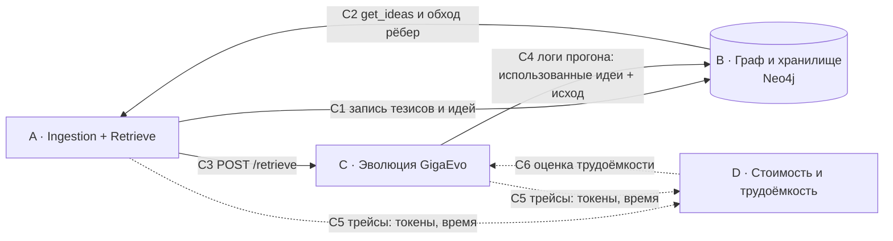

# 07 — Роли и контракты между модулями

> Зафиксировано 2026-07-27 по итогам встречи с менторами и встречи команды. **Контракты C1–C4 обновлены 2026-07-28** после согласования моделей данных с B; **C1, C2 и C3 доуточнены вечером 2026-07-28** по итогам ревью реализуемости (`10` §0.1) — три правки, все помечены `[изменено … вечер]` и все идут к B/C одним сообщением. Архитектура — `06-proposal-design.md` (v2), реализация блока A — `10-implementation-spec.md`.
> Здесь только **кто чем владеет** и **что передаёт соседу**. 
> Владелец блока — единственный, кто меняет контракт своего выхода. Ломающее изменение контракта объявляется в чат до того, как ломается.
> На доске: [диаграмма «7 · Роли и контракты»](https://miro.com/app/board/uXjVH3i6LnU=/?moveToWidget=3458764679285906933).

---

## 1. Блоки и владельцы


| Блок                                            | Владелец          | Что внутри                                                                                                                                                                                                                               | Цвет на доске                           |
| ----------------------------------------------- | ----------------- | ---------------------------------------------------------------------------------------------------------------------------------------------------------------------------------------------------------------------------------------- | --------------------------------------- |
| **A · Ingestion + Retrieve**                    | A                 | crawler / список источников → парсер (документ → тезисы) → обобщение и обезличивание → линковка тезиса к идее или создание идеи; **и** весь путь чтения: поиск по тезисам → подъём к идеям → dedup → ранжирование → обход рёбер → выдача | красный                                 |
| **B · Граф и хранилище**                        | B                 | схема хранения, Neo4j, создание рёбер, подкрепление и затухание весов, переоценка, `trust_score`. **Индекс тезисов — не здесь**: он у A (C2, решено 2026-07-28 вечером)                                                                  | зелёный                                 |
| **C · Эволюция: потребитель и поставщик логов** | C                 | форк `gigaevo-core`; вопрос мутационному агенту «какая информация была неверной / какой не хватило»; подмешивание выдачи озера в мутацию; доказательство, что эволюционный луп не ломается и не замедляется                              | —                                       |
| **D · Стоимость и трудоёмкость**                | D                 | калибруемая модель скоринга трудоёмкости, сбор логов, оценка модели на логах, ручки агенту для влияния на оценки, замер дельты метрик и оверхеда                                                                                         | `Δcost / Δlatency / A/B` слева на доске |


---

## 2. Карта контрактов



---

## 3. Контракты

### C1 · Ingestion → Граф (A → B)

Запись батчем, один источник за вызов; со-встречаемость внутри источника нужна графу для инициализации рёбер (§3.4 в `06`). Модели `Source` / `Thesis` / `Idea` — `06` §3.1–3.3, поля и типы — [`10`](./10-implementation-spec.md) §1.

```
write_source( { id, url, title, type: paper|doc|run, version,
                retrieved_at, run_success?, run_meta? } ) -> source_id

write_theses(
  source_id,
  theses: [ { id, idea_id, text, context, effect, locator, text_hash, vector } ]
) -> [ thesis_id ]

create_idea( { id, text, applicability_conditions, limitations, failure_modes,
               effect_claimed, effect_observed, vector,
               rederived_at_leaf_count } ) -> idea_id
update_idea( idea_id, fields )                            # пере-вывод
```

- **[изменено 2026-07-28, вечер]** Поле `rederived_at_leaf_count: int` на `Idea`, пишет **A**. Триггер пере-вывода — «накопилось 3 новых листа» (`10` §4.6) — считался в памяти прогона, а корпус идёт в несколько заходов и листья от прогонов через C4 приезжают позже: между заходами счётчик терялся. Один int, сравнивается с `len(leaves)`. `dirty` остаётся у B и означает другое.
- **[изменено 2026-07-28, вечер]** `create_idea` + `write_theses` нужны **одной транзакцией**: отказ между ними оставляет идею с нулём листьев, что нарушает `IDEA ||--|{ THESIS` (`06` §3), а падение на одном тезисе из шести — штатный случай (`10` §4.5). Если B транзакции не даёт — A делает реконсиляцию у себя, но знать надо заранее.

- Решение «прилинковать к существующей идее или создать новую» принимает **A** (это и есть дедуп). **B** исполняет запись и держит инварианты схемы.
- **[решено 2026-07-28] `id` идей и тезисов генерирует A** (`uuid4`). В одном батче второй тезис может линковаться к идее, созданной первым, — ждать ответа хранилища негде.
- Со-встречаемость отдельным полем **не передаётся**: батч приходит одним вызовом на один источник, все затронутые идеи в нём видны, инициализацию рёбер **B** выводит из батча.
- Пере-вывод текста идеи инициирует **A** по накоплению 3 новых листьев; флаг `dirty` и пересчёт `trust_score` — на **B**.
- **[решено 2026-07-28]** Формат `Idea` больше не блокирует A: поля согласованы с B, зафиксированы в `06` §3.3 и `10` §1. За **B** остаются `trust_score`, `dirty`, таймстемпы и рёбра.
- **[открыто]** Форма интеграции: HTTP-сервис поверх Neo4j или библиотека-клиент, которую A импортирует. Решает **B**. Прячется за `graph_client.py` (`10` §3.4).

**[факт 2026-07-29] Озеро залито в тестовый Neo4j B односторонней заливкой. Это не переезд и не адаптер** — форма интеграции остаётся открытой выше. Скрипт `lake/neo4j_load.py` читает через `graph_client` как любой другой потребитель и говорит Cypher только на выходе (`lake/neo4j_load.py:1-10`).

- Инстанс `airi`, Aura Free, **база `37b54210`, а не `neo4j`**. Драйвер и Aura-консоль по умолчанию идут в `neo4j` и показывают пустой граф; `NEO4J_DATABASE` обязателен.
- Залито 88 узлов: 2 `Source`, 60 `Thesis`, 26 `Idea`. Рёбра по ERD (`06` §3): `(:Idea)-[:HAS_LEAF]->(:Thesis)` 60, `(:Source)-[:YIELDS]->(:Thesis)` 60. Констрейнты уникальности на `id` для трёх меток созданы — у инстанса их не было, и `MERGE` без них это полный скан метки на строку.
- Вектора на месте у всех моих узлов: 60/60 тезисов и 26/26 идей, 384 измерения. **Первая заливка их потеряла** — `build()` читал тезисы через `list_theses`, витринную проекцию без `vector` (`lake/stub_store.py:277-283`), а `_row` требовал только `id`, поэтому обязательное поле модели пропало молча: у Neo4j схемы нет, возразить некому. Исправлено 2026-07-29 в корне — вектора подмешиваются из `all_theses()`, и `_row` теперь требует каждое поле, которое модель объявила обязательным. Проверка вписана в общий прогон как `6.21`; до этого она жила только за собственным `--self-check`, и набор её не запускал.
- **В базе при этом 92 узла и 122 ребра.** Разницу дают 4 тестовых узла B в своём словаре (`concept`, `target_score`, `is_success`, `kind`): два тезиса `thesis_test_001` и `thesis_test_003` — у обоих `source_id` и `idea_id` равны `null`, проверено запросом — и две идеи (по разнице счётчиков). Загрузчик их не пишет и не удаляет (`lake/neo4j_load.py:12-16`), поэтому они видны как две отдельные пары `Idea—Thesis` без источника. Сверять `/stats` блока A с `MATCH (n) RETURN count(n)` напрямую нельзя.
- Смотреть граф — Aura Studio → **Query**, не Bloom. Bloom рисует «сцену», то есть только то, что явно добавлено поиском или раскрытием, а не базу: на 2026-07-29 в сцене лежало 9 узлов из 92, и это читалось как неполная заливка. Лимиты Query (node limit 1000, max neighbours 1000) на 92 узлах ни при чём.
- Убрать источники из выдачи (`MATCH (i:Idea)-[r:HAS_LEAF]->(t:Thesis) RETURN i, r, t`) — граф распадается ровно на 28 компонент по числу идей: **рёбер `Idea—Idea` в озере нет вообще**, `differentiation` не заполняется, и связность держат только два источника. Механики весов и рёбер между идеями — сторона B (`06` §6).

### C2 · Граф → Retrieve (B → A)

```
get_ideas(idea_ids)                      -> [ Idea + листья (Thesis: text, effect, locator)
                                               + source (url, title, type) ]
neighbors(idea_ids, hops=1, min_weight?) -> [ { from, to, type, weight, note } ]
```

**[решено 2026-07-28, вечер] `search_theses` снят с B. Индекс тезисов живёт у A и на Neo4j не переезжает.**

Вопрос «где физически живёт векторный индекс» стоял **[открыто]** с 27-го (`06` §9 п.12, `08` §13 вопрос №4 Даше — ответа не было). Метод попал в C2 не по решению, а потому что `06` §5.3 описал ретрив как «поиск по индексу тезисов», а чей это индекс — оставили на потом. Закрыто в сторону A, реализация — `10` §3.5. `06` §3 допускает это прямым текстом: «вектора и полнотекст живут рядом — нативный индекс Neo4j **либо отдельный слой**».

Четыре причины, первая решающая:

1. переезд на Neo4j стоит в плане A как «если готов» (`10` §9, 31 июля); поиск по тезисам — ядро read path (`06` §2), и за недоделанным чужим сервисом в день демо ему не место. При индексе у A просрочка B стоит только `get_ideas` и `neighbors`, а они деградируют мягко;
2. модель эмбеддингов и её асимметричный query-префикс живут у A (`10` §3.2), вектора тезисов пишет тоже A; у B индекс потребовал бы дублирования модели, а цена рассинхрона — не ошибка, а тихо просевший косинус;
3. абляция «RRF против min-max» становится внутренним делом A, без правки контракта на защитной неделе;
4. уже написано и проверено: `09-raw/hybrid_recipe.py`, 96 строк, self-check зелёный.

**Для B это снятие работы, а не добавление.** Её сторона C2 сокращается до двух методов. `neo4j-graphrag HybridRetriever` (`09` §4, «передать B») в MVP не нужен.

- Основной вход поиска — **индекс тезисов**, не идей (`06` §5.3); индекс — `10` §3.5, вызовы наружу не идут.
- **[решено 2026-07-28]** `get_ideas` отдаёт листья **уже склеенными с источником**. Причина: `kind` на тезисе больше нет, признак `paper`/`run` живёт на `Source` (`06` §3.1), и разделение `effect_claimed`/`effect_observed` не должно зависеть от того, вспомнил ли кто-то сделать join. Оттуда же берётся провенанс в ответе `/retrieve`.
- **[решено 2026-07-28]** Тот же индекс набирает кандидатов для дедупа на записи (`10` §4.5) — отдельного «поиска по идеям» нет и не нужно.
- **[решено 2026-07-28]** Слияние гибрида — RRF `k=60`, считается у A; min-max с весами — второе плечо абляции, там же.
- `neighbors` вызывается только когда идей набралось меньше запрошенного k.

### C3 · Retrieve → Эволюция (A → C)

```
POST /retrieve
  { query, k=5, run_id?, budget?, rewrite=true, allow_web=false }
->
  { ideas: [ { idea_id, text, applicability_conditions, limitations, failure_modes,
               effect_claimed, effect_observed, trust_score, score, via,
               theses: [ { text, url, title, effect, locator } ] } ],
    log_id, cost: { tokens_in, tokens_out, wall_ms } }
```

**[изменено 2026-07-28]** `concept` → `text`, `url_or_doi` → `url`, `claimed_effect` → `effect`; добавлены `failure_modes`, `title`, `locator`, `via`. `via` показывает, как идея попала в выдачу: `thesis` \| `edge` \| `padding` — без него не отличить найденное от дозаполненного.

- Запрос формулируется **как решение, а не как задача** (`06` §5.3). **[открыто]** кто переписывает контекст эволюции в query — эволюция или LLM внутри ретрива.
- Политика recall-first: пустой выдачи нет, дозаполняем до k; всё выданное и отсечённое пишется в лог по `log_id`.
- **[добавлено 2026-07-28, вечер]** Отказ хранилища ≠ пустая выдача. Граф недоступен → **HTTP 503** с `{error, log_id}`, а не `ideas: []`. `ideas: []` означает «в озере по этому запросу ничего нет» и является данными для A/B; `503` означает «озеро сломано» и данными не является. Смешать их — загрязнить главную метрику проекта. C трактует 503 как «прогон без озера» и продолжает мутацию (`10` §5.4).
- Стадия 2: агентный интерфейс вместо простой ручки. Не MVP.
- **[открыто]** ручка «сходить в интернет по запросу» (стадия III ингеста) — тот же эндпоинт с флагом или отдельный.

### C4 · Эволюция → Граф (C → B, при участии A)

По завершении прогона:

```
POST /run
  { run_id, task_id, retrieve_log_ids: [...],
    used_idea_ids: [...],
    outcome: { fitness_delta, success: bool, notes },
    artifacts? }
```

Эффект: заводится один `Source` с `type=run`, `version=run_id`, `run_success=outcome.success` и `run_meta` = остальные метаданные прогона; под каждой использованной идеей создаётся его `Thesis` (в том числе **отрицательный** — это и есть источник контраста); подкрепляются рёбра **на весь использованный набор**, затронутые идеи помечаются `dirty`, пересчитывается `trust_score`.

**[изменено 2026-07-28]** Исход прогона живёт на **источнике**, а не на тезисе. Один прогон даёт один исход и несколько тезисов — по одному под каждую использованную идею; на листе исход был бы продублирован N раз с гарантией разъехаться. Поля `run_success` / `run_meta` — `06` §3.2.

- **[открыто]** push из эволюции или pull-парсинг логов прогона. Менторская реплика в пользу pull: «достаточно исторических данных по решениям, это дерево решений, его можно парсить».
- **[риск]** своих прогонов к защите может не набраться. Митигация, названная на встрече: исторические логи уже прошедших прогонов GigaEvo, при необходимости синтетика.

### C5 · Все → владелец блока D: трейсы

Обязательное поле каждой LLM-операции и каждого обращения к графу:

```
{ ts, component, op, model, tokens_in, tokens_out, wall_ms, run_id?, task_id?, log_id? }
```

- `wall_ms` обязателен: модель трудоёмкости калибруется по **реальному времени из логов**.
- Токены обязательны: `Δcost` — метрика проекта (`06` §7).
- Валидация и вызовы LLM внутри неё логируются тоже — сейчас это дыра в существующем логировании.

### C6 · владелец блока D → Эволюция

```
estimate(task | plan) -> { cost_tokens, wall_ms, confidence_interval }
```

плюс ручки, которыми агент влияет на оценку. Оверхед самой оценки логируется и вычитается при отчёте.

---

## 4. Зависимости и порядок


| Кто           | Ждёт                                                                                            | Не ждёт никого                                  |
| ------------- | ----------------------------------------------------------------------------------------------- | ----------------------------------------------- |
| A           | ~~формат `Idea` от B~~ — **снят 2026-07-28**; форму интеграции с Neo4j прячет адаптер          | весь write path, весь read path, ранжирование   |
| B           | —                                                                                               | схема, Neo4j, формулы весов и trust             |
| C           | контракт C3 от A — **для подмешивания**; до этого работает на своём вопросе мутационному агенту | форк core, эксперимент «не ломает ли луп»       |
| D           | формат трейсов от A и C — **для калибровки**                                                    | своя модель, эксперименты на коротких эволюциях |


Критический путь: **запись (A) → выдача (A) → подмешивание (C) → A/B**. Первое звено — формат `Idea` от B — снято 2026-07-28: поля согласованы, реализация идёт против `06` §3.3 через `graph_client.py`, и переезд на Neo4j не блокирует ни один день.

---

Общий горизонт: **до конца недели**, защита — **понедельник 3 августа 2026**.
