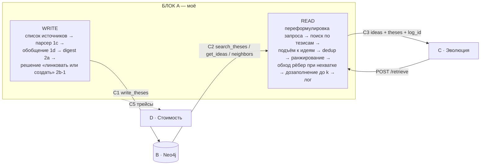

# 08 — Блок A: Ingestion + Retrieve. Рабочий план владельца

> Владелец: блок A. Зафиксировано 2026-07-27. Защита — **понедельник 3 августа 2026**, остаётся 7 дней.
> Архитектура — [`06-proposal-design.md`](./06-proposal-design.md) (v2). Контракты с соседями — [`07-roles-and-contracts.md`](./07-roles-and-contracts.md).
> Здесь только моя часть: что я строю, в каком порядке, из чего собираю, какие числа ставлю по умолчанию и чем доказываю, что оно работает.
> **Внимание: десять решений этого плана отменены 2026-07-28** после разбора инструментов ([`09`](./09-tools-and-prior-art.md)) и живых замеров на серверах школы. Список отменённого — [`10-implementation-spec.md`](./10-implementation-spec.md) §0; там же реализация. Затронуты §4.2, §4.5, §4.6, §5.2, §5.3 и план по дням.
> **Ещё десять — вечером 2026-07-28** по итогам ревью реализуемости, `10` §0.1. Дополнительно затронуты §3 (раскладка кода: две фазы, `index.py`), §4.4 (батч теперь после фазы 1), §5.2 (индекс тезисов **мой**, а не за C2 — снимает вопрос №4 из §13) и §9.

---

## 1. Что на мне

Весь путь данных, кроме самого графа: **источник → тезис → идея** на запись и **запрос → выдача** на чтение.



**Моё:**

| | Что | Где в `06` |
|---|---|---|
| 1 | Список источников стадии I и их загрузка | §5.1 |
| 2 | `1c` парсер: документ → тезисы + черновые поля идеи | §5.1 |
| 3 | `1d` генерализация/обезличивание: тезис → обезличенная формулировка идеи | §5.1 |
| 4 | `2a` digest: батч тезисов одного источника, со-встречаемость внутри источника | §5.2 |
| 5 | `2b-1` **решение** «прилинковать к существующей идее или создать новую» — это и есть дедуп | §5.2, C1 |
| 6 | Инициатор пере-вывода идеи при изменении состава листьев | §5.2 |
| 7 | Retriever целиком: поиск → подъём → dedup → ранжирование → обход рёбер → дозаполнение | §5.3 |
| 8 | `POST /retrieve` — интерфейс к эволюции | §5.4, C3 |
| 9 | Лог выдачи: что выдано, с какими скорами, что осталось за порогом | §5.3 |
| 10 | Трейсы токенов и времени по всем моим LLM-вызовам | C5 |

**Не моё** (не трогаю, спрашиваю у владельца):

- схема хранения, Neo4j, физическая запись, инварианты — **B**;
- создание рёбер, формулы веса/подкрепления/затухания, `trust_score` — **B**; я только **потребляю** `trust_score` в ранжировании и **передаю** со-встречаемость для инициализации рёбер;
- флаг `dirty` и пересчёт по нему — **B**;
- парсинг логов прогонов эволюции и создание `Thesis(kind=run)` — контракт C4, владельцы — **C и B**, я участвую как консультант по формату тезиса;
- модель трудоёмкости — **D**.

---

## 2. Блокеры и как я их обхожу

| Блокер | Кто снимает | Что делаю, пока не снят |
|---|---|---|
| **Финальный формат `Idea`** (C1, «блокирует запись») | B | Пишу против черновика `06` §3.3 через **один** адаптерный модуль `graph_client.py`. Смена формата = правка одного файла, а не всего пайплайна |
| **Форма интеграции: HTTP-сервис или библиотека** (C1, открыто) | B | Адаптер прячет и это. Внутри — либо `httpx`, либо импорт; наружу один и тот же интерфейс |
| **Neo4j ещё не поднят** | B | Тот же интерфейс реализую вторым бэкендом на SQLite + numpy-косинус (~80 строк). На нём разрабатываю и тестирую парсер и ретрив, не ожидая B. Это единственный случай, когда два бэкенда оправданы: они реально существуют оба |
| **C ждёт от меня C3 «для подмешивания»** | я | Отдаю C **мок-эндпоинт `/retrieve`** в первый же день — правильная форма ответа, данные захардкожены. C начинает интеграцию сразу, я меняю начинку под ним |
| **Значение порога линковки не задано** (`06` §9, блокер 1) | я | Ставлю значения по умолчанию из §5.5 ниже и калибрую на 20 ручных парах. Это моё решение, не жду ничьего |

Правило на неделю: **ни один мой день не начинается со слова «жду»**. Всё, что зависит от соседей, спрятано за адаптером или заменено заглушкой.

---

## 3. Раскладка кода

```
lake/
  sources.yaml           # список источников стадии I, руками
  ingest/
    fetch.py             # arXiv id / URL / pdf → текст + метаданные источника
    parse.py             # 1c: документ → [Thesis] + черновые поля идеи
    generalize.py        # 1d: тезис → обезличенная формулировка
    link.py              # 2b-1: hash → cosine → LLM-арбитр → link | new
    run.py               # оркестрация write path, батч по источнику
  retrieve/
    rewrite.py           # запрос эволюции → запрос «в терминах решения»
    search.py            # гибрид BM25 + cosine по тезисам
    rank.py              # подъём, dedup, ранжирование, обход рёбер, дозаполнение
    api.py               # POST /retrieve
  graph_client.py        # ЕДИНСТВЕННОЕ место, знающее формат B (C1 + C2)
  stub_store.py          # SQLite-бэкенд того же интерфейса, пока B не готов
  trace.py               # C5: один декоратор на каждый LLM-вызов и вызов графа
  prompts/               # текстовые файлы, как в gigaevo-core: {step}/system.txt
  selfcheck.py           # assert-проверки инвариантов, запускается одной командой
  eval/
    queries.yaml         # 30 запросов для метрики релевантности
    score.py             # actionability + верность полей
```

Промпты — обычные текстовые файлы, а не строки в коде: так их правит кто угодно без релиза, и так это уже сделано в `gigaevo-core` (`llm.py:39-64`, [05]).

---

## 4. Write path

### 4.1 Стадия I — список источников

Арифметика из `06` §5.1: 100+ карточек ≈ **50–100 статей**, если карточка — приём, а не пересказ. На таком объёме список собирается руками, краулер не нужен и в MVP не входит.

Состав, который набиваю:

| Группа | Сколько | Зачем |
|---|---|---|
| Эволюционный поиск программ и LLM-мутация | ~20 | Домен потребителя: FunSearch, AlphaEvolve, MAP-Elites, island models, NAS-прокси, early stopping |
| Агентные пайплайны и их оптимизация | ~20 | Класс задачи A/B — «агентная цепочка» (`06` §7) |
| Дешёвые прокси и каскады оценки | ~10 | Пример карточки со слайда — `cascaded evaluation`, отсюда же откалиброванный эталон |
| Память агентов и извлечение знания | ~10 | A-MEM, HiMem, Mem0, Zep, HippoRAG, GraphRAG — уже разобраны в [04], тезисы почти готовы |
| **Логи прошедших прогонов GigaEvo** | сколько дадут | Единственный источник `kind=run` и единственный источник **отрицательных** тезисов до того, как пойдут наши прогоны (`06` §8) |

Формат `sources.yaml`: `url_or_doi`, `kind`, `version`, `note`. Версия обязательна — на ней держится идемпотентность (§4.6).

**Риск, который называю сразу:** логи прогонов GigaEvo придут от владельца блока C, и они могут не прийти. Тогда слой `kind=run` пуст, `effect_observed` пуст, а `trust_score` вырождается в счётчик источников. Митигация — синтетика по протоколу из `06` §8, но об этом договариваюсь с B и C, а не решаю сам.

### 4.2 Шаг 1c — парсер: документ → тезисы

**Вход:** текст документа, разбитый по секциям (Abstract, Method, Experiments, Limitations — если размечены; иначе чанки по ~1500 токенов с перекрытием 100).

**Выход** — строгий JSON, один вызов на секцию:

```json
{
  "theses": [
    {
      "text": "до-обобщённое утверждение, близко к формулировке источника",
      "context": "обстановка: датасет, модель, масштаб, режим",
      "claimed_effect": "число ровно как заявлено в источнике, с единицей; пусто если числа нет",
      "location": "секция и/или номер таблицы, для провенанса",
      "draft_concept": "черновая обезличенная формулировка приёма",
      "draft_applicability": "при каких условиях приём имеет смысл; ВЫВОД, часто не написан в тексте",
      "draft_limitations": "цена применения; частично из секции Limitations"
    }
  ]
}
```

Правила промпта — прямые заимствования, каждое с адресом:

1. **Приём, а не пересказ.** Тезис описывает переиспользуемый рычаг. Если утверждение нельзя применить в другой работе — не тезис. Иначе получим 39 % тавтологий, как в собственном аудите GigaEvo ([05] `plans/memory-system-quality-boost.md`).
2. **Число живёт в тезисе.** `claimed_effect` копируется, а не пересказывается: на идее его нечем будет сверить с источником (`06` §2).
3. **Не выдумывать.** Контракт Stage 2 у HiMem: «You MUST treat these facts as the only source of truth», новых фактов не вводить ([04]).
4. **Разделять, а не сливать.** Stage 3 HiMem: «You MAY split one note, but you MAY NOT merge multiple input facts into one output fact» ([04]).
5. **Атомарность с ограничителем.** Правило IdeaL против over-split: «a claim plus the essential rationale that makes it make sense is **one** idea» ([01] `SKILL.md`).
6. Потолок 6 тезисов на секцию, 30 на документ. Больше — сигнал, что парсер пересказывает.

**Осознанная сложность, названная в `06` §5.1:** `draft_applicability` и `draft_limitations` в тексте статьи чаще всего **не написаны** — это вывод. Значит: они помечаются `derived: true`, и метрика «верность полей» (§8) к ним **не применяется** — их источником подтвердить нельзя по определению. Приёмка для них — отдельная и ручная.

**Параметры:** `temperature=0`, structured output через function calling (в отличие от `gigaevo-core`, где `json.loads` вручную и 10 ретраев на `JSONDecodeError`, [05] `analyzers.py:186` — этот класс ошибок я закрываю схемой, а не ретраями). Ошибки LLM **не проглатываю**: у `gigaevo-core` `llm.py:156-158` возвращает `""` на любом исключении, и это тихая потеря данных.

### 4.3 Шаг 1d — генерализация / обезличивание

Отдельный слой, а **не** NER и не regex. ТЗ противопоставляет «обезличенные карточки» «текстовым выдержкам» — требуется снять привязку к воплощению, а не вычистить персональные данные (`06` §5.1). PII-слоя нет и не планируется.

**Вход:** тезис + черновые поля от 1c. **Выход:** `concept` — обобщённая формулировка приёма без чисел и без конкретных use-case.

```
«Префильтр дешёвой моделью отсеивает 70 % кандидатов на ImageNet/ResNet-50»
  → concept: «каскадная оценка: дешёвый прокси отсекает кандидатов до дорогой оценки»
  → на листе остаётся: text (исходный), context («ImageNet, ResNet-50»), claimed_effect («−70 % compute»)
```

**Почему отдельным слоем, а не внутри 1c:** контракт Stage 3 HiMem запрещает абстракцию именно там, где требует обратимости. Обобщение необратимо; поэтому до-обобщённый текст обязан сохраниться на листе, а обобщение — быть отдельным, заменяемым шагом ([04]).

**Приёмка (её сейчас нет — это дыра `06` §7):** предлагаю бинарную ручную рубрику на выборке 50 идей, два признака утечки конкретики:
- в `concept` осталось число из `claimed_effect` → провал;
- в `concept` осталось имя датасета/модели/бенчмарка из `context` → провал.

Считается автоматически: пересечение строк `concept` с числами и именованными сущностями из `context`. Это не идеальный критерий, но он выполним за час и делает заявленную новизну измеримой хоть чем-то.

### 4.4 Шаг 2a — digest

Батч на **один источник за вызов** (C1). Со-встречаемость внутри источника нужна B для инициализации весов рёбер — без неё граф стартует без единого ребра (`06` §3.4, механизм 1). Значит: одна статья = один вызов `write_theses`, все её тезисы и все решения о линковке в одном пакете.

### 4.5 Шаг 2b-1 — линковка и дедуп: каскад из трёх ступеней

Решение принимаю я, запись исполняет B (C1). Ступени — от дешёвой к дорогой:

| Ступень | Механизм | Порог v0 | Откуда взято |
|---|---|---|---|
| **0. Точный дубль** | md5 от нормализованного `text` тезиса | точное совпадение → тезис уже есть, пропуск | `hash` у HiMem ([04] `note_store.py`) — отсекает точные дубли до всяких LLM-вызовов |
| **1. Кандидаты** | top-10 идей по cosine между вектором тезиса и `vector_concept` идеи | `k = 10` | плато на `k=10` у **обеих** статей ([04]) |
| **2a. Автолинковка** | cosine ≥ **0.92** → линкую без LLM | 0.92 | ниже дедуп-порога `gigaevo-memory` 0.95 ([02] `entity_service.py:1230`), выше DBSCAN `eps=0.25` (⇒ 0.75) в `gigaevo-core fast` ([05]) |
| **2b. Серая зона** | 0.70 ≤ cosine < 0.92 → **LLM-арбитр** над кандидатами | — | eq.4–6 A-MEM: cosine как префильтр, LLM как арбитр ([04]) |
| **2c. Новая идея** | cosine < **0.70** → создаю идею | 0.70 | нижняя граница, калибруется |

**Промпт арбитра** — переписанный `card_dedup` из `gigaevo-core` ([05] `card_dedup.py:318-366`), с двумя правками:

- решение сокращается до двух вариантов: `link_to: <idea_id>` или `new`. **`discard` вырезан целиком** — в нашей модели дубль не выбрасывается, он становится ещё одним листом (`06` §2). Это принципиальное отличие от всех изученных систем;
- сохраняю их же правило-предохранитель verbatim по смыслу: «Do not choose link just because cards share the same broad task, benchmark, or domain. Compare the actual mechanism.»

**Правило гранулярности в промпте** (блокер 1 в `06` §9 — параметр не зафиксирован никем): внутри одного репозитория GigaEvo два промпта дают **противоположные** ответы — `cluster_fast_refine`: «different numeric values … are the SAME concept», `classify_ext`: «PARAMETER CONFLICT = NEW IDEA» ([05]). Наш случай ближе к первому: идея обезличена, числа живут на листьях, значит **разные числа при одном механизме — одна идея**. Фиксирую это правило в промпте явно и записываю как решение, которое проверяется абляцией, а не спором.

**Fail-open запрещён.** У `gigaevo-core` сбой LLM → действие по умолчанию `add` ([05] `card_dedup.py:284-289`), и дубли молча копятся. У меня сбой арбитра → тезис уходит в очередь `pending_link` и **не пишется**; очередь видна в отчёте. Лучше недописать, чем тихо засорить граф.

**Пере-вывод идеи.** После добавления листа инициирую пере-вывод `concept` / `applicability_conditions` / `limitations` по **всем** листьям идеи, `id` сохраняется (рёбра и накопленные веса не рвутся). Флаг `dirty` и пересчёт `trust_score` — на B.

### 4.6 Идемпотентность повторного ингеста

`06` §8 записывает её в принятые ограничения, но цена закрытия — одна колонка, поэтому беру:

- `source_id = sha1(url_or_doi + version)`;
- `thesis_hash = md5(нормализованный text)`;
- повторная подача того же документа → все хеши совпали → ноль записей, ноль LLM-вызовов.

Что это **не** закрывает и я не претендую: v2 статьи с изменённым текстом обработается как новый источник, отозванная статья не откатывается. Ни одна изученная работа re-ingestion не рассматривает ([04] §11), и я тоже не буду.

---

## 5. Read path

### 5.1 Переформулировка запроса

`06` §5.3: искать надо **по решению, а не по задаче**; кто переписывает — открыто.

**Беру на себя.** Один LLM-вызов внутри `/retrieve`, флаг `rewrite=true` по умолчанию. Причина: C не должен знать, в каких терминах устроен наш индекс, а без переписывания «как решить задачу X» по индексу отработает плохо. Паттерн известен: MemoRAG — сначала черновая догадка, ретрив по догадке, а не по сырому запросу ([04]). Вызов кэшируется по хешу запроса, стоимость логируется отдельной строкой трейса, чтобы D видел её как накладную.

При `rewrite=false` запрос идёт как есть — это плечо для абляции «помогает ли переписывание».

### 5.2 Поиск по индексу тезисов

Вход — **индекс тезисов**, не идей (`06` §5.3): тезис несёт больше семантической конкретики. Гибрид BM25 + cosine, веса `0.5 / 0.5` по умолчанию (дефолт `gigaevo-memory`, [02] `SearchRequest.hybrid_weights`), min-max нормализация в `[0,1]` и взвешенное слияние — механика оттуда же (`hybrid_strategy.py:12,107,134`), её не переписываю, а повторяю.

**Модель эмбеддингов:** `snowflake-arctic-embed-s`, 384d, **асимметричная** (разные префиксы для запроса и документа). Причина: у нас вход и правда асимметричный — короткий запрос-решение против длинного тезиса. Она же проверена в IdeaL на живом store из 129 идей ([01]). Альтернативы под абляцию: `all-mpnet-base-v2` (768d, HiMem) и `all-MiniLM-L6-v2` (384d, A-MEM и `gigaevo-core`).

Забираю `top-50` тезисов. Где физически живёт векторный индекс при Neo4j — вопрос B (C2), меня это не касается: я вызываю `search_theses(query, k, hybrid_weights)`.

### 5.3 Подъём, dedup, ранжирование

```
top-50 тезисов
  → подъём: thesis_id → idea_id
  → dedup по idea_id: у идеи остаётся МАКСИМАЛЬНЫЙ скор её тезисов
  → ранжирование
  → если идей < k → neighbors(найденные, hops=1) и добор
  → дозаполнение до k из отсечённого хвоста
```

Максимум по тезисам, а не сумма: иначе идея с 20 листьями побеждает идею с двумя листьями просто по объёму. Это тот же механизм внутри одного запроса, что и в `card_dedup` ([05] `card_dedup.py:210-227`).

**Формула ранга v0** — намеренно тупая и заменяемая:

```
score = hybrid_score_max  +  0.15 * trust_score_normalized
```

Обоснование единственного веса: `trust_score` — сигнал второго порядка, он не должен переворачивать релевантность, только разводить близкие. Число подбирается на наборе запросов (§8), не гаданием. Обход рёбер работает как механизм **расширения** выдачи, а не как основной путь (`06` §5.3).

Чего сознательно **не** делаю: не подключаю ранжирование по `support × Δbest`. В `gigaevo-core` оно реализовано, не подключено, а сигналы для него никто не пишет — ключ сортировки всегда `0 * 0 = 0` ([05] `card_search.py`). Повторять эту конструкцию до появления данных прогонов бессмысленно.

### 5.4 Recall-first и лог

Политика `06` §5.3: отказа нет, дозаполняем до k. Обоснование команды: проверка гипотезы эволюцией дешёвая, 10 % попаданий достаточно, потерять правильную идею дороже, чем показать лишнюю.

**Но дозаполняем с записью.** Прецедент обратного известен: у GigaEvo правило «Empty hand is mandatory … do not pad with low-relevance cards» прописано в промпте селектора и **аннулируется кодом** — `_ensure_top_ideas` добирает карточки из сырого порядка, пока их не станет 3 ([05] `research_agent.py:544-571`). Разница между ними и нами ровно одна: мы это пишем в лог.

Формат записи лога на каждый вызов:

```json
{ "log_id": "...", "ts": "...", "query_raw": "...", "query_rewritten": "...",
  "k": 5, "returned": [ {"idea_id": "...", "score": 0.71, "rank": 1, "via": "thesis|edge|padding"} ],
  "cut_off": [ {"idea_id": "...", "score": 0.22, "rank": 6} ],
  "cost": { "tokens_in": 0, "tokens_out": 0, "wall_ms": 0 } }
```

Поле `via` обязательно: без него потом не отделить «нашли поиском» от «дозаполнили», и порог отсечения придётся ставить на глаз. `cut_off` — то, из чего потом строится кривая «что мы теряли бы при пороге X».

### 5.5 Контракт наружу (C3)

Форма ответа — из `07-roles-and-contracts.md`, без изменений. Две правки, которые вношу заранее, чтобы не менять контракт позже:

- `budget?` в запросе уже есть — использую как потолок токенов на переписывание;
- добавляю `allow_web: bool = false`. Стадия III (поиск в интернете on-demand) в MVP не входит, но поле в контракте стоит **сейчас**, чтобы включение стадии III не ломало интеграцию с C. Одно поле сегодня против согласования контракта на защитной неделе.

Агентный интерфейс вместо простой ручки — стадия 2, не MVP (`06` §5.4).

---

## 6. Трейсы (C5)

Один декоратор `@trace` на каждый LLM-вызов и каждое обращение к графу. Поля — ровно как в контракте:

```
{ ts, component, op, model, tokens_in, tokens_out, wall_ms, run_id?, task_id?, log_id? }
```

- `wall_ms` обязателен: модель трудоёмкости D калибруется по реальному времени из логов;
- **валидация и вызовы LLM внутри неё логируются тоже** — в существующем логировании это названная дыра (C5);
- вызовы графа логирую я, даже если сам граф не мой: D нужна полная картина, а обращение инициирую я.

Формат — JSONL, один файл на прогон. Договориться с D о месте и ротации — вопрос в §11.

---

## 7. Что переиспользую, а не пишу

| Что беру | Откуда | Как беру |
|---|---|---|
| Гибрид BM25 + cosine, min-max, взвешенное слияние | `gigaevo-memory` `hybrid_strategy.py:12,107,134` [02] | Повторяю алгоритм; **не** тяну сервис целиком — у него нет файла LICENSE ([02]), это блокирующий юридический риск |
| Дедуп-порог как ориентир (0.95) | `gigaevo-memory` `entity_service.py:1230` [02] | Как верхняя граница для своего 0.92 |
| Промпт LLM-судьи дедупа | `gigaevo-core` `card_dedup.py:318-366` [05] | Переписываю: `discard` вырезан, `link_to`/`new` |
| Правило «разные числа при одном механизме — одна идея» | `gigaevo-core` `cluster_fast_refine` [05] | В промпт арбитра |
| Правило против over-split | `IdeaL` `SKILL.md` [01] | В промпт парсера |
| `note` ≤12 слов на ребре, «relationship, not summary» | `IdeaL` `SKILL.md:190-207` [01] | Передаю B как рекомендацию — рёбра его |
| Асимметричная модель эмбеддингов | `IdeaL`, `arctic-embed-s` [01] | Беру ту же |
| md5-хеш от нормализованного текста | `HiMem` `note_store.py` [04] | Ступень 0 каскада + идемпотентность |
| Неразрушающий контракт извлечения (Source Preservation, No Merging, No Abstraction, Reversibility) | `HiMem` Stage 3 [04] | В промпт парсера, кроме No Abstraction — обобщение у нас отдельным слоем 1d |
| cosine-префильтр + LLM-арбитр, `k=10` | `A-MEM` eq.4–6 [04] | Каркас линковки |
| «Сначала догадка, потом ретрив по догадке» | `MemoRAG` [04] | Переписывание запроса |

Чего **не** беру, хотя лежит рядом: `MemoryCardContent` из `gigaevo-memory` как схему карточки. Она богатая и почти подходит, но у репозитория нет лицензии ([02] `README.md:250` заявляет MIT, `gh api` отдаёт `null`), а схема идеи — зона ответственности B. Смотрю как на референс, не копирую.

---

## 8. Метрики на мне

| Метрика | Как считаю | Целевое | Ориентир для сравнения |
|---|---|---|---|
| **Объём графа** | число идей, листьев; доля идей с ≥2 **разными** источниками | ≥120 идей, ≥60 источников, ≥25 % идей с ≥2 источниками | 100+ карточек — критерий ТЗ №1 |
| **Верность полей** | ручная бинарная проверка по листьям: подтверждается ли поле источником. Выборка 50 тезисов. **Не применяется** к двум выводимым полям идеи | ≥90 % | — |
| **Обезличивание (1d)** | автопроверка утечки: число из `claimed_effect` или сущность из `context` попала в `concept` | ≤10 % утечек | критерия нет ни у кого — это дыра `06` §7, закрываю хоть чем-то |
| **Actionability выдачи** | рубрика «по этой карточке можно действовать», **не** topicality. 30 запросов × top-5 | ≥60 % | у GigaEvo 39 % карточек тавтологичны ([05]) |
| **Дедуп** | ручная выборка 20 пар похожих тезисов: сколько разъехалось по разным идеям при одном механизме | ≤10 % выживших дублей | у GigaEvo ≥3 из 18 (17 %) пережили дедуп ([05]) |
| **Latency `/retrieve`** | p50 / p95 при k=5 | p95 ≤ 5 с | ретрив идёт параллельно эволюции, вклад в wall-clock ≈ 0 (`06` §7) — метрика для отчёта, не для оптимизации |
| **Покрытие лога** | доля вызовов `/retrieve`, у которых есть запись со `score` и `cut_off` | 100 % | — |

**Набор запросов — блокер 2 из `06` §9, и он мой.** 30 запросов, три группы по 10:
- сформулированные **как решение** («ускорить оценку кандидатов дешёвым прокси») — основной режим;
- сформулированные **как задача** («слишком долго считается фитнес») — проверяют слой переписывания;
- **заведомо отсутствующие в озере** — проверяют, что recall-first не превращается в выдачу мусора с высоким скором; именно здесь нужен `cut_off` в логе.

Рубрику оценки пишу заранее и оцениваю вслепую относительно того, какой конфигурацией получена выдача.

**Главная метрика проекта — A/B «эволюция с озером против без» — не моя.** Она на C и B. Моя роль в ней: обеспечить работающий `/retrieve` и лог, по которому потом видно, что именно подмешивалось.

---

## 9. План по дням

Сегодня 27 июля, понедельник. Защита 3 августа, понедельник.

| День | Что выкатываю | Проверка «сделано» |
|---|---|---|
| **27 (вечер)** | Мок `/retrieve` в правильной форме C3 → **отдаю C сегодня**. Каркас `graph_client.py` + `stub_store.py`. `trace.py`. `sources.yaml` на 30 источников | C дёрнул мок и получил валидный JSON |
| **28** | `1c` парсер + `1d` генерализация. Прогон на 5 статьях | 50 тезисов прочитаны глазами; верность полей посчитана на этой выборке |
| **29** | Каскад линковки `2b-1` + запись через адаптер. Калибровка порогов на 20 ручных парах | 5 статей проехали end-to-end в stub-store; пороги зафиксированы числом |
| **30** | Retriever end-to-end: поиск → подъём → dedup → ранжирование → обход рёбер → дозаполнение → лог. Реальный `/retrieve` вместо мока. Переезд на Neo4j-клиент B, если готов | `selfcheck.py` зелёный; C дёргает уже настоящий эндпоинт |
| **31** | Ингест всего корпуса: 60–100 источников → 120+ идей. Набор из 30 запросов | Объём графа посчитан; отчёт по `pending_link` пуст или объяснён |
| **1 авг** | Замеры: верность, обезличивание, actionability, дедуп. Абляция: веса гибрида, порог линковки, `rewrite` on/off | Таблица чисел, а не «работает» |
| **2 авг** | Демо-сценарий (критерий ТЗ №4: агент отвечает релевантными стратегиями **со ссылками на источники**), слайды по блоку A, буфер на то, что сломается | Демо прогнано от начала до конца дважды |
| **3 авг** | Защита | — |

Порядок неслучаен: **мок для C — первым**, потому что он снимает единственную зависимость соседа от меня (C3, «блокирует подмешивание» в `07` §4). Всё остальное можно двигать, эту точку — нет.

---

## 10. SMART по блоку A

- **S.** Запустить путь «60+ источников → 120+ обезличенных идей с листьями и провенансом» и путь `POST /retrieve`, возвращающий идеи вместе с их листьями и ссылками на источники, с полным логом выдачи.
- **M.** ≥120 идей; ≥25 % идей с ≥2 разными источниками; верность полей ≥90 % на выборке 50 тезисов; утечка конкретики в `concept` ≤10 %; actionability ≥60 % на 30 запросах; выживших дублей ≤10 % на 20 парах; p95 latency ≤5 с; покрытие лога 100 %.
- **A.** Корпус собирается руками за день (ориентир: ResearchStudio-Idea прошла 1947 статей и вывела 15 паттернов — у нас другой масштаб и другая гранулярность, [04]). Все компоненты имеют прототип-донор, ничего не пишется с нуля алгоритмически.
- **R.** Без блока A у эволюции нет входа в озеро и нет содержимого в озере; A/B-эксперимент C без этого не запускается.
- **T.** Корпус — 31 июля; числа — 1 августа; демо — 2 августа; защита — 3 августа.

---

## 11. Порядок урезания

Если не успеваю — режу сверху вниз, и говорю об этом вслух, а не молча:

1. Абляции (веса гибрида, вторая модель эмбеддингов, `rewrite` on/off) — остаётся один зафиксированный конфиг.
2. Переписывание запроса — `/retrieve` работает по сырому запросу, качество падает, контракт не меняется.
3. Обход рёбер при нехватке — выдача становится плоским top-k по тезисам.
4. Метрика обезличивания → полностью ручная на 20 идеях вместо 50.
5. Корпус 60 источников вместо 100 — **но не ниже 100 идей**, это критерий ТЗ.

Что **не режется ни при каких условиях**: лог выдачи со скорами и `cut_off`; провенанс в ответе `/retrieve`; сохранение до-обобщённого текста на листе. Первое — иначе нечем ставить порог; второе — прямой критерий успеха ТЗ №4; третье — иначе обезличивание необратимо и вся модель «тезис → идея» теряет смысл.

---

## 12. Риски моего блока

| Риск | Вероятность | Что делаю |
|---|---|---|
| Формат `Idea` от B приходит поздно или меняется | высокая | Всё знание о формате — в `graph_client.py`. Приемлемая цена: полдня на переезд |
| Neo4j не поднят к 30 июля | средняя | `stub_store.py` держит весь путь; переезд — смена одной реализации интерфейса |
| `draft_applicability` выходит мусором (поля нет в тексте) | **высокая** | Помечено `derived: true`, из метрики верности исключено, приёмка отдельная и ручная. Если мусор — поле выводится только у идей с ≥3 листьями из разных контекстов, где контраст реально есть (`06` §2) |
| Логи прогонов GigaEvo не приедут → нет `kind=run`, нет отрицательных тезисов | **высокая** (`06` §8: «результатов у нас нет и не будет») | Эскалирую C и B **сегодня**. Озеро строится на `kind=paper`, слой `run` остаётся пустым слотом, и это честно называется на защите |
| Стоимость записи: ~3+ LLM-вызовов на тезис | средняя | Каскад экономит: ступени 0 и 2a вообще без LLM. Реальные числа даёт трейс, а не оценка — цифр записи на корпусном масштабе нет ни у кого ([04] §10) |
| Recall-first вырождается в выдачу мусора | средняя | Третья группа запросов (заведомо отсутствующие) + `cut_off` в логе. Это измеряется, а не обсуждается |
| Позитивный bias литературы: статьи не публикуют неудачи | высокая, неустранимая | Ограничение принято командой (`06` §8). Контраст приходит только из своих прогонов; темп уточнения `applicability_conditions` ограничен их числом |

---

## 13. Что спрашиваю у соседей сегодня

**У блока B:**
1. Финальный формат `Idea` — набор полей, обязательность, типы. Это мой единственный блокер записи. Нужна дата, даже приблизительная.
2. Интеграция: HTTP-сервис или библиотека-клиент? От этого зависит начинка `graph_client.py` (не структура — только начинка).
3. В каком виде передавать со-встречаемость внутри источника: списком пар или списком «все идеи этого источника»? В `06` §3.4 сказано «на весь набор», уточняю форму.
4. ~~Где живёт векторный индекс и кто считает эмбеддинги~~ — **снят 2026-07-28 вечером, ответа так и не было**. Решено в мою сторону: индекс тезисов у A, `search_theses` снят с C2, `vector` в `write_theses` кладу я (`10` §3.5, `07` C2). Для B это снятие работы.

**У блока C:**
5. Логи прошедших прогонов GigaEvo — есть ли они физически, в каком объёме, в каком формате? Это единственный источник `kind=run` до защиты.
6. Форма запроса от эволюции: даёшь сырой контекст мутации или уже сформулированный запрос? По умолчанию считаю, что сырой, и переписываю у себя.
7. Какое `k` тебе нужно и какой бюджет токенов на выдачу?

**У владелец блока Dа (D):**
8. Куда писать JSONL с трейсами и в каком виде тебе удобно их забирать?

**Команде:**
9. Конкретная задача для A/B — класс назван («агентная цепочка»), конкретика нет (`06` §9, блокер 3). От неё зависит состав корпуса: если задача известна, я подбираю источники под неё, а не вообще.

---

## 14. Definition of done по блоку A

- [ ] `POST /retrieve` отвечает в форме C3, включая листья с `url_or_doi`, и лог пишется на каждый вызов
- [ ] ≥120 идей в графе из ≥60 источников, ≥25 % с двумя и более разными источниками
- [ ] Write path проходит на полном корпусе одним запуском, `pending_link` пуст или объяснён поимённо
- [ ] Числа по всем шести метрикам §8 посчитаны и записаны — включая те, что не дотянули до целевых
- [ ] `selfcheck.py` зелёный: схема выхода парсера валидна, инвариант дозаполнения до k выполняется, каждая выдача попала в лог
- [ ] Демо прогнано дважды от начала до конца: запрос → выдача со ссылками на источники
- [ ] C интегрирован с настоящим эндпоинтом, не с моком
- [ ] Трейсы приняты D в работающем виде

**«Сделано» — это когда я прогнал реальный путь и посмотрел на результат.** Не когда код написан.

